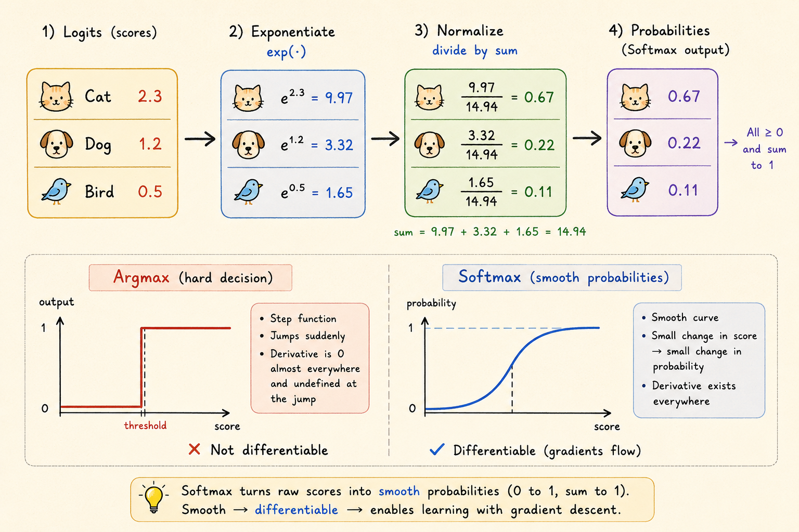

<iframe width="100%" height="500" src="https://www.youtube.com/embed/MlivXhZFbNA?start=1289" title="CMU DLSys Lecture 2: ML Refresher / Softmax Regression" frameborder="0" allowfullscreen></iframe>

These notes summarize the machine learning refresher portion of CMU 10-414/714 Deep Learning Systems: how a model class, loss function, and optimization method combine into softmax regression.

## Three Ingredients of an ML System

An ML system needs three pieces:

- **Hypothesis class**: the parameterized program structure that maps inputs to outputs.
- **Loss function**: the objective that measures how well a hypothesis performs on the task.
- **Optimization method**: the procedure for finding parameters that minimize the training loss.

## Softmax

### Multi-Class Classification Setting

Training data has the form

$$
x^{(i)} \in \mathbb{R}^n,
\qquad
y^{(i)} \in \{1, \dots, k\},
\qquad
i = 1, \dots, m.
$$

Here:

- $n$ is the input dimension.
- $k$ is the number of classes.
- $m$ is the number of training examples.

### Linear Hypothesis Function

A linear classifier maps an input vector to one score per class:

$$
h_\theta : \mathbb{R}^n \to \mathbb{R}^k.
$$

In batch form, the data matrix stacks examples as rows:

$$
X \in \mathbb{R}^{m \times n},
\qquad
y \in \{1, \dots, k\}^m.
$$

With a parameter matrix $\Theta \in \mathbb{R}^{n \times k}$, the full batch of class scores is

$$
H = X\Theta \in \mathbb{R}^{m \times k}.
$$

This matrix form computes all class scores for all examples in one operation.

## Loss Function

### Classification Error

Classification error is the direct all-or-nothing metric:

$$
\ell_{\mathrm{err}}(h(x), y)
=
\begin{cases}
0 & \text{if } \arg\max_i h_i(x) = y, \\
1 & \text{otherwise}.
\end{cases}
$$

It is useful for evaluation, but it is a poor optimization objective because it is not differentiable.

### Softmax / Cross-Entropy Loss

Softmax converts raw scores into a probability distribution:

$$
z_i
=
p(\text{label}=i)
=
\frac{\exp(h_i(x))}
{\sum_{j=1}^{k}\exp(h_j(x))}.
$$

The cross-entropy loss for the correct class $y$ is

$$
\ell_{\mathrm{ce}}(h(x), y)
=
-\log p(\text{label}=y)
=
-h_y(x) + \log \sum_{j=1}^{k}\exp(h_j(x)).
$$

## Optimization

### Softmax Regression Objective

The optimization goal is to minimize the average training loss:

$$
\min_\theta
\frac{1}{m}
\sum_{i=1}^{m}
\ell(h_\theta(x^{(i)}), y^{(i)}).
$$

For softmax regression:

$$
\min_\Theta
\frac{1}{m}
\sum_{i=1}^{m}
\ell_{\mathrm{ce}}(\Theta^\top x^{(i)}, y^{(i)}).
$$

### Gradient Descent

The gradient $\nabla_\theta f(\theta)$ has the same shape as the parameter matrix. It points in the direction of steepest local increase, so minimizing the loss means moving in the opposite direction:

$$
\theta := \theta - \alpha \nabla_\theta f(\theta).
$$

Here $\alpha$ is the learning rate.

### Stochastic Gradient Descent

SGD estimates the full gradient with a minibatch of size $B$:

$$
\theta
:=
\theta
-
\frac{\alpha}{B}
\sum_{i=1}^{B}
\nabla_\theta
\ell(h_\theta(x^{(i)}), y^{(i)}).
$$

This gives more frequent parameter updates than waiting for a full pass over the training set.

### Gradient of Softmax

For one example, the derivative of cross-entropy with respect to a score component $h_i$ is

$$
\frac{\partial \ell_{\mathrm{ce}}(h,y)}{\partial h_i}
=
\frac{\partial}{\partial h_i}
\left(
-h_y
+
\log \sum_{j=1}^{k}\exp(h_j)
\right).
$$

The first term contributes $-\mathbf{1}\{i=y\}$. The log-sum-exp term contributes the softmax probability:

$$
\frac{\partial}{\partial h_i}
\log \sum_{j=1}^{k}\exp(h_j)
=
\frac{\exp(h_i)}{\sum_{j=1}^{k}\exp(h_j)}
=
z_i.
$$

So the final component-wise gradient is

$$
\frac{\partial \ell_{\mathrm{ce}}(h,y)}{\partial h_i}
=
z_i - \mathbf{1}\{i=y\}.
$$

In vector form:

$$
\nabla_h \ell_{\mathrm{ce}}(h,y) = z - e_y,
$$

where $z$ is the predicted probability vector and $e_y$ is the one-hot vector for the true label.

## Summary

For a minibatch $X \in \mathbb{R}^{B \times n}$, softmax regression has a compact update:

$$
\Theta
:=
\Theta
-
\frac{\alpha}{B}
X^\top (Z - I_y).
$$

Here $Z$ is the minibatch matrix of predicted probabilities and $I_y$ is the one-hot label matrix.

Key takeaways:

- The final algorithm is simple even though the derivation uses matrix calculus.
- Classification error is good for evaluation, while cross-entropy is better for gradient-based training.
- A basic linear softmax model can already reach less than 8% error on MNIST in a few seconds.

*Source: CMU 10-414/714 Deep Learning Systems, Lecture 2: ML Refresher / Softmax Regression.*
