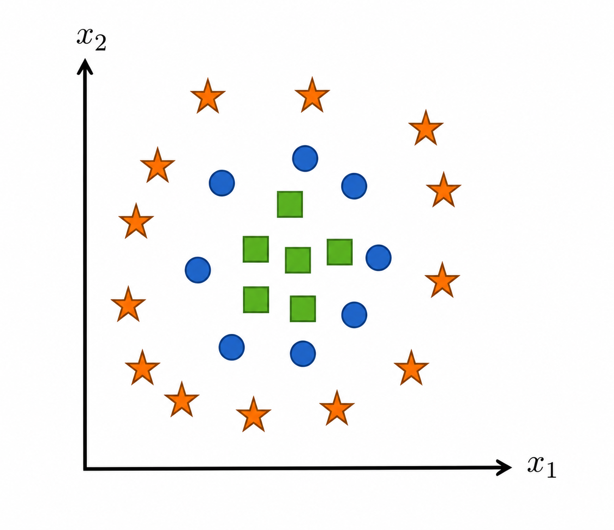
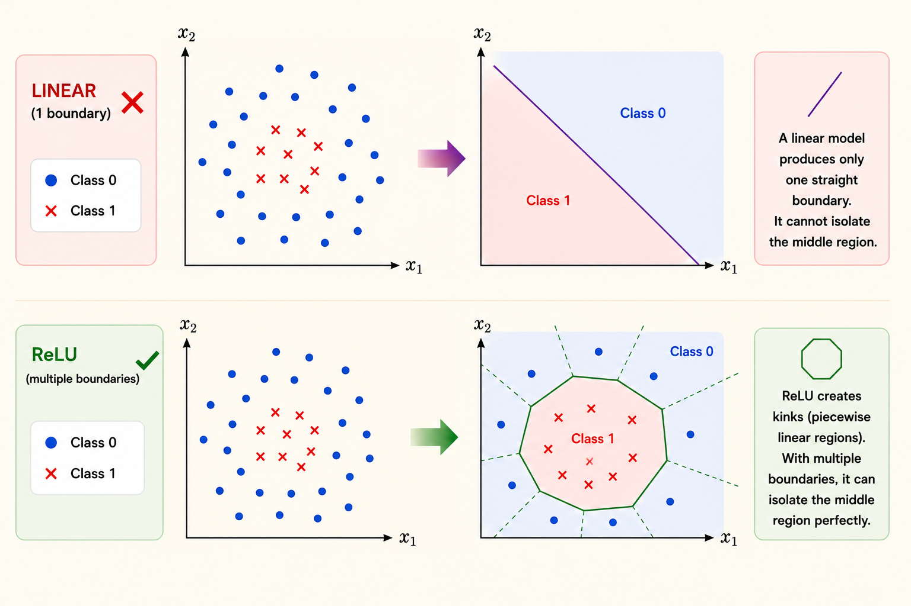
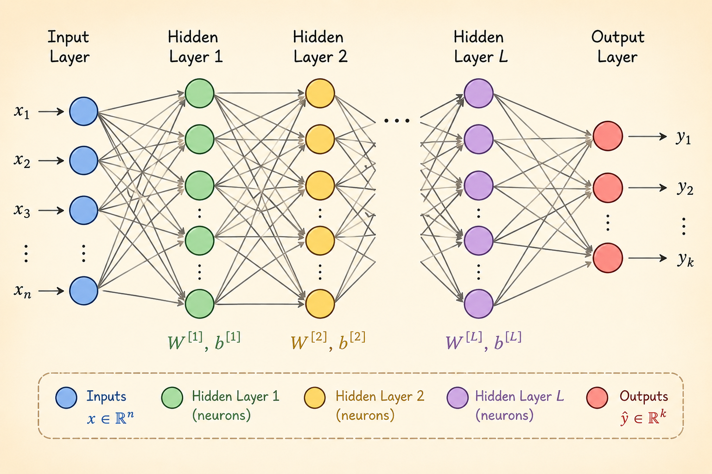

<iframe width="100%" height="500" src="https://www.youtube.com/embed/OyrqSYJs7NQ?start=1357" title="CMU DLSys Lecture 3: Manual Neural Networks" frameborder="0" allowfullscreen></iframe>

This lecture moves from linear models to manual neural networks. The main idea is simple: if the data is not linearly separable in the original input space, we need learned nonlinear features.

## Trouble With Linear Hypothesis Classes

A linear hypothesis class has the form

$$
h_\theta(x) = \theta^T x,
\qquad \theta \in \mathbb{R}^{n \times k}.
$$

For an input $x \in \mathbb{R}^n$, the model produces $k$ output logits. This works when classes can be separated by linear decision boundaries, but it breaks down when the class structure is nonlinear.

The problem is not the optimizer. The problem is the hypothesis class: a linear model can only express linear boundaries in the original feature space.

## Creating Features

One way to make a linear model more expressive is to transform the input first:

$$
h_\theta(x) = \theta^T \phi(x).
$$

Here $\phi(x)$ is a feature map. If $\phi$ maps the raw input into a better representation, then a linear classifier on top of $\phi(x)$ can solve problems that were nonlinear in the original input space.

### Why Linear Activations Do Not Help

If the feature map is itself linear, it does not add expressive power. For example,

$$
\phi(x) = W^T x
$$

gives

$$
h_\theta(x)
= \theta^T (W^T x)
= (\theta^T W^T)x.
$$

This is still just a linear function of $x$. Stacking linear layers collapses into one linear layer, so the model still cannot represent nonlinear decision boundaries.

### Nonlinear Features

To make the model more expressive, insert a nonlinear activation:

$$
\phi(x) = \sigma(W^T x).
$$

Then the hypothesis becomes

$$
h_\theta(x) = \theta^T \sigma(W^T x).
$$

Random Fourier features are one example where $W$ is fixed randomly. Neural networks go one step further: they learn $W$ from data, so the feature representation itself becomes trainable.

## Neural Networks as Hypothesis Classes

A neural network is a composition of parameterized differentiable functions. The biological analogy is historically useful, but mathematically the important point is function composition:

$$
x
\rightarrow \text{linear map}
\rightarrow \text{nonlinear activation}
\rightarrow \text{linear map}
\rightarrow \cdots
$$

Deep learning studies these composed, trainable hypothesis classes and how to optimize them efficiently.

### Two-Layer Neural Network

A two-layer neural network can be written as

$$
h_\theta(x) = W_2^T \sigma(W_1^T x).
$$

The first matrix $W_1$ maps the input into a hidden representation, the nonlinearity $\sigma$ prevents collapse back to a linear model, and $W_2$ maps the hidden representation to the output.

For a batch $X$, the same model is commonly written as

$$
h_\theta(X) = \sigma(XW_1)W_2.
$$

This batch form is the one used in practical implementations because it maps directly to matrix multiplication kernels.

### Universal Function Approximation

Neural networks with nonlinear activations such as ReLU can approximate a broad class of smooth functions on a bounded domain. Intuitively, ReLU networks build piecewise linear approximations: with enough hidden units, the pieces can fit a complicated function arbitrarily well.

The theorem explains why neural networks are expressive, but it is not a practical training recipe. The number of hidden units required by a constructive proof may be far larger than what we want to train.

## ReLU

The rectified linear unit is

$$
\operatorname{ReLU}(x) = \max(0, x).
$$

ReLU is useful because it is cheap to compute, introduces nonlinearity, and has derivative $1$ on the positive side. That positive-side derivative helps gradients pass through active units during backpropagation.

## Fully Connected Deep Networks

A fully connected network repeatedly applies affine maps and nonlinear activations. One common notation is

$$
Z_1 = X,
$$

$$
Z_{i+1} = \sigma_i(Z_i W_i),
\qquad i = 1, \ldots, L - 1,
$$

with a final output layer producing the model prediction.

The trainable parameters are the layer weights

$$
\theta = \{W_1, W_2, \ldots, W_L\}.
$$

Each hidden layer learns a new representation of the previous layer. Depth lets the model build features in stages instead of trying to solve the task from raw inputs in one step.

## Why Deep Networks?

Some common arguments for depth are incomplete: the brain analogy is loose, and worst-case circuit complexity does not directly explain modern neural network practice.

The practical reason is empirical and architectural. Deep networks have repeatedly worked well when paired with the right structure:

- CNNs exploit locality and translation structure in images.
- RNNs and related sequence models reuse computation across time.
- Transformers use attention to model token interactions in parallel.

Depth is valuable because it lets a model compose simple transformations into increasingly useful representations under a fixed parameter budget.
