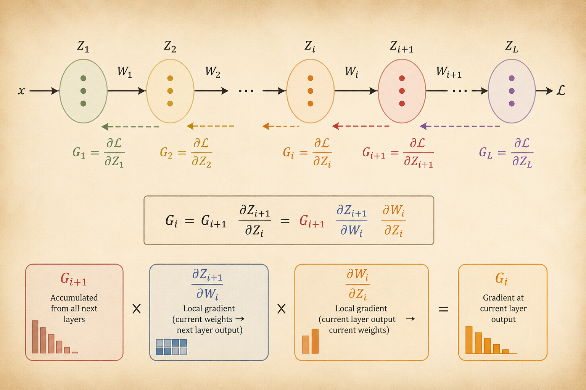

<iframe width="100%" height="500" src="https://www.youtube.com/embed/JLg1HkzDsKI" title="CMU DLSys Lecture 3 Part II: Manual Neural Networks" frameborder="0" allowfullscreen></iframe>

Part I introduced neural networks as nonlinear hypothesis classes. Part II asks a systems-oriented question: if a network is just matrix operations and elementwise nonlinearities, how do we compute all gradients efficiently?

The answer is backpropagation: cache intermediate activations during the forward pass, then reuse local derivatives during a backward pass.

# Gradients of a Two-Layer Network

Consider a simple two-layer network:

$$
Z = XW_1,
\qquad
H = \sigma(Z),
\qquad
U = HW_2,
\qquad
S = \operatorname{softmax}(U).
$$

For cross-entropy loss with one-hot labels $I_y$, the output-layer error is:

$$
G_U
=
\frac{\partial \ell_{\text{ce}}}{\partial U}
=
S - I_y.
$$

Here:

- $S$ is the predicted probability distribution.
- $I_y$ is the one-hot ground-truth label.
- $S - I_y$ is the error signal at the logits.

For example:

$$
S =
\begin{bmatrix}
0.2 \\
0.6 \\
0.2
\end{bmatrix},
\qquad
I_y =
\begin{bmatrix}
0 \\
1 \\
0
\end{bmatrix},
\qquad
S - I_y =
\begin{bmatrix}
0.2 \\
-0.4 \\
0.2
\end{bmatrix}.
$$

## Gradient With Respect to $W_2$

The second layer is:

$$
U = HW_2.
$$

Because $H$ is the input to this linear layer, the weight gradient is:

$$
\nabla_{W_2}\ell_{\text{ce}}
=
H^T G_U
=
H^T(S - I_y).
$$

This is the same pattern as linear classification: input activations transposed times output error.

## Gradient With Respect to $W_1$

For the first layer, the gradient must pass through:

$$
W_2,
\qquad
\sigma,
\qquad
XW_1.
$$

By the chain rule:

$$
\frac{\partial \ell_{\text{ce}}}{\partial W_1}
=
\frac{\partial \ell_{\text{ce}}}{\partial U}
\frac{\partial U}{\partial H}
\frac{\partial H}{\partial Z}
\frac{\partial Z}{\partial W_1}.
$$

In matrix form:

$$
\nabla_{W_1}\ell_{\text{ce}}
=
X^T
\left(
\left((S - I_y)W_2^T\right)
\circ
\sigma'(XW_1)
\right).
$$

The components are:

- $X^T$: input activations transposed.
- $(S - I_y)W_2^T$: output error propagated backward through $W_2$.
- $\circ \sigma'(XW_1)$: elementwise multiplication by the activation derivative.

# Backpropagation in General

For a fully connected network, write each layer as:

$$
Z_{i+1}
=
\sigma_i(Z_i W_i),
\qquad
i = 1, \dots, L.
$$

The gradient of the loss with respect to one weight matrix $W_i$ can be written as a long chain:

$$
\frac{\partial \ell(Z_{L+1}, y)}{\partial W_i}
=
\frac{\partial \ell}{\partial Z_{L+1}}
\frac{\partial Z_{L+1}}{\partial Z_L}
\cdots
\frac{\partial Z_{i+2}}{\partial Z_{i+1}}
\frac{\partial Z_{i+1}}{\partial W_i}.
$$

Naively computing this full product separately for every layer would be wasteful. Backpropagation reuses the accumulated gradient from later layers.

Define the upstream gradient:

$$
G_{i+1}
=
\frac{\partial \ell(Z_{L+1}, y)}{\partial Z_{i+1}}.
$$

Then the backward recursion is:

$$
G_i
=
G_{i+1}
\frac{\partial Z_{i+1}}{\partial Z_i}.
$$

In practice, we do not explicitly materialize huge Jacobian matrices. Each layer implements the corresponding vector-Jacobian product.

# Matrix Backpropagation

For the layer:

$$
Z_{i+1}
=
\sigma_i(Z_i W_i),
$$

define:

$$
A_i = Z_i W_i.
$$

The gradient with respect to the layer input is:

$$
G_i
=
\left(
G_{i+1}
\circ
\sigma_i'(A_i)
\right)
W_i^T.
$$

The gradient with respect to the weight matrix is:

$$
\nabla_{W_i}\ell
=
Z_i^T
\left(
G_{i+1}
\circ
\sigma_i'(A_i)
\right).
$$

The same local error term appears in both equations:

$$
G_{i+1}
\circ
\sigma_i'(A_i).
$$

This term combines the incoming gradient from later layers with the derivative of the current activation.

# Forward and Backward Passes

## Forward Pass

The forward pass computes and caches activations.

1. Set $Z_1 = X$.
2. For each layer, compute:

$$
Z_{i+1}
=
\sigma_i(Z_i W_i),
\qquad
i = 1, \dots, L.
$$

The cache stores values such as $Z_i$ and $A_i = Z_iW_i$, which are needed during the backward pass.

## Backward Pass

The backward pass propagates the loss gradient from output to input.

1. Initialize the final gradient. For softmax cross-entropy:

$$
G_{L+1}
=
\nabla_{Z_{L+1}}\ell(Z_{L+1}, y)
=
S - I_y.
$$

2. Iterate backward for $i = L, \dots, 1$:

$$
G_i
=
\left(
G_{i+1}
\circ
\sigma_i'(Z_iW_i)
\right)
W_i^T.
$$

3. Compute each weight gradient:

$$
\nabla_{W_i}\ell
=
Z_i^T
\left(
G_{i+1}
\circ
\sigma_i'(Z_iW_i)
\right).
$$

# Takeaways

- Backpropagation is the chain rule organized for reuse.
- $G_{i+1}$ is the accumulated upstream gradient from later layers.
- Each layer only needs its local derivative and cached forward values.
- The key systems primitive is the vector-Jacobian product, not explicit Jacobian construction.
- This modular view is what makes automatic differentiation possible for larger computation graphs.

*Source: CMU 10-414/714 Deep Learning Systems, Lecture 3 Part II: Manual Neural Networks.*
