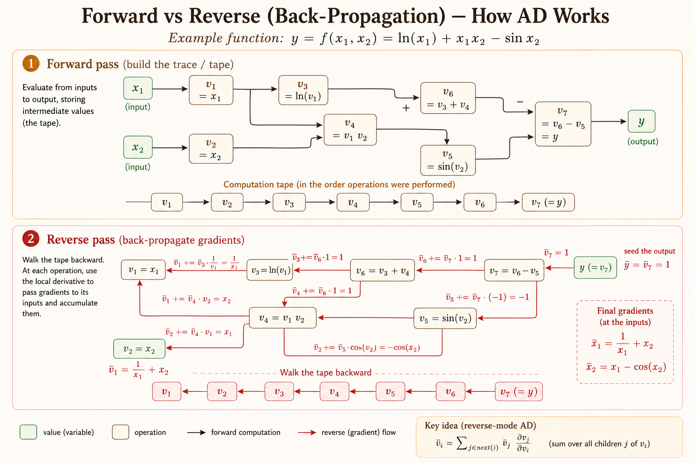

<iframe width="100%" height="500" src="https://www.youtube.com/embed/56WUlMEeAuA?start=695" title="CMU DLSys Lecture 4: Automatic Differentiation" frameborder="0" allowfullscreen></iframe>

Automatic differentiation (AD) evaluates derivatives by decomposing a function into elementary operations and repeatedly applying the chain rule. Unlike numerical differentiation, it does not approximate derivatives; unlike symbolic differentiation, it avoids expanding large derivative expressions.

# Numerical Differentiation

For the $i$th coordinate, the derivative can be approximated directly from its definition:

$$
\frac{\partial f(\theta)}{\partial \theta_i}
=
\lim_{\epsilon \to 0}
\frac{f(\theta+\epsilon e_i)-f(\theta)}{\epsilon},
$$

where $e_i$ is one at coordinate $i$ and zero everywhere else.

A central difference is typically more accurate:

$$
\frac{\partial f(\theta)}{\partial \theta_i}
=
\frac{f(\theta+\epsilon e_i)-f(\theta-\epsilon e_i)}{2\epsilon}
+O(\epsilon^2).
$$

## Numerical Gradient Checking

Numerical differentiation is useful for testing an autodiff implementation. Instead of checking every coordinate separately, sample a unit vector $\delta$ and compare the directional derivative:

$$
\delta^T \nabla_\theta f(\theta)
=
\frac{f(\theta+\epsilon\delta)-f(\theta-\epsilon\delta)}{2\epsilon}
+O(\epsilon^2).
$$

Here, $\nabla_\theta f(\theta)$ is the gradient produced by autodiff, $\lVert\delta\rVert=1$, and $\epsilon$ is a small step such as $10^{-5}$. This test needs only two function evaluations, rather than two evaluations for every parameter.

# Symbolic Differentiation

Symbolic differentiation repeatedly applies rules such as:

$$
\frac{\partial(f(\theta)+g(\theta))}{\partial\theta}
=
\frac{\partial f(\theta)}{\partial\theta}
+
\frac{\partial g(\theta)}{\partial\theta},
$$

$$
\frac{\partial(f(\theta)g(\theta))}{\partial\theta}
=
g(\theta)\frac{\partial f(\theta)}{\partial\theta}
+
f(\theta)\frac{\partial g(\theta)}{\partial\theta},
$$

and the chain rule:

$$
\frac{\partial f(g(\theta))}{\partial\theta}
=
\frac{\partial f(g)}{\partial g}
\frac{\partial g(\theta)}{\partial\theta}.
$$

Naive symbolic expressions can repeat work. For example, let

$$
f(\theta)=\prod_{i=1}^{n}\theta_i.
$$

Computing each partial derivative independently,

$$
\frac{\partial f}{\partial\theta_k}
=
\prod_{j\ne k}\theta_j,
$$

requires roughly $n(n-2)$ multiplications for the full gradient. If the shared product $g=\prod_i\theta_i$ is cached first, then

$$
\frac{\partial f}{\partial\theta_k}=\frac{g}{\theta_k},
$$

and all partial derivatives require only $O(n)$ work.

# Computational Graph

Consider

$$
y=f(x_1,x_2)=\ln(x_1)+x_1x_2-\sin(x_2).
$$

Its computation can be decomposed into reusable intermediate values:

```{mermaid}
flowchart LR
    x1["x1"] --> v1["v1 = x1"]
    x2["x2"] --> v2["v2 = x2"]
    v1 --> v3["v3 = ln(v1)"]
    v1 --> v4["v4 = v1 v2"]
    v2 --> v4
    v2 --> v5["v5 = sin(v2)"]
    v3 --> v6["v6 = v3 + v4"]
    v4 --> v6
    v6 --> v7["v7 = v6 - v5"]
    v5 --> v7
    v7 --> y["y = v7"]
```

For $x_1=2$ and $x_2=5$, a forward evaluation gives:

$$
\begin{aligned}
v_1 &= 2, & v_2 &= 5,\\
v_3 &= \ln(2) \approx 0.693, &
v_4 &= 2\cdot 5=10,\\
v_5 &= \sin(5) \approx -0.959, &
v_6 &= v_3+v_4=10.693,\\
v_7 &= v_6-v_5=11.652, & y&=v_7.
\end{aligned}
$$

# Forward-Mode Automatic Differentiation

Forward mode propagates a value and its derivative together. To differentiate with respect to $x_1$, define

$$
\dot v_i=\frac{\partial v_i}{\partial x_1}.
$$

The denominator is always $\partial x_1$: each dot records how the corresponding intermediate value changes with the selected input.

Following the graph in topological order:

$$
\begin{aligned}
\dot v_1 &= 1, & \dot v_2 &= 0,\\
\dot v_3 &= \frac{\dot v_1}{v_1}=\frac12=0.5,\\
\dot v_4 &= \dot v_1v_2+v_1\dot v_2=5,\\
\dot v_5 &= \cos(v_2)\dot v_2=0,\\
\dot v_6 &= \dot v_3+\dot v_4=5.5,\\
\dot v_7 &= \dot v_6-\dot v_5=5.5.
\end{aligned}
$$

Therefore,

$$
\frac{\partial y}{\partial x_1}=\dot v_7=5.5.
$$

## Limitation of Forward Mode

For $f:\mathbb{R}^n\to\mathbb{R}^k$, one forward-mode pass computes derivatives with respect to one selected input direction. Computing the full Jacobian therefore requires $n$ passes.

This is a poor fit for deep learning losses: $n$ can be millions or billions of parameters, while $k=1$ is usually a scalar loss.

# Reverse-Mode Automatic Differentiation

Reverse mode first evaluates and stores the forward trace. It then walks the graph backward, propagating adjoints

$$
\bar v_i=\frac{\partial y}{\partial v_i}.
$$

Seed the output with $\bar v_7=1$, then apply local derivatives in reverse topological order:

$$
\begin{aligned}
\bar v_7 &= 1,\\
\bar v_6 &= \bar v_7\frac{\partial v_7}{\partial v_6}=1,\\
\bar v_5 &= \bar v_7\frac{\partial v_7}{\partial v_5}=-1,\\
\bar v_4 &= \bar v_6\frac{\partial v_6}{\partial v_4}=1,\\
\bar v_3 &= \bar v_6\frac{\partial v_6}{\partial v_3}=1,\\
\bar v_2
&=\bar v_5\frac{\partial v_5}{\partial v_2}
+\bar v_4\frac{\partial v_4}{\partial v_2}
=-\cos(5)+2\approx1.716,\\
\bar v_1
&=\bar v_4\frac{\partial v_4}{\partial v_1}
+\bar v_3\frac{\partial v_3}{\partial v_1}
=5+\frac12=5.5.
\end{aligned}
$$



## Why Reverse Mode Works Well for Deep Learning

An intermediate node can affect the output through several downstream paths. Reverse mode computes each downstream adjoint once, caches it, and reuses it for every parent. This is the chain rule organized as dynamic programming.

- **Forward mode** is efficient when there are few inputs and many outputs.
- **Reverse mode** is efficient when there are many inputs and few outputs.

Neural network training is the second case: a scalar loss depends on a very large number of parameters. A single reverse pass computes the loss derivative with respect to all parameters.

# Multiple Gradient Paths

Suppose $v_i$ contributes to several immediate successors $v_j$. The gradient contribution along one edge is the partial adjoint

$$
\bar v_{i\to j}
=
\bar v_j\frac{\partial v_j}{\partial v_i}.
$$

The total adjoint sums all downstream contributions:

$$
\bar v_i
=
\sum_{j\in\operatorname{next}(i)}\bar v_{i\to j}
=
\sum_{j\in\operatorname{next}(i)}
\bar v_j\frac{\partial v_j}{\partial v_i}.
$$

This accumulation rule is the core of backpropagation: when a value is reused, gradients returning through every use must be added.

# Algorithm Implementation

```python
def gradient(out):
    # Each node may receive contributions from multiple downstream paths.
    node_to_grad = {out: [1]}

    for node in reverse_topological_order(out):
        node_bar = sum(node_to_grad[node])

        for input_node in inputs(node):
            partial = node_bar * local_derivative(node, input_node)
            node_to_grad.setdefault(input_node, []).append(partial)

    return node_to_grad
```

The forward pass constructs the graph and caches values needed by local derivatives. The reverse pass visits each operation in reverse order and accumulates partial adjoints at shared inputs.

# Reverse-Mode AD on Tensors

The same idea extends from scalars to tensors. For

$$
Z=XW,
$$

the adjoint $\bar Z$ has the same shape as $Z$, with entries

$$
\bar Z_{ij}=\frac{\partial y}{\partial Z_{ij}}.
$$

Elementwise, the gradient with respect to $X$ is

$$
\bar X_{ik}
=
\sum_j
\frac{\partial Z_{ij}}{\partial X_{ik}}\bar Z_{ij}
=
\sum_j W_{kj}\bar Z_{ij}.
$$

In matrix form:

$$
\boxed{\bar X=\bar ZW^T}.
$$

Similarly,

$$
\boxed{\bar W=X^T\bar Z}.
$$

Tensor backpropagation therefore reduces elementwise chain-rule calculations to optimized matrix operations.

# Key Takeaways

- Numerical differentiation is mainly a gradient-checking tool.
- Symbolic differentiation can duplicate work if shared expressions are expanded independently.
- A computational graph exposes reusable intermediate values and local derivatives.
- Forward mode propagates one input direction per pass.
- Reverse mode propagates from a scalar output to all inputs in one backward pass.
- Gradients from multiple downstream paths must be accumulated.
- Backpropagation is reverse-mode AD specialized to neural network computation graphs.
