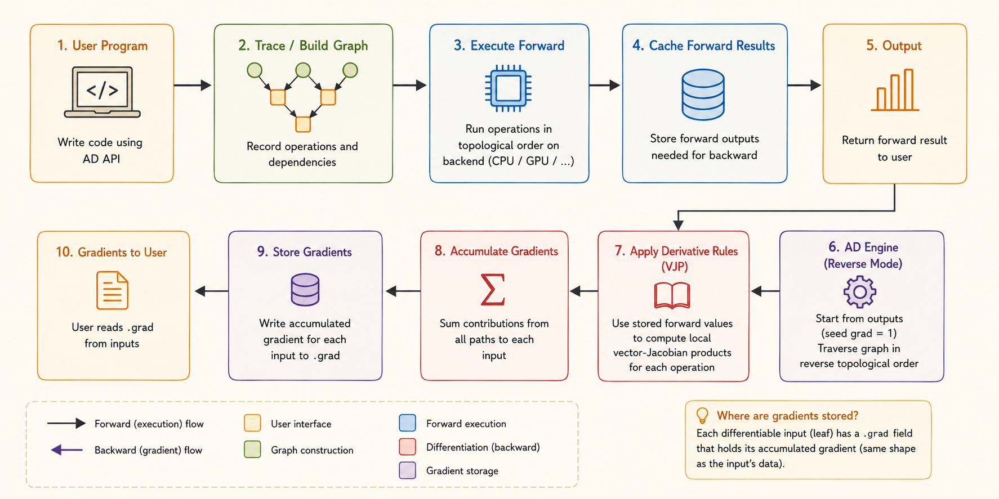

<iframe width="100%" height="500" src="https://www.youtube.com/embed/cNADlHfHQHg?start=712" title="CMU DLSys Lecture 5: Auto Differentiation Implementation" frameborder="0" allowfullscreen></iframe>

::: {.callout-note}
**Part I** is a framework-independent synthesis of what an automatic differentiation library needs and why. **Part II** follows the lecture's flow through Needle as a concrete implementation.
:::

# Part I: What an Automatic Differentiation Library Needs

Automatic differentiation evaluates derivatives of a program by decomposing it into primitive operations and repeatedly applying the chain rule. It is neither symbolic differentiation nor finite differences.

A fundamental AD system needs the following cooperating components.

## 1. A Differentiable Value Abstraction

The library needs an object that represents a numerical value and carries metadata such as:

- shape and data type;
- storage device;
- whether derivatives are required;
- the gradient or tangent associated with the value;
- optionally, the operation that produced it.

**Why:** ordinary arrays contain numbers but no differentiation context. AD needs a value that can participate in numerical computation while also carrying enough information to derive the result.

## 2. Primitive Operations and Local Derivative Rules

A program must be decomposed into primitive operations such as addition, multiplication, exponential, matrix multiplication, reshape, broadcast, and reduction.

Each primitive needs:

1. a **forward rule** that computes its output;
2. a **differential rule**, usually a Jacobian-vector product (JVP) or vector-Jacobian product (VJP).

For $y=f(x)$, the two common rules are:

$$
\dot{y}=J_f(x)\dot{x}
\qquad \text{(JVP, forward mode)},
$$

$$
\bar{x}=\bar{y}J_f(x)
\qquad \text{(VJP, reverse mode)}.
$$

**Why:** the AD engine should not derive calculus rules dynamically. It composes trusted local rules through the chain rule. Reverse-mode AD is especially useful for neural networks because one scalar loss depends on many parameters.

## 3. A Trace, Tape, or Computation Graph

The system must record which operation produced each intermediate value and which values were its inputs.

**Why:** the reverse pass needs to recover dependencies in the opposite direction. Without this history, the library has numerical outputs but no path along which to propagate derivatives.

The trace may be:

- built dynamically as operations execute;
- represented as a static graph before execution;
- recorded as a tape of operations.

## 4. A Numerical Execution Layer

Graph construction and numerical execution are different responsibilities. The system needs:

- numerical kernels that operate on raw arrays;
- a strategy for evaluating intermediate values;
- caching or recomputation rules.

**Why:** the graph describes **what** to compute, while the backend performs the actual arithmetic. Keeping them separate allows the same AD logic to run on different array libraries and devices.

Two common execution strategies are:

- **Eager:** evaluate each operation immediately.
- **Lazy:** record operations first and evaluate when the result is required.

## 5. A Differentiation Engine

Local derivative rules are not enough. The library needs an engine that composes them across the whole program.

For reverse mode, it must:

1. seed the output adjoint;
2. order dependencies topologically;
3. traverse the graph in reverse;
4. call each operation's VJP rule;
5. accumulate all contributions arriving at the same value.

If $v$ influences the loss through several consumers:

$$
\bar{v}
=
\frac{\partial L}{\partial v}
=
\sum_{u\in\operatorname{consumers}(v)}
\bar{u}\frac{\partial u}{\partial v}.
$$

**Why:** a value can reach the output through multiple paths. The final derivative is the sum of every path's contribution.

## 6. Shape, Broadcasting, and Reduction Semantics

Derivative rules must preserve correct shapes. Broadcasting in the forward pass usually requires summing over broadcast dimensions in the backward pass; reductions require reshaping or broadcasting the incoming derivative.

**Why:** many incorrect AD implementations get the scalar calculus right but mishandle tensor dimensions.

## 7. Gradient Control and Graph Lifetime

A practical library needs mechanisms such as:

- `requires_grad` or trainable flags;
- detach / stop-gradient;
- no-gradient scopes;
- gradient reset or accumulation policies.

**Why:** recording every operation wastes memory, and retaining a result may retain its entire graph. Users must be able to state where differentiation starts and stops.

## 8. A Backend and Device Abstraction

The AD layer should not depend directly on one storage format. It should dispatch numerical work to a backend that owns:

- memory;
- CPU/GPU placement;
- data types;
- numerical kernels.

**Why:** differentiation logic is mostly independent of hardware. A backend boundary lets the same graph and derivative engine target NumPy, custom CPU arrays, GPUs, or accelerators.

## 9. A Clear Public API and Validation Strategy

The library should expose a small interface such as:

- `backward()` on an output value;
- `grad(f)` as a function transformation;
- an explicit output seed for non-scalar outputs.

It also needs tests for:

- forward values;
- local derivative rules;
- graph traversal and accumulation;
- broadcasting and shape behavior;
- comparison against analytical or finite-difference checks.

**Why:** AD behavior is global, but most bugs originate in one primitive rule, one graph edge, or one shape transformation.

```{mermaid}
flowchart LR
    A["User program"] --> B["Primitive operations"]
    B --> C["Trace / computation graph"]
    B --> D["Numerical backend"]
    C --> E["Differentiation engine"]
    E --> F["JVP or VJP rules"]
    F --> G["Accumulate derivatives"]
    D --> H["Forward values"]
```

::: {.callout-tip}
**General architecture:** values carry differentiation context, primitives provide local calculus rules, a trace records dependencies, a backend computes numbers, and a differentiation engine composes the local rules.
:::



# Part II: The Needle Implementation

This part follows the teacher's sequence: try the API, inspect the data structures, build a graph, trace forward execution, examine graph lifetime, and finally connect the pieces to reverse-mode AD.

## 1. Needle Setup and Codebase

**Needle** stands for **Ne**cessary **E**lements of **D**eep **Le**arning. The small teaching framework provides the scaffolding used throughout the course.

The codebase has three main roles:

- `__init__.py`: expose the public package interface;
- `autograd.py`: define graph values, tensors, and the AD mechanism;
- `ops.py` / `ops/`: define operations and derivative rules.

The lecture environment clones the [Lecture 5 repository](https://github.com/dlsyscourse/lecture5) and adds `needle/python` to `PYTHONPATH`.

## 2. Try the Tensor API

```python
import needle as ndl

x = ndl.Tensor([1, 2, 3], dtype="float32")
y = x + 1

y.shape
y.dtype
y.numpy()
```

The expression `x + 1` is operator sugar. `Tensor.__add__` dispatches to an operation such as `AddScalar`, allowing normal Python syntax to build a computation graph.

In the first assignments, Needle tensors are backed by NumPy. The `numpy()` boundary still matters because later the data may live in Needle's own CPU/GPU `NDArray`.

## 3. Value, Tensor, and Op

### Value and Tensor

`Tensor` is a subclass of `Value`. A `Value` is one graph node with:

- `cached_data`: the realized array;
- `op`: the operation that produced it;
- `inputs`: the operation's input nodes;
- `requires_grad`: whether gradients should propagate through it.

`Tensor` adds user-facing tensor behavior and a `grad` field.

A leaf has `op is None` and no inputs. A non-leaf is both a numerical value and a record of its computation history.

### Op

Every concrete `Op` defines:

- `compute`: forward computation on raw arrays;
- `gradient`: propagation from an output adjoint to partial input adjoints.

Operations may also store parameters. `AddScalar(1)`, for example, has one tensor input and stores the scalar `1` in the operation object.

## 4. Construct and Inspect the Graph

The lecture uses:

```python
v1 = ndl.Tensor([0], dtype="float32")
v2 = ndl.exp(v1)
v3 = v2 + 1
v4 = v2 * v3
```

Numerically:

$$
v_1=0,
\qquad v_2=e^{v_1}=1,
\qquad v_3=v_2+1=2,
\qquad v_4=v_2v_3=2.
$$

```{mermaid}
flowchart LR
    V1["v1 = 0<br>leaf"] --> EXP["Exp"]
    EXP --> V2["v2 = 1"]
    V2 --> ADD["AddScalar(1)"]
    ADD --> V3["v3 = 2"]
    V2 --> MUL["EWiseMul"]
    V3 --> MUL
    MUL --> V4["v4 = 2"]
```

The graph is directly inspectable:

- `v4.inputs == [v2, v3]`;
- `v4.op` is `EWiseMul`;
- `v2.op` is `Exp`;
- `v1.op is None`;
- `v3.op.scalar == 1`;
- `v4.cached_data` contains the NumPy result `2`.

Following `inputs` reconstructs the directed acyclic graph.

## 5. Forward Execution

For `x1 + x2`, the call path is:

```{mermaid}
flowchart LR
    A["x1 + x2"] --> B["Tensor.__add__"]
    B --> C["EWiseAdd()(x1, x2)"]
    C --> D["TensorOp.__call__"]
    D --> E["Tensor.make_from_op"]
    E --> F["Value._init<br>record op + inputs"]
    F --> G["realize_cached_data"]
    G --> H["EWiseAdd.compute<br>raw arrays"]
    H --> I["cache result"]
```

`Tensor.make_from_op` creates a graph node and `_init` records its operation, inputs, cache, outputs, and gradient requirement.

`realize_cached_data` then:

1. returns an existing cached result when available;
2. recursively realizes all inputs;
3. calls `self.op.compute` on their raw arrays;
4. caches and returns the result.

### Eager and Lazy Modes

- **Eager:** `make_from_op` immediately realizes the output. This is Needle's default.
- **Lazy:** the graph node is created first and the data is realized only when requested.

Lazy execution exposes a larger graph for batching, compilation, or graph optimization; eager execution is direct and interactive.

## 6. Detach and Memory

The lecture demonstrates a subtle consequence of storing computation history:

```python
sum_loss = ndl.Tensor([0.0])
for _ in range(100):
    sum_loss = sum_loss + x * x
```

Although there is only one Python variable named `sum_loss`, it points to the end of a graph containing every previous iteration. The old nodes remain reachable and consume memory.

`detach()` creates a new leaf that shares the realized value but has no inputs and no producing operation. Use detach, stop-gradient, or no-grad when a value is needed but its history is not.

## 7. Array Backend

In this lecture:

```python
import numpy as array_api
NDArray = numpy.ndarray
```

Forward rules call `array_api`, such as `array_api.exp`. Later, Needle can replace NumPy with its own device-aware array library without redesigning the graph or differentiation layers.

## 8. Needle's Reverse-Mode Interface

Each operation's `gradient(out_grad, node)` performs one local reverse step. It consumes and returns **Tensors**, not raw arrays.

This is intentional:

- `compute` realizes numerical values;
- `gradient` constructs the backward computation graph.

Therefore a gradient can itself be differentiated, enabling higher-order derivatives.

For

$$
v_4=v_2v_3,
$$

the multiplication rule returns:

$$
\bar{v}_{2\to4}
=
\bar{v}_4\frac{\partial v_4}{\partial v_2}
=
\bar{v}_4v_3,
$$

$$
\bar{v}_{3\to4}
=
\bar{v}_4\frac{\partial v_4}{\partial v_3}
=
\bar{v}_4v_2.
$$

Seed the final output with $\bar{v}_4=1$. Since $v_2=1$ and $v_3=2$, the local contributions are:

$$
\bar{v}_{2\to4}=2,
\qquad
\bar{v}_{3\to4}=1.
$$

Homework 1 completes the global reverse pass:

1. trace dependencies through `inputs`;
2. compute a topological order;
3. traverse it in reverse;
4. sum contributions at shared nodes;
5. call each node's `gradient` rule;
6. store results in `grad`.

`gradient_as_tuple` normalizes one-input and multi-input gradient rules to the same tuple interface.

## 9. Mapping Needle to the General Design

| General AD component | Needle implementation |
|---|---|
| Differentiable value | `Value` and `Tensor` |
| Primitive operation | `Op` and concrete operations |
| Trace / graph | `op` and `inputs` fields |
| Forward execution | `compute` and `realize_cached_data` |
| Backend | `array_api` and `NDArray` |
| Local VJP | `gradient` |
| Global reverse pass | Reverse topological traversal and accumulation |
| Gradient control | `requires_grad` and `detach` |

## Sources

- [Lecture video](https://www.youtube.com/watch?v=cNADlHfHQHg)
- [Lecture 5 repository](https://github.com/dlsyscourse/lecture5)
- [Lecture notebook](https://github.com/dlsyscourse/lecture5/blob/main/5_automatic_differentiation_implementation.ipynb)
- [Needle autograd core](https://github.com/dlsyscourse/lecture5/blob/main/python/needle/autograd.py)
- [Needle operations](https://github.com/dlsyscourse/lecture5/tree/main/python/needle/ops)
