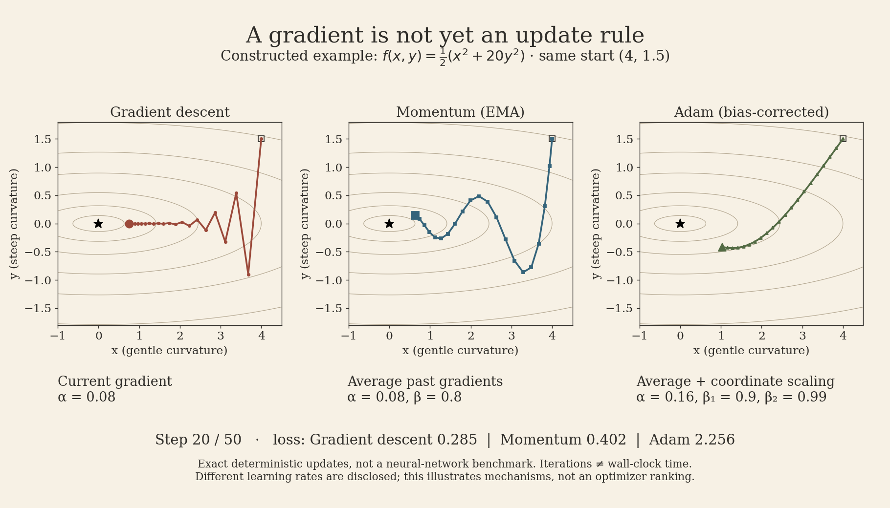
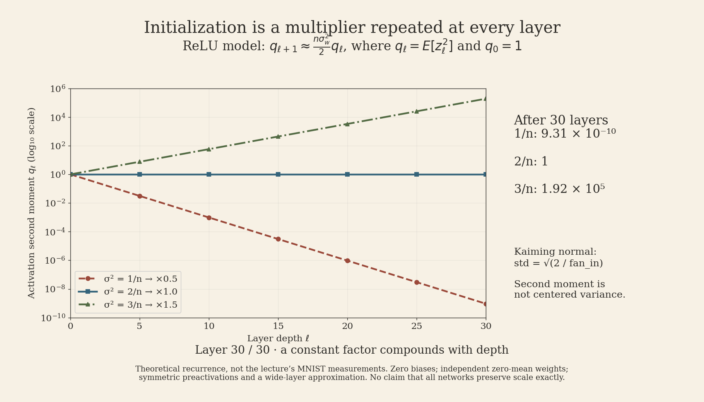

Automatic differentiation tells us how the loss changes with each parameter. It does not decide how far to move, how to combine noisy gradients, or where training should begin. Lecture 6 of **CMU 10-414/714: Deep Learning Systems** connects those decisions: define a fully connected network precisely, turn its gradients into updates, and initialize it so signals can propagate.

These notes follow the **2022 online lecture** and the currently linked slide deck. The full 1:26:55 transcript was read; equations were checked against the slides. The current course page lists Tim Dettmers and Tianqi Chen, while the older recording belongs to the original online course. The figures below are new, reproducible teaching examples—not replications of the lecture's experiments.

## Lecture recording



[Open the lecture on YouTube](https://www.youtube.com/watch?v=CukpVt-1PA4) · [Course schedule](https://dlsyscourse.org/lectures/) · [Official slides](https://dlsyscourse.org/slides/fc_init_opt.pdf)

## 1. A fully connected layer still needs correct shapes

For a batch of $B$ examples, write a layer as

$$
A_i=Z_iW_i+\mathbf{1}_B b_i^T,\qquad Z_{i+1}=\sigma_i(A_i).
$$

Here $Z_i\in\mathbb{R}^{B\times n_i}$, $W_i\in\mathbb{R}^{n_i\times n_{i+1}}$, and $b_i\in\mathbb{R}^{n_{i+1}}$. Thus both terms in $A_i$ have shape $B\times n_{i+1}$. Hidden layers may use ReLU; the final transformation can remain linear to produce logits. AD composes the derivative rules, so we no longer derive an entire network's backward pass by hand.

The bias is shared across examples. Broadcasting represents its repeated use without requiring an explicitly tiled bias matrix. In Needle's explicit formulation, reshape the bias to $(1,n_{i+1})$ and broadcast it to $(B,n_{i+1})$. Actual allocation behavior belongs to the backend; logical repetition is not a requirement to copy the data.

Let $G=\partial L/\partial A_i$ have shape $B\times n_{i+1}$. The local reverse rules are

$$
\nabla_{W_i}L=Z_i^TG,\quad
\nabla_{Z_i}L=GW_i^T,\quad
\nabla_{b_i}L=G^T\mathbf{1}_B.
$$

**Broadcast forward means sum backward.** Each use of the same bias contributes to the same derivative. If the loss averages over examples, that averaging is already inside $G$; do not divide the bias gradient by the batch size a second time.

![A two-example batch shares bias [10,20]. An upstream gradient [[1,2],[3,4]] reduces across rows to bias gradient [4,6].](cmu-dlsys-6-broadcast.png){fig-alt="Worked broadcast example with forward matrix shapes and backward bias reduction. The two row contributions sum to [4,6]."}

*Source: lecture 0:38–13:14; slides 4–5. The numerical reverse-pass example is an added derivation.*

## 2. A steepest direction can still make slow progress

For an empirical loss $f(\theta)$, gradient descent uses

$$
\theta_{t+1}=\theta_t-\alpha g_t,\qquad g_t=\nabla f(\theta_t).
$$

The negative gradient is locally steepest under the Euclidean norm. This is not the same as pointing toward the minimizer. A narrow valley has high curvature across it and low curvature along it. A step size large enough to move quickly along the valley can overshoot across it.

Our constructed example makes this explicit:

$$
f(x,y)=\tfrac12(x^2+20y^2),\qquad \nabla f=(x,20y).
$$

With $\alpha=0.08$, the updates are $x_{t+1}=0.92x_t$ and $y_{t+1}=-0.6y_t$. The $y$ coordinate changes sign while shrinking: zigzagging is compatible with convergence. For this positive-definite quadratic, stability requires $0<\alpha<2/20=0.1$. That bound belongs to this example, not every neural network.

<button type="button">Play animation</button>

The animation uses exact deterministic gradients and a common starting point. GD and EMA momentum use $\alpha=0.08$; Adam uses $\alpha=0.16$. Momentum has $\beta=0.8$; Adam has $(\beta_1,\beta_2)=(0.9,0.99)$ and $\epsilon=10^{-8}$. These are disclosed illustration settings, not an equal-budget optimizer benchmark. The horizontal progress is iteration count, not elapsed time.

## 3. Newton rescales curvature; momentum averages history

Newton's method uses the Hessian $H_t=\nabla^2f(\theta_t)$:

$$
H_t d_t=g_t,\qquad \theta_{t+1}=\theta_t-\alpha d_t.
$$

Writing a linear solve avoids suggesting that an implementation must explicitly form $H_t^{-1}$. For $f(\theta)=\frac12\theta^TP\theta+q^T\theta$ with **symmetric positive-definite** $P$, a full step reaches $-P^{-1}q$ exactly. The local quadratic model is the actual objective. An indefinite Hessian in a nonconvex problem does not offer the same guarantee.

A dense Hessian for $p$ parameters contains $p^2$ entries. Hessian-vector products can avoid materializing it, but that does not make an inverse-Hessian direction free. The lecture uses Newton as a contrast before returning to first-order methods; its skepticism is not a proof that every second-order approximation is ineffective.

Momentum retains a running vector:

$$
u_{t+1}=\beta u_t+(1-\beta)g_t,\qquad
\theta_{t+1}=\theta_t-\alpha u_{t+1},\qquad u_0=0.
$$

In this lecture's **exponential moving average** convention, old gradients receive geometrically decreasing weights. Opposing components can cancel while persistent components accumulate. Momentum can also carry the iterate past a minimum: it does not guarantee a decrease at every step.

Some libraries use $u_{t+1}=\beta u_t+g_t$ instead. The missing $(1-\beta)$ changes the scale, so matching learning-rate numbers alone does not match update rules.

### Why the first moving average is small

For a constant gradient $g$,

$$
u_t=(1-\beta^t)g.
$$

Dividing by $1-\beta^t$ removes the zero-initialization attenuation. More generally, the usual unbiased-estimate interpretation requires a stationary expected gradient; training gradients need not satisfy that assumption exactly.

### Nesterov evaluates a look-ahead point

The slides present the variant

$$
u_{t+1}=\beta u_t+(1-\beta)\nabla f(\theta_t-\alpha u_t),\qquad
\theta_{t+1}=\theta_t-\alpha u_{t+1}.
$$

The difference is where the gradient is evaluated. Other Nesterov parameterizations use a differently scaled velocity or look-ahead distance; compare equations before translating hyperparameters. Convex convergence results are not a blanket guarantee for deep-network training.

*Source: lecture 16:24–52:40; slides 8–15.*

## 4. Adam keeps both direction and scale

Adam maintains moving averages of the gradient and its elementwise square:

$$
\begin{aligned}
m_t&=\beta_1m_{t-1}+(1-\beta_1)g_t,\\
v_t&=\beta_2v_{t-1}+(1-\beta_2)g_t^2,\\
\hat m_t&=m_t/(1-\beta_1^t),\qquad
\hat v_t=v_t/(1-\beta_2^t),\\
\theta_t&=\theta_{t-1}-\alpha\frac{\hat m_t}{\sqrt{\hat v_t}+\epsilon}.
\end{aligned}
$$

Here $t\ge1$, $g_t=\nabla f(\theta_{t-1})$, and $m_0=v_0=0$. Squaring, square roots, and division are elementwise. $v_t$ estimates a **second moment**, not a centered variance. Adam changes coordinate scales using gradient history; it does not estimate a full Hessian or account for arbitrary rotations like a full curvature matrix.

For a first gradient $g_1=(2,20)$, bias correction gives $\hat m_1=(2,20)$ and $\hat v_1=(4,400)$. Ignoring a tiny $\epsilon$, the normalized direction is $(1,1)$. That example explains the scaling mechanism—not a claim that equal coordinate steps always improve optimization. Later steps depend on the whole moving history.

*Source: lecture 52:46–1:03:10; slides 16–17.*

## 5. In training, these gradients come from mini-batches

If

$$
f(\theta)=\frac1N\sum_{j=1}^N\ell_j(\theta),
$$

then a uniformly sampled mini-batch $\mathcal B_t$ gives

$$
g_t=\frac1{|\mathcal B_t|}\sum_{j\in\mathcal B_t}\nabla\ell_j(\theta_t).
$$

Under that sampling assumption, this is an unbiased estimate of the full gradient. It can replace the gradient in SGD, momentum, or Adam. A noisy, cheaper update can be more useful than waiting for a full-dataset gradient, but batch size also affects hardware utilization and variance. An iteration-count plot alone cannot establish training efficiency.

The lecture explicitly warns against treating convex quadratic animations as a ranking of optimizers for real networks. Our GIF illustrates update mechanics. Choosing an optimizer still requires experiments on the actual architecture, data, loss, and compute budget.

*Source: lecture 1:03:18–1:09:19; slides 18–20.*

## 6. Initialization decides whether there is a useful signal to optimize

Setting every weight to zero can block learning in a multilayer ReLU network. Hidden activations and weight gradients can vanish, and identical hidden units cannot break symmetry. This does **not** imply that every bias gradient must always be zero: an output bias can still receive a loss gradient. The problem is the uninformative hidden representation and broken gradient propagation.

Randomness breaks symmetry, but its scale matters just as much. The lecture compares weight variances $1/n$, $2/n$, and $3/n$ in a 50-layer ReLU network. Its plots show that modest per-layer changes can compound into shrinking or growing activations and gradients.

### Why the factor two appears

Consider a preactivation $a=\sum_{j=1}^n w_jz_j$. Assume zero biases and independent, zero-mean weights with variance $\sigma_w^2$, independent of the incoming activations. If their common second moment is $q=E[z_j^2]$, the cross terms vanish:

$$
E[a^2]=n\sigma_w^2q.
$$

For a symmetric preactivation distribution,

$$
E[\operatorname{ReLU}(a)^2]=\tfrac12 E[a^2].
$$

Thus the approximate layerwise recurrence is

$$
q_{\ell+1}\approx\frac{n\sigma_w^2}{2}q_\ell.
$$

Choosing $\sigma_w^2=2/n$ keeps this factor near one. This is the rationale for **Kaiming normal initialization**, whose standard deviation is $\sqrt{2/\mathrm{fan\_in}}$. Do not pass $2/n$ as the standard deviation when an API expects a standard deviation.

<button type="button">Play animation</button>

Starting from $q_0=1$, this idealized recurrence gives the following values after 30 layers:

| Weight variance | Per-layer multiplier | $q_{30}$ |
|---|---:|---:|
| $1/n$ | $0.5$ | $9.31\times10^{-10}$ |
| $2/n$ | $1$ | $1$ |
| $3/n$ | $1.5$ | $1.92\times10^5$ |

These are theoretical values, **not measured MNIST results**. Also, ReLU outputs have a nonzero mean: preserving their second moment is not the same statement as preserving their centered variance. Independence and distributional approximations become imperfect in finite networks and during training. Different activations, normalization, residual connections, and fan-in/fan-out objectives change the analysis.

*Source: lecture 1:09:26–1:26:55; slides 22–25. The second-moment derivation makes the lecture's informal variance argument more precise.*

## What connects the lecture

AD supplies derivatives. The optimizer transforms them using a step size, history, and sometimes coordinate scaling. Initialization determines the scale of the signals reaching that machinery in the first place. A more elaborate update rule cannot be assumed to repair an untrainable starting configuration.

A useful implementation check is therefore to inspect shapes and broadcast reductions, activation and gradient magnitudes, and the exact optimizer convention together. Then compare training outcomes under an explicit budget. That is a stronger test than asking which colored path wins a toy animation.

## Sources and reproducibility

- [CMU Deep Learning Systems — lecture schedule](https://dlsyscourse.org/lectures/).
- [Lecture 6 recording, 2022 online course](https://www.youtube.com/watch?v=CukpVt-1PA4): full transcript inspected, with source intervals above; not a claim of real-time viewing of the entire video.
- [Official slide deck: Fully connected networks, optimization, initialization](https://dlsyscourse.org/slides/fc_init_opt.pdf), 25 pages. The current deck has updated instructor attribution; the recording is older.
- Figures use Python, NumPy, Matplotlib, and Pillow. All examples are constructed and labeled; no lecture experiment is represented as reproduced.
- Figure workflow: Kassis, T., Agarwal, V., He, Y., Patel, D., & Brueckner, A. M. (2026), [Scientific Agent Skills](https://doi.org/10.48550/arXiv.2609.00065). This is a tooling reference, not a source for the lecture's mathematical claims.

