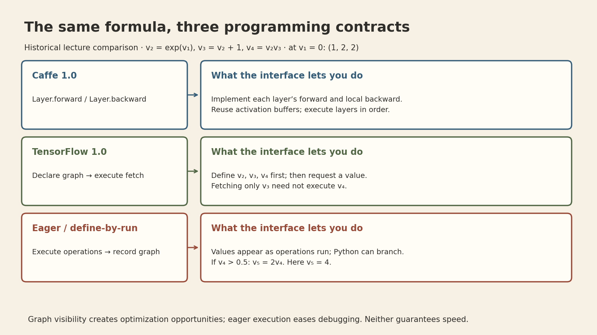
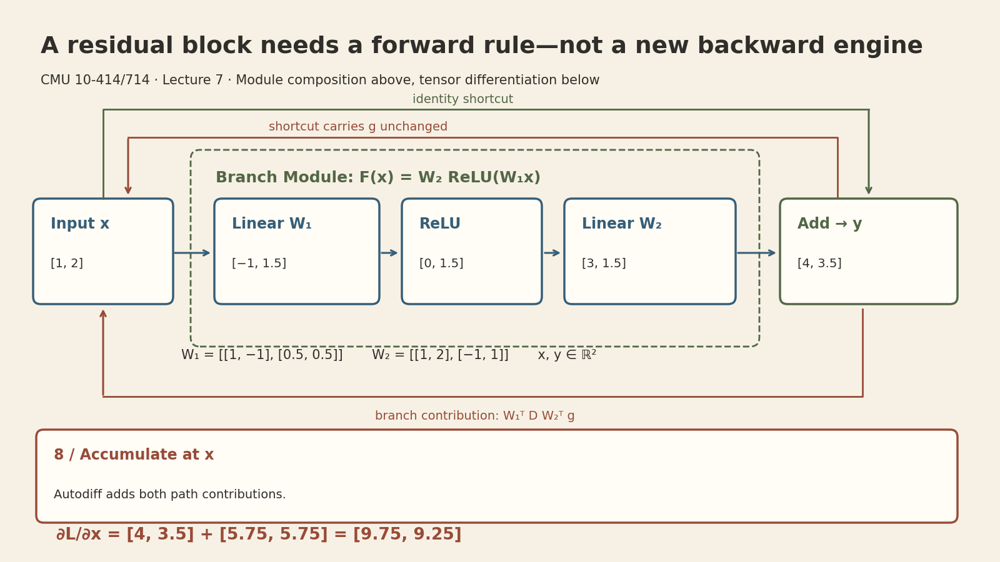
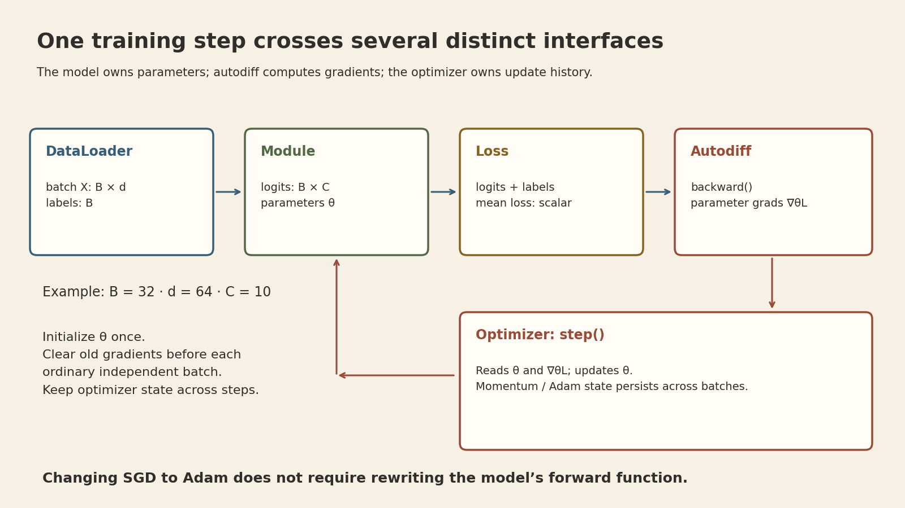

Suppose a network already supports matrix multiplication, ReLU, and addition. To add a residual block, do we also need to implement a new backward pass?

**Not when the block is composed from operations the automatic-differentiation engine already understands.** We define the forward computation, expose its trainable parameters, and let the tensor graph connect the derivative rules. That separation is the central idea of **CMU 10-414/714 Lecture 7: Neural Network Library Abstractions**.

[Lecture 6](cmu-dlsys-lecture-6-optimization-initialization.qmd) examined how to initialize and update weights. This lecture asks how to organize those capabilities into a library that lets us change one component without rebuilding the rest.

## Lecture recording and source coverage



[YouTube recording](https://www.youtube.com/watch?v=fzKNkS_5E6U) · [Official course schedule](https://dlsyscourse.org/lectures/) · [Official slides](https://dlsyscourse.org/slides/7-nn-framework.pdf)

These notes use the complete **2022 online lecture transcript** (0:00–59:49; recording 59:57) by Tianqi Chen and all 24 pages of the currently linked **Fall 2026 slide deck**. The recording and slides are different editions; the framework comparison is presented as the lecture's historical design study, not a ranking of current frameworks. Source coverage here is the transcript and slides, not a full viewing of the video. Numerical examples and diagrams below are added teaching examples.

## 1. A framework chooses a programming contract

A programming abstraction determines more than function names. It determines what a programmer describes, when the system obtains values, and which information is available when the system executes the computation.

The lecture compares three interfaces using a small graph:

$$
v_2=e^{v_1},\qquad v_3=v_2+1,\qquad v_4=v_2v_3.
$$

At $v_1=0$, the values are $v_2=1$, $v_3=2$, and $v_4=2$. The formula is unchanged across the interfaces; the execution contract changes.

{fig-alt="Caffe layers define forward and backward; TensorFlow 1.0 declares a graph before fetching values; eager interfaces compute values as the graph is built."}

### Caffe 1.0: a layer supplies both directions

A layer implements a forward operation and a local backward operation. For an exponential layer with output $y=e^x$ and upstream derivative $g_y$, its backward rule returns $g_x=g_y y$. The saved forward output can be reused.

The lecture describes preallocated output/gradient buffers, a forward traversal, and a reverse traversal that propagates derivatives. This interface closely follows hand-written backpropagation. It makes layers composable, but places responsibility for a layer's derivative alongside its forward computation. A newly implemented compound layer may therefore require its own backward logic. This does **not** mean that every architecture assembled from existing Caffe layers needs an entirely new differentiation engine.

### TensorFlow 1.0: declare first, execute later

A graph description precedes execution. The runtime then receives a requested output and the required inputs. If only $v_3$ is requested in the example, $v_4$ need not be evaluated. A complete graph also creates opportunities for scheduling, memory planning, and combining operations.

In the graph-based differentiation design discussed in the lecture (12:05–14:19; revisited at 33:12), gradient calculations are themselves represented as operations that extend the computation graph. The system constructs the derivative computation and then executes it, rather than requiring each compound model to supply a hand-written backward routine. This describes the lecture's design, not a requirement that every autodiff system materialize the same kind of backward graph.

The distinction between description and execution permits execution away from the Python process. The tradeoff is that ordinary Python control flow and a graph's control flow are different things: a branch depending on a not-yet-computed tensor must be represented in the graph. A symbolic tensor also cannot reveal its numerical value merely by printing the graph description.

### Eager / define-by-run: values and the graph develop together

In the eager model discussed for PyTorch and Needle, tensor operations compute values while recording dependencies for differentiation. Python can inspect an intermediate value and choose the next branch. For example, if $v_4>0.5$, compute $v_5=2v_4$; otherwise use $v_5=v_4$.

For $v_1=0$, the first branch runs and $v_5=4$. Within that branch,

$$
\frac{dv_4}{dv_1}=e^{v_1}(2e^{v_1}+1)=3,\qquad
\frac{dv_5}{dv_1}=6.
$$

Autodiff differentiates the executed tensor operations. It does not turn the discrete Python branch choice into a smooth operation; derivatives at switching boundaries need separate care.

Being able to inspect values makes debugging and data-dependent computation natural. But if eager execution has already computed $v_4$, a later decision to return only $v_3$ cannot undo that work. The lecture also notes lazy evaluation and compilation as ways to complicate this simple comparison. **Eager versus graph-based is a design tradeoff, not a universal speed ordering.**

*Sources: recording 1:41–34:13; slides 4–9. The numerical derivatives are added calculations. The slides' snippets illustrate APIs and should not be copied as executable current TensorFlow code.*

## 2. Model composition and differentiation are separate layers

A residual block offers a concrete reason to separate these responsibilities. Use column vectors for one example and omit biases:

$$
z=W_1x,\quad r=\operatorname{ReLU}(z),\quad F(x)=W_2r,\quad y=x+F(x).
$$

For $x\in\mathbb{R}^{d}$, take $W_1\in\mathbb{R}^{h\times d}$ and $W_2\in\mathbb{R}^{d\times h}$. The residual branch must return the same shape as $x$ for this identity shortcut. A branch that changes the width needs a compatible shortcut transformation; that is outside this example.

For a row-major batch $X\in\mathbb{R}^{B\times d}$, the same calculation is

$$
Y=X+\operatorname{ReLU}(XW_1^T)W_2^T\in\mathbb{R}^{B\times d}.
$$

This follows the slide's output-by-input weight convention. It differs from writing a weight of shape input-by-output and multiplying without a transpose; either is valid if used consistently.

```{=html}
<div class="lecture-animation">

<button type="button" aria-pressed="false">Play animation</button>
</div>
```

The animation shows exact arithmetic through one forward/backward pass, **not training iterations or measured execution time**. Its matrices are

$$
x=\begin{bmatrix}1\\2\end{bmatrix},\quad
W_1=\begin{bmatrix}1&-1\\0.5&0.5\end{bmatrix},\quad
W_2=\begin{bmatrix}1&2\\-1&1\end{bmatrix}.
$$

Forward computation gives $z=(-1,1.5)^T$, $r=(0,1.5)^T$, $F(x)=(3,1.5)^T$, and $y=(4,3.5)^T$. Set an illustrative loss $L=\tfrac12\|y\|_2^2=14.125$, so the upstream gradient is $g=\nabla_yL=y$.

At the addition, the derivative travels down **both** paths. With $D=\operatorname{diag}(0,1)$ from the ReLU mask,

$$
\nabla_x L=g+W_1^TDW_2^Tg
=\begin{bmatrix}4\\3.5\end{bmatrix}
+\begin{bmatrix}5.75\\5.75\end{bmatrix}
=\begin{bmatrix}9.75\\9.25\end{bmatrix}.
$$

The module hierarchy lets us think in terms of a residual block. The tensor graph handles the finer operations and gradient accumulation. Consequently, a composition of supported differentiable operations needs a forward definition, not a manually derived compound backward function. A genuinely new primitive still needs a derivative rule or another supported differentiation mechanism.

*Sources: recording 37:36–44:43 and 56:56–59:34; slides 12–14 and 22–23. Matrices, loss, and gradient values are constructed for these notes.*

## 3. A Module owns structure and exposes parameters

The lecture's `nn.Module` abstraction follows a tensor-in, tensor-out contract. Modules can contain other modules, allowing a network to be described recursively: a model contains residual blocks, a block contains Linear/ReLU components, and their forward computations use tensor operations.

A module must also make its trainable parameters discoverable. Knowing how to calculate an output is insufficient if the optimizer cannot find the weights. Initialization can occur during construction, using routines appropriate to each parameter's role. Random matrix weights, zero biases, and normalization statistics need not share an initialization rule.

The following is **interface pseudocode**, not a claim that this precise API is implemented in the lecture's repository:

```python
class Residual(Module):
    def __init__(self, branch):
        super().__init__()
        self.branch = branch  # registered child module

    def forward(self, x):
        return x + self.branch(x)

# The branch's final Linear returns width d, matching the identity shortcut.
model = Residual(Sequential(Linear(d, h), ReLU(), Linear(h, d)))
optimizer = SGD(model.parameters(), lr=learning_rate)
```

Parameter discovery and gradient propagation answer different questions. Discovery asks **which trainable objects belong to this model?** The computation graph asks **how did this particular loss depend on those objects?** Merely appearing in a module's parameter list does not establish that a parameter influenced a particular forward pass.

*Sources: recording 42:50–44:43 and 50:46–52:31; slides 14 and 18. The final distinction and pseudocode are explanatory synthesis.*

## 4. Losses compose because their outputs are tensors too

A loss module receives predictions and targets and returns a scalar tensor after the selected reduction. For a batch of class logits $Z\in\mathbb{R}^{B\times C}$ and integer class labels $y_i$, mean softmax cross-entropy is

$$
L=\frac1B\sum_{i=1}^{B}\left[-Z_{i,y_i}+\log\sum_{j=1}^{C}e^{Z_{ij}}\right].
$$

This is single-label multiclass classification: one target class per example. A scalar is a rank-zero tensor, so a loss remains part of the same differentiable computation. In implementations, evaluate the logarithmic sum with a numerically stable log-sum-exp routine.

This interface permits a joint objective such as $L=L_{\mathrm{class}}+\lambda L_{\mathrm{box}}$. One backward traversal can collect the contributions from both objectives. The weighting and reduction conventions still matter: adding two scalar losses does not automatically make their scales comparable.

Training and inference also differ in which computations are needed. Predictions may not need a supervised loss or labels. The lecture raises mode-dependent behavior; it does not make every loss module a required part of inference.

*Sources: recording 44:46–47:21; slides 11 and 15. Batch reduction, numerical stability, and scale cautions are added clarification.*

## 5. An optimizer consumes gradients; it does not define the model

The optimizer receives parameter references and their gradients. Plain SGD applies $w\leftarrow w-\alpha g$. Momentum additionally needs a state variable that persists across steps. Under the lecture's exponential-moving-average convention,

$$
u_t=\beta u_{t-1}+(1-\beta)g_t,\qquad
w_{t+1}=w_t-\alpha u_t.
$$

Here $u_t$ is the running gradient average. Adam maintains first- and second-moment state; its full update details belong to Lecture 6. The point here is **ownership**: optimizer history is not a new model layer or a fresh activation that should be recreated every batch.

{fig-alt="DataLoader supplies batch X and labels. Module produces logits, loss reduces to a scalar, autodiff computes parameter gradients, and optimizer updates the model while retaining momentum state."}

For ordinary independent minibatch updates, the conceptual order is:

```python
for x, target in loader:
    optimizer.reset_grad()       # API name varies by library
    prediction = model(x)
    loss = loss_fn(prediction, target)
    loss.backward()               # calculate parameter gradients
    optimizer.step()              # update parameters using those gradients
```

This is pseudocode illustrating interfaces. Explicit gradient accumulation across batches is another valid design, but then clearing and scaling gradients must be intentional. Calling backward and calling step are separate operations; replacing SGD with another optimizer need not change the model's forward definition.

### Where regularization belongs

For plain SGD, adding $\tfrac\lambda2\|w\|_2^2$ to the objective gives

$$
w_{t+1}=w_t-\alpha(g_t+\lambda w_t)
=(1-\alpha\lambda)w_t-\alpha g_t.
$$

Thus the same update can be expressed through the loss or through an SGD update rule. The equivalence shown here is specific to this rule and coefficient convention. It should not be generalized to decoupled weight decay and adaptive optimizers: transforming the combined gradient through adaptive state need not equal separately shrinking the weights.

*Sources: recording 47:25–50:37; slides 16–17. Gradient-reset guidance and the equivalence boundary are implementation clarifications.*

## 6. Data preparation is another compositional system

The lecture also treats data loading and preprocessing as modular components. A loader supplies batches to the model; transformations can compose in a pipeline, such as rotation followed by crop and resize. Their composition can change the data distribution without changing the optimizer interface.

The interfaces still need semantic contracts. A batch of shape $B\times d$ must fit the first model layer; classification labels must match the chosen loss. For tasks with spatial labels, an image transform must preserve or appropriately transform the target. Modularity reduces the amount of code that changes, but does not eliminate these checks.

*Source: recording 52:39–54:11; slide 19. Shape and label checks are practical consequences of the interface design.*

## What this separation buys us

The lecture's modularity discussion (55:42–56:04) suggests a useful design test: **can one component change while the others keep their contracts?** We can replace an optimizer without rewriting residual blocks, compose a new objective without manually deriving the entire network's backward pass, or change a preprocessing pipeline without changing the gradient engine.

This works because the boundaries carry concrete information: tensors and shapes between modules, a scalar objective for differentiation, and parameters plus gradients for the optimizer. Those contracts are the reason the familiar training loop can stay short while the model changes substantially.

## Sources and figure provenance

- Tianqi Chen, *Lecture 7 — Neural Network Abstractions*, CMU 10-414/714, [2022 online recording](https://www.youtube.com/watch?v=fzKNkS_5E6U), full transcript inspected.
- *Neural Network Library Abstractions*, [24-page official slide deck](https://dlsyscourse.org/slides/7-nn-framework.pdf), Fall 2026 edition, accessed September 20, 2026. Page references above use PDF page numbers.
- Figures are programmatic teaching diagrams, not measurements. [Generation code](cmu-dlsys-7-assets/create_figures.py) and [numerical provenance](cmu-dlsys-7-assets/manifest.json) are retained. The GIF has eight states and a static fallback; no random sampling is used.
- Visualization workflow: Kassis, T., Agarwal, V., He, Y., Patel, D., and Brueckner, A. M. (2026), [Scientific Agent Skills: A Library of Procedural Knowledge for Research Agents](https://doi.org/10.48550/arXiv.2609.00065).

```{=html}
<style>
.lecture-animation { margin:1.6rem 0; }
.lecture-animation img { width:100%; height:auto; display:block; }
.lecture-animation button { margin-top:.5rem; padding:.5rem .9rem; border:1px solid #526746; border-radius:4px; background:#F7F1E5; color:#302E2A; }
</style>
<script>
document.querySelectorAll('.lecture-animation').forEach(box => {
 const img=box.querySelector('img'), btn=box.querySelector('button');
 const stop=()=>{img.src=img.dataset.poster;btn.setAttribute('aria-pressed','false');btn.textContent='Play animation';};
 btn.addEventListener('click',()=>{if(btn.getAttribute('aria-pressed')==='true'){stop();}else{img.src=img.dataset.gif;btn.setAttribute('aria-pressed','true');btn.textContent='Stop animation';}});
 window.matchMedia('(prefers-reduced-motion: reduce)').addEventListener('change',e=>{if(e.matches)stop();});
});
</script>
```
