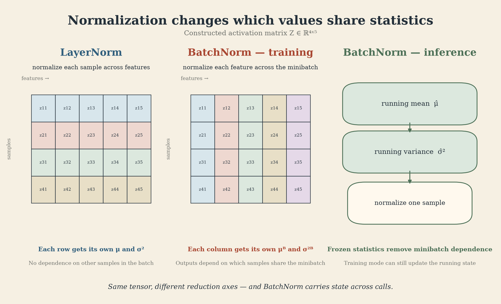
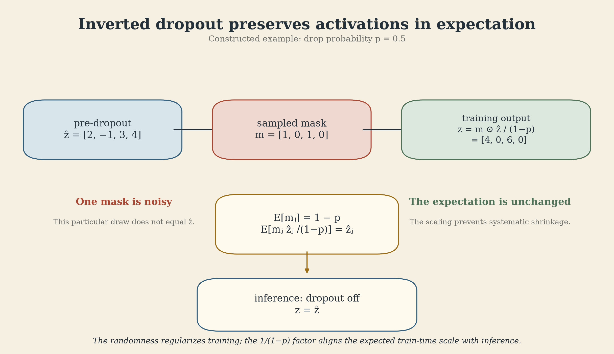

Why can the same network give a different answer when its weights have not changed? The reason may be the *other examples in the batch*, a stored running statistic, or a dropout mask. These are parts of the computation, not incidental training settings.

CMU 10-414/714 uses normalization and regularization to show how initialization, optimization, and model behavior interact. The practical thread running through this lecture is simple: **to reproduce a prediction, knowing the weights alone may not be enough.**

## Recording and version note



[Recording](https://www.youtube.com/watch?v=ky7qiKyZmnE) · [Current course schedule](https://dlsyscourse.org/lectures/) · [36-page slides](https://dlsyscourse.org/slides/norm_reg.pdf)

The Fall 2026 schedule labels this topic **Lecture 8: Normalization, Dropout, + Implementation**. Its linked public recording and slides are from Fall 2022, when the recording was **Lecture 9: Normalization and Regularization**. This article uses the complete 2022 transcript and slide deck, not a full viewing of the video or a 2026 implementation lecture. The small matrix and dropout calculations below are added teaching examples.

## Initialization gives normalization a job

The lecture begins with a 50-layer fully connected ReLU network. If a layer's weights are initialized with variance $c/n$, where $n$ is its input width, changing $c$ from 2 to 1 or 3 has a large effect across depth: activations diminish or grow, and training can stall or diverge. In this particular setup, $c=2$ keeps the initial activation scale roughly steady. It is a result about this architecture and initialization, not a universal prescription.

Even the nearby choices $c=1.7,2,2.3$ leave a trace after successful training. In the lecture's MNIST example, all three networks reach 5% error, yet their layerwise weight norms remain close to their respective initialized scales. The weights *do* change; a norm plot cannot tell us how their directions changed. The narrower lesson is that optimization does not necessarily wash away the effects of initialization.

That motivates adding a differentiable operation inside the network to control activation scale. The choice of what to normalize, however, changes the model.

## One matrix, two normalization axes

Let $Z\in\mathbb R^{B\times d}$ hold $B$ examples in rows and $d$ features in columns. **LayerNorm** computes a mean and variance across the $d$ features of each row. **BatchNorm**, during training, computes them across the $B$ examples of each column. Both use a small $\varepsilon$ to make division stable; implementations commonly follow standardization with learned scale $\gamma$ and shift $\beta$.

For example, take

$$
Z=\begin{bmatrix}1&2\\3&4\end{bmatrix},
$$

and ignore the tiny $\varepsilon$ for the arithmetic. LayerNorm sends each row to $[-1,1]$. Training-time BatchNorm instead sends the first row to $[-1,-1]$ and the second to $[1,1]$. The formulas differ only by the reduction axis, but the information they retain differs: LayerNorm standardizes every example separately; BatchNorm retains differences between examples while coupling them through the batch.

{fig-alt="Constructed 4 by 5 matrix. Each row is one example and each column is one feature. LayerNorm reduces across each row; BatchNorm reduces down each column during training."}

This is why the lecture resists the rule that normalization is always helpful. It notes that LayerNorm can make some plain fully connected networks harder to fit, perhaps because the relative activation scale between examples carries useful information. That suggested explanation is not a universal finding; LayerNorm remains widely used, including in Transformers.

## BatchNorm has state beyond the weights

Training-time BatchNorm makes a sample's output depend on its batchmates. In the 2-by-2 example, the first feature of the first sample becomes approximately $-1$ when paired with $[3,4]$. Pair it with different examples and the batch mean and variance change. At inference, standard BatchNorm avoids that dependence by using stored running estimates accumulated during training.

Conceptually, for one feature,

$$
\widehat\mu_t=\rho\widehat\mu_{t-1}+(1-\rho)\mu_t^{\mathcal B},
$$

with an analogous running-variance update. In training mode the current batch supplies statistics and updates the stored estimates; in evaluation mode the stored estimates supply the normalization. Exact momentum conventions and variance estimators depend on the implementation.

This yields a concrete failure mode: a validation forward pass left in training mode can change BatchNorm's running state even without a gradient update. A later prediction may then differ although every trainable weight is unchanged. A checkpoint must save the running statistics as well as the parameters, and evaluation must switch modes deliberately.

## Regularization acts on the training path

An overparameterized network can fit its training examples and still sometimes generalize. The lecture distinguishes **implicit regularization**, such as the solutions reachable by a particular initialization and SGD trajectory, from **explicit regularization**, which deliberately changes the objective or training computation. Parameter count alone does not specify the solution training finds.

For $L_2$ regularization, add $\frac{\lambda}{2}\sum_{\ell=1}^{L}\lVert W_\ell\rVert_F^2$ to the data loss. With plain SGD, one weight matrix obeys

$$
W_{t+1}=W_t-\alpha\bigl(\nabla L_{\mathrm{data}}(W_t)+\lambda W_t\bigr)
        =(1-\alpha\lambda)W_t-\alpha\nabla L_{\mathrm{data}}(W_t).
$$

The factor $1-\alpha\lambda$ explains the name *weight decay*. Here the shrinkage and an $L_2$ loss penalty coincide. With adaptive optimizers they need not: AdamW's decoupled weight decay is different from adding $\lambda W$ to the gradient Adam receives. This distinction is a later implementation clarification, supported by the [AdamW paper](https://arxiv.org/abs/1711.05101), not a claim that the lecture teaches AdamW. The lecture also warns that weight magnitude can be a poor stand-in for function complexity, especially with normalization.

## Dropout preserves an expectation, not each computation

Dropout applies randomness to activations rather than a deterministic penalty to weights. Let $p$ be the drop probability and $m_j\sim\operatorname{Bernoulli}(1-p)$. In the common *inverted dropout* convention,

$$
z_j^{\mathrm{train}}=\frac{m_j}{1-p}\widehat z_j,
\qquad z_j^{\mathrm{eval}}=\widehat z_j.
$$

Because $\mathbb E[m_j]=1-p$, the training output satisfies $\mathbb E[z_j^{\mathrm{train}}]=\widehat z_j$. This identity describes an average over masks. It does not say that one sampled output, or its variance, equals the input.

{fig-alt="Constructed inverted-dropout example for p=0.5. The sampled mask gives zeros or doubled values; averaging over masks recovers each original activation."}

For a fixed activation $\widehat z_j=4$ and $p=0.5$, training outputs either 0 or 8. Their mean is 4, while their variance is 16. Evaluation uses 4 directly. The distinction matters when explaining the scale correction: saying that dropout “preserves the variance” would be incorrect for this example.

The lecture offers a second intuition: dropout samples part of a layer's computation, somewhat as minibatch SGD samples part of the training objective. It is an analogy about stochastic approximation, not an equivalence between the two algorithms or a guarantee of better generalization.

## Why the mechanisms must be tested together

The original BatchNorm paper explained its benefit through reduced “internal covariate shift.” Later work proposed smoother optimization as an explanation; the lecture cites further analysis that questions whether the relevant smoothness improves *along the optimization trajectory*. The empirical usefulness of BatchNorm is stronger evidence than any single proposed mechanism. See the [original paper](https://arxiv.org/abs/1502.03167) and the [smoothness analysis](https://arxiv.org/abs/1805.11604).

There is an instructive twist: using target-batch statistics at test time may help under some distribution shifts, but it restores dependence on which other test examples are present. It is a distinct evaluation choice, not the default inference behavior of BatchNorm.

The implementation question, then, is not merely “which layer should I add?” It is: **which axes, state, randomness, and evaluation rules define the model I am actually running?** Initialization, learning rate, normalization, and regularization interact, and the lecture does not give one recipe that wins for every architecture.

## Checks before trusting a result

- State the tensor layout and reduction axes for each normalization layer.
- Save BatchNorm running statistics in checkpoints; switch explicitly to evaluation mode for validation and serving.
- Verify the affine parameters and $\varepsilon$ placement against the chosen implementation.
- For dropout, distinguish drop probability from keep probability and test the $1/(1-p)$ training scale.
- State whether “weight decay” means an $L_2$ penalty in the optimizer's gradient or a decoupled parameter update.
- Compare training and evaluation behavior on the same fixed input; report the batch and mode when a result changes.

## Sources

- Tim Dettmers and Tianqi Chen, CMU 10-414/714, [Fall 2022 public recording](https://www.youtube.com/watch?v=ky7qiKyZmnE), transcript 0:00–1:19:29, and [36-page official slides](https://dlsyscourse.org/slides/norm_reg.pdf). The [Fall 2026 schedule](https://dlsyscourse.org/lectures/) supplies the current Lecture 8 number.
- Sergey Ioffe and Christian Szegedy, [Batch Normalization](https://arxiv.org/abs/1502.03167), 2015; Shibani Santurkar et al., [How Does Batch Normalization Help Optimization?](https://arxiv.org/abs/1805.11604), 2018; Nitish Srivastava et al., [Dropout](https://jmlr.org/papers/v15/srivastava14a.html), 2014; Ilya Loshchilov and Frank Hutter, [Decoupled Weight Decay Regularization](https://arxiv.org/abs/1711.05101), 2019.
- Both figures are constructed teaching diagrams, not empirical measurements.
