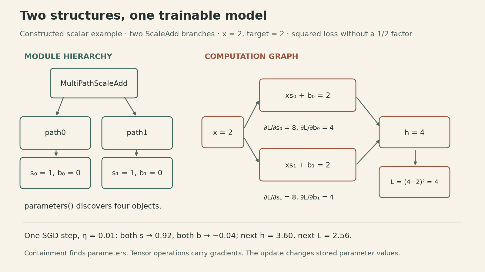
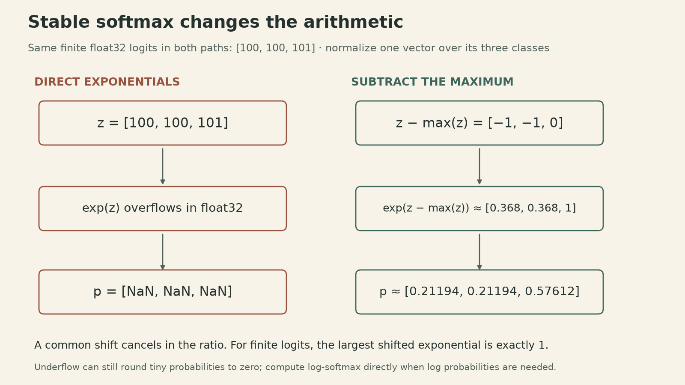
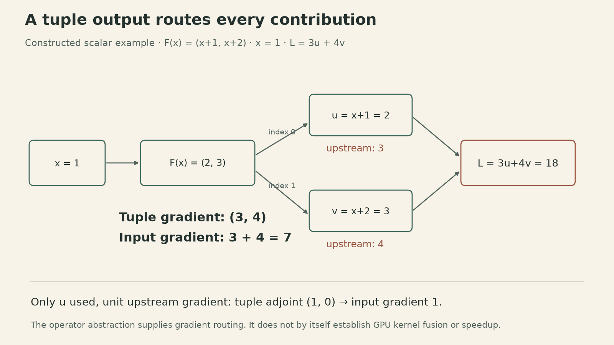

A neural network library must answer two different questions: **which objects should the optimizer update, and which paths connect those objects to the loss?** The answers come from different structures. Confusing them can silently leave a parameter unchanged, attach an update to an unwanted history, or lose a gradient contribution.

Tianqi Chen's neural network library implementation lecture builds these interfaces in Needle. It connects a small module hierarchy to automatic differentiation, numerical stability, initialization, and operators with multiple outputs.

<div style="position:relative;width:100%;padding-top:56.25%;margin:1.2em 0">
<iframe src="https://www.youtube-nocookie.com/embed/uB81vGRrH0c" title="CMU Neural Network Library Implementation — 2022 recording, Lecture 8" style="position:absolute;inset:0;width:100%;height:100%;border:0" loading="lazy" allow="accelerometer; autoplay; clipboard-write; encrypted-media; gyroscope; picture-in-picture; web-share" allowfullscreen></iframe>
</div>

The [current course schedule](https://dlsyscourse.org/lectures/) calls this topic **Lecture 9: NN Library Implementation**. Its linked 2022 recording and [teaching notebook](https://github.com/dlsyscourse/lecture8/blob/main/8_nn_library_implementation.ipynb) are labeled **Lecture 8**. The discussion below follows that notebook's Needle design; the scalar calculations are teaching examples, not training benchmarks.

## A module hierarchy discovers parameters; a computation graph carries gradients

Needle's `Parameter` is a subclass of `Tensor`. This marks an object as a trainable parameter. A `Module` supplies a `forward` method, and calling the module dispatches to that method. Its `parameters()` method searches the objects stored in the module for `Parameter` instances and recursively searches child modules.

The teaching notebook's small walker handles parameters, dictionaries, and modules. This is enough for its example, where each branch is stored as a named attribute. It does not automatically search lists or tuples, and it does not remove duplicate references to a shared parameter. A more general library needs an explicit policy for those cases: discovering the same parameter twice could cause an optimizer to update it twice.

Now consider the notebook's `ScaleAdd` module,

$$
f(x;s,b)=xs+b,
$$

and a model that adds two independently parameterized branches:

$$
h(x)=(xs_0+b_0)+(xs_1+b_1).
$$

The module hierarchy discovers four scalar parameters: $s_0,b_0,s_1,b_1$. A forward call builds tensor operations connecting them to the output. Reverse-mode differentiation follows those operations, independently of the Python containment hierarchy.

{fig-alt="A two-branch ScaleAdd model. The module tree contains path0 with s0,b0 and path1 with s1,b1. The computation graph sends x=2 through both branches, each initially producing 2; their sum is h=4, target is 2, and squared loss is 4. Each scale gradient is 8 and each bias gradient is 4. One SGD step with learning rate 0.01 gives both scales 0.92 and both biases minus 0.04, next output 3.60 and next loss 2.56."}

For the constructed scalar input $x=2$, target $t=2$, initial scales $s_0=s_1=1$, and biases $b_0=b_1=0$, the output is $h=4$. Use the unnormalized squared loss $L=(h-t)^2$, so

$$
\begin{aligned}
\frac{\partial L}{\partial h}&=2(h-t)=4,\\
\frac{\partial L}{\partial s_j}&=4x=8,\\
\frac{\partial L}{\partial b_j}&=4,\quad j\in\{0,1\}.
\end{aligned}
$$

One plain SGD step with learning rate $\eta=0.01$ gives $s_j=0.92$ and $b_j=-0.04$. The next forward call produces $h=3.60$ and loss $2.56$. The input gradient would add both branch contributions, giving $\partial L/\partial x=4(s_0+s_1)=8$ at the initial parameters.

These numbers depend on the loss convention. Adding a factor $1/2$, averaging across a batch, or using a different target changes the gradients. In the notebook, `L2Loss` returns elementwise squared residuals. With a nonscalar output, Needle's default all-ones backward seed corresponds to differentiating their sum; a mean reduction must be specified separately.

## An optimizer update should not retain the whole training history

In a differentiable tensor system, writing $w_{k+1}=w_k-\eta g_k$ using ordinary graph-tracked operations creates another node linked to $w_k$. Repeating this assignment can retain a chain of earlier updates. Rebinding a Python variable does not remove the references stored inside that chain.

Ordinary first-order training usually needs the graph for the current loss, followed by a parameter update outside that history. In this version of Needle, `w.data` returns a detached tensor sharing the realized array. Assigning to `w.data` replaces the cached array of the existing tensor object; it does not replace the optimizer's parameter reference with a new graph-tracked tensor.

The notebook demonstrates the boundary with detached values:

```python
# Needle's teaching API; not a general recipe for another framework.
w.data = w.data - lr * grad.data
```

Here `grad` is a separate gradient tensor used to demonstrate the update boundary. The notebook’s optimizer reads the gradient from `w.grad`; its `data` setter retains only the realized update values. The getter shares data rather than making an independent copy. Code that needs a snapshot must copy explicitly. The setter checks the dtype in this implementation; a complete update interface also needs to enforce compatible shape and device.

The training loop's responsibilities are then distinct:

1. Clear parameter gradients for a fresh step.
2. Run the model and construct the loss.
3. Run backward to obtain gradient contributions.
4. Update parameter values through the intended state interface.

Clearing a gradient field and detaching a value solve different problems. Deliberate gradient accumulation uses a different clearing schedule. Differentiating through optimization, as in some meta-learning methods, also intentionally retains an update graph; the detached update above is for ordinary first-order training.

## Stable softmax preserves the function while changing the arithmetic

Softmax appears simple:

$$
p_i=\frac{e^{z_i}}{\sum_j e^{z_j}}.
$$

But evaluating that expression directly on the notebook's float32 logits $[100,100,101]$ overflows the exponentials. Algebraic correctness does not guarantee useful floating-point values.

For any finite common shift $c$,

$$
\frac{e^{z_i-c}}{\sum_j e^{z_j-c}}
=\frac{e^{-c}e^{z_i}}{e^{-c}\sum_j e^{z_j}}
=p_i.
$$

Choose $m=\max_j z_j$. For finite logits, every shifted exponent is at most zero and at least one is exactly zero. The largest exponential is then one, and the denominator has at least one nonzero term. The example becomes $[e^{-1},e^{-1},1]$, giving approximately $[0.21194,0.21194,0.57612]$.

{fig-alt="For finite float32 logits [100,100,101], naive exponentials overflow and normalized results are NaN. Subtracting the maximum gives [-1,-1,0], exponentials approximately [0.36788,0.36788,1], and probabilities [0.21194,0.21194,0.57612]. This is an analytical teaching example, not a performance measurement."}

Shift invariance applies to all logits in the same normalization group. For a matrix of examples and classes, subtract each row's maximum and reduce along the class axis. The lecture's NumPy function uses a one-dimensional vector; applying its global reduction blindly to a batch would mix examples.

Logarithms require another careful choice. A stable formula is

$$
\begin{aligned}
\operatorname{LSE}(z)&=m+\log\sum_j e^{z_j-m},\\
\log p_i&=(z_i-m)-\log\sum_j e^{z_j-m}.
\end{aligned}
$$

Computing `log(softmax(z))` can still fail: a very small probability may underflow to zero before the logarithm is taken. With finite logits $[0,-1000]$, float32 softmax rounds the second probability to zero; the direct log-softmax expression still represents its log probability as approximately $-1000$.

For target class $y$, cross-entropy can use $(m-z_y)+\log\sum_j e^{z_j-m}$. Its gradient with respect to finite logits is $p_i-\mathbf1\{i=y\}$. One way to see this is to differentiate $-z_y+\log\sum_j e^{z_j}$: the first term contributes the negative one-hot target, and the second contributes softmax. An implementation must still handle its dtype, reduction axes, and nonfinite-input policy explicitly. Maximum subtraction does not make NaN or all-infinite inputs valid.

## Initialization belongs to the layer's shape contract

The notebook also revisits ReLU initialization. Write $Y=XW^\top$ with $X\in\mathbb R^{B\times n_{\rm in}}$ and $W\in\mathbb R^{n_{\rm out}\times n_{\rm in}}$. Output $Y$ has shape $B\times n_{\rm out}$.

For independent zero-mean weights with variance $\sigma_w^2$, independent of the inputs, and a common input second moment $q$, for any example $b$ and output component $i$, the preactivation variance is

$$
\operatorname{Var}(Y_{b,i})=n_{\rm in}\,q\,\sigma_w^2.
$$

For an input obtained by applying ReLU to the previous preactivation $A$, $q=\mathbb E[\operatorname{ReLU}(A)^2]$. If $A$ is symmetric about zero with finite second moment, then $\mathbb E[\operatorname{ReLU}(A)^2]=\tfrac12\mathbb E[A^2]$. Finite second moment and symmetry about zero imply mean zero, so this is also $\tfrac12\operatorname{Var}(A)$. Requiring the next preactivation variance to match the previous preactivation variance gives $\sigma_w^2=2/n_{\rm in}$, or standard deviation $\sqrt{2/n_{\rm in}}$.

The second moment matters because ReLU outputs are generally not centered. This derivation does not say their variance is exactly half the input variance. It relies on the stated initialization model and symmetry assumptions, and it is not a guarantee that training or an arbitrary architecture will preserve activation scale. The [rectifier initialization paper](https://arxiv.org/abs/1502.01852) develops this argument further.

## Multiple outputs still have one gradient contract

A single operator can return more than one tensor. Needle represents that result as a `TensorTuple`, a graph value whose components can be selected through a tuple-indexing operator. This preserves a connection from each selected component back to the producing operator.

The notebook's illustrative operator returns

$$
F(x)=(x+1,x+2).
$$

For upstream gradients $(\bar u,\bar v)$, its vector-Jacobian product is $\bar x=\bar u+\bar v$. Selecting only the first component routes a tuple gradient $(\bar u,0)$ to the producer. When both outputs contribute to a loss, both paths must be included.

{fig-alt="Constructed scalar example: x=1 and F(x)=(x+1,x+2)=(2,3). Loss is 3u+4v=18. Upstream tuple gradient is (3,4), and the input gradient is 3+4=7. If only u is used with unit upstream gradient, tuple indexing supplies (1,0) and the input gradient is one."}

For a constructed scalar loss $L=3u+4v$ at $x=1$, the outputs are $(2,3)$, the loss is $18$, and the input gradient is $7$. A tuple in an ordinary Python container would not by itself specify this gradient routing.

“Fused” here names the operator abstraction. The provided NumPy `compute` method returns two array expressions; that alone does not establish a single fused GPU kernel or a speedup. The programming interface permits shared computation, while actual execution depends on the backend.

## The library connects three kinds of correctness

This lecture makes library design concrete through three contracts. Parameter discovery decides what can change. The tensor graph decides how a loss depends on those values. Numerical evaluation decides whether the same mathematical function produces usable values in the chosen dtype.

The useful implementation habit is to check each contract separately: locate the intended parameters, work through a small gradient example, verify update boundaries, and test finite and extreme inputs for the relevant operators. A mathematically sound equation can still be implemented with the wrong reduction, container traversal, or state lifetime.

## Sources and example data

- CMU 10-414/714, [current lecture schedule](https://dlsyscourse.org/lectures/) and [2022 recording: Neural Network Library Implementation](https://www.youtube.com/watch?v=uB81vGRrH0c).
- [Official teaching notebook](https://github.com/dlsyscourse/lecture8/blob/ca9cfd9d7d9d185f3062db079c74a4fe990b0a95/8_nn_library_implementation.ipynb): tensor data interface (cells 7–30), numerical stability (31–37), modules and optimizer (38–57), initialization (58), and multiple outputs (59–64).
- Needle's accompanying [tensor implementation](https://github.com/dlsyscourse/lecture8/blob/ca9cfd9d7d9d185f3062db079c74a4fe990b0a95/python/needle/autograd.py) and [tuple operators](https://github.com/dlsyscourse/lecture8/blob/ca9cfd9d7d9d185f3062db079c74a4fe990b0a95/python/needle/ops/ops_tuple.py). The repository is a teaching scaffold; several backward components require the homework implementation before the complete training example can run.
- Kaiming He, Xiangyu Zhang, Shaoqing Ren, and Jian Sun, [Delving Deep into Rectifiers](https://arxiv.org/abs/1502.01852), 2015, section 2.2.
- [Scalar model calculations and numerical examples (CSV)](cmu-dlsys-9-assets/examples.csv). Figures show analytical teaching examples, not empirical training performance.
