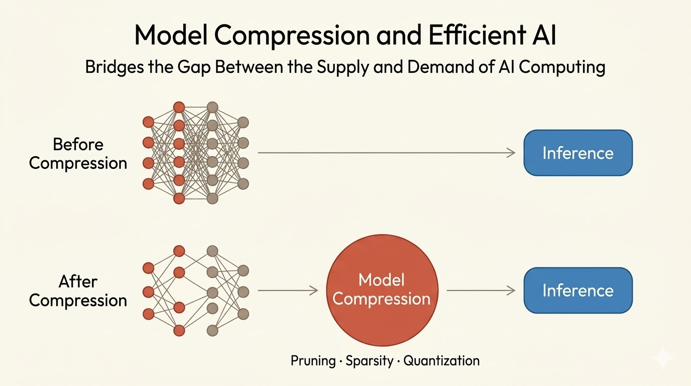
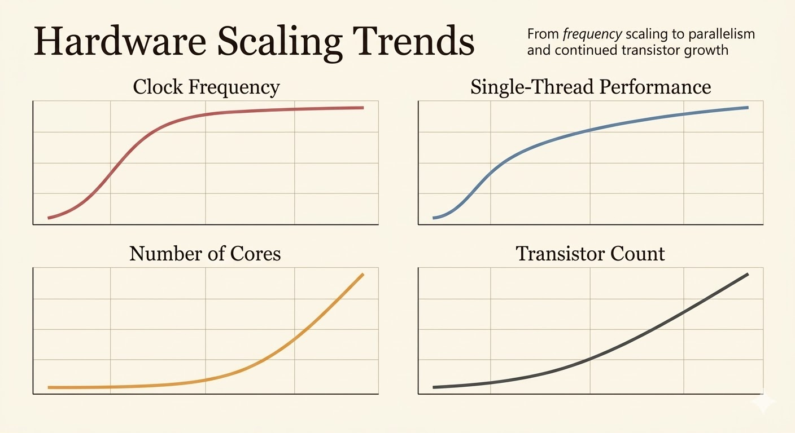

<iframe width="100%" height="500" src="https://www.youtube.com/embed/RgUl6BlyaF4" title="Efficient AI Lecture 1: Introduction" frameborder="0" allow="accelerometer; autoplay; clipboard-write; encrypted-media; gyroscope; picture-in-picture; web-share" allowfullscreen></iframe>

Slides: [Lecture 1 PDF](https://www.dropbox.com/scl/fi/ym2frcworou622a7wrghb/lec01.pdf?dl=0&rlkey=nbnjyn0wyyvhmoti7jvqbfa9s)

Efficient AI starts from a systems mismatch: modern models are scaling much faster than hardware memory and bandwidth. This lecture frames hardware-software co-design as the way to close that gap, combining compression algorithms with architectures that can actually exploit sparsity and low precision.

## Why Efficiency Matters

Modern AI models are growing much faster than hardware memory capacity, creating a widening gap between model demand and what commodity hardware can supply.

Model compression is one way to bridge that gap:

- shrink parameter storage
- reduce data movement
- lower inference latency and energy

## Deep Compression and EIE

Deep Compression reduces network size through three stages:

1. Pruning removes redundant connections.
2. Quantization reduces precision and weight storage.
3. Encoding compresses the remaining structure further.

EIE, the Efficient Inference Engine, is the hardware counterpart: a specialized accelerator designed to run compressed sparse networks directly instead of first densifying them.

The important co-design idea is that compression alone is not enough. If the hardware cannot exploit sparsity and compressed formats efficiently, much of the theoretical gain is lost.

## MCUNetV3 and On-Device Training

MCUNetV3 pushes efficiency further by enabling training directly on microcontrollers with extremely limited memory, on the order of 256 KB.

Its recipe has three parts:

1. Quantization-aware scaling adapts training to low-precision arithmetic.
2. Sparse layer or tensor updates avoid touching every parameter.
3. A tiny training engine is built specifically for MCU constraints.

Together these ideas reduce the training memory footprint by up to 2300x, making on-device adaptation possible even under severe edge-device limits.

## Efficient Vision Models

The lecture also sketches two application fronts:

- Efficient image classification for phones and edge devices, where compact architectures make real-time deployment practical.
- Efficient image generation, where pruning, adaptive computation, and spatial sparsity reduce the cost of GANs and diffusion models.

One example is SIGE, which accelerates Stable Diffusion by exploiting spatial sparsity to skip unnecessary computation.

## Efficient Language Models

Efficiency matters just as much for sequence models.

- Lite Transformer combines pruning and quantization to compress neural machine translation models dramatically while preserving BLEU.
- SpAtten prunes tokens and attention heads progressively across layers so later layers run on a much smaller active set.
- Quantization methods such as SmoothQuant and AWQ make LLM deployment feasible on edge-class hardware.
- TinyChatEngine provides a C/C++ inference runtime for these compressed models on constrained platforms.

The recurring pattern is the same: reduce precision, reduce active structure, and build runtimes that actually take advantage of both.

## Hardware Trend and AI Efficiency

Classical single-core scaling has slowed. Clock frequency has largely plateaued, and raw transistor scaling no longer translates into easy per-core performance gains.

That pushes modern acceleration toward:

- parallelism
- lower precision arithmetic
- specialized tensor hardware
- structured sparsity support

The lecture highlights that AI inference performance has improved roughly 317x in 8 years, largely because hardware and software evolved together: FP32 gave way to FP16 and INT8, while accelerator designs such as Tensor Cores made those reduced-precision operations practical at scale.

## Takeaways

- Efficient AI is not just about smaller models; it is about matching model structure to hardware reality.
- Compression methods such as pruning and quantization become much more valuable when the hardware is designed to exploit them.
- Edge AI pushes the problem harder, forcing training and inference into tiny memory budgets.
- Hardware-software co-design is the unifying theme across efficient CNNs, diffusion models, and LLMs.

*Source: Efficient AI, Lecture 1.*
