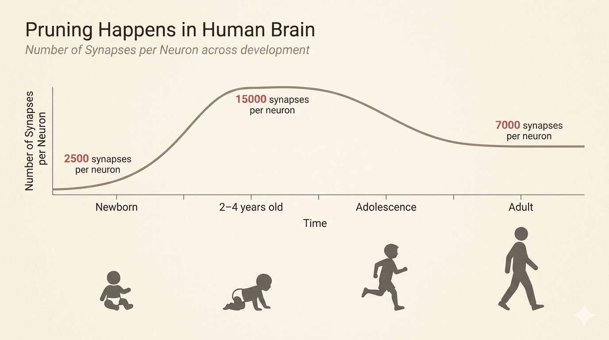
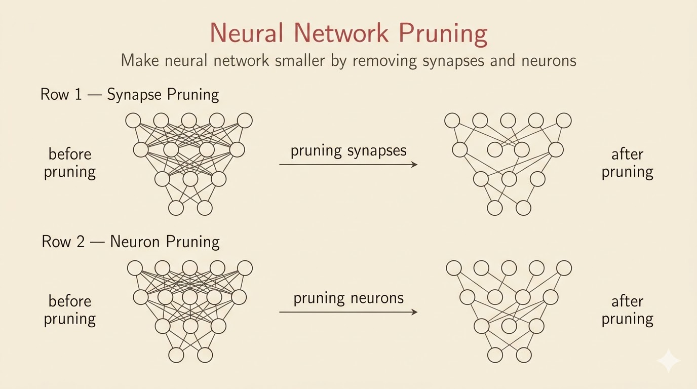
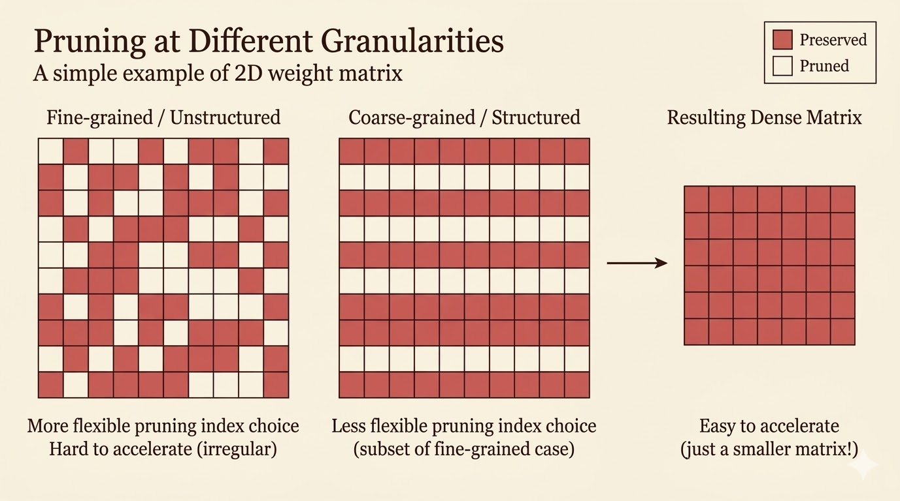

<iframe width="100%" height="500" src="https://www.youtube.com/embed/EjsB0WgIfUM" title="Efficient AI Lecture 3: Pruning and Sparsity (Part 1)" frameborder="0" allow="accelerometer; autoplay; clipboard-write; encrypted-media; gyroscope; picture-in-picture; web-share" allowfullscreen></iframe>

[Slides (PDF)](https://www.dropbox.com/scl/fi/6qspcmk8qayy7mft737gh/Lec03-Pruning-I.pdf?rlkey=9jpifc92be0sitiknpbhn9ggf&e=1&st=lml94lam&dl=0)

This lecture argues that pruning is not only about model size. It is really about hardware cost: moving data is often far more expensive than doing the arithmetic. That hardware fact explains why sparsity matters, but also why some kinds of sparsity are much easier to accelerate than others.

## Memory Is Expensive

The lecture starts with a hardware reality check: memory access can dominate energy consumption.

| Operation | Energy [pJ] | Relative Cost |
| --- | ---: | ---: |
| 32-bit int add | 0.1 | 1 |
| 32-bit float add | 0.9 | 9 |
| 32-bit register file access | 1 | 10 |
| 32-bit int multiply | 3.1 | 31 |
| 32-bit float multiply | 3.7 | 37 |
| 32-bit SRAM cache access | 5 | 50 |
| 32-bit DRAM access | 640 | 6400 |

The main message is that efficient deep learning must reduce data movement, not just arithmetic. Reading a value from DRAM can cost orders of magnitude more energy than adding numbers.

## Neural Network Pruning

Pruning can be written as a constrained optimization problem:

$$
\begin{aligned}
\text{minimize} &\quad L(x;W_p) \\
\text{subject to} &\quad \|W_p\|_0 \le N
\end{aligned}
$$

where:

- $L$: the loss function
- $W_p$: the weights after pruning
- $\|W_p\|_0$: the number of nonzero parameters
- $N$: the target number of remaining parameters

The biological analogy is synaptic pruning in the brain: connections are overproduced early, then many are removed later while function improves or stays strong.

## Synapse Pruning vs Neuron Pruning

Two basic pruning styles appear early:

### Synapse Pruning

Also called **unstructured pruning**, this removes individual weights.

- maximizes compression flexibility
- usually preserves accuracy better at the same sparsity level
- creates irregular sparsity that is hard to accelerate on standard hardware

### Neuron Pruning

Also called **structured pruning**, this removes whole neurons, rows, columns, or channels.

- directly shrinks matrix dimensions
- is easy to accelerate with standard dense kernels
- is less flexible and may hurt accuracy more

The lecture also highlights an empirical pattern: accuracy often stays almost unchanged up to moderate pruning ratios, then collapses only after a critical threshold.

## Two Milestones

- **Optimal Brain Damage (1989)**: one of the earliest principled pruning methods, using second-order information to decide which weights matter least
- **Deep Compression and EIE (2015-2016)**: revived pruning in deep learning and connected sparse models to specialized hardware acceleration

## A100 2:4 Sparsity

NVIDIA A100 supports a structured sparsity pattern called **2:4 sparsity**:

- in every block of 4 weights, exactly 2 must be zero
- hardware is designed to skip those zeros directly
- this gives large throughput gains with small accuracy loss if the model is trained or fine-tuned for the pattern

This is a good example of hardware-software co-design: the sparsity pattern is chosen not just for model compression, but for what hardware can exploit efficiently.

## Pruning Granularity

Granularity asks: what exactly are we removing?

### Unstructured Pruning

Remove individual weights with the smallest magnitudes across the full matrix.

- **Pros**: most flexible, often best accuracy retention
- **Cons**: irregular sparsity is difficult for GPUs and CPUs to exploit efficiently

### Structured Pruning

Remove entire rows, columns, channels, or filters.

- **Pros**: produces a smaller dense matrix that standard kernels can accelerate immediately
- **Cons**: all-or-nothing removal makes it easier to drop useful parameters

### CNN Example

For convolution, weights are 4-dimensional:

- $c_i$: input channels
- $c_o$: output channels
- $k_h$: kernel height
- $k_w$: kernel width

That allows several pruning levels:

- **fine-grained pruning**: remove individual weights anywhere in the tensor
- **pattern-based pruning**: enforce local patterns such as N:M or 2:4 sparsity
- **vector-level pruning**: remove 1D vectors inside the kernel tensor
- **kernel-level pruning**: remove whole 2D kernels
- **channel-level pruning**: remove full output channels and their feature maps

The coarser the pruning unit, the easier the acceleration but the higher the risk of accuracy loss.

## Pruning Criteria

Once we choose the pruning granularity, we still need a criterion for importance.

### Magnitude-Based Pruning

The simplest rule is: small weights matter less.

$$
\text{importance} = |W|
$$

For row-wise or channel-wise pruning, one often uses norms such as:

$$
\text{L1 importance} = \sum_i |W_i|
$$

$$
\text{L2 importance} = \sqrt{\sum_i W_i^2}
$$

This is the most common baseline because it is simple, cheap, and surprisingly effective.

### Scaling-Based Pruning

Instead of pruning raw weights, assign a trainable scaling factor to each channel:

- optimize the scaling factors during training
- encourage sparsity with regularization such as L1
- prune channels whose learned scaling factors become very small

This is the idea behind **network slimming**.

### Second-Order-Based Pruning

Second-order pruning approximates the increase in loss caused by deleting weights.

Let

$$
\delta L = L(x;W) - L(x;W-\delta W).
$$

A second-order Taylor expansion gives

$$
\delta L \approx
\sum_i g_i\,\delta w_i
+ \frac{1}{2}\sum_i h_{ii}(\delta w_i)^2
+ \frac{1}{2}\sum_{i\ne j} h_{ij}\delta w_i\delta w_j
+ O(\|\delta W\|^3),
$$

where:

- $g_i = \frac{\partial L}{\partial w_i}$
- $h_{ij} = \frac{\partial^2 L}{\partial w_i \partial w_j}$

Optimal Brain Damage makes three simplifying assumptions:

1. the model is near a local minimum, so $g_i \approx 0$
2. cross terms are ignored, so $h_{ij} \approx 0$ for $i \ne j$
3. higher-order terms are ignored

Then the saliency of weight $w_i$ becomes

$$
S_i = \frac{1}{2}h_{ii}w_i^2.
$$

This measures how much the loss would increase if that weight were removed.

### APoZ: Percentage of Zeros

APoZ measures neuron importance from activations rather than weights.

- run data through the model
- record how often a neuron outputs zero
- neurons with high APoZ are rarely active
- prune those neurons first

This is especially natural for ReLU networks, where zero activations already indicate inactivity.

### Regression-Based Pruning

Instead of minimizing global loss directly, regression-based pruning tries to preserve a layer's output.

Suppose

$$
Z = XW^\top,
$$

where:

- $X$: input features
- $W$: weights
- $Z$: output feature map

We seek a pruned model whose output $\hat Z$ still matches $Z$:

$$
\min_{W,\beta}\|Z-\hat Z\|_F^2
=
\left\|Z-\sum_c \beta_c X_c W_c^\top\right\|_F^2
$$

subject to

$$
\|\beta\|_0 \le N_c.
$$

Here:

- $\beta_c = 0$ means channel $c$ is pruned
- $\beta_c \ne 0$ means channel $c$ is kept
- $N_c$ is the number of channels to keep

The usual optimization alternates between:

1. **channel selection**: fix $W$, solve for $\beta$
2. **weight reconstruction**: fix $\beta$, solve for $W$

So the criterion is not raw magnitude or Hessian saliency, but how well the layer output can be reconstructed after pruning.

## Summary Table

| Method | Criterion |
| --- | --- |
| Magnitude pruning | Weight size |
| Second-order pruning (OBD) | Loss sensitivity |
| APoZ | Activation frequency |
| Regression-based pruning | Output reconstruction |

## Colab Demo

The lecture also provides a pruning demo on MNIST:

[Colab: Pruning Demo](https://colab.research.google.com/drive/1Z3Qne88hrTuojRwigIEyvUK5BCNJXeRZ?usp=sharing)

## Takeaways

- Memory access can cost far more energy than computation, so efficiency is largely a data-movement problem.
- Pruning is naturally framed as an L0-constrained optimization problem.
- Unstructured sparsity is flexible but hardware-unfriendly; structured sparsity is easier to accelerate.
- Granularity and pruning criterion are separate design choices.
- Modern sparse acceleration succeeds when the sparsity pattern matches what hardware can execute efficiently.

*Source: Efficient AI, Lecture 3: Pruning and Sparsity (Part 1).*
