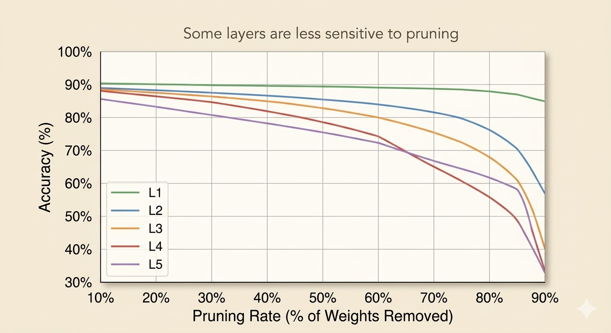
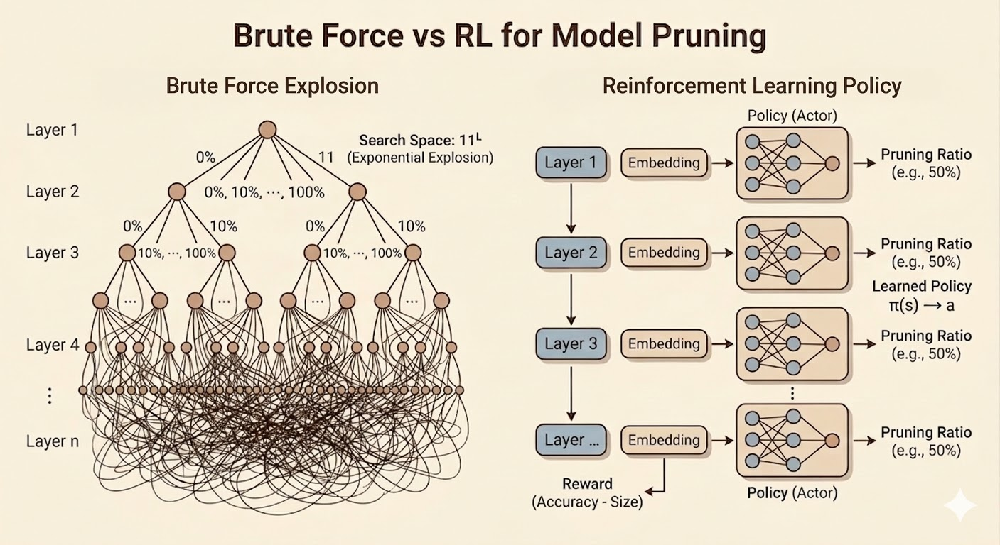
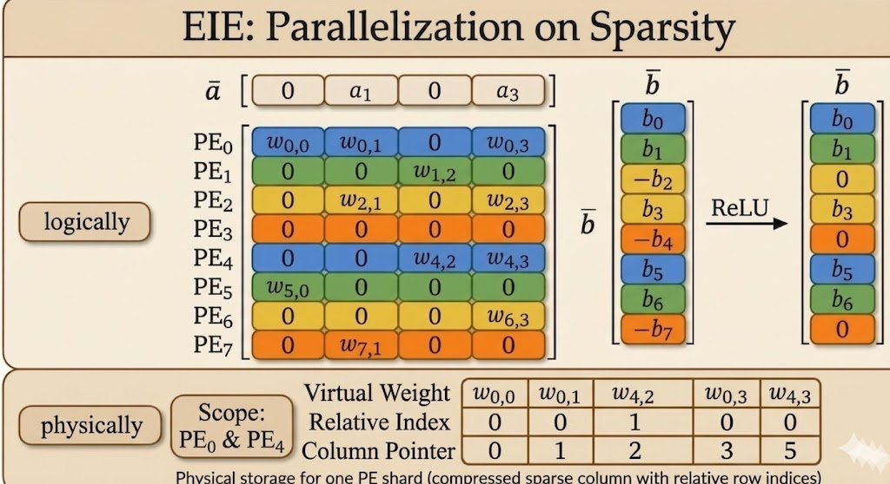

<iframe width="100%" height="500" src="https://www.youtube.com/embed/kgcvCs_1rzY" title="Efficient AI Lecture 4: Pruning and Sparsity (Part II)" frameborder="0" allow="accelerometer; autoplay; clipboard-write; encrypted-media; gyroscope; picture-in-picture; web-share" allowfullscreen></iframe>

[Slides (PDF)](https://www.dropbox.com/scl/fi/w5baiyci5cxl1ozpy6lsr/Lec04-Pruning-II.pdf?rlkey=6qxc1nz20isy9izwnqfebtukg&e=1&st=59gy1eal&dl=0)

This lecture continues pruning from the algorithm side into the system side. Part I asked what to prune. Part II asks how much to prune in each layer, how to automate those choices, how to recover accuracy, and when sparsity actually translates into hardware speed.

## Pruning Ratio

Different layers should not use the same pruning ratio:

- some layers are more sensitive
- some layers are more redundant

### Layer-Level Pruning Ratio

One direct strategy is to analyze each layer separately:

1. Pick one layer $L_i$
2. Apply pruning ratios
   $$
   r \in \{0.1,0.2,\dots,0.9\}
   $$
3. Measure the accuracy drop
   $$
   \Delta \mathrm{Acc}_i(r)
   $$
4. Repeat for all layers

Interpretation:

- a flat curve means the layer is not very sensitive, so it can be pruned more aggressively
- a sharp drop means the layer is sensitive, so pruning must be conservative

This is informative, but not necessarily optimal, because it ignores interactions between layers.

## Automatic Pruning

Manual layer-by-layer tuning is expensive, so the lecture presents automatic strategies.

### AMC: Pruning as a Reinforcement Learning Problem

AMC formulates layer-wise compression as a sequential decision problem.

- state:
  the current layer is encoded by an embedding containing signals such as layer index, input/output channels, feature-map size, kernel size, stride, and other structural information
- actor:
  a policy outputs a continuous pruning ratio
  $$
  a_t = \mu(s_t;\theta^\mu)
  $$
- critic:
  estimates the value of a state-action pair
  $$
  Q(s_t,a_t)
  $$
- reward:
  combines task performance and resource cost such as FLOPs or latency

The lecture's reward idea is

$$
R=
\begin{cases}
-\mathrm{Error}, & \text{if constraints are satisfied} \\
-\infty, & \text{otherwise.}
\end{cases}
$$

AMC is attractive because it learns the pruning policy automatically rather than requiring handcrafted layer ratios.

### NetAdapt

NetAdapt is a more direct greedy alternative.

For each iteration:

- pick one layer candidate
- prune only that layer until latency is reduced by a target amount $\Delta R$
- do a short fine-tune
- measure validation accuracy
- keep the branch with the best accuracy

Then repeat from the newly pruned model until the full latency target is met, followed by a longer final fine-tune.

Compared with AMC, NetAdapt is less global, but easier to interpret because every step is tied to measured latency.

## Fine-Tuning a Pruned Model

After pruning, accuracy usually drops. Fine-tuning is the recovery step.

- the learning rate is often reduced to `1/10` or `1/100` of the original training rate
- iterative pruning plus fine-tuning generally works better than one aggressive pruning step

### Iterative Pruning

Instead of pruning once:

- prune a little
- fine-tune
- prune again
- fine-tune again

This staged process can push compression further while preserving accuracy better.

### Regularization

Two regularizers appear repeatedly:

- L1:
  $$
  L' = L(x;W)+\lambda \|W\|_1
  $$
  encourages sparsity directly
- L2:
  $$
  L' = L(x;W)+\lambda \|W\|_2^2
  $$
  encourages small weights

Examples:

- L2 aligns naturally with magnitude-based pruning
- L1 aligns with methods like network slimming

## System and Hardware Support for Sparsity

The main systems message is simple: sparsity only matters if hardware can exploit it.

## EIE: Weight Sparsity Plus Activation Sparsity

EIE (Efficient Inference Engine) was one of the first accelerators designed explicitly for sparse compressed networks.

It combines three mechanisms:

- sparse weights:
  skip multiplications of the form $0 \times a$
- sparse activations:
  skip multiplications of the form $w \times 0$
- weight sharing / quantization:
  store representative values instead of full-precision weights everywhere

This is the lecture's key co-design lesson: pruning alone is not enough; data format and hardware execution model matter just as much.

### Compressed Sparse Column Format

To store sparse weights efficiently, EIE uses a customized compressed sparse column style format.

- a column pointer tells hardware where each column starts and ends
- a relative index stores how many zeros appear between consecutive nonzero entries

The relative index is tiny, but enough to reconstruct row positions on the fly.

#### Calculation Rule: Decoding the Actual Local Row Number

- Case A: first nonzero element in a column

  $$
  \text{Actual Local Row}=\text{Current Relative Index}
  $$

  Since there is no previous nonzero element, the number of skipped zeros is exactly its row position.

- Case B: subsequent nonzero element in the same column

  $$
  \text{Actual Local Row}=\text{Previous Row}+1+\text{Current Relative Index}
  $$

  Hardware keeps a small accumulator and reconstructs row numbers incrementally.

#### Column Index Rule

The number of elements in column $Col_j$ is

$$
\text{Pointer}[j+1]-\text{Pointer}[j].
$$

One subtle detail is the final entry of the column-pointer array:

- the column-pointer array always has length = number of columns + 1
- the last entry is the end guard (or sentinel)
- it equals the total number of nonzero elements stored in that processing element

That final value is what lets hardware determine the size of the last column as well.

### Dataflow and Micro-Architecture

EIE's datapath reflects the sparsity pattern directly:

- zero activations are filtered early
- nonzero activations are broadcast
- sparse weights are fetched in compressed form
- weight values and coordinates are decoded on the fly
- products accumulate only where real work exists
- ReLU generates new zeros, which the next stage can skip again

So sparsity reduces both computation and data movement.

#### EIE Micro-Architecture

- load balance:
  the activation queue absorbs workload imbalance because different columns contain different numbers of nonzeros
- filtering and table lookup:
  nonzero detection drops zero activations and uses the activation index to query column start/end addresses
- compressed data extraction:
  sparse matrix SRAM stores compressed nonzero weights together with relative indices
- hardware-level decompression:
  a weight decoder reconstructs shared quantized values, while an address accumulator reconstructs coordinates from relative indices
- multiply-accumulate and write-back:
  decoded weights multiply nonzero activations and accumulate into the correct destination activation registers
- dynamic zero generation:
  ReLU creates new zeros, and the next stage filters them again before continuing

## Nvidia Tensor Core: 2:4 Sparsity

NVIDIA's 2:4 sparsity is a more structured compromise:

- in every group of 4 weights, exactly 2 are kept and 2 are zero
- this enforces a fixed 50% sparsity ratio

Why it matters:

- from the algorithm side, it preserves accuracy better than coarse structured pruning
- from the hardware side, the pattern is predictable enough for tensor cores to accelerate directly

This is less flexible than fully unstructured sparsity, but much easier to support efficiently in mainstream hardware.

## TorchSparse and PointAcc

The lecture then shifts to activation sparsity in point-cloud workloads.

### TorchSparse

TorchSparse is a specialized library for activation sparsity, especially in 3D point clouds.

- system support for activation sparsity:
  it targets workloads where activations are extremely sparse
- sparse vs. conventional convolution:
  conventional convolution tends to dilate nonzeros over time, while sparse convolution preserves sparsity by computing only on active locations
- map-based computation:
  it uses prebuilt rule maps to locate exactly where sparse inputs, outputs, and weights align
- eliminating redundant math:
  empty regions are skipped directly, which can reduce the number of multiplications dramatically
- weight-stationary dataflow:
  matrix multiplications for different weights are separated so each weight stays in place and is reused efficiently
- gather-matmul-scatter pipeline:
  scattered sparse inputs are gathered into dense blocks, processed with dense matrix multiplication, then scattered back to sparse coordinates

### TorchSparse++

TorchSparse++ further improves efficiency by:

- row reordering:
  group similar sparsity patterns together
- column splitting:
  form tighter dense blocks and reduce padding waste

### PointAcc

PointAcc is a sparsity-aware accelerator for 3D point clouds.

Its key idea is to turn sparse spatial matching into a fast mapping problem:

- shift coordinates according to kernel offsets
- use a merge-sort-style matching unit to find valid overlaps efficiently

This co-designed mapping hardware avoids brute-force neighbor search and makes sparse point-cloud convolution much faster and more energy efficient.

More concretely:

- PointAcc is an ASIC designed specifically for sparse 3D point-cloud workloads
- its mapping unit reduces spatial matching to sorted-array comparison rather than expensive neighborhood search
- the result is large speed and energy gains compared with general-purpose hardware when sparsity is high

## Takeaways

- pruning ratio should be layer-aware because different layers have different sensitivity
- AMC and NetAdapt automate pruning decisions in different ways: global policy search versus greedy latency-aware search
- fine-tuning is essential after pruning, especially in iterative pipelines
- sparsity only becomes useful in practice when storage format, dataflow, and hardware execution are designed for it

*Source: Efficient AI, Lecture 4: Pruning and Sparsity (Part II).*
