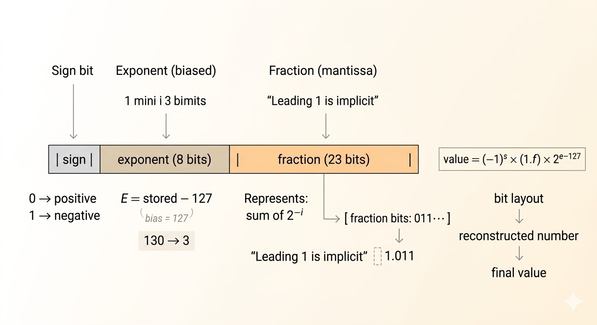
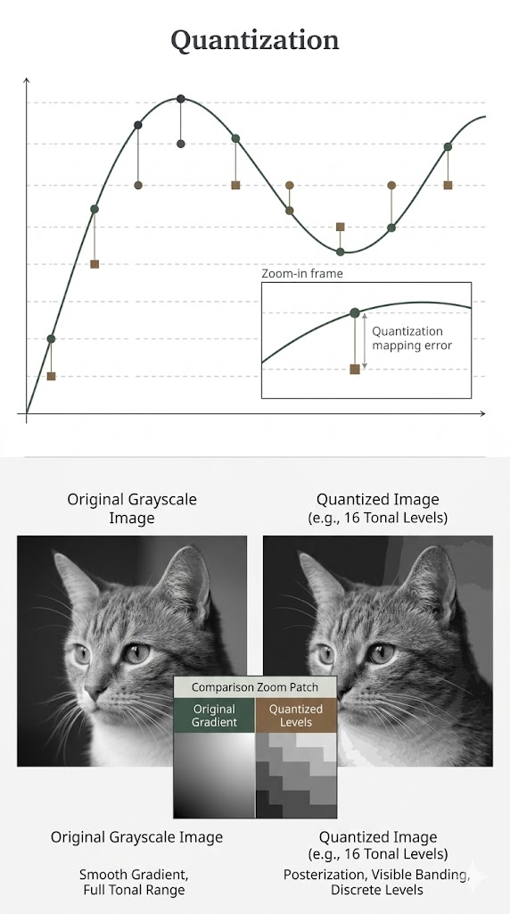
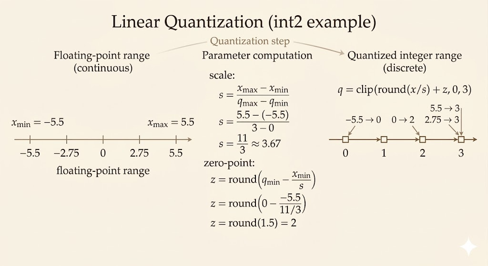

<iframe width="100%" height="480" src="https://www.youtube.com/embed/RP23-dRVDWM" title="Efficient AI Lecture 5: Quantization (Part I)" frameborder="0" allowfullscreen></iframe>

[Slides: Lecture 5 PDF](https://www.dropbox.com/scl/fi/qc2s9opsa2mnqfithvwz1/Lec05-Quantization-I.pdf?rlkey=sizfzkdv85etnplz1nqgngeql&e=2&st=zr1y81q7&dl=0)

## Less Bits, Less Energy

Low-bit arithmetic is cheaper than high-precision arithmetic.

| Operation | Bit-width | Energy [pJ] | Relative Cost vs 8b Int ADD |
|---|---:|---:|---:|
| 8-bit Integer ADD | 8 | 0.03 | 1x |
| 32-bit Integer ADD | 32 | 0.1 | ~3.3x |
| 16-bit Floating-Point ADD | 16 | 0.4 | ~13x |
| 32-bit Floating-Point ADD | 32 | 0.9 | 30x |
| 8-bit Integer MULT | 8 | 0.2 | ~6.7x |
| 16-bit Floating-Point MULT | 16 | 1.1 | ~37x |
| 32-bit Integer MULT | 32 | 3.1 | ~103x |
| 32-bit Floating-Point MULT | 32 | 3.7 | ~123x |

That is the hardware motivation for quantization: fewer bits reduce energy, storage, and bandwidth pressure.

## Numeric Data Types

### Integer

- Unsigned integer uses all bits for nonnegative values in $[0,2^n-1]$.
- Sign-magnitude uses one sign bit plus magnitude bits, but it has both `+0` and `-0`, which is awkward for hardware arithmetic.
- Two's complement is the standard representation because it makes signed arithmetic efficient and uniform.

### Fixed-Point

A fixed-point number splits bits into:

- an integer part
- a fractional part using powers like $2^{-1}, 2^{-2}, \dots$

Its value is just the weighted sum of the active bits. Fixed-point is simpler than floating-point, but its range is limited by the fixed binary point.

### Floating-Point

Floating-point stores three components:

- sign
- exponent
- fraction

For a normal IEEE FP32 number,

$$
\text{value} = (-1)^s (1.f)\,2^{e-127}
$$

Key ideas:

- the leading `1` is implicit for normal numbers, giving one extra bit of precision
- the exponent is stored with a bias so hardware can compare exponents efficiently

### Subnormals and Special Values

For IEEE-style floating point:

- exponent all `0`, fraction all `0`: `+0` or `-0`
- exponent all `0`, fraction nonzero: subnormal numbers
- exponent all `1`, fraction all `0`: `+\infty` or `-\infty`
- exponent all `1`, fraction nonzero: `NaN`

Subnormals drop the hidden `1` and fill the gap between the smallest normal number and zero.

### Different Precisions

- FP32: exponent `8`, fraction `23`, sign `1`
- FP16: exponent `5`, fraction `10`, sign `1`
- bfloat16: exponent `8`, fraction `7`, sign `1`
- FP8 `E4M3`: exponent `4`, fraction `3`, sign `1`
- FP8 `E5M2`: exponent `5`, fraction `2`, sign `1`

There are also more aggressive low-bit formats such as `INT4` and several `FP4` variants.

## Quantization

Quantization maps a continuous or high-precision set of values into a small discrete set.

The goal is not only compression. It is also to make the hardware execute cheaper low-bit operations.

## K-Means Quantization

K-means quantization works in three steps:

1. Cluster similar FP32 weights.
2. Replace each cluster by a centroid, forming a small shared codebook.
3. Store only low-bit indices that point to the codebook entries.

This saves storage because large floating-point tensors become:

- a low-bit index matrix
- a tiny floating-point codebook

But the arithmetic itself is still not naturally low-bit. During execution, the indices usually have to be dequantized back to floating-point values. So:

- storage is compressed
- computation is not automatically accelerated

## Linear Quantization

Linear quantization uses an affine map between real values and integers.

Let:

- $r_{\min}, r_{\max}$ be the floating-point range
- $q_{\min}, q_{\max}$ be the integer range of the target format

Then the scale is

$$
S = \frac{r_{\max}-r_{\min}}{q_{\max}-q_{\min}}
$$

and the zero point is

$$
Z = \operatorname{round}\left(q_{\min} - \frac{r_{\min}}{S}\right)
$$

The reconstruction formula is

$$
r \approx S(q-Z)
$$

This is what lets integer values approximate real-valued weights and activations.

Compared with K-means quantization:

- linear quantization is simpler
- the hardware path is much cleaner
- integer MAC units can often use it directly

## Quantized Matrix Computation

Suppose

$$
Y = WX
$$

and the quantized tensors are represented by

$$
W \approx S_W(q_W - Z_W), \qquad
X \approx S_X(q_X - Z_X), \qquad
Y \approx S_Y(q_Y - Z_Y)
$$

Then the integer kernel computes dot products of shifted integers:

$$
Y \approx S_W S_X \sum (q_W - Z_W)(q_X - Z_X)
$$

After accumulation, the output is requantized:

$$
q_Y \approx \operatorname{round}\!\left(
\frac{S_W S_X}{S_Y}
\sum (q_W - Z_W)(q_X - Z_X)
\right) + Z_Y
$$

The important point is not the exact bookkeeping of every correction term. The important point is that the heavy computation happens in low-bit integer arithmetic, and only scale / zero-point corrections are handled around it.

## Takeaways

- lower bit-width means lower arithmetic energy
- integer, fixed-point, and floating-point formats trade off range, precision, and hardware cost
- K-means quantization is good for compression but does not directly give low-bit compute
- linear quantization is hardware-friendly because it matches integer arithmetic
- quantized inference works by shifting integers with zero points, accumulating in integer form, and requantizing at the end
