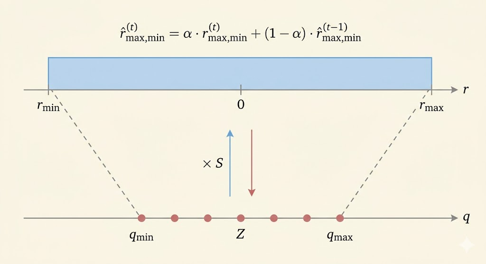
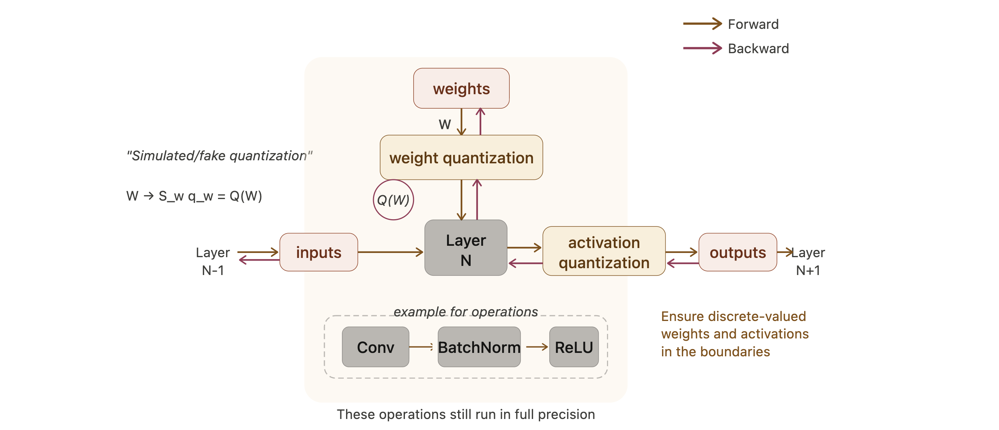

<iframe width="100%" height="500" src="https://www.youtube.com/embed/kjHuIzQ54v4" title="Efficient AI Lecture 6" frameborder="0" allowfullscreen></iframe>

Slides: [Lecture 6 PDF](https://www.dropbox.com/scl/fi/qt970xoje5d1btek4a8cl/Lec06-Quantization-II.pdf?rlkey=lalxz5ed2hez0olwu4e4gokbj&e=1&st=f1oof15v&dl=0)

## Post-Training Quantization

### Quantization Granularity

#### Per-Tensor Quantization

Per-tensor quantization uses one scaling factor for the whole tensor.

- simple and hardware-friendly
- often works well for large models
- can hurt accuracy more on small models

For the example weight matrix

$$
W = \begin{bmatrix}
2.09 & -0.98 & 1.48 & 0.09 \\
0.05 & -0.14 & -1.08 & 2.12 \\
-0.91 & 1.92 & 0 & -1.03 \\
1.87 & 0 & 1.53 & 1.49
\end{bmatrix},
$$

we have $|r_{\max}| = 2.12$. In a 2-bit signed example with $q_{\max}=1$,

$$
S = \frac{|r_{\max}|}{q_{\max}} = 2.12.
$$

The quantized matrix is

$$
\begin{bmatrix}
1 & 0 & 1 & 0 \\
0 & 0 & -1 & 1 \\
0 & 1 & 0 & 0 \\
1 & 0 & 1 & 1
\end{bmatrix}
$$

and the reconstructed matrix is

$$
\begin{bmatrix}
2.12 & 0 & 2.12 & 0 \\
0 & 0 & -2.12 & 2.12 \\
0 & 2.12 & 0 & 0 \\
2.12 & 0 & 2.12 & 2.12
\end{bmatrix}.
$$

The reconstruction error is

$$
\|W - S \odot q_W\|_F = 2.28.
$$

#### Per-Channel Quantization

Per-channel quantization gives each channel its own scale. That usually reduces distortion because different rows or channels can have very different dynamic ranges.

Using the same matrix,

- $|r_{\max}|=2.09$, so $S_0 = 2.09$
- $|r_{\max}|=2.12$, so $S_1 = 2.12$
- $|r_{\max}|=1.92$, so $S_2 = 1.92$
- $|r_{\max}|=1.87$, so $S_3 = 1.87$

The quantized matrix is

$$
\begin{bmatrix}
1 & 0 & 1 & 0 \\
0 & 0 & -1 & 1 \\
0 & 1 & 0 & -1 \\
1 & 0 & 1 & 1
\end{bmatrix}
$$

with reconstruction

$$
\begin{bmatrix}
2.09 & 0 & 2.09 & 0 \\
0 & 0 & -2.12 & 2.12 \\
0 & 1.92 & 0 & -1.92 \\
1.87 & 0 & 1.87 & 1.87
\end{bmatrix}
$$

and error

$$
\|W - S \odot q_W\|_F = 2.08.
$$

So per-channel quantization improves the reconstruction by adapting scale to local statistics.

#### Group Quantization

Modern GPUs support even finer scaling granularity. Blackwell introduces micro-tensor scaling to help push low-bit formats like FP4 further.

| Specification | B200 GPU | B100 GPU |
|---|---:|---:|
| FP4 Tensor Core | 18 petaFLOPS | 14 petaFLOPS |
| FP8/FP6 Tensor Core | 9 petaFLOPS | 7 petaFLOPS |
| INT8 Tensor Core | 9 petaOPS | 7 petaOPS |
| FP16/BF16 Tensor Core | 4.5 petaFLOPS | 3.5 petaFLOPS |

##### Vector-Scaled Quantization (VSQ)

$$
r = S(q-Z) \rightarrow r = \gamma \cdot S_q (q-Z)
$$

- $\gamma$: per-tensor floating-point scale
  - more expensive
  - coarser granularity
- $S_q$: per-vector integer scale
  - less expensive
  - finer granularity

For 4-bit quantization with a 4-bit vector scale every 16 elements, the effective bit width is

$$
4 + \frac{4}{16} = 4.25.
$$

##### Multi-Level Scaling (MX)

Multi-level scaling uses several nested scale levels:

$$
r = (q-z) \cdot s_{l_0} \cdot s_{l_1} \cdots
$$

| Quantization Approach | Data Type | L0 Group Size | L0 Scale Data Type | L1 Group Size | L1 Scale Data Type | Effective Bit Width |
|---|---|---:|---|---:|---|---:|
| Per-Channel Quant | INT4 | Per channel | FP16 | - | - | 4 |
| VSQ | INT4 | 16 | UINT4 | Per channel | FP16 | 4.25 |
| MX4 | S1M2 | 2 | E1M0 | 16 | E8M0 | 4 |
| MX6 | S1M4 | 2 | E1M0 | 16 | E8M0 | 6 |
| MX9 | INT8 | 2 | E1M0 | 16 | E8M0 | 9 |

## Dynamic Range Clipping

Unlike weights, activation ranges vary across inputs.

Here, activation means the output tensor of a layer, not the activation function itself.

So before deployment we need activation statistics. Two common ways are:

- during training, if we own the training process
- calibration, if we only have a pretrained model

During training, a moving average can track the range:

$$
\hat r^{(t)}_{\max,\min} = \alpha \cdot r^{(t)}_{\max,\min} + (1-\alpha) \cdot \hat r^{(t-1)}_{\max,\min}.
$$

For calibration, we run representative samples through the FP32 model and choose the clipping range that minimizes reconstruction distortion, often via mean-square error:

$$
\min_{r_{\max}} \mathbb{E}[(X-Q(X))^2].
$$

Clipping is a tradeoff:

- outliers outside the chosen range are saturated, creating clipping error
- but the quantization buckets become denser over the important region, improving precision for most values

A statistics-based way to choose the clipping point is KL divergence:

$$
D_{KL}(P\|Q) = \sum_{i=1}^{N} P(x_i) \log \frac{P(x_i)}{Q(x_i)}.
$$

### Rounding

Rounding to nearest is not always the best choice. Learning-based rounding tries to choose the quantized value that minimizes downstream error.

AdaRound writes

$$
\tilde w = \left\lfloor \lfloor w \rfloor + \delta \right\rceil, \qquad \delta \in [0,1],
$$

and optimizes a relaxed rounding decision:

$$
\operatorname*{argmin}_{\mathbf V} \|\mathbf W \mathbf x - \tilde{\mathbf W}\mathbf x\|_F^2 + \lambda f_{\mathrm{reg}}(\mathbf V)
$$

which becomes

$$
\operatorname*{argmin}_{\mathbf V} \left\|\mathbf W \mathbf x - [\lfloor \mathbf W \rfloor + \mathbf h(\mathbf V)]\mathbf x\right\|_F^2 + \lambda f_{\mathrm{reg}}(\mathbf V).
$$

- $\mathbf V$: latent rounding variables
- $h(\cdot)$: maps those variables into $(0,1)$
- $f_{\mathrm{reg}}$: encourages hard rounding decisions

## Quantization-Aware Training

### Simulated Quantization

QAT keeps a full-precision copy of the weights during training, but inserts quantization in the forward pass so the model learns to live with low-bit inference.

After training, only the quantized weights are used for inference.

### Straight-Through Estimator (STE)

The problem is that quantization is discrete, so its true derivative is zero almost everywhere:

$$
\frac{\partial Q(W)}{\partial W} = 0.
$$

STE uses a surrogate backward rule and simply passes the gradient through the quantizer:

$$
\frac{\partial L}{\partial W} = \frac{\partial L}{\partial Q(W)}.
$$

This is not the exact derivative, but it makes optimization possible in practice.

## Binary Quantization

### Deterministic Binarization

$$
q = \operatorname{sign}(r) =
\begin{cases}
+1, & r \ge 0 \\
-1, & r < 0
\end{cases}
$$

### Stochastic Binarization

Instead of a hard sign, stochastic binarization turns the value into a probability of $+1$ or $-1$.

#### BinaryConnect

BinaryConnect uses a hard sigmoid:

$$
\sigma(r) = \min(\max((r+1)/2, 0), 1).
$$

- probability of $+1$: $\sigma(r)$
- probability of $-1$: $1-\sigma(r)$

#### Binary Weight Networks (BWN)

BWN adds a single floating-point scale for the whole binary weight matrix:

- $W^{\mathbb B} = \operatorname{sign}(W)$
- $\alpha = \frac{1}{N}\|W\|_1$

That scaling makes the binary matrix better match the original real-valued weights.

#### XNOR-Net

XNOR-Net binarizes both weights and activations. Then multiply-accumulate can be approximated by:

1. XNOR of bit patterns
2. popcount to count matches

| Input | Weight | Operations | Memory | Computation |
|---|---|---|---:|---:|
| Float | Float | $+,\times$ | $1\times$ | $1\times$ |
| Float | Binary | $+,-$ | about $32\times$ less | about $2\times$ less |
| Binary | Binary | XNOR, popcount | about $32\times$ less | about $58\times$ less |

## Ternary Quantization

### Ternary Weight Networks (TWN)

$$
q =
\begin{cases}
r_p, & r > \Delta \\
0, & |r| \le \Delta \\
-r_p, & r < -\Delta
\end{cases}
$$

where

- threshold: $\Delta = 0.7\,\mathbb E(|r|)$
- reconstruction value: $r_p = \mathbb E_{|r|>\Delta}(|r|)$

So TWN keeps three values: positive, zero, and negative.

### Trained Ternary Quantization (TTQ)

$$
q =
\begin{cases}
w_p, & r > \Delta \\
0, & |r| \le \Delta \\
-w_n, & r < -\Delta
\end{cases}
$$

TTQ improves on TWN by making the positive and negative scales trainable:

- $w_p$: learned positive scale
- $w_n$: learned negative scale

This allows asymmetric positive and negative magnitudes.

Colab: [Quantization Colab](https://colab.research.google.com/drive/11IBla1q1McoZ2oCANCGHns8VtzG5nCMP)
