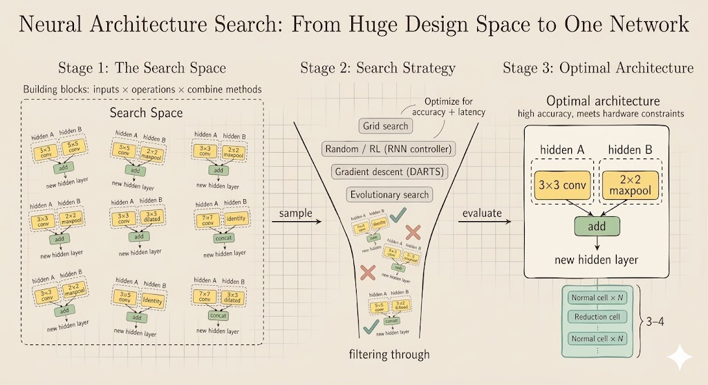

<iframe width="100%" height="500" src="https://www.youtube.com/embed/_Pflki9XOXE" title="Efficient AI Lecture 7" frameborder="0" allowfullscreen></iframe>

Slides: [Lecture 7 PDF](https://www.dropbox.com/scl/fi/hxhjhxonwqyw2hfoywzcp/Lec07-Neural-Architecture-Search-I.pdf?rlkey=o6s5dglazyb2o2nrc897ccppg&e=1&st=dcjyr42l&dl=0)

## Why Architecture Search Matters

Efficient AI is not only about compressing a fixed model. Sometimes the better move is to search directly for an architecture that matches the hardware budget from the beginning.

This lecture separates two ingredients:

- the **search space**: which architectures are allowed
- the **search strategy**: how we explore that space efficiently

That distinction is useful because a bad search strategy can waste compute, but a bad search space can prevent the right model from ever being considered.

## Classic Efficient Building Blocks

Modern NAS systems do not start from nothing. They reuse a menu of building blocks that have already proved effective.

- **ResNet bottleneck block**: uses a skip connection plus 1x1-3x3-1x1 convolutions to reduce cost while keeping deep optimization stable.
- **MobileNetV1**: replaces a full convolution with a depthwise convolution followed by a pointwise 1x1 convolution, dramatically reducing FLOPs and parameters.
- **MobileNetV2 / MBConv**: expands channels first, performs depthwise convolution in the expanded space, then projects back down with a linear bottleneck so information is not destroyed by a final ReLU.
- **ShuffleNet block**: uses groupwise pointwise convolutions and a channel-shuffle operation to reduce compute while still mixing information across groups.
- **Transformer block**: replaces convolutional locality with self-attention, which is flexible but expensive in sequence length.

For self-attention,

$$
\operatorname{Attention}(Q,K,V) = \operatorname{softmax}\left(\frac{QK^\top}{\sqrt{k}}\right)V.
$$

If the sequence length is $N$ and hidden width is $d$, then:

- forming $QK^\top$ costs $O(N^2 d)$
- multiplying the attention matrix by $V$ also costs $O(N^2 d)$

So the total complexity is

$$
O(N^2 d),
$$

which is why standard attention becomes expensive for long sequences.

```{mermaid}
graph LR
    Q["Q (N x d)"] -->|MatMul| A["softmax(QK^T) (N x N)"]
    K["K^T (d x N)"] -->|MatMul| A
    A -->|MatMul| O["Output (N x d)"]
    V["V (N x d)"] -->|MatMul| O
```

## Search Space

A neural architecture search problem begins by defining the family of candidate models.

### Cell-Level Search

One influential idea is to search for a small computational cell and then stack copies of that cell.

- a **normal cell** preserves spatial resolution and mainly extracts features
- a **reduction cell** shrinks spatial resolution and increases receptive field

The controller repeatedly decides:

1. which previous hidden states to use as inputs
2. which operation to apply to each selected input
3. how to combine the two transformed results

```{mermaid}
graph LR
    H1["Select first input"] --> O1["Operation on first input"]
    H2["Select second input"] --> O2["Operation on second input"]
    O1 --> C["Combine"]
    O2 --> C
    C --> N["New hidden state"]
```

If each node is built from:

- 2 input selections
- $M$ candidate operations for the first branch
- $M$ candidate operations for the second branch
- $N$ candidate combine methods

then a $B$-block cell has design space size

$$
(2 \cdot 2 \cdot M \cdot M \cdot N)^B.
$$

This grows extremely fast, which is why brute-force search becomes expensive.

### Elastic Dimensions

The search space is not only about operators inside a cell. Practical efficient-model design often searches over several global dimensions:

- **depth**: how many blocks are stacked in each stage
- **width**: how many channels each stage uses
- **resolution**: the input image size
- **kernel size**: whether layers use 3x3, 5x5, 7x7, and so on
- **topology / connectivity**: how information routes across scales or stages

This is the logic behind systems such as MobileNet variants and EfficientNet: capacity is not controlled by one knob, but by several coupled knobs.

## Good Search Spaces Respect Hardware

A large search space is not automatically a good one. In efficient AI, the target is not simply the model with the highest FLOPs or the largest parameter count.

The design space should contain strong candidates **under the real hardware constraint**, such as latency, memory, or energy.

For example, width-resolution pairs with similar FLOPs can behave differently in practice:

| Width-Resolution | mFLOPs |
|---|---:|
| w0.3-r160 | 32.5 |
| w0.4-r112 | 32.4 |
| w0.4-r128 | 39.3 |
| w0.5-r112 | 38.3 |
| w0.7-r96 | 31.4 |
| w0.7-r112 | 38.4 |

So the goal is not just "more FLOPs means more accuracy." The better interpretation is:

- larger models often have higher capacity
- but the **shape** of that extra capacity matters
- a good search space makes it easy to pick the best architecture for a fixed budget

## Search Strategy

Once the search space is fixed, we need a procedure for exploring it.

### Grid Search

The simplest baseline is grid search over a Cartesian product of dimensions such as width and resolution. Each candidate is trained and evaluated, then we keep only the models that satisfy the latency constraint.

This is conceptually simple but computationally expensive.

### Compound Scaling

EfficientNet-style compound scaling replaces a large grid with three coordinated scaling variables:

$$
d = \alpha^\phi,\qquad
w = \beta^\phi,\qquad
r = \gamma^\phi.
$$

Because convolutional FLOPs scale roughly like

$$
d \cdot w^2 \cdot r^2,
$$

the scaling coefficients are chosen so that

$$
\alpha \beta^2 \gamma^2 \approx 2,
\qquad
\alpha \ge 1,\ \beta \ge 1,\ \gamma \ge 1.
$$

This gives a structured way to enlarge a model family without an exhaustive search over every dimension independently.

### Random Search

Random search samples architectures from the candidate set and keeps the best-performing ones. It is surprisingly competitive when the search space is well designed, though it still wastes many evaluations.

### Reinforcement Learning

RL-based NAS models architecture generation as a sequential decision problem.

- an RNN controller samples an architecture token by token
- the sampled child model is trained and evaluated
- the validation accuracy becomes the reward
- policy-gradient updates improve the controller

This was a major early NAS idea, but it is costly because many child networks must be trained.

### Differentiable Search

The key DARTS-style trick is to relax a discrete operator choice into a soft weighted mixture:

$$
\bar o(x) = \sum_i \frac{\exp(\alpha_i)}{\sum_j \exp(\alpha_j)} o_i(x).
$$

Now the architecture parameters $\alpha_i$ are differentiable, so gradient descent can optimize them directly.

This reduces search cost dramatically. It also makes it possible to include hardware-aware penalties, such as expected latency:

$$
\mathcal{L}_{\text{total}} = \mathcal{L}_{\text{task}} + \lambda F(\alpha,\beta,\dots),
$$

where $F$ is a latency predictor or lookup-table estimate. After optimization, the relaxed architecture is discretized by keeping the strongest operation on each edge.

### Evolutionary Search

Evolutionary search treats architectures like a population:

- encode each architecture
- evaluate its fitness under accuracy and hardware constraints
- create offspring by crossover and mutation
- keep the stronger candidates and discard the weaker ones

This method is intuitive and hardware-friendly because it can optimize directly for black-box objectives such as measured latency, though it can still require many evaluations.

The slide below summarizes the broader NAS picture in the lecture:



## Interpretation

- the **search space** decides what kinds of efficient models are even possible
- the **search strategy** decides how much compute we spend to find one
- hardware-aware NAS works only when both are designed together

The lecture’s main message is that efficient AI is not just about pruning or quantizing an existing model. Sometimes the architecture itself should be treated as a variable, and the search must be guided by both learning performance and deployment constraints.
