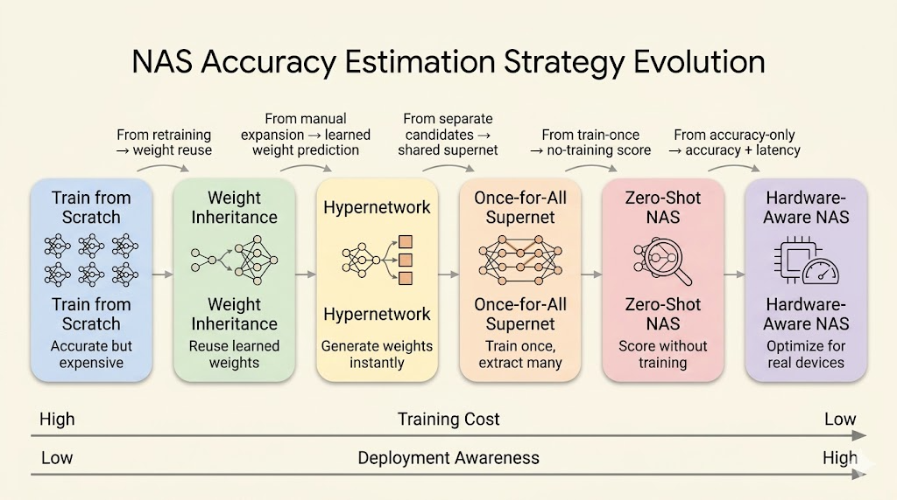

<iframe width="100%" height="500" src="https://www.youtube.com/embed/L07-eVmSVGY" title="Efficient AI Lecture 8" frameborder="0" allowfullscreen></iframe>

Slides: [Lecture 8 PDF](https://www.dropbox.com/scl/fi/kaia5vvmdwb2bj0xnbihm/Lec08-Neural-Architecture-Search-II.pdf?rlkey=vkp9i12ljbk4jmdfp05j3ctdy&st=hincmob7&dl=0)



Lecture 7 focused on the NAS search space and search strategy. Lecture 8 asks the next practical question: how do we estimate accuracy and hardware cost without training every candidate from scratch?

The main progression is:

- train each candidate from scratch
- reuse weights from a trained parent model
- use a hypernetwork to generate candidate weights
- train a shared supernet and sample child networks
- use zero-shot scores without training
- add hardware latency, mapping, and accelerator design into the loop

## Accuracy Estimation

The expensive part of NAS is not sampling architectures. It is evaluating them. A naive NAS loop trains thousands of candidates, and each full training run can be costly.

Accuracy-estimation methods try to answer a cheaper question:

> Can we predict which architecture is promising without paying the full training cost?

### Weight Inheritance

Weight inheritance treats architecture search as evolution rather than creation from zero.

Instead of initializing every candidate randomly, a child model starts from a trained parent model and expands it through transformations that preserve the parent's function.

Two common transformations are:

- **Net2Wider:** duplicate neurons or channels, then divide outgoing weights so the widened layer initially computes the same function.
- **Net2Deeper:** insert a new layer initialized as an identity mapping, so the deeper network initially behaves like the shallower one.

The goal is to expand capacity while preserving useful learned representations. The child can then be fine-tuned instead of trained from scratch.

### Hypernetwork

A hypernetwork is a model that generates weights for another model.

In NAS, this means we train one master network that can emit weights for many sampled child architectures. A typical loop is:

1. Sample an architecture from the search space.
2. Encode its structure into embeddings.
3. Feed the embeddings through the hypernetwork.
4. Generate the child model's weights.
5. Evaluate the child model on data.
6. Use the child model's loss to update the hypernetwork.

This replaces "train every candidate" with "learn a weight generator." The sampled architecture still gets evaluated, but it does not need its own full training run.

## Hardware-Aware NAS

Hardware-aware NAS includes latency, memory, energy, or other deployment constraints directly in the search objective.

The objective is no longer only:

$$
\max_\alpha \operatorname{Accuracy}(\alpha).
$$

Instead, the search balances model quality and hardware cost:

$$
\max_\alpha \operatorname{Accuracy}(\alpha)
\quad \text{subject to} \quad
\operatorname{Latency}(\alpha) \le T.
$$

Equivalently, latency can be added as a differentiable or predicted penalty:

$$
\mathcal{L}_{\text{total}}
=
\mathcal{L}_{\text{task}}
+ \lambda \operatorname{Latency}(\alpha).
$$

### ProxylessNAS

ProxylessNAS avoids training a separate proxy model that may not match the target hardware. It builds an over-parameterized network containing all candidate paths, then trains the search process directly on the target task and hardware constraint.

The simplified workflow is:

1. Build a supernet with all candidate paths.
2. Train the over-parameterized network as one shared model.
3. Learn which paths are useful.
4. Prune redundant paths.
5. Keep the final efficient architecture.

This is a single-training-process view of NAS: the supernet shares weights across candidates, and search becomes path selection inside the network.

### Latency Prediction and Feedback

Measuring real latency for every sampled architecture on a physical device is too slow. Hardware-aware NAS usually needs a fast latency estimator.

One approach is a **latency lookup table**:

1. Measure common operations on the target device.
2. Store latency values for layers such as 3x3 convolution, 5x5 convolution, depthwise convolution, and pointwise convolution.
3. Estimate architecture latency by summing the latency of its components.

Another approach is a learned latency predictor:

1. Collect architectures and measured latencies.
2. Extract architecture features such as kernel size, width, depth, and resolution.
3. Train a predictor to estimate latency for unseen candidates.

The estimated latency then feeds back into the NAS loop, so the search is guided toward architectures that are accurate and deployable.

## Once-for-All Networks

Once-for-All (OFA) changes the deployment workflow from "train one model for one device" to "train one supernet, then extract many specialized subnets."

The idea is:

- train a large supernet once
- allow child networks with different depth, width, kernel size, and resolution
- extract a subnet for a target hardware constraint
- deploy the extracted subnet without retraining

This reduces design cost. If a phone, watch, edge accelerator, and cloud GPU all need different latency or memory targets, OFA can select different child networks from the same trained supernet.

### Progressive Shrinking

Progressive shrinking is the training strategy that makes OFA work. The supernet is trained so that smaller subnets remain accurate after extraction.

The shrinking dimensions include:

- **Kernel size:** learn transformations from larger kernels such as 7x7 into smaller kernels such as 5x5 or 3x3.
- **Depth:** allow shallower subnets to exit early by skipping later layers in a block.
- **Width:** rank channels by importance and keep the stronger channels for narrower subnets.

During training, the model is exposed to these smaller choices so early layers and shared weights become robust. During deployment, unused paths are removed.

### Roofline Intuition

Efficient deployment is not only about reducing FLOPs. Hardware performance also depends on memory movement.

Roofline analysis separates two regimes:

- **memory-bound:** performance is limited by moving data
- **compute-bound:** performance is limited by arithmetic throughput

Arithmetic intensity is:

$$
\text{Arithmetic intensity}
=
\frac{\text{operations}}{\text{bytes moved}}.
$$

An architecture with higher arithmetic intensity does more work for each byte fetched from memory. That can move it away from the memory-bound region and improve real hardware utilization.

This is why a searched architecture can outperform a hand-designed model even when the nominal FLOPs look similar.

## Zero-Shot NAS

Zero-shot NAS tries to rank architectures without training them.

Instead of estimating validation accuracy after training, it computes cheap scores from a randomly initialized network. The assumption is that some structural signals correlate with trainability or final accuracy.

### Zen-NAS

Zen-NAS scores an architecture by measuring how sensitive the randomly initialized network is to a small input perturbation, plus a batch-normalization variance term.

The rough procedure is:

1. Sample random input:

$$
x \sim \mathcal{N}(0, 1).
$$

2. Add a small perturbation:

$$
x' = x + \epsilon.
$$

3. Initialize the network weights randomly.
4. Measure the output difference:

$$
z_1 = \log \left\| f(x') - f(x) \right\|.
$$

5. Add a batch-normalization signal. For channel-wise standard deviation $\sigma_{i,j}$,

$$
\bar{\sigma}_i =
\sqrt{
\frac{\sum_j \sigma_{i,j}^2}{c_{\text{out}}}
},
\qquad
z_2 = \sum_i \log \bar{\sigma}_i.
$$

The final score is:

$$
z = z_1 + z_2.
$$

The intuition is that a good architecture should be expressive and sensitive enough to distinguish nearby inputs, while maintaining useful signal propagation.

### GradSign

GradSign is based on gradient sign consistency across samples.

The intuition is that an easier-to-optimize architecture has sample-wise local minima that are closer together. If this is true, gradients from different samples should often point in similar directions at random initialization.

Given a dataset

$$
S = \{(x_i, y_i)\}_{i=1}^n
$$

and random initialization $\theta_0$, compute gradient signs for each sample and layer:

$$
g[i,k]
=
\operatorname{sign}
\left(
\left[
\nabla_\theta \ell(f_\theta(x_i), y_i)
\big|_{\theta_0}
\right]_k
\right).
$$

Then score the model by aggregating sign agreement:

$$
\tau_f
=
\sum_k
\left\|
\sum_{i=1}^n g[i,k]
\right\|.
$$

If gradients across samples have the same sign, the inner sum is large. Higher sign consistency suggests easier optimization and better final accuracy.

## Beyond NAS: Hardware and Mapping Search

The last step is to expand the search beyond the neural network itself.

In Neural Accelerator Architecture Search (NAAS), the search space includes:

- **neural network architecture:** depth, width, kernels, operators, and topology
- **accelerator architecture:** cache sizes, number of processing elements, and memory bandwidth
- **mapping strategy:** tiling sizes and loop ordering

The mapping part matters because the same model and hardware can perform differently depending on data movement and loop scheduling.

Some mapping choices are categorical, such as loop orders like `CRXKYS` or `CXYRSK`. Search algorithms often encode these choices as numerical indices so they can be optimized together with continuous or integer hardware parameters.

## Joint Optimization Loop

A simplified NAAS-style loop looks like this:

```python
for epoch_naas in range(max_naas_epochs):
    accelerators = NAAS_generate_hardware()
    for hw in accelerators:
        for epoch_ofa in range(max_ofa_epochs):
            networks = OFA_generate_networks(accuracy)
            for nn in networks:
                mapping = NAAS_optimize_mappings(hw, nn)
                edp = NAAS_get_edp(hw, nn, mapping)
                OFA_update_optimizer(nn, edp)
                best_nn, best_map, best_edp = OFA_update_best(nn, mapping, edp)
        NAAS_update_optimizer(hw, best_nn, best_map, best_edp)
```

The objective is not only high accuracy. The system searches for a model, hardware design, and mapping that jointly minimize deployment cost.

## Lab

[Colab notebook](https://colab.research.google.com/drive/1xKReLBHVS6bkFbYkfi-Ky3C4loQmG6Yc)

## Summary

- Weight inheritance and hypernetworks reduce the cost of candidate evaluation.
- ProxylessNAS searches directly inside an over-parameterized target network.
- Hardware-aware NAS uses latency prediction or lookup tables as feedback.
- Once-for-All networks train one supernet and extract many device-specific child networks.
- Zero-shot NAS ranks architectures without training by using random-initialization signals.
- NAAS extends the search to neural network architecture, accelerator design, and compiler mapping.
