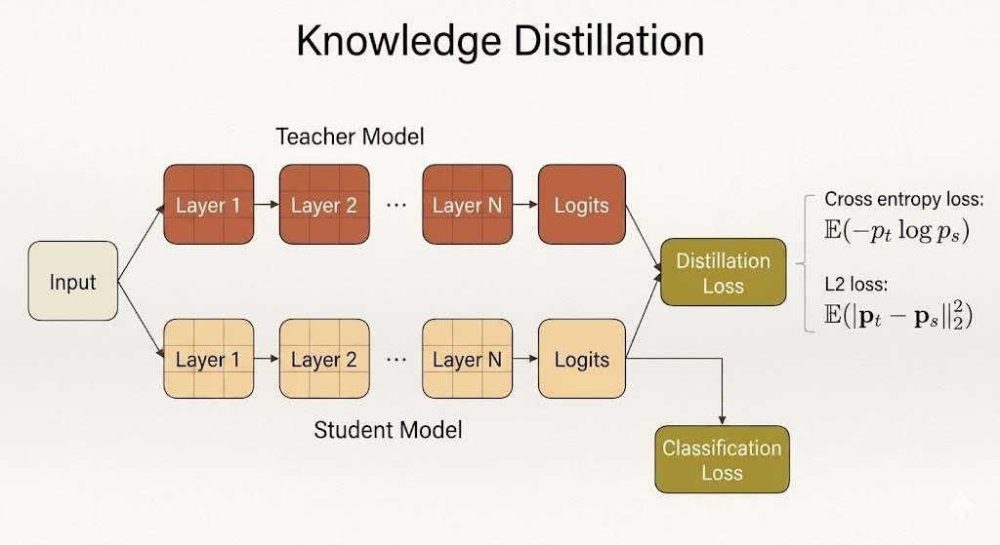
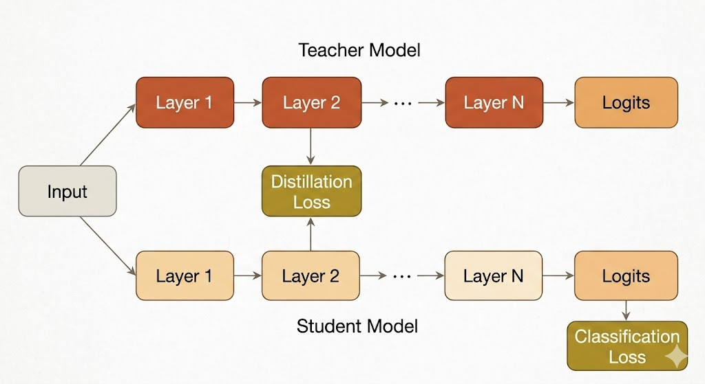

<iframe width="100%" height="500" src="https://www.youtube.com/embed/-UmiOFLzG1o" title="Efficient AI Lecture 9" frameborder="0" allowfullscreen></iframe>

Slides: [Lecture 9 PDF](https://www.dropbox.com/scl/fi/fjgnue7z3mi1ynxbd0y5k/Lec09-Knowledge-Distillation.pdf?rlkey=cup1qhlpx3vx0nrs7wuwj6m0d&e=1&st=jzhogqwp&dl=0)

Edge and mobile deployment often forces a hard tradeoff: large models have strong accuracy, but small models fit the memory, latency, and energy budget.

Knowledge distillation is a way to transfer the behavior of a large **teacher** model into a smaller **student** model. Instead of training the student only from hard labels, we also train it to imitate what the teacher predicts or represents internally.

The core idea is:

- the teacher carries extra information in its probability distribution, features, gradients, or relational structure
- the student is optimized to match that information
- the deployed model can be much smaller while retaining more of the teacher's accuracy

## Matching Teacher and Student Outputs

The most common form of knowledge distillation matches the teacher's output probabilities.

For an input image, the teacher produces logits, then a softmax converts them into probabilities. The student produces its own logits and probabilities. Distillation trains the student so that its distribution gets closer to the teacher's distribution.

For example:

| Model | Class | Logit | Probability |
|---|---:|---:|---:|
| Teacher | Cat | 5 | 0.982 |
| Teacher | Dog | 1 | 0.017 |
| Student | Cat | 3 | 0.731 |
| Student | Dog | 2 | 0.269 |

The student should not only learn that the correct class is "cat." It should learn the teacher's relative confidence across classes.

This is useful because the teacher's wrong-class probabilities are not pure noise. They can encode class similarity. If the teacher assigns more probability to "dog" than to "car" for a cat image, it is telling the student something about shared visual structure.

## Temperature and Soft Targets

Softmax with temperature is:

$$
q_i =
\frac{\exp(z_i / T)}
{\sum_j \exp(z_j / T)}.
$$

Here:

- $z_i$ is the logit for class $i$
- $T$ is the temperature
- $C$ is the number of classes
- $i,j = 0,1,\dots,C-1$

When $T=1$, softmax can be very peaky. One class may receive probability close to 1, while the rest are close to 0.

When $T>1$, the distribution becomes softer:

| Class | Logit | Probability, $T=1$ | Probability, $T=10$ |
|---|---:|---:|---:|
| Cat | 5 | 0.982 | 0.599 |
| Dog | 1 | 0.017 | 0.401 |

Higher temperature reveals more of the teacher's **dark knowledge**: the relative probabilities among non-target classes. This extra structure gives the student a richer training signal than one-hot labels alone.

## Distillation Loss

A typical student objective combines the ordinary supervised loss with a distillation loss:

$$
\mathcal{L}
=
\mathcal{L}_{\text{cls}}(y, p_s)
+
\lambda \mathcal{L}_{\text{KD}}(p_t, p_s).
$$

The classification loss keeps the student aligned with the true labels. The distillation loss keeps the student aligned with the teacher.

Two common output-matching losses are cross entropy:

$$
\mathbb{E}[-p_t \log p_s],
$$

and squared error:

$$
\mathbb{E}\left[\|p_s - p_t\|_2^2\right].
$$

In many KD setups, the teacher is fixed and the student is the only model updated.

## What Can Be Matched?

Knowledge distillation does not have to match only final probabilities. The lecture expands the question:

> What knowledge from the teacher should the student imitate?

Different answers produce different distillation methods.

### Output Logits and Probabilities

The simplest target is the final output distribution. The student and teacher see the same input, and the student learns from both:

- ground-truth labels through classification loss
- teacher predictions through distillation loss

This directly transfers the teacher's class-level behavior.

### Intermediate Features

Sometimes the student is asked to match internal activations from the teacher.

The challenge is that the teacher and student often have different widths, depths, or channel dimensions. A common solution is to learn a projection or adaptation layer so that the student's feature map can be compared with the teacher's feature map.

The goal is to make the student not only produce similar answers, but also form similar intermediate representations.

### Gradients and Attention Transfer

Attention transfer matches where the teacher is sensitive.

For a feature map $x$ and loss $L$, the gradient

$$
\frac{\partial L}{\partial x}
$$

measures how much the objective changes when a feature changes. If

$$
\frac{\partial L}{\partial x_{i,j}}
$$

is large, then location $(i,j)$ strongly affects the prediction. Matching this signal encourages the student to pay attention to similar regions or features as the teacher.

### Sparsity Patterns

Another internal signal is the activation pattern after ReLU. A neuron can be treated as active if its value is positive:

$$
\rho(x) = \mathbf{1}[x > 0].
$$

The student can be trained to match the teacher's on/off activation pattern across layers. This transfers information about the teacher's decision boundaries and feature usage.

### Relational Information

Instead of matching one feature vector directly, relational distillation matches relationships among features.

Examples include:

- Gram matrices from inner products between feature maps
- pairwise distances between feature vectors in a batch
- correlations across channels or layers

The student then learns the teacher's internal geometry, not only its individual activations.

## Self and Online Distillation

Classic distillation assumes a large pretrained teacher and a smaller student. The lecture also covers variants that relax this assumption.

### Self Distillation

In self distillation, the student can have the same architecture as the teacher.

Born-Again Neural Networks train models sequentially:

$$
T \rightarrow S_1 \rightarrow S_2 \rightarrow \cdots \rightarrow S_k.
$$

Each new generation learns from the previous one. The surprising point is that even without changing the architecture, successive students can improve because they learn from smoother soft targets rather than only hard labels.

### Online Distillation

Online distillation trains models together instead of using a fixed pretrained teacher.

In Deep Mutual Learning, two networks learn from ground-truth labels and from each other. One network minimizes a loss that includes:

$$
\operatorname{KL}(S(I) \| T(I)),
$$

while the other uses:

$$
\operatorname{KL}(T(I) \| S(I)).
$$

The models act as peers. This removes the need for a separate teacher pretraining stage and lets different architectures improve collaboratively.

### Combined Distillation

Some networks attach classifiers to intermediate layers. During training, each branch can receive three signals:

1. Cross entropy from true labels.
2. KL divergence from deeper, more reliable predictions.
3. L2 feature matching from deeper hints.

This can improve training and also support early-exit inference: shallow exits are faster, while deeper exits are more accurate.

## Distillation for Different Tasks

Knowledge distillation is not limited to image classification.

### Object Detection

For object detection, the student may match:

- teacher feature maps through hint and guided layers
- class predictions with weighted cross entropy
- bounding box coordinates with regression loss

Because detection has many background regions, the distillation objective often needs to emphasize useful foreground or high-confidence regions.

### GANs

For GAN compression, the student generator can be trained with:

- feature distillation loss against the teacher generator
- reconstruction loss against paired ground truth or teacher outputs
- adversarial loss from a discriminator

This helps the smaller generator preserve both low-level detail and high-level visual realism.

### NLP and LLMs

For NLP models, distillation can match:

- hidden states
- attention maps
- logits
- generated responses

In modern LLM compression, pruning and distillation often work together:

1. Start with a large trained model.
2. Estimate component importance.
3. Remove less important weights, neurons, layers, or attention heads.
4. Distill from the original model to recover quality.
5. Repeat until the model meets the target size or latency.

## Data Augmentation and Distillation

The lecture also connects distillation with augmentation.

Standard augmentation creates transformed inputs through flips, crops, rotations, or other perturbations. Cutout masks regions of the image, forcing the model to use multiple cues. Mixup blends two images and their labels, encouraging smoother decision boundaries.

These ideas pair naturally with distillation because both soften the learning target. Instead of forcing the student to memorize one hard label for one fixed input, we expose it to richer input-output structure.

## Takeaways

- Knowledge distillation transfers behavior from a teacher model into a student model.
- Temperature softens probabilities and exposes dark knowledge.
- Distillation can match outputs, features, gradients, sparsity patterns, or relations.
- Self distillation and online distillation show that a fixed large teacher is not always required.
- For deployment, distillation is a practical bridge between high accuracy and edge-friendly model size.
