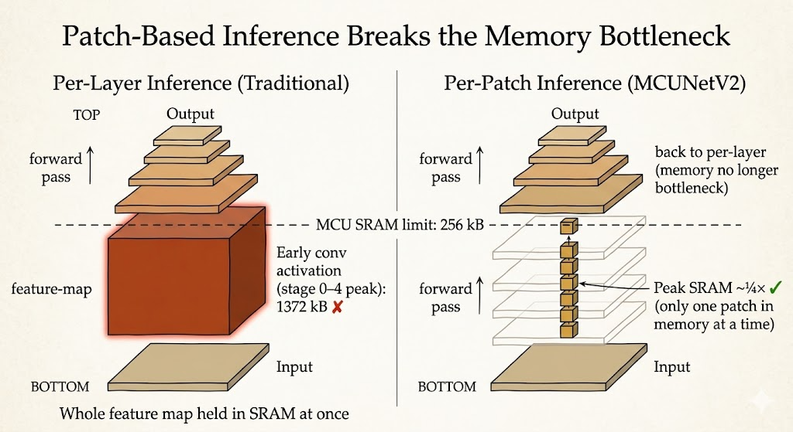

<iframe width="100%" height="500" src="https://www.youtube.com/embed/ePytVBpjxJA" title="Efficient AI Lecture 10" frameborder="0" allowfullscreen></iframe>

TinyML is not just about making a model smaller. It is about making the whole model-execution stack fit into an extremely constrained device.

The key constraint is often not raw computation. It is memory.

Microcontrollers may have only hundreds of kilobytes of SRAM and around a few megabytes of Flash. That creates two different limits:

- Flash stores the model weights
- SRAM stores the intermediate activations during inference

So the central design question becomes:

> How do we choose a neural network architecture that fits both the weight memory and the peak activation memory, while still preserving accuracy?

MCUNet answers this with hardware-aware neural architecture search and memory-aware inference.

## TinyML Constraints

On servers and GPUs, we usually think about throughput, latency, and total FLOPs. On microcontrollers, the constraints are more severe:

- the model must fit in Flash
- the peak activation footprint must fit in SRAM
- inference must stay within the latency and energy budget
- the runtime must avoid memory spikes

This changes what "efficient" means. A model with acceptable FLOPs can still fail if one early layer creates an activation tensor larger than available SRAM.

The lecture's simple theme is:

> Computation is cheap; memory is expensive.

That is especially true on tiny devices.

## Automatic Search Space Optimization

TinyNAS does not search a fixed, generic architecture space. It first adapts the search space to the target hardware.

The idea is to find a design space that contains many strong candidates under the memory constraint. A good search space should include more models with enough compute capacity to be accurate, while still satisfying the device limits.

One example is tuning input resolution and width multiplier together.

| Width and Resolution | MFLOPs |
|---|---:|
| w0.3-r160 | 32.5 |
| w0.4-r112 | 32.4 |
| w0.4-r128 | 39.3 |
| w0.4-r144 | 46.9 |
| w0.5-r112 | 38.3 |
| w0.5-r128 | 46.9 |
| w0.5-r144 | 52.0 |
| w0.6-r112 | 41.3 |
| w0.7-r96 | 31.4 |
| w0.7-r112 | 38.4 |

The important point is not that larger FLOPs are always better. The point is that, under the same memory constraint, a search space with more high-capacity candidates has a better chance of finding an accurate model.

Hardware constraints also change which architecture dimensions matter most:

- more Flash allows wider models, because Flash stores weights
- more SRAM allows higher input resolutions, because SRAM stores activations

So TinyNAS specializes the search space for the actual microcontroller instead of treating efficiency as a single universal number.

## One-Shot NAS with Nested Subnetworks

Training every candidate architecture separately would be too expensive. TinyNAS uses a one-shot NAS approach based on weight sharing.

The process is:

1. Train a super network that contains many possible widths, depths, and resolutions.
2. Sample subnetworks from this super network during training.
3. Share weights across related candidates.
4. Select the best subnetwork under the device constraints.

The nested design matters. Smaller child networks are structured as subsets of larger networks, so weights learned by the larger network can also support smaller candidates.

This makes architecture search much cheaper, because the system does not need to train every candidate from scratch.

## The CNN Memory Bottleneck

For CNNs such as MobileNetV2, the peak SRAM bottleneck is often highly imbalanced.

Early layers operate on large spatial feature maps. Even if the channel count is not huge, the activation tensor can be massive because the resolution is still high. Later layers may have more channels but much smaller spatial dimensions.

This means the model may fail because of one early memory spike, not because every layer is too large.

That observation changes the optimization strategy:

- shrinking the whole model uniformly may waste capacity
- reducing early activation peaks is more targeted
- later layers can often preserve more representational power

The bottleneck is not just the total model size. It is the maximum live activation memory during execution.

## Patch-Based Inference

Traditional per-layer inference computes the full feature map for one layer, stores it, then moves to the next layer.

That is memory-hungry because the device must hold a large activation map in SRAM.

MCUNetV2 uses patch-based inference instead. Rather than processing the whole image horizontally layer by layer, it processes smaller spatial patches vertically through multiple layers.

The benefit is direct:

- only part of the activation map needs to be live at once
- peak SRAM usage drops sharply
- deeper CNNs become feasible on tiny microcontrollers

This is a systems idea as much as a model idea. The same network can become deployable or undeployable depending on how inference is scheduled.

## Network Redistribution

Patch-based inference reduces memory, but it introduces another problem: repeated computation.

Adjacent patches overlap because later activations need receptive-field context. If patches are processed independently, the overlapping boundary regions may be computed multiple times. This creates extra MAC operations.

MCUNetV2 addresses this with network redistribution:

- reduce the receptive field in early layers where patch-based inference is used
- increase the receptive field in later layers where memory is less constrained

This keeps accuracy while reducing redundant patch-boundary computation.

The lesson is that memory optimization and architecture design cannot be separated. If the execution schedule changes, the best network architecture may also change.

## Main Takeaway

MCUNet shows what TinyML really requires.

It is not enough to compress a model and hope it runs on a microcontroller. The model architecture, memory usage, inference schedule, and hardware constraints must be designed together.

The key ideas are:

- search spaces should be specialized to the target device
- Flash and SRAM constrain different parts of the model
- peak activation memory can matter more than average memory
- patch-based inference reduces SRAM pressure
- network redistribution compensates for patch-based overhead

For me, the lecture makes TinyML feel like a co-design problem: the model is only one part of the system. The way the model is searched, stored, and executed is just as important.
