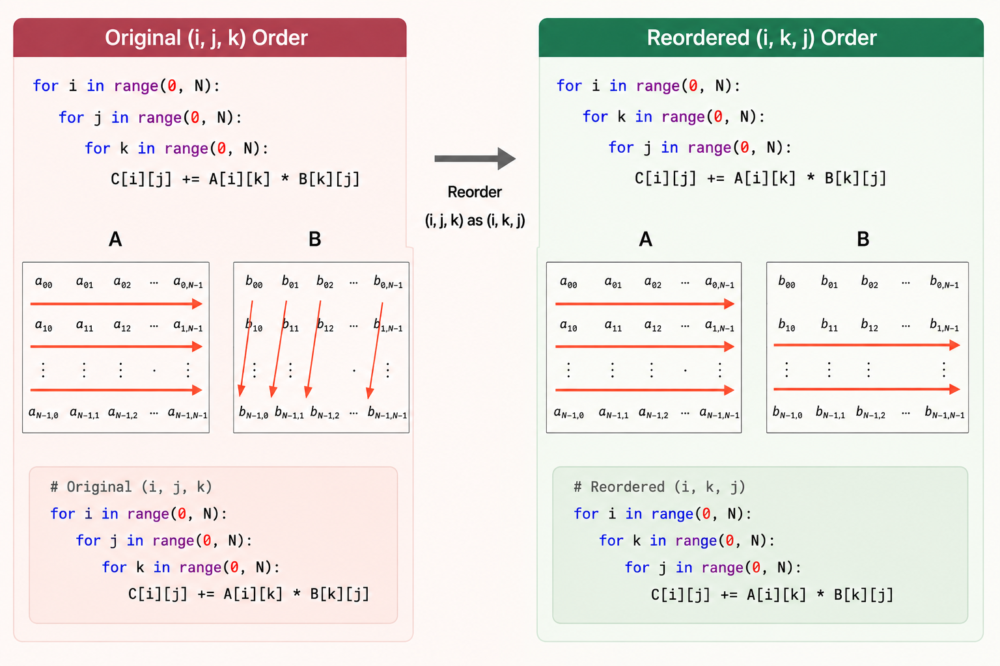
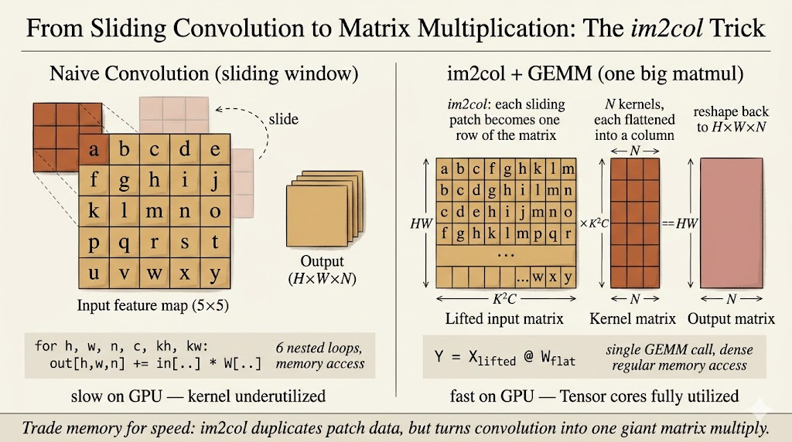

<iframe width="100%" height="500" src="https://www.youtube.com/embed/qSsQifiHDU4" title="Efficient AI Lecture 11" frameborder="0" allowfullscreen></iframe>

TinyEngine is about the part of TinyML that happens after we already have a small model.

The question is no longer only:

> Can we design a neural network that is accurate and compact?

The question becomes:

> Can this exact network actually execute on a tiny device without wasting memory, bandwidth, and cycles?

This lecture connects general parallel computing ideas with neural network inference on microcontrollers. The main lesson is that deployment efficiency is not just a model property. It depends on loops, memory layout, data movement, kernel implementation, and the runtime schedule.

General-purpose deep learning frameworks are flexible, but that flexibility can be expensive on microcontrollers.

Tiny devices have severe limits:

- SRAM is tiny, so temporary activation buffers are dangerous
- Flash is limited, so binary size matters
- memory movement costs more than arithmetic
- generic operators may allocate intermediate tensors that do not fit
- the runtime must be specialized to the target model and hardware

TinyEngine addresses this by generating compact, model-specific inference code. Instead of carrying a large general runtime, it can specialize kernels and memory planning for the network being deployed.

For me, the core idea is:

> TinyEngine turns inference into a systems optimization problem.

The neural network is only one input. The engine also has to decide how data should be laid out, reused, transformed, and overwritten.

## Parallel Computing Techniques

### Loop Reordering

The first optimization idea is simple: the order of loops changes the memory access pattern.

For matrix multiplication, this raw loop order has poor locality for `B`, because `B[k][j]` jumps across rows in memory:

```python
for i in range(0, N):
    for j in range(0, N):
        for k in range(0, N):
            C[i][j] += A[i][k] * B[k][j]
```

Reordering the loops improves locality for `B` and `C`:

```python
for i in range(0, N):
    for k in range(0, N):
        for j in range(0, N):
            C[i][j] += A[i][k] * B[k][j]
```

The arithmetic is the same. The difference is how the processor moves through memory.

This matters because CPUs and microcontrollers fetch memory in chunks. If nearby values are used together, the cache line is useful. If the program jumps around, the processor spends more time waiting for data.



### Loop Tiling

Loop tiling extends the same idea.

If a matrix is much larger than cache, data may be evicted before it is reused. Tiling breaks the computation into smaller blocks that fit better in cache:

```python
T_i = T_j = T_k = TILE_SIZE

for i_t in range(0, N, T_i):
    for k_t in range(0, N, T_k):
        for j_t in range(0, N, T_j):
            for i in range(i_t, i_t + T_i):
                for k in range(k_t, k_t + T_k):
                    for j in range(j_t, j_t + T_j):
                        C[i][j] += A[i][k] * B[k][j]
```

Instead of streaming through huge arrays once and losing locality, the kernel works on a small tile where `A`, `B`, and `C` can be reused.

The principle is:

> Move data less. Reuse it more.

This principle appears again in convolution kernels and TinyEngine memory planning.

### Loop Unrolling

Loops have overhead:

- index arithmetic
- branch checks
- loop counter updates
- jumps back to the loop body

Loop unrolling reduces that overhead by doing several operations per loop iteration:

```python
for i in range(0, N):
    for j in range(0, N):
        for k in range(0, N, 4):
            C[i][j] += A[i][k] * B[k][j]
            C[i][j] += A[i][k + 1] * B[k + 1][j]
            C[i][j] += A[i][k + 2] * B[k + 2][j]
            C[i][j] += A[i][k + 3] * B[k + 3][j]
```

Unrolling can improve speed, but it also increases binary size. On microcontrollers, that tradeoff matters because Flash is limited.

### SIMD

SIMD means single instruction, multiple data.

Instead of applying one instruction to one value, SIMD applies one instruction to a small vector of values. This exploits data-level parallelism.

Common SIMD instruction families include:

- SSE on x86
- NEON on ARM

For example, with ARM NEON, a multiply-add loop can operate on multiple floating-point values at once:

```c
for (int k = 0; k < N / 4; k++) {
    C += vmulq_f32(vld1q_f32(&A[k * 4]), vld1q_f32(&B[k * 4]));
}
```

The benefit is not only performance. SIMD can also improve energy efficiency because more useful work happens per instruction.

For TinyML, this means the kernel implementation should match the target instruction set. A convolution kernel written without awareness of SIMD may leave hardware capability unused.

### Multithreading

Multithreading splits work across multiple execution threads that share memory.

For matrix multiplication, one simple strategy is to assign different row ranges to different threads:

```c
void* mat_mul_multithreading(void* arg) {
    ThreadData* data = (ThreadData*) arg;
    int thread_id = data->thread_id;

    int rows_per_thread = SIZE_MATRIX / NUM_THREADS;
    int start_row = thread_id * rows_per_thread;
    int end_row = (thread_id + 1) * rows_per_thread;

    for (int i = start_row; i < end_row; ++i) {
        for (int j = 0; j < SIZE_MATRIX; ++j) {
            for (int k = 0; k < SIZE_MATRIX; ++k) {
                C[i][j] += A[i][k] * B[k][j];
            }
        }
    }

    return NULL;
}
```

The useful abstraction is shared memory: all threads can access the same arrays, but the work is partitioned.

On tiny microcontrollers, the parallelism story is more constrained than on servers, but the idea still matters. The inference engine needs to understand what resources the hardware actually provides.

### CUDA As A Contrast

CUDA shows the same idea at a much larger scale.

CUDA separates:

- host memory on the CPU
- device memory on the GPU
- private memory per thread
- shared memory per block
- global memory across the device

A matrix-add kernel maps each output element to a GPU thread:

```c
__global__ void matrixAdd(float A[Ny][Nx], float B[Ny][Nx], float C[Ny][Nx]) {
    int i = blockIdx.x * blockDim.x + threadIdx.x;
    int j = blockIdx.y * blockDim.y + threadIdx.y;

    C[j][i] = A[j][i] + B[j][i];
}
```

CUDA also uses tiling heavily. Matrix multiplication often loads tiles of `A` and `B` into shared memory so that many threads can reuse them before going back to global memory.

TinyEngine operates in a very different hardware regime, but the lesson is the same:

> Fast inference depends on matching the algorithm to the memory hierarchy.

## Inference Optimizations

### Im2col Convolution

Convolution can be transformed into matrix multiplication through im2col.

Every sliding-window patch of shape $K \times K \times C$ is flattened into a row. The convolution filters are also flattened into columns. Then convolution becomes a matrix multiplication:

$$
[HW \times K^2C] \times [K^2C \times N] = [HW \times N]
$$



The advantage is that matrix multiplication kernels are heavily optimized.

The cost is memory.

The im2col matrix duplicates overlapping input pixels, so it can require a large temporary buffer. On a server this may be acceptable. On a microcontroller, this temporary buffer can be the difference between fitting and failing.

So TinyEngine cares about avoiding or reducing explicit im2col buffers. This is where memory-aware kernel design becomes essential.

### In-Place Depth-Wise Convolution

Depth-wise convolution is common in efficient CNNs such as MobileNet-style models.

In a general framework, the engine may keep both:

- the full input activation
- the full output activation

For an activation tensor with shape $C \times H \times W$, that can create a peak footprint close to:

$$
2 \times C \times H \times W
$$

Tiny microcontrollers often cannot afford that peak.

In-place depth-wise convolution reduces the peak memory by writing output values back into the same activation buffer when it is safe to do so. A small temporary buffer is still needed because a convolution window may need neighboring input pixels before they are overwritten.

The important idea is not just "save memory." It is:

> The engine has to understand the data dependency of the operator.

Only then can it decide when an activation can be overwritten.

### NHWC For Point-Wise Convolution

Memory layout also changes performance.

Two common tensor layouts are:

- `NCHW`: batch, channels, height, width
- `NHWC`: batch, height, width, channels

For point-wise convolution, each output value combines information across channels at one spatial location.

With `NCHW`, channel values for the same pixel may be far apart in memory. The processor has to jump between locations.

With `NHWC`, channel values for the same pixel are contiguous. That makes memory access more sequential and more friendly to vectorized kernels.

The same mathematical operation can run differently depending on layout. TinyEngine can exploit this by choosing layouts that match the operator and hardware.

### Winograd Convolution

Winograd convolution reduces the number of multiplications needed for small convolutions such as $3 \times 3$ filters.

The high-level process is:

1. Transform the input tile.
2. Transform the filter.
3. Multiply element-wise in the transformed domain.
4. Transform the result back.

The filter transform can be precomputed offline because model weights are fixed during inference.

For a small output tile, Winograd can reduce multiply-accumulate operations compared with direct convolution. The tradeoff is that it introduces extra transform steps and can increase implementation complexity.

So the same pattern appears again:

> Optimization is never only about counting arithmetic. It is about arithmetic, memory, layout, and implementation cost together.

### Main Takeaway

TinyEngine makes the systems layer visible.

After MCUNet searches for a model that can fit on a tiny device, TinyEngine has to make the model actually run. That requires low-level choices:

- reorder and tile loops for locality
- use SIMD when the instruction set supports it
- avoid large temporary buffers such as explicit im2col
- reuse activation memory through in-place operators
- choose layouts such as `NHWC` when they improve access patterns
- use specialized kernels instead of generic framework code

For me, this lecture explains why TinyML is not just model compression. It is model-system co-design all the way down to memory layout and kernel loops.
