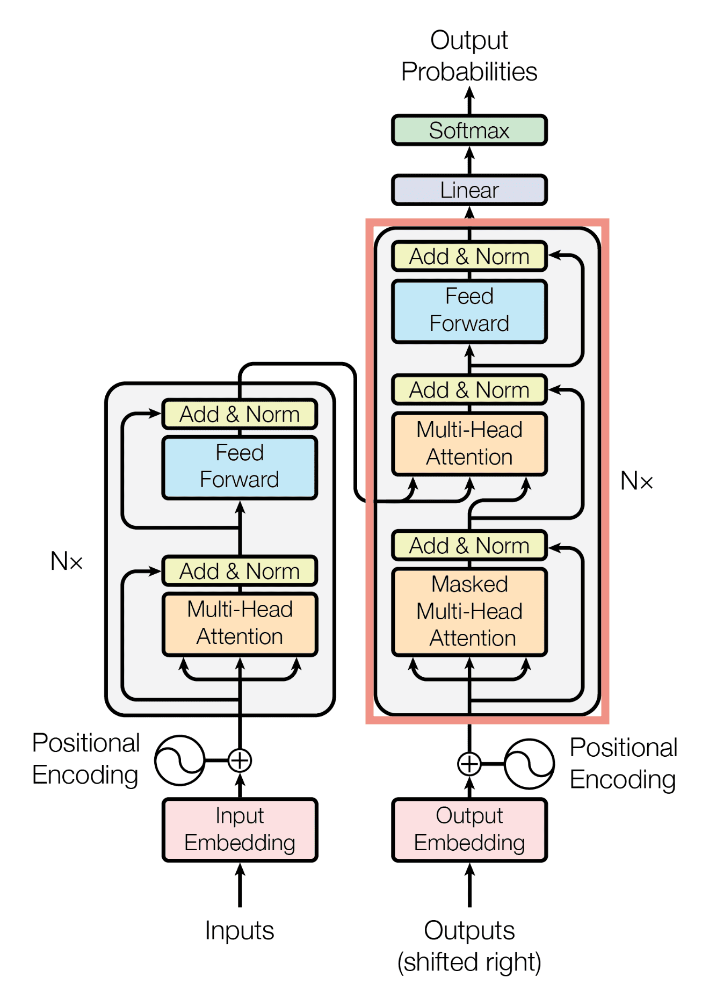
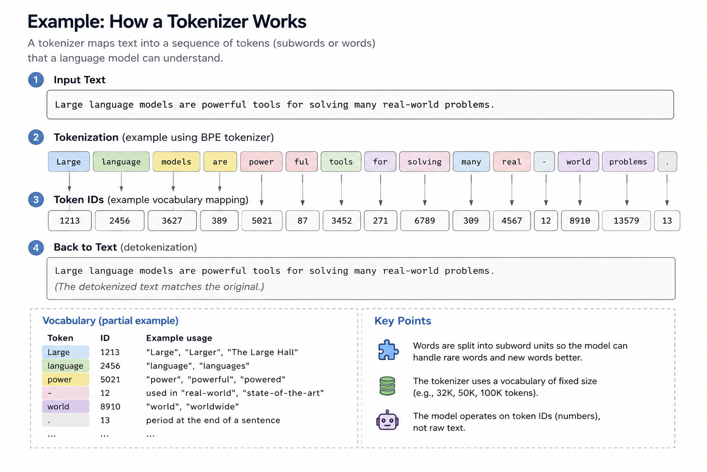
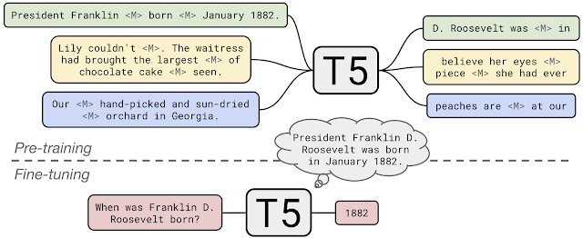
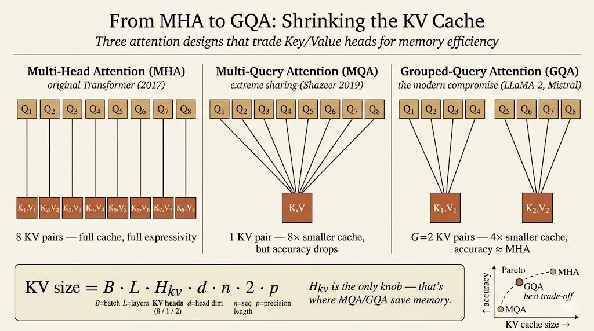

<iframe width="100%" height="500" src="https://www.youtube.com/embed/6__gyzZxZ4k" title="Efficient AI Lecture 12" frameborder="0" allowfullscreen></iframe>

This lecture connects the transformer block to the systems problems behind modern LLMs.

The transformer is not only an architecture for NLP. It is also a design space where model quality, memory, inference latency, and hardware efficiency are tightly coupled.

The big idea is:

> LLM efficiency depends on both what the model computes and what the runtime must remember.

Self-attention, positional encoding, feed-forward layers, and KV cache design all shape the cost of serving a language model.

## Transformer Basics

Before transformers, common sequence models had clear limitations.

RNNs process tokens sequentially. They can model order, but they struggle with long-term dependencies and are hard to parallelize across sequence length.

CNNs can be more parallel, but their receptive field is local unless the network becomes deep or uses special dilation patterns. That can limit long-range context modeling.

Transformers changed the default by using attention as the core sequence-mixing operation.

### Tokenization

A tokenizer maps raw text into tokens.

One word may map to one token, several subword tokens, or even part of a token depending on the tokenizer vocabulary.

This matters because the model does not directly see words. It sees token IDs, which are then mapped into vectors.

### Embeddings

An embedding maps each token ID into a continuous vector.

This vector is the model's starting representation of the token. Later layers repeatedly transform these vectors by mixing information across tokens and features.

### Self-Attention

Self-attention projects token embeddings into three matrices:

- queries $Q$
- keys $K$
- values $V$

The attention operation is:

$$
\text{Attention}(Q,K,V)
=
\text{softmax}\left(\frac{QK^T}{\sqrt{d}}\right)V.
$$

The score matrix $QK^T$ measures how much each token attends to each other token. The softmax turns those scores into attention weights, and multiplying by $V$ forms the new token representation.

A useful analogy is search:

- query: what I am looking for
- key: what each item advertises
- value: the content I retrieve

The cost is important. Full attention over sequence length $n$ forms an $n \times n$ attention matrix, so attention has quadratic sequence-length cost.

### Multi-Head Attention

Multi-head attention runs several attention branches in parallel.

Each head can learn a different relation:

- syntax
- local context
- long-range dependency
- entity relation
- positional pattern

The outputs of the heads are combined, giving the model multiple ways to read the same sequence.

### Attention Masking

The mask defines which tokens can attend to which tokens.

Two common cases:

- global attention: each token can see all tokens
- causal attention: each token can only see current and previous tokens

Causal masking is essential for autoregressive language models such as GPT, because the model must not see future tokens during next-token prediction.

### Feed-Forward Network

Attention mixes information across tokens, but the transformer block also needs nonlinear feature transformation at each token.

That role is played by the feed-forward network:

$$
FFN(x)=\max(0,xW_1+b_1)W_2+b_2.
$$

Modern LLMs often use variants such as GELU, SwiGLU, or other gated feed-forward designs instead of a plain ReLU MLP.

### Layer Normalization

Layer normalization normalizes each token representation across its feature dimension:

$$
y=
\frac{x-\mathbb{E}[x]}{\sqrt{\mathrm{Var}[x]+\epsilon}}\gamma+\beta.
$$

It stabilizes training and lets the model learn a scale and shift through $\gamma$ and $\beta$.

### Positional Encoding

Self-attention alone does not know token order. It sees a set of token vectors unless position information is added.

The original transformer uses sinusoidal positional encoding:

$$
p_t^{(i)}
=
\begin{cases}
\sin(\omega_k t), & i = 2k \\
\cos(\omega_k t), & i = 2k + 1
\end{cases}
$$

with

$$
\omega_k = \frac{1}{10000^{2k/d}}.
$$

The model then receives both token identity and token position.

## Transformer Design Variants

Transformer models differ in how they use encoder and decoder blocks, how they represent position, and how they optimize inference memory.

### Encoder-Decoder

The original transformer is an encoder-decoder model.

The encoder reads the input sequence. The decoder generates the output sequence while attending to both previous generated tokens and encoder outputs.

T5 uses this style in a unified text-to-text setup: every task is represented as text input and text output.

### Encoder-Only

BERT is an encoder-only transformer.

It is designed for representation learning and discriminative tasks. Its pretraining objectives include:

- masked language modeling
- next sentence prediction

Because the encoder can use bidirectional context, BERT is strong for tasks such as classification, retrieval, and token-level labeling.

### Decoder-Only

GPT-style models are decoder-only transformers.

Their pretraining objective is next-token prediction:

$$
L(u)=\sum_i \log P(u_i \mid u_{i-k}, \dots, u_{i-1}; \Theta).
$$

This objective makes decoder-only models natural text generators. It also enables zero-shot and few-shot prompting, where the task is specified through context rather than through parameter updates.

### Absolute and Relative Position Embeddings

Absolute position embeddings add position information directly to the token embeddings.

Relative methods instead affect attention scores based on token distance. This can generalize better to sequence lengths or relative patterns that were not directly represented in training.

Two important modern variants:

- RoPE rotates query and key dimensions according to position
- ALiBi adds a distance-dependent bias directly to attention scores

These methods make position part of the attention mechanism rather than only part of the input vector.

### KV Cache Optimization

During autoregressive decoding, the model generates one token at a time.

For each new token, we only need the new query. But we still need the keys and values for all previous tokens. Those stored keys and values are the KV cache.

The KV cache size grows with:

$$
\text{batch size}
\times
\text{layers}
\times
\text{heads}
\times
\text{head dimension}
\times
\text{sequence length}
\times
2
\times
\text{precision}.
$$

The factor of 2 comes from storing both $K$ and $V$.

This can become a major inference bottleneck. For long context lengths, KV cache memory can dominate serving cost even when the model weights are fixed.

Multi-query attention and grouped-query attention reduce that cost:

- multi-head attention: each query head has its own key and value head
- multi-query attention: many query heads share one key/value head
- grouped-query attention: query heads are split into groups that share key/value heads

Grouped-query attention is a practical compromise: it reduces KV-cache memory while preserving much of the quality of multi-head attention.

### Improving the FFN

The feed-forward network is a large part of transformer compute.

Modern LLMs often replace a plain FFN with gated variants such as GLU or SwiGLU. The gate gives the model a more expressive way to control which features pass through the block.

## Large Language Models

LLMs scale the transformer recipe to much larger parameter counts and training datasets.

Several patterns define the modern LLM era:

- scaling parameters can produce new capabilities
- training data size must scale with model size
- inference memory becomes a first-class constraint
- architecture details matter for serving cost
- prompting enables zero-shot and few-shot adaptation

GPT-3 made in-context learning a central idea: instead of fine-tuning on every task, a model can infer the task from examples placed in the prompt.

Later LLMs refined the architecture:

- Llama uses design choices such as RMSNorm, RoPE, SwiGLU, and later grouped-query attention
- Mistral uses sliding-window attention to improve long-context efficiency
- Chinchilla-style scaling laws emphasize that many large models are undertrained if data does not scale with parameter count

The lesson is that LLM progress is not just "make the model bigger." It is also about choosing the right architecture, data scale, memory layout, and inference strategy.

## Multimodal LLMs

Multimodal LLMs extend the language-model interface to images and other signals.

Two examples from the lecture:

- Flamingo maps visual features into a fixed number of visual tokens and injects them into a frozen language model through gated cross-attention.
- PaLM-E feeds visual tokens directly into the language model.

The common theme is to turn non-text inputs into tokens or token-like representations that a transformer can consume.

That makes the transformer a general sequence-processing backbone, not only a text model.

## Main Takeaway

The transformer stack has two sides.

On the modeling side, attention, tokenization, position encoding, FFNs, and encoder/decoder structure determine what the model can represent.

On the systems side, attention complexity, KV cache size, query/key/value sharing, and context length determine whether the model can be served efficiently.

For me, this lecture makes LLMs feel like a model-systems co-design problem: architecture choices directly become memory and latency choices during inference.
