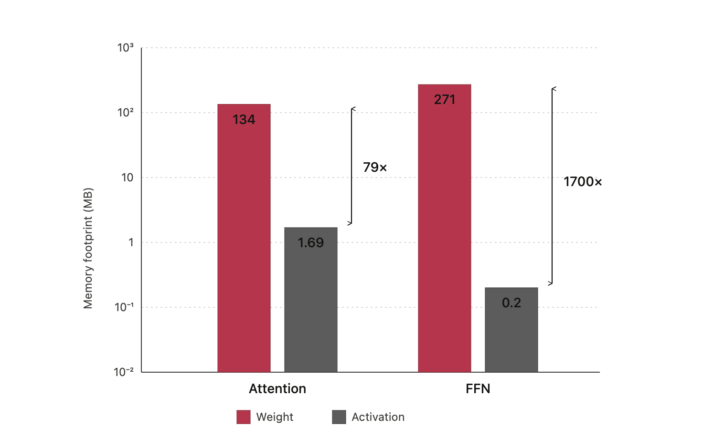
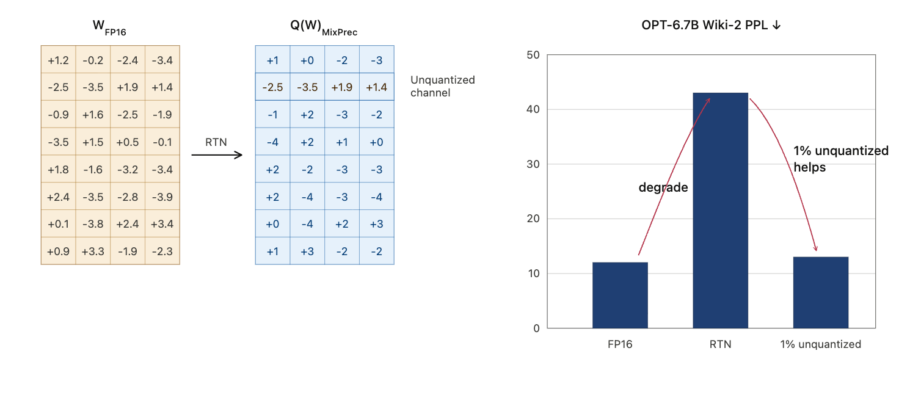
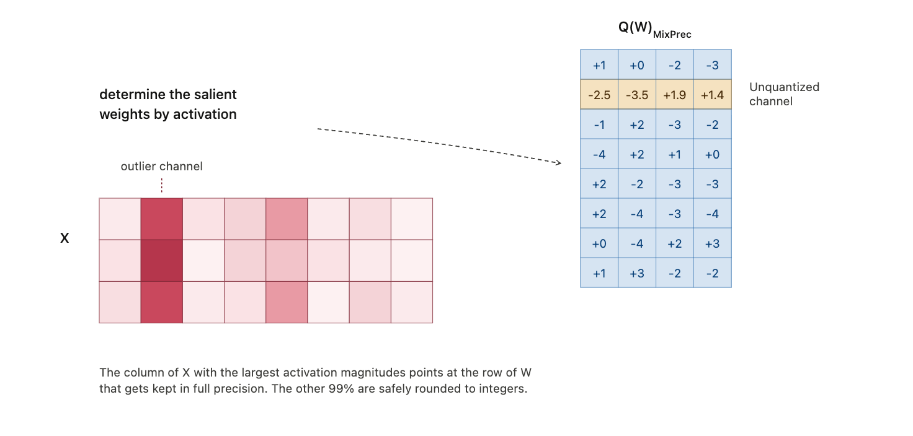
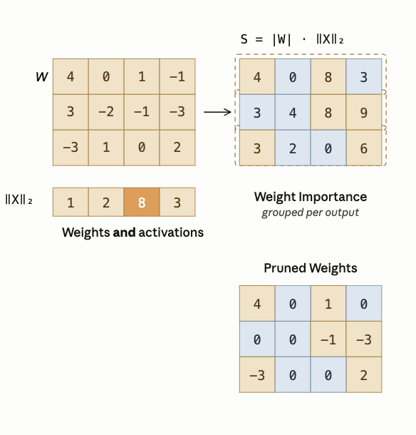
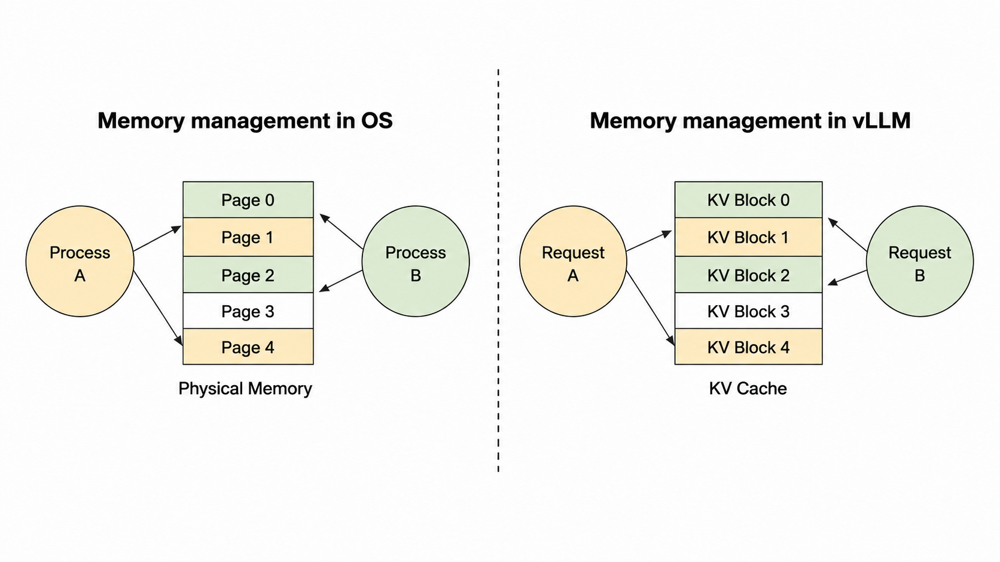
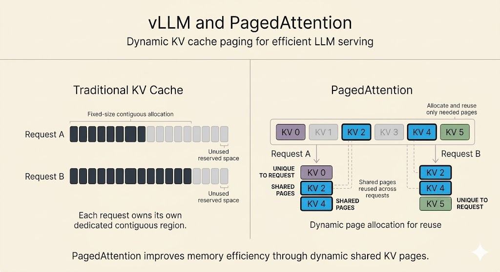
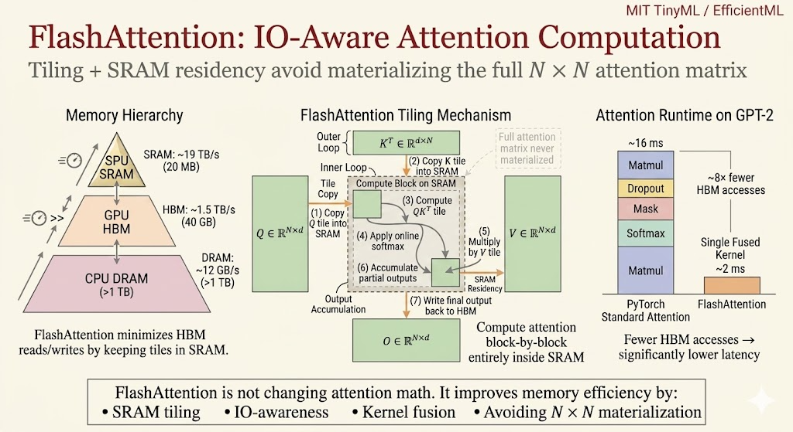

<iframe width="100%" height="500" src="https://www.youtube.com/embed/7g5tL2stswo" title="Efficient AI Lecture 13: LLM Deployment Techniques" frameborder="0" allowfullscreen></iframe>

This lecture is about the systems side of deploying large language models.

The main idea is:

> LLM deployment is limited less by arithmetic alone and more by memory movement, quantization error, KV-cache management, and request scheduling.

For training, the hard question is how to distribute a large model. For deployment, the hard question is how to serve many requests with low latency and high throughput while keeping model quality.

# Quantization

Quantization lowers numeric bit width so inference can use less memory bandwidth, less storage, and cheaper arithmetic.

For LLMs, weights are usually easier to quantize than activations. Activations are harder because a few channels may contain very large outliers. A useful observation is that these outliers often persist in fixed channels.

That makes it possible to rebalance the quantization problem:

- scale down difficult activation channels
- scale up the corresponding weight channels
- preserve the same matrix multiplication result

## Activation Smoothing

Suppose a linear layer computes:

$$
Y = XW.
$$

If one activation channel has much larger magnitude than the others, activation quantization needs a large scale, and most values lose precision.

Activation smoothing introduces a positive per-channel scale vector $s$:

$$
\hat{X}=X\operatorname{diag}(s)^{-1},
\qquad
\hat{W}=\operatorname{diag}(s)W.
$$

Then:

$$
\hat{X}\hat{W}
=
X\operatorname{diag}(s)^{-1}\operatorname{diag}(s)W
=
XW.
$$

So the computation is unchanged, but the quantization difficulty is shifted from activations into weights.

One common smoothing choice is:

$$
s=\sqrt{\frac{\max |X|}{\max |W|}},
$$

where the maxima are computed per channel from calibration data.

### Offline Calibration

During calibration, we run representative data through the model and measure per-channel activation ranges.

The goal is not to train new parameters. The goal is to estimate which activation channels are difficult to quantize and choose smoothing scales that balance activation and weight ranges.

### Offline Smoothing

During smoothing, the scale is folded into static model parameters.

For example, the previous normalization layer can be adjusted so it emits smoothed activations, while the current linear layer's weight channels are scaled in the opposite direction.

The important deployment property is that this transformation can be folded offline. At runtime, the model does not need an extra explicit scaling operation.

### Inference

After smoothing, activations are less dominated by outliers and become easier to quantize. The model can then use efficient low-bit or INT8 operations with less quality loss.

This is the core idea behind SmoothQuant-style deployment:

- activations are hard to quantize
- weights can absorb some scaling
- an equivalent transformation makes runtime quantization easier

## Weight-Only Quantization

LLM decoding is often memory-bound. During autoregressive decoding, the system repeatedly streams model weights from memory while generating one token at a time.

That means even A8W8 may not be enough. Weight bandwidth can become the bottleneck, so compressing weights to INT4 can be very valuable.

Naive round-to-nearest quantization at very low bit width can fail badly. For example, applying simple RTN to large OPT models can cause a large perplexity spike. Extreme weight compression needs a more careful method.

## AWQ

AWQ stands for Activation-aware Weight Quantization.

Its key observation is:

> Not all weight channels matter equally, and importance is better identified through activations than by weight magnitude alone.

Keeping or protecting a very small fraction of salient channels can greatly improve quality under INT4 weight-only quantization.

### Selecting Salient Channels

AWQ selects salient channels using activation statistics. A weight channel that connects to large activations can contribute much more to output error if quantized poorly.

This is why activation-aware importance is more useful than weight-only magnitude.

### Scaling Instead of Mixed Precision

One direct idea is to keep the top 1% salient weights in higher precision. But mixed precision inside the same tensor is awkward for hardware.

AWQ instead uses scaling.

For salient channels, scale weights up before quantization and scale the corresponding activations down:

$$
WX
\approx
Q(W \cdot s)(s^{-1}X).
$$

The scaling preserves the mathematical computation while reducing the relative quantization error of important weight channels.

Why does scaling help?

For standard quantization:

$$
\operatorname{Err}(Q(w)\cdot x)
=
\Delta \cdot
\operatorname{Err}\left(\operatorname{Round}\left(\frac{w}{\Delta}\right)\right)
\cdot x.
$$

For scaled weights:

$$
\operatorname{Err}\left(Q(w\cdot s)\cdot \frac{x}{s}\right)
=
\Delta' \cdot
\operatorname{Err}\left(\operatorname{Round}\left(\frac{w\cdot s}{\Delta'}\right)\right)
\cdot \frac{x}{s}.
$$

If $s$ is moderate and only applied to a small subset of channels, the global quantization step may stay roughly unchanged, so $\Delta' \approx \Delta$. The error contribution for those channels is then reduced roughly by a factor of $s$.

### Optimal Scaling Search

AWQ searches for a scale that minimizes reconstruction error:

$$
\mathcal{L}(s)
=
\left\|Q(W\cdot s)(s^{-1}X)-WX\right\|.
$$

The scale is parameterized by activation statistics:

$$
s=s_X^\alpha,
\qquad
\alpha^*=\arg\min_\alpha \mathcal{L}(s_X^\alpha).
$$

The search is small and calibration-efficient, because it is not trying to regress every weight. It is choosing a channel scaling rule that preserves layer output.

### Advantages

AWQ has several practical advantages:

- it is simple to implement
- it is friendly to hardware kernels
- it needs relatively little calibration data
- it is more robust to calibration-distribution mismatch than heavier regression-based methods
- it works across instruction-tuned and multimodal models

## INT4 Inference Kernels

Weight-only INT4 quantization reduces memory traffic, but hardware usually reads bytes, not individual 4-bit values.

That makes packing layout important.

AWQ-style kernels can pre-shuffle INT4 weights offline so unpacking is efficient at runtime. The layout allows SIMD instructions to decode many weights in parallel:

1. mask to extract low 4-bit values
2. shift the byte block right by 4 bits
3. mask again to extract the other 4-bit values

The lesson is that compression is not only an algorithmic issue. The bit layout must match the hardware's vector operations.

### Kernel Fusion

Efficient LLM kernels avoid unnecessary trips to DRAM.

For attention, a fused kernel can combine operations such as batched matrix multiplication, masking, softmax, and the second matrix multiplication while keeping intermediates in fast memory.

For quantized GEMM, dequantization can be fused into matrix multiplication:

- CUDA cores unpack and dequantize INT4 weights
- tensor cores consume the dequantized values for matrix multiply
- the full decompressed model is never written back to memory

This is why low-bit inference depends on both quantization method and kernel design.

# Pruning & Sparsity

## Weight Sparsity

For LLM pruning, activation-aware criteria can outperform simple weight magnitude.

A useful pruning score is:

$$
|W| \cdot \|X\|.
$$

This keeps weights that are important under the activations the model actually sees.

## Contextual Sparsity

Static sparsity permanently removes weights. That can hurt accuracy because the same sparse subnetwork must serve every input.

Contextual sparsity is input-dependent. Different inputs activate different attention heads, MLP features, or neurons. Systems such as DejaVu try to predict which computations are unnecessary for the current context and skip them dynamically.

The key distinction:

- static sparsity asks which weights are globally unnecessary
- contextual sparsity asks which computations are unnecessary for this input

## Mixture of Experts

Mixture-of-Experts models use sparse activation at the module level.

Instead of sending every token through the same dense feed-forward network, a router chooses a small number of experts for each token.

This decouples total parameter count from per-token inference cost:

- more experts increase total model capacity
- only selected experts run for each token
- inference cost can stay closer to a smaller dense model

### Capacity Factor

Routing is not always balanced. Some experts may receive more tokens than others.

The capacity factor controls how many tokens each expert is allowed to process:

$$
\text{expert capacity}
=
\frac{\text{tokens per batch}}{\text{number of experts}}
\times
\text{capacity factor}.
$$

A low capacity factor is efficient but risks dropping tokens when routing is imbalanced. A higher capacity factor gives slack capacity but increases memory and compute overhead.

## Attention Sparsity

Attention sparsity reduces work by avoiding unimportant tokens, heads, or value fetches.

Examples:

- prune tokens with low cumulative attention score
- remove heads that contribute little
- skip fetching a value vector when the query-key score is too small
- start with lower precision and use higher precision only when confidence is low

The goal is to avoid spending full attention cost on information that will not affect the output much.

# LLM Serving Systems

## LLM Serving Metrics

Deployment quality is measured through both user-facing latency and system-wide throughput.

### Time to First Token

Time to first token, or TTFT, is the delay between submitting a request and receiving the first generated token.

It is especially important for interactivity. High TTFT makes the model feel unresponsive.

### Time Per Output Token

Time per output token, or TPOT, is the average time to generate each subsequent token after the first one.

This controls the apparent streaming speed of the response.

### Latency

End-to-end latency is:

$$
\text{latency}
=
\text{TTFT}
+
\text{TPOT}
\times
\text{number of generated tokens}.
$$

### Throughput

Throughput is the total number of tokens generated per second across all users and requests.

Users tend to care about latency. Service providers also care about throughput, because it determines how much traffic the same hardware can serve.

## PagedAttention

The KV cache is a major memory problem in LLM serving.

Waste comes from two sources:

- output length is unknown, so systems may over-allocate cache memory
- not all allocated cache memory is actively used at every stage

PagedAttention borrows the idea of paging from operating systems.

Instead of requiring one contiguous KV-cache block per sequence, PagedAttention breaks the cache into fixed-size blocks.

It then uses a block table to map logical token blocks to physical memory blocks.

### How It Works

1. Split each sequence's KV cache into logical blocks.
2. Allocate physical GPU memory blocks on demand.
3. Store logical blocks in non-contiguous physical memory.
4. Use a block table to translate logical block IDs into physical block IDs.

This avoids large contiguous allocations and reduces fragmentation.

### Benefits

PagedAttention improves serving efficiency because:

- memory is allocated closer to actual need
- more concurrent requests fit in GPU memory
- throughput increases through larger effective batching
- shared prompt prefixes can reuse physical KV-cache blocks

This memory-sharing feature is useful for beam search, parallel sampling, and workloads where several continuations share the same prompt.

## FlashAttention

Standard attention is memory-bound.

The core issue is the memory hierarchy:

- GPU SRAM is small but very fast
- GPU HBM is large but much slower
- materializing the full $N\times N$ attention matrix causes heavy HBM traffic

FlashAttention does not change the attention math. It changes the IO pattern.

### Tiling

FlashAttention splits the computation into tiles that fit in SRAM.

It loads blocks of $Q$, $K$, and $V$, computes attention locally, and avoids writing the full attention matrix to HBM.

### Kernel Fusion

FlashAttention fuses operations such as score computation, masking, softmax, and value aggregation into a single IO-aware kernel.

This reduces memory traffic and makes long-context attention much more practical.

The key idea is:

> Attention efficiency is not only FLOPs. It is also how many times data moves through the memory hierarchy.

## Speculative Decoding

Autoregressive decoding generates tokens one by one. For small batch sizes, the process is often memory-bound because each token step streams large model weights.

Speculative decoding uses two models:

- a small draft model
- a large target model

The draft model quickly proposes several tokens. The target model verifies those draft tokens in parallel.

If the draft tokens agree with the target model's distribution, multiple tokens can be accepted at once. If not, the target model corrects the sequence.

The important property is that speculative decoding can preserve the target model's output distribution while improving speed, often by 2x to 3x when the draft model is accurate enough.

## Batching

Batching increases GPU utilization by serving multiple requests together.

| Method | How it works | Tradeoff |
|---|---|---|
| No batching | Process one request at a time | Simple but inefficient |
| Static batching | Wait for a fixed batch size | Good for offline work but increases waiting time |
| Dynamic batching | Batch when full or after a timeout | Balances throughput and latency |
| Continuous batching | Schedule requests token by token | Best suited for LLM serving because new requests can join as others finish |

Continuous batching, also called in-flight batching, is especially important because LLM requests have different prompt lengths and generation lengths. Token-level scheduling avoids idle slots left by completed requests.

## Summary

LLM deployment is a stack of systems optimizations:

- SmoothQuant shifts activation difficulty into weights
- AWQ protects salient weight channels through activation-aware scaling
- INT4 kernels need hardware-friendly packing and fused dequantization
- sparsity saves work only when the runtime can exploit it
- MoE increases parameter count without activating every parameter per token
- PagedAttention makes KV-cache memory management more efficient
- FlashAttention reduces HBM traffic through tiling and fusion
- speculative decoding and batching improve serving throughput and latency

The common theme is that efficient LLM serving depends on matching model transformations to the memory hierarchy and runtime scheduler.
