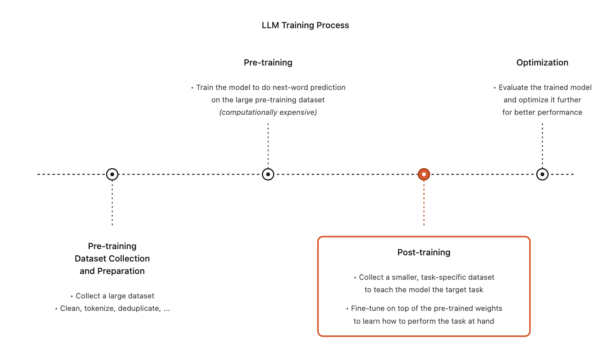
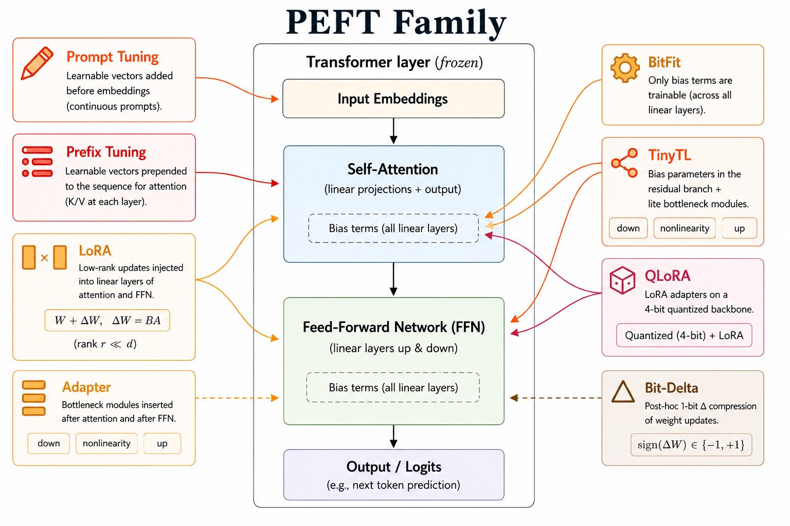

<iframe width="100%" height="500" src="https://www.youtube.com/embed/udw5TxtbmLI" title="Efficient AI Lecture 14: LLM Post-Training" frameborder="0" allowfullscreen></iframe>

Post-training turns a pretrained language model into a useful assistant, domain specialist, or multimodal system.

Pretraining gives the model broad next-token prediction ability. Post-training changes how that ability is expressed:

- supervised fine-tuning teaches response style and task format
- preference optimization aligns outputs with human judgments
- parameter-efficient fine-tuning adapts large models cheaply
- multimodal post-training connects LLMs to vision and robotics
- prompt engineering steers behavior without changing weights



## LLM Fine-Tuning

### Supervised Fine-Tuning

Supervised fine-tuning (SFT) keeps the same next-token objective as pretraining, but changes the data distribution.

For an output sequence $U=(u_0,\ldots,u_n)$, the objective is

$$
L(U)
=
\sum_i
\log P(u_i \mid u_0,\ldots,u_{i-1};\Theta).
$$

The difference is that SFT trains on curated examples of the behavior we want.

For example, given the prompt:

> I can't log into my account. What should I do?

A pretrained LLM may answer dryly:

> Try to reset your password using the Forgot Password option.

After SFT on customer-support examples, the model learns a more useful assistant style:

> I'm sorry to hear you're having trouble logging in. You can try resetting your password using the Forgot Password option on the login page...

The model is still predicting tokens, but the target tokens encode tone, formatting, helpfulness, and domain behavior.

### Reinforcement Learning From Human Feedback

Reinforcement learning from human feedback (RLHF) optimizes qualities that are hard to capture with static metrics such as BLEU or ROUGE.

The first step is to train a reward model from preference comparisons. Given a prompt $x$, a preferred answer $y_{\mathrm{win}}$, and a rejected answer $y_{\mathrm{lose}}$, the reward model is trained with

$$
\max_{r_\theta}
\mathbb{E}_{(x,y_{\mathrm{win}},y_{\mathrm{lose}})\sim D}
\left[
\log \sigma
\left(
r_\theta(x,y_{\mathrm{win}})
-
r_\theta(x,y_{\mathrm{lose}})
\right)
\right].
$$

Then the policy is tuned to maximize reward while staying close to the base model:

$$
\max_{\pi_{\mathrm{PPO}}}
\mathbb{E}_{x\sim D,\;y\sim \pi_{\mathrm{PPO}}(\cdot\mid x)}
\left[
r_\theta(y\mid x)
-
\lambda_{\mathrm{KL}}
D_{\mathrm{KL}}
\left(
\pi_{\mathrm{PPO}}(y\mid x)
\;\|\;
\pi_{\mathrm{base}}(y\mid x)
\right)
\right].
$$

The KL term is not a detail. It prevents the policy from drifting too far from the base model and exploiting weaknesses in the reward model. Without this constraint, the model can reward-hack: score highly under $r_\theta$ while producing degenerate or brittle outputs.

### Direct Preference Optimization

Direct Preference Optimization (DPO) simplifies RLHF.

Instead of training a separate reward model and running PPO, DPO directly optimizes the language model on preference pairs:

$$
\max_{\pi_\theta}
\mathbb{E}_{(x,y_{\mathrm{win}},y_{\mathrm{lose}})\sim \mathcal{D}}
\left[
\log \sigma
\left(
\beta
\log
\frac{\pi_\theta(y_{\mathrm{win}}\mid x)}
{\pi_{\mathrm{ref}}(y_{\mathrm{win}}\mid x)}
-
\beta
\log
\frac{\pi_\theta(y_{\mathrm{lose}}\mid x)}
{\pi_{\mathrm{ref}}(y_{\mathrm{lose}}\mid x)}
\right)
\right].
$$

The two log-ratios act like implicit rewards. The model is encouraged to assign higher relative probability to the winning answer and lower relative probability to the rejected answer, while the reference model keeps the update anchored.

The DPO paper shows that the KL-constrained RLHF objective has a closed-form optimal policy. By inverting that relationship, preference optimization becomes a binary classification-style loss over preferred and rejected completions.

The result is a cleaner pipeline:

- no separate reward model
- no rollouts
- no PPO instability
- preference alignment as direct supervised optimization

## Parameter-Efficient Fine-Tuning

Full fine-tuning is expensive because every downstream model may require a full copy of the base weights. Parameter-efficient fine-tuning (PEFT) freezes most of the model and trains only a small number of parameters.



### BitFit

BitFit freezes the main model weights and trains only bias terms.

For BERT-base, this changes the trainable parameter count from roughly 110M parameters to about 0.1M bias parameters. The method is simple, sparse, and cheap, but its capacity is limited because it can only adjust the model through biases.

### TinyTL

TinyTL also focuses on bias-only tuning, but adds lite residual modules to recover capacity.

The key deployment idea is to reduce activation memory:

- reduce feature-map resolution
- avoid inverted bottlenecks that expand intermediate activations
- keep most convolution weights frozen
- train only small task-specific pieces

This makes task adaptation feasible under tight memory budgets.

### Adapters

Adapters insert small trainable bottleneck modules into a frozen Transformer.

An adapter usually performs:

$$
x
\rightarrow
\text{down-project}
\rightarrow
\text{nonlinearity}
\rightarrow
\text{up-project}
\rightarrow
x + \Delta x.
$$

The base model stays frozen, and each task stores only its adapter weights.

This is especially useful when many downstream tasks share one large base model. If 1,000 tasks each need a copy of a 7B model, full fine-tuning can require petabytes of storage. With adapters, each task stores only a small module.

The tradeoff is inference latency. Adapter layers add extra computation inside the model.

### Prompt Tuning

Prompt tuning freezes the whole model and trains only continuous virtual tokens prepended to the input embeddings.

If the real input embeddings are

$$
[E_1,E_2,\ldots,E_L],
$$

prompt tuning adds trainable vectors

$$
[P_1,P_2,\ldots,P_k]
\in
\mathbb{R}^{k\times d}
$$

before the input:

$$
[P_1,\ldots,P_k]
\oplus
[E_1,\ldots,E_L].
$$

These prompt vectors are not vocabulary tokens. They live directly in embedding space, so decoding them back to text usually produces meaningless strings. Their job is to steer the frozen model in its own representation space.

For a model with hidden size $d=1024$ and prompt length $k=20$, the trainable parameter count is only

$$
20\times 1024 = 20{,}480.
$$

Prompt tuning saves checkpoint size and optimizer memory, but not necessarily forward/backward compute. Gradients still pass through the full model to update the prompt vectors.

A practical advantage is mixed-task batching. Since all tasks share exactly the same frozen backbone, different task prompts can be attached to different requests in the same batch.

### Prefix Tuning

Prefix tuning injects trainable information into every Transformer layer rather than only at the input.

For layer $\ell$, it prepends trainable key/value prefixes:

$$
P_K^{(\ell)},P_V^{(\ell)}
\in
\mathbb{R}^{k\times d}.
$$

The attention layer uses

$$
K'=[P_K^{(\ell)};K],
\qquad
V'=[P_V^{(\ell)};V].
$$

Queries are unchanged, but each token can attend to the learned prefix keys and values.

The parameter count is approximately

$$
L \times 2 \times k \times d,
$$

where $L$ is the number of Transformer layers. For LLaMA-7B with $L=32$, $k=20$, and $d=4096$:

$$
32\times 2\times 20\times 4096
=
5{,}242{,}880.
$$

That is larger than prompt tuning, but still tiny relative to a 7B model.

The key distinction is where information enters:

| Method | Injection site | Query length | Key/value length |
|---|---|---:|---:|
| Hard prompt | discrete input tokens | $L+k$ | $L+k$ |
| Prompt tuning | input embeddings | $L+k$ | $L+k$ |
| Prefix tuning | per-layer KV cache | $L$ | $L+k$ |

Prefix tuning can also compose naturally with KV caching because the learned prefix can be treated as a persistent cache prefix.

### LoRA

Low-Rank Adaptation (LoRA) freezes the pretrained weight matrix $W$ and learns a low-rank update:

$$
h = xW + xAB.
$$

Here $A$ projects from the hidden dimension down to rank $r$, and $B$ projects back up.

LoRA initializes $A$ randomly and initializes $B=0$. Therefore, at the start of training,

$$
xAB = 0,
$$

so the model initially behaves exactly like the pretrained model. The low-rank branch then gradually learns the task-specific update.

This zero-initialized adaptation pattern is important for stable fine-tuning. The new branch starts transparent and only contributes after training finds a useful direction.

### QLoRA

QLoRA combines LoRA with 4-bit quantization of the frozen base model.

The setup is:

- the base Transformer is quantized to 4 bits and frozen
- the LoRA adapters remain trainable, usually in 16-bit precision
- optimizer states are stored only for the small adapter parameters

QLoRA's main memory-saving ideas are:

- **NF4:** a 4-bit datatype designed for normally distributed neural weights
- **double quantization:** quantize the quantization constants themselves
- **paged optimizers:** move optimizer states between GPU and CPU memory to handle spikes

This makes fine-tuning much larger models possible on limited hardware.

### Bit-Delta

Bit-Delta starts from a different observation: a fine-tuned model differs only slightly from the base model.

Let

$$
\Delta = W_{\mathrm{fine}} - W_{\mathrm{base}}.
$$

Instead of storing a full fine-tuned weight matrix, Bit-Delta stores a 1-bit approximation of the delta:

$$
\hat{\Delta}
=
\alpha \cdot \operatorname{Sign}(\Delta).
$$

Each entry of $\operatorname{Sign}(\Delta)$ is stored as $\pm 1$, and $\alpha$ is one scaling factor.

The closed-form initialization for $\alpha$ minimizes reconstruction error:

$$
\alpha
=
\frac{1}{nm}
\sum_{ij}
|\Delta_{ij}|.
$$

Then a short distillation step tunes the scaling factors so the compressed model matches the logits of the full fine-tuned teacher:

$$
\mathcal{L}_{\mathrm{distill}}
=
\mathbb{E}_{x\sim \mathrm{C4}}
\left[
\operatorname{KL}
\left(
P_{\mathrm{fine}}(\cdot\mid x)
\;\|\;
P_{\mathrm{bit\text{-}delta}}(\cdot\mid x)
\right)
\right].
$$

LoRA and Bit-Delta compress different structure:

| Dimension | LoRA | Bit-Delta |
|---|---|---|
| When applied | during fine-tuning | after fine-tuning |
| What is compressed | rank of $\Delta$ | precision of $\Delta$ |
| Trainable parameters | low-rank matrices | scaling factors |
| Storage per task | adapter matrices | 1-bit delta plus scales |

The big distinction is that LoRA restricts how the model can change during tuning, while Bit-Delta allows full fine-tuning first and compresses the resulting change afterward.

## Multimodal LLMs

### Flamingo

Flamingo connects frozen vision and language models using trainable bridge modules.

The architecture has two frozen backbones:

- a vision encoder trained on image-text data
- a large pretrained language model

And two trainable bridges:

- a Perceiver Resampler
- Gated Cross-Attention Dense layers

The Perceiver Resampler turns a variable number of visual features into a fixed number of visual tokens. This gives the language model a compact visual representation regardless of image resolution or number of images.

The Gated Cross-Attention Dense layers let text tokens attend to visual tokens:

$$
\mathrm{output}
=
y
+
\tanh(\alpha)
\cdot
\mathrm{Attention}(q=y,\;kv=x).
$$

The gate is initialized with $\alpha=0$. Since $\tanh(0)=0$, the visual branch initially contributes nothing, and the language model behaves like the original pretrained LLM. During training, the gate learns how much visual information to inject.

This is the same stability idea as LoRA's zero-initialized branch: new modules start transparent, then learn to contribute.

Flamingo also supports interleaved image-text inputs:

```text
<image> A red car.
<image> A blue cat.
<image> Describe:
```

This enables few-shot multimodal in-context learning.

Flamingo's recipe influenced later vision-language models:

- freeze strong pretrained backbones
- train lightweight bridges
- use cross-attention or projection to connect modalities
- use interleaved image-text data when few-shot behavior matters

### PaLM-E

PaLM-E treats language, images, videos, state estimates, and sensor data as tokens in one shared sequence.

The pipeline is:

1. Encode visual or physical inputs.
2. Project them into the language-model embedding space.
3. Concatenate them with text tokens.
4. Feed the unified token stream into the LLM.
5. Decode text that can represent answers, plans, or robot actions.

The benefit is that a single model can combine language reasoning, visual grounding, and embodied control. For robotics, the model can use pretrained language knowledge while interpreting camera observations and task instructions.

## Prompt Engineering

### Zero-Shot Prompting

In the older task-specific paradigm, each task often required a separate model: one model for translation, another for sentiment, another for summarization.

Large foundation models shift this pattern. A single model can perform many tasks if the prompt clearly specifies the task.

The model weights do not change. The instruction changes.

### Few-Shot Prompting

Few-shot prompting gives demonstrations directly in context. The model infers the task and output format from examples.

This can teach:

- new labels
- unusual formatting
- task-specific conventions
- mappings from inputs to structured outputs

For example, if examples map sentiments to hexadecimal labels, the model can mimic that convention for a new sentence without any parameter update.

### Chain-of-Thought Prompting

Chain-of-thought prompting asks the model to produce intermediate reasoning steps before the final answer.

For problems that require multi-step reasoning, a direct answer may fail because the model compresses too much reasoning into one jump. Showing step-by-step examples encourages the model to decompose the problem.

The prompt does not merely provide the answer format. It provides a reasoning pattern.

### Retrieval-Augmented Generation

Retrieval-Augmented Generation (RAG) addresses two weaknesses of pure parametric memory:

- the model cannot store every fact in its weights
- the model's internal knowledge becomes outdated

RAG adds an external retrieval step:

1. The user asks a question.
2. A retriever searches an external text collection.
3. Relevant passages are inserted into the prompt.
4. The LLM reads the context and generates a grounded answer.

This turns the LLM from a closed-book generator into a reader over external evidence.

## Summary

- SFT adapts a pretrained LLM with curated next-token examples.
- RLHF learns a reward model from human preferences and optimizes with a KL penalty.
- DPO turns preference optimization into a direct supervised-style loss.
- PEFT freezes most weights and trains small task-specific components.
- LoRA learns low-rank updates; QLoRA combines LoRA with 4-bit base-model quantization.
- Bit-Delta stores a compressed 1-bit representation of the fine-tuning delta.
- Flamingo shows how frozen vision and language models can be connected with trainable bridges.
- Prompting, chain-of-thought, and RAG steer or ground model behavior without changing weights.
