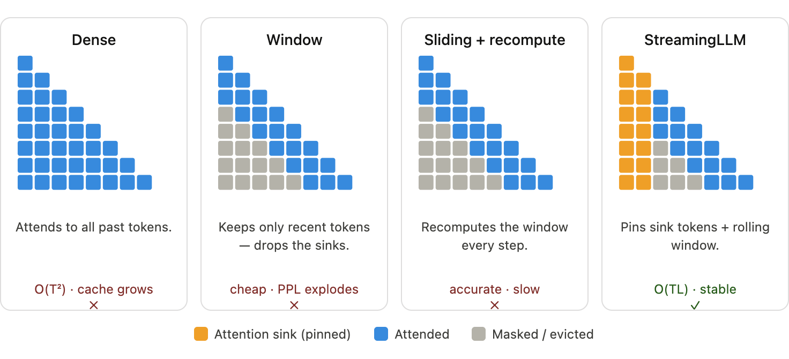
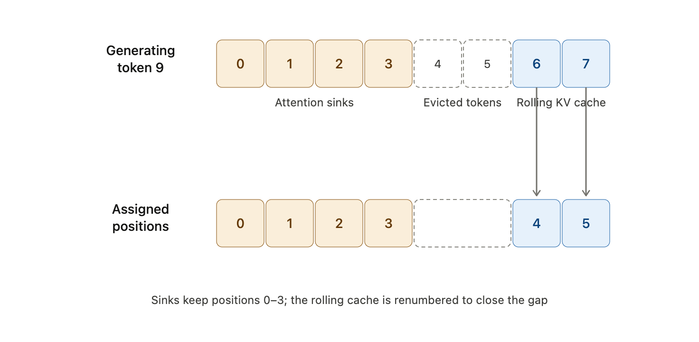
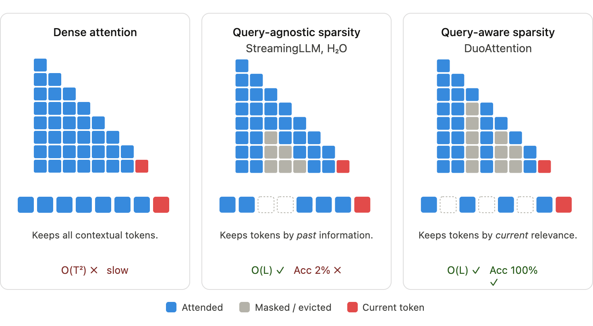

<iframe width="100%" height="500" src="https://www.youtube.com/embed/D3NlVsFod8w" title="Efficient AI Lecture 15: Long-Context LLM" frameborder="0" allowfullscreen></iframe>

Long-context LLMs are not just "larger prompt windows."

They require changes at several levels:

- position encoding must behave outside the pretraining range
- attention must avoid quadratic growth in memory and compute
- evaluation must test whether the model actually uses the middle of long contexts
- inference systems must decide which KV cache entries deserve memory
- alternative sequence models must compress history without losing important details

The core tension is simple: long context is useful only if the model can both store and retrieve the right information.

## Context Extension

### RoPE: Rotary Position Embedding

Rotary position embedding (RoPE) injects position information by rotating query and key vectors.

The embedding dimension $d$ is split into $d/2$ two-dimensional pairs. Each pair is treated as a 2D coordinate, and each coordinate pair is rotated according to the token position.

The base frequencies are:

$$
\Theta
=
\left\{
\theta_i
=
10000^{-2(i-1)/d},
\quad
i\in\{1,\dots,d/2\}
\right\}.
$$

For a complex-valued view of each 2D coordinate pair, RoPE can be written as:

$$
\operatorname{RoPE}(x,m)
=
x e^{im\theta}.
$$

The useful property is that the dot product between a query at position $m$ and a key at position $n$ depends on the relative distance $m-n$:

$$
\left\langle
\operatorname{RoPE}(q_j,m),
\operatorname{RoPE}(k_j,n)
\right\rangle
=
q_j k_j e^{i(m-n)\theta}.
$$

Equivalently, the positional interaction is a function of $m-n$, not just the two absolute positions separately.

This is why RoPE is useful for autoregressive Transformers: attention scores can encode relative distance while still being implemented through transformed queries and keys.

### Context Extension by Position Interpolation

The challenge is that LLMs are trained under a fixed context length. Examples:

- original LLaMA: roughly 2k context
- Llama 2: roughly 4k context
- GPT-4 family models: longer native context windows

If a model trained on positions $[0,L)$ is forced to evaluate positions far beyond that range, it can fail by extrapolation. The positional pattern is outside the distribution seen in pretraining.

RoPE makes a simple context-extension strategy possible: interpolate positions by scaling the frequencies.

Suppose a model was trained with context length $L=2048$, and we want to evaluate a context twice as long. Without interpolation:

$$
m\in[0,2L),
\qquad
\theta_i'=\theta_i.
$$

Now the model sees angular positions outside the trained range.

With position interpolation:

$$
m\in[0,2L),
\qquad
\theta_i'=\frac{\theta_i}{2}.
$$

Halving the frequency compresses twice as many positions into the angular range the model already saw. More generally, extending context by a factor $s$ uses:

$$
\theta_i'=\frac{\theta_i}{s}.
$$

The idea is to prefer interpolation inside the known positional range over extrapolation outside it.

### LongLoRA

Standard attention scales quadratically with sequence length:

$$
O(N^2).
$$

As context length grows, attention becomes the main training bottleneck.

LongLoRA addresses this with two ideas:

- use sparse attention during long-context adaptation
- tune a few extra low-cost parameters beyond ordinary LoRA

#### Shifted Sparse Attention

LongLoRA uses shifted sparse attention, denoted $S^2$-Attention.

The attention heads are split into two groups:

- one group attends inside local chunks without shifting
- the other group shifts the chunk boundaries by half a block

For example, if the block size is 4:

- unshifted heads group tokens as $[0,1,2,3]$, $[4,5,6,7]$, ...
- shifted heads group tokens as $[2,3,4,5]$, $[6,7,8,9]$, ...

Each head still performs cheap local attention, but the shifted grouping creates overlap between neighboring chunks. Across layers, information can propagate through the sequence while each layer avoids full dense attention.

#### Enhanced LoRA

LongLoRA also finds that ordinary LoRA on attention weights alone is often not enough for aggressive context extension.

It opens a few additional components for training:

- input normalization before self-attention
- post-attention normalization before the feed-forward network
- input embeddings

These parameters are cheap compared with full fine-tuning. Normalization layers are a tiny fraction of total parameters, and embeddings are still much smaller than all Transformer blocks. But adapting them helps close the gap between LoRA-style adaptation and full fine-tuning.

## Evaluating Long-Context LLMs

### Needle in the Haystack

Needle-in-the-haystack tests ask whether a model can retrieve a specific fact hidden inside a long context.

This exposes a recurring failure pattern: models often perform well when the relevant fact appears near the beginning or end of the prompt, but perform much worse when the fact is buried in the middle.

The resulting curve is often U-shaped:

- high accuracy near the start
- low accuracy in the middle
- high accuracy near the end

The practical lesson is that accepting a long input does not imply robust use of the entire input. Critical facts buried around the middle of a long document can be missed.

For prompt design, important instructions and facts are safer near the beginning or end of the context.

### LongBench

Synthetic retrieval tests are useful, but they are not enough.

LongBench evaluates long-context models across a broader set of real tasks:

- single-document QA
- multi-document QA
- summarization
- few-shot learning
- code tasks
- synthetic tasks

It includes both English and Chinese inputs, with contexts reaching more than 13k tokens. Metrics include F1 and ROUGE depending on the task.

Two lessons matter:

- position-embedding optimization can directly improve long-context understanding
- retrieval or compression workarounds help, but native long-context architecture usually performs better

## Efficient Attention Mechanisms

### KV Cache Optimizations

During autoregressive generation, every new token needs access to previous keys and values. The KV cache avoids recomputing them, but its memory grows linearly with sequence length and number of layers.

For long contexts, KV cache memory becomes a deployment bottleneck.

The main question becomes:

> Which past tokens must remain available, and which can be compressed, evicted, or approximated?

The following methods answer that question in different ways.

### StreamingLLM

StreamingLLM starts from an empirical observation: early tokens receive unusually large attention mass, even when they are semantically unimportant.

This is called the attention sink phenomenon.

#### Attention Sinks

In an autoregressive Transformer, each row of the attention distribution must sum to 1 after softmax.

When a token does not need much information from earlier tokens, the model still has to put the remaining probability mass somewhere. Since the first token is visible to all later tokens, it becomes a convenient location for leftover attention.

The result is a vertical attention stripe at the first token across many later positions and layers.

The key point is that these sink tokens are not necessarily meaningful. Their role is structural: they stabilize the attention distribution.

#### Infinite Streaming with Attention Sinks

StreamingLLM uses a hybrid cache:

- keep the first few attention sink tokens pinned
- keep a rolling window of recent tokens
- evict the middle tokens

For example, with 4 sink tokens and 4 recent-token budget:

| Step | Sink tokens | Evicted tokens | Rolling cache |
|---|---|---|---|
| Generate token 7 | $[0,1,2,3]$ | $[4]$ | $[5,6,7]$ |
| Generate token 8 | $[0,1,2,3]$ | $[4,5]$ | $[6,7,8]$ |
| Generate token 9 | $[0,1,2,3]$ | $[4,5,6]$ | $[7,8,9]$ |

This gives bounded memory while preserving the attention sink behavior the model expects.

The complexity becomes:

$$
O(TL),
$$

where $T$ is the total number of generated tokens and $L$ is the fixed active cache length.

#### Position Encoding Assignments

For StreamingLLM, positions should follow cache order, not original absolute text position.

If middle tokens are evicted but the remaining tokens keep their old absolute positions, RoPE sees artificial gaps. For example, the model may jump from position 3 to position 10000 even though the cache now contains adjacent active tokens.

The safer rule is:

> assign positions according to the compact cache layout.

This preserves the relative-distance patterns the model saw during pretraining.

#### Pretraining with a Dedicated Attention Sink

A vanilla model often needs multiple first tokens to stabilize streaming inference.

A natural question is whether a model can be pretrained with a single dedicated sink token.

The method is simple: add an extra learnable token at the beginning of every pretraining sample. This token is trained to serve as the attention sink from the start.

The reported result is that this can reduce permanent sink overhead to one token without hurting pretraining convergence.

| Model | 0 + 1024 | 1 + 1023 | 2 + 1022 | 4 + 1020 |
|---|---:|---:|---:|---:|
| Vanilla | 27.87 | 18.49 | 18.05 | 18.05 |
| Zero Sink | 29214 | 19.90 | 18.27 | 18.01 |
| Learnable Sink | 1235 | 18.01 | 18.01 | 18.02 |

The learnable-sink model reaches stable perplexity with a single sink token.

### DuoAttention: Retrieval Heads and Streaming Heads

DuoAttention starts from another observation:

> not all attention heads need full global context.

Some heads act as retrieval heads. They need access to long-range context and are sensitive to KV cache compression.

Other heads act as streaming heads. They mainly use local recent context and attention sinks, so they can operate with a small fixed cache.

#### Prefilling Bottleneck

During prefill, the model processes the whole input prompt and builds the initial KV cache.

For long contexts, full attention during prefill is expensive because every token attends over the whole history:

$$
O(N^2).
$$

DuoAttention reduces this by keeping full attention only for heads that need it.

#### Head Types

Retrieval heads:

- capture long-range dependencies
- need full historical KV cache
- lose accuracy if aggressively compressed

Streaming heads:

- focus on recent local context
- use attention sinks plus a rolling cache
- tolerate a fixed-size sparse KV cache

#### Gate-Based Head Selection

DuoAttention assigns each head a trainable gate value $\alpha_{i,j}$ for layer $i$ and head $j$.

The mixed attention output is:

$$
\operatorname{attn}_{i,j}
=
\alpha_{i,j}\operatorname{full\_attn}
+
(1-\alpha_{i,j})\operatorname{streaming\_attn}.
$$

Full attention is:

$$
\operatorname{full\_attn}
=
\operatorname{softmax}(QK^T\odot M_{\mathrm{causal}})V.
$$

Streaming attention is:

$$
\operatorname{streaming\_attn}
=
\operatorname{softmax}(QK^T\odot M_{\mathrm{streaming}})V.
$$

Heads with $\alpha$ above a threshold are treated as retrieval heads. Heads below the threshold use the lightweight streaming cache.

#### Training Objective

The training objective balances preserving the full-attention model and encouraging sparse head selection:

$$
\mathcal{L}
=
\mathcal{L}_{\mathrm{distill}}
+
\lambda \mathcal{L}_{\mathrm{reg}}.
$$

The distillation loss matches hidden states between the full model and the mixed-attention model:

$$
\mathcal{L}_{\mathrm{distill}}
=
\frac{1}{N}
\sum_{i=1}^{N}
\sum_{j=T-l+1}^{T}
\left(
H_{\mathrm{full}}^{(i)}[j]
-
H_{\mathrm{mixed}}^{(i)}[j]
\right)^2.
$$

The regularization loss pushes more heads toward the streaming regime:

$$
\mathcal{L}_{\mathrm{reg}}
=
\sum_{i=1}^{L}
\sum_{j=1}^{H}
|\alpha_{i,j}|.
$$

In one reported long-context setting around 1.84M tokens:

| Metric | Full attention | DuoAttention | Impact |
|---|---:|---:|---|
| GPU memory | 78.4 GB | 49.3 GB | about 37% less memory |
| Prefill time | 4570 s | 2348 s | roughly 2x faster |

The broader point is that full-context memory is not equally useful for every head.

### SpAtten

SpAtten reduces attention cost by pruning unimportant tokens from the KV cache.

It estimates token importance through cumulative attention. For each historical token, it sums the attention probability it receives over time. Tokens with low cumulative importance are treated as redundant and can be removed.

This is query-agnostic: once a token is judged unimportant, it may be dropped even if a later query would have needed it.

### Quest: Query-Aware Sparsity

Quest makes sparse attention query-aware.

Instead of permanently evicting old tokens only by age or historical importance, Quest decides what to retrieve based on the current query.

The cache is divided into pages. Each page stores lightweight key summaries, such as min and max key values.

Quest then runs a two-stage process.

First, it estimates which pages may matter for the current query. This is a cheap scoring step over page summaries.

Second, it loads only the top-$K$ selected pages and computes full attention over those pages.

This gives the memory benefit of sparse attention while preserving a path to recover old tokens when they become relevant.

## Beyond Transformers

### State-Space Models

State-space models (SSMs) process a sequence through a hidden state.

At time $t$:

- $x_t$ is the input
- $h_t$ is the hidden state
- $y_t$ is the output

During inference, the recurrence is:

$$
\mathbf{h}_t
=
\overline{\mathbf{A}}\mathbf{h}_{t-1}
+
\overline{\mathbf{B}}\mathbf{x}_t,
$$

$$
\mathbf{y}_t
=
\mathbf{C}\mathbf{h}_t.
$$

This gives constant-time state updates per token:

$$
O(1)
$$

with respect to sequence length.

For training, the recurrence can be rewritten as a global convolution:

$$
\overline{\mathbf{K}}
=
(
\mathbf{C}\overline{\mathbf{B}},
\mathbf{C}\overline{\mathbf{A}}\overline{\mathbf{B}},
\dots,
\mathbf{C}\overline{\mathbf{A}}^k\overline{\mathbf{B}},
\dots
),
$$

$$
\mathbf{y}
=
\mathbf{x} * \overline{\mathbf{K}}.
$$

This convolution form can be parallelized during training, while the recurrent form is efficient during inference.

### Mamba

Classical SSMs have a limitation: the matrices $\mathbf{A}$, $\mathbf{B}$, and $\mathbf{C}$ are static.

They do not change based on input content. That makes it hard to selectively remember important tokens and ignore filler.

Mamba introduces selectivity by making key parameters input-dependent:

$$
\mathbf{B}=f_B(x_t),
\qquad
\mathbf{C}=f_C(x_t),
\qquad
\Delta=f_\Delta(x_t).
$$

The step size $\Delta$ modulates the state transition, while $\mathbf{B}$ and $\mathbf{C}$ control what enters and exits the state.

Conceptually:

- without selectivity, every token consumes similar state capacity
- with selectivity, important tokens can dominate the state update while less useful tokens are filtered out

For a phrase such as "I want to order a hamburger", a selective model can focus its memory on "order" and "hamburger" rather than spending equal state capacity on every word.

The key takeaway is that Mamba keeps the efficient inference structure of SSMs while making the memory update content-dependent.

## Summary

Long-context modeling is a systems problem as much as a modeling problem.

RoPE interpolation stretches positional representations. LongLoRA adapts models to longer contexts without full dense attention. Needle-in-the-haystack and LongBench test whether models actually use long input. StreamingLLM, DuoAttention, SpAtten, and Quest reduce KV cache and attention cost by deciding what history to keep. Mamba shows a different path: replace attention over stored tokens with a selective recurrent state.

The shared question behind all of them is:

> How much of the past must remain explicitly accessible for the model to answer the next token well?
