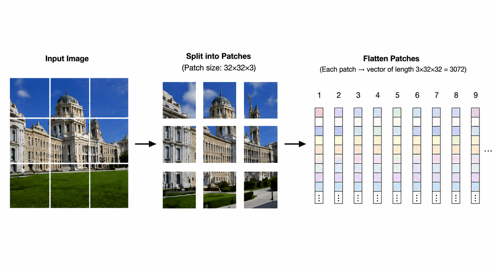
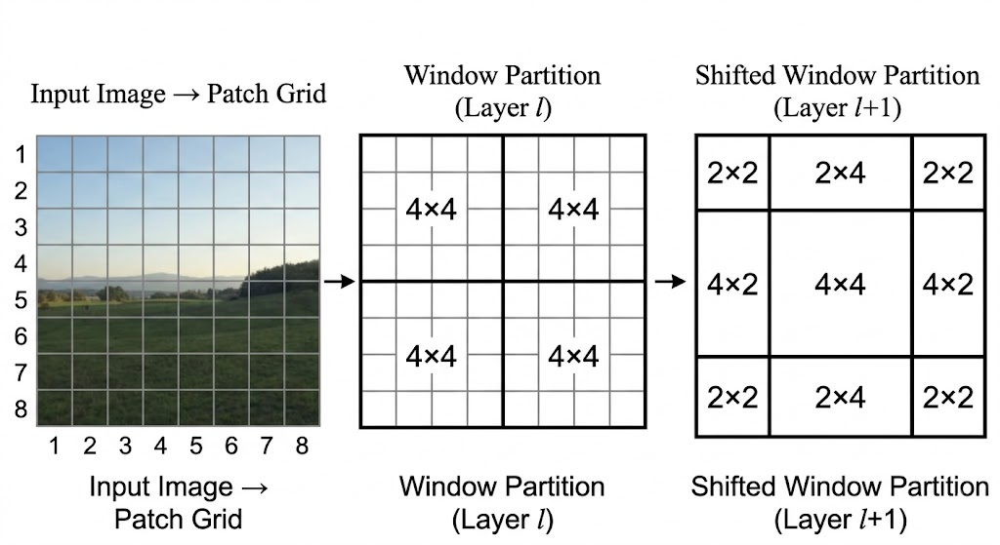
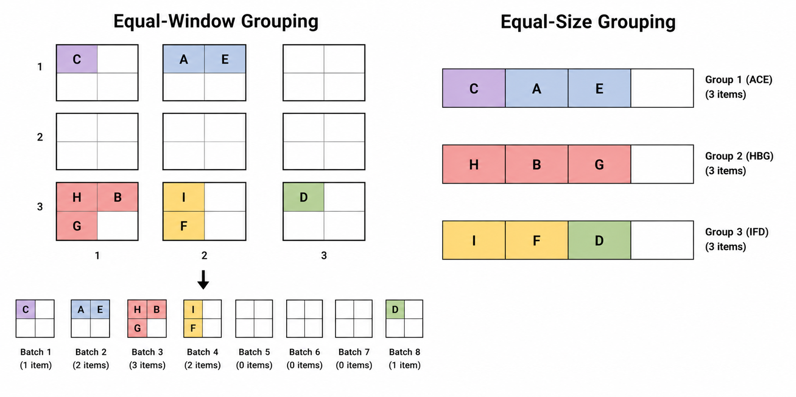
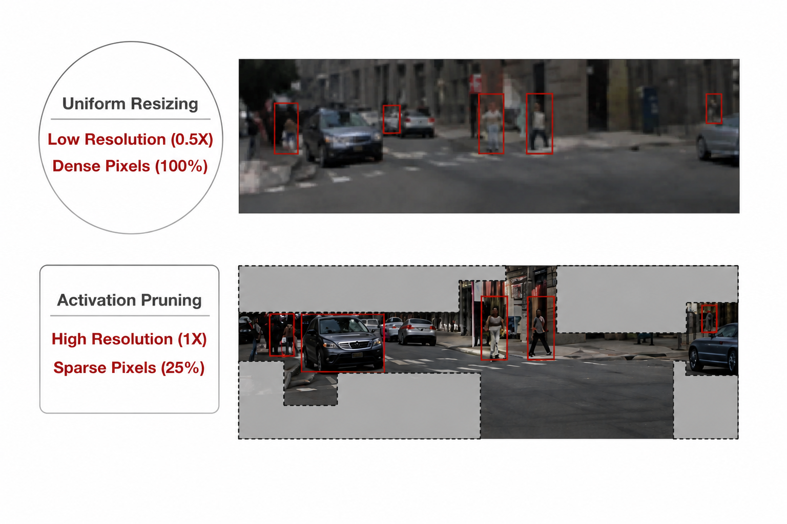

<iframe width="100%" height="500" src="https://www.youtube.com/embed/C_U19CeStV4" title="Efficient AI Lecture 16: Vision Transformer" frameborder="0" allowfullscreen></iframe>

## Vision Transformer

A Vision Transformer converts a two-dimensional image into a sequence of tokens. The key move is to split the image into fixed-size patches, flatten each patch, project it into a hidden dimension, and then process the resulting token sequence with Transformer encoder blocks.

For a ViT-Base style model, the patch embedding step can be implemented as a convolution:

- The convolution kernel size is the patch size, for example `32x32`.
- The stride equals the patch size, so patches do not overlap.
- Padding is zero, so no artificial boundary pixels are added.
- The input channels are the RGB channels.
- The output channels are the hidden dimension, for example 768.

This convolution is equivalent to taking each image patch, flattening it, and applying a learned linear projection. Each patch becomes one token in the sequence. Positional embeddings are then added so the model can recover where each token came from in the image.

The Transformer encoder is where patches exchange information. Multi-head self-attention lets each patch token compare itself with other tokens, and MLP blocks refine the representation.

| Model | Layers | Hidden size $D$ | MLP size | Heads | Params |
|---|---:|---:|---:|---:|---:|
| ViT-Base | 12 | 768 | 3072 | 12 | 86M |
| ViT-Large | 24 | 1024 | 4096 | 16 | 307M |
| ViT-Huge | 32 | 1280 | 5120 | 16 | 632M |

## Efficiency and Acceleration

The main efficiency problem in Vision Transformers is resolution. Dense prediction tasks, such as segmentation and autonomous driving perception, need high-resolution images because small objects disappear when the input is aggressively downsampled.

But standard global self-attention has quadratic cost in the number of patches. If the number of patches is $n$, attention builds an $n \times n$ interaction matrix. Increasing image resolution increases $n$, and the cost quickly becomes too expensive.

The rest of the lecture studies strategies for keeping high-resolution visual information while reducing the cost of attention.

## Window Attention

Standard ViT attention is global: every patch attends to every other patch. Window attention restricts self-attention to small local windows. Each patch only attends to patches inside the same window.

This changes the scaling behavior. Instead of building one global attention matrix over all patches, the model builds many small local attention matrices. The cost becomes much closer to linear in image size, which makes high-resolution inputs practical.

The tradeoff is information isolation. If windows never communicate, a patch in one window cannot directly use information from a nearby patch just across the boundary.

Shifted window attention fixes this by alternating the window layout across layers:

- One layer uses normal non-overlapping windows.
- The next layer shifts the window grid.
- Patches that were separated by a boundary in the previous layer can now fall inside the same shifted window.

This preserves most of the efficiency of local attention while letting information move across the image over multiple layers.

### Sparse Window Attention

Sparse window attention appears naturally in 3D data such as point clouds. Unlike an image grid, a point cloud is mostly empty space. If we divide the space into equal windows, some windows contain many points, some contain a few, and many contain none.

This creates a hardware problem. GPUs prefer balanced batches, so uneven windows require padding. The model may spend substantial compute on dummy tokens that only exist to make tensor shapes match.

Equal-size grouping attacks the hardware inefficiency directly. Instead of forcing every spatial window to have a different number of points, the implementation groups non-empty points into balanced groups of similar size.

The benefit is high utilization: less padding and more useful work per kernel. The cost is that exact geometric locality is no longer guaranteed, because balanced groups may not perfectly match spatial neighborhoods.

## Linear Attention

Linear attention removes the quadratic attention matrix by changing the similarity function.

Standard softmax attention uses:

$$
\text{Sim}(Q, K) = \exp\left(\frac{QK^T}{\sqrt{d}}\right)
$$

The exponential couples $Q$ and $K$, so the model must form the $QK^T$ matrix first. With sequence length $n$, this creates an $n \times n$ matrix and costs $O(n^2)$.

Linear attention replaces softmax with a feature map or activation that can be applied independently:

$$
\text{Sim}(Q, K) = \text{ReLU}(Q)\text{ReLU}(K)^T
$$

Now matrix multiplication can be reassociated:

$$
\text{ReLU}(Q)(\text{ReLU}(K)^T V)
$$

Instead of computing $QK^T$ first, the model computes $K^T V$ first. If $Q, K, V$ have shape roughly $n \times d$, then $K^T V$ is only $d \times d$. This avoids materializing the $n \times n$ attention matrix.

The gain is linear scaling in the number of tokens. The cost is representational: linear attention is often weaker at sharp local interactions because it loses the strong selectivity of softmax.

## EfficientViT

EfficientViT combines efficient global context with local detail recovery.

The architecture uses linear attention to keep global context affordable at high resolution. Since linear attention can be weak at local patterns, EfficientViT injects depthwise convolutions into the feed-forward network. These convolutions restore local spatial inductive bias.

The model also uses multi-scale processing for queries, keys, and values, helping it capture features at different spatial scales. This combination gives a useful division of labor:

- Linear attention provides cheap global communication.
- Depthwise convolution recovers local detail.
- Multi-scale Q/K/V projections improve visual hierarchy.

This is why EfficientViT can improve throughput and edge latency without giving up the accuracy expected from modern vision backbones.

## Sparse Attention

Another route is to keep the image at high resolution but avoid spending equal compute everywhere.

Uniform resizing reduces cost by shrinking the whole image. The problem is that every detail is degraded, including small objects that matter. Sparse attention keeps the original resolution and selects only the important regions for expensive attention.

### Window Activation Pruning

Window activation pruning divides the image into windows and scores each window by importance. Low-score windows, such as empty road or sky, can be dropped. High-score windows are gathered and sent through the expensive attention layers.

This keeps fine details where they matter while reducing the number of active tokens.

### Sparsity-Aware Adaptation

A dense model may fail if tokens are suddenly removed at inference time. Sparsity-aware adaptation trains the model under varying sparsity levels so it learns to remain stable when different windows are pruned.

The idea is to make pruning part of the training distribution instead of a surprise at deployment.

### Resource-Constrained Search

Not every layer can tolerate the same sparsity level. Some layers are sensitive, while others can be pruned aggressively.

Resource-constrained search chooses the per-layer pruning configuration under a latency or compute budget. Evolutionary search with rejection sampling can explore many sparsity schedules while discarding candidates that violate the hardware budget.

## Self-Supervised Learning for ViT

Vision Transformers also benefit from self-supervised pretraining. Instead of relying entirely on human labels, the model learns visual representations from automatically generated training signals.

### Contrastive Learning

Contrastive learning trains an encoder by comparing views.

Two augmented views of the same image are positive samples. The model is trained to pull their embeddings together. Images from different originals are negative samples. The model is trained to push their embeddings apart.

The important effect is invariance. If two crops or color-shifted versions of the same image must map close together, the model cannot rely only on superficial pixel cues. It must learn stable semantic features.

### CLIP

CLIP extends contrastive learning across modalities. It trains an image encoder and a text encoder on paired image-text data.

For a batch of $N$ image-text pairs, CLIP computes a similarity matrix between every image embedding and every text embedding. The diagonal entries are true pairs; off-diagonal entries are mismatches. Training increases similarity on the diagonal and decreases it elsewhere.

At inference time, CLIP enables zero-shot and open-vocabulary classification:

1. Write candidate class descriptions as text prompts.
2. Encode the prompts with the text encoder.
3. Encode the image with the image encoder.
4. Pick the text prompt with the highest similarity to the image.

This removes the need for a new classifier head whenever the label set changes.

## Masked Autoencoder

A Masked Autoencoder trains a Vision Transformer by hiding most of the image and asking the model to reconstruct it.

The process is:

1. Split the image into patches.
2. Randomly mask a large fraction of patches, often around 75%.
3. Feed only visible patches into the heavy encoder.
4. Add mask tokens and use a lightweight decoder to reconstruct missing pixels.
5. Train with a reconstruction loss against the original image.

The efficiency comes from the asymmetry. The expensive encoder only processes visible patches, so pretraining is much cheaper than running the encoder over the full image.

After pretraining, the decoder is discarded. The encoder becomes a strong visual representation model that can be fine-tuned for downstream tasks.

## ViT and Autoregressive Image Generation

Transformers generate language by predicting the next discrete token. Images are naturally continuous, so autoregressive image generation needs a way to convert image content into discrete visual tokens.

### Codebooks and Vector Quantization

Vector quantization converts continuous image features into discrete token IDs.

The basic pipeline is:

1. An encoder maps image patches into continuous feature vectors.
2. A learned codebook stores representative visual vectors.
3. Each feature vector is matched to its nearest codebook entry.
4. The continuous vector is replaced by the index of that codebook entry.

The result is a compressed sequence of discrete image tokens. This makes image modeling look more like language modeling: a Transformer can predict the next visual token in a sequence.

The benefit is compression and compatibility with autoregressive models. The cost is information loss, especially when the tokenizer is forced to represent fine visual details with a small discrete codebook.

### VAR

VAR, or Visual Autoregressive modeling, changes the generation order. Instead of generating a high-resolution image token by token from left to right, VAR predicts images scale by scale.

The model first generates a coarse low-resolution representation. Then it predicts residual information that upgrades the image to the next scale. Repeating this process adds detail progressively.

This next-scale prediction is faster than strict token-by-token generation because it predicts layers of detail rather than every final-resolution token sequentially.

The limitation is still tokenization quality. If the discrete tokenizer loses too much high-frequency information, the final image can become blurry or distorted.

### Hybrid Image Tokenization

HART, the Hybrid Autoregressive Transformer, uses a simple sequence design for text-to-image generation.

Instead of using heavy cross-attention or adaptive normalization layers to inject text into image generation, HART prepends text tokens directly before visual tokens. The Transformer then reads one combined sequence:

$$
\text{text tokens} \rightarrow \text{visual tokens}
$$

This makes text conditioning parameter-efficient. The same autoregressive Transformer can use the prompt as prefix context and then predict the image tokens that follow.

## Summary

Vision Transformers turn images into token sequences, which makes visual modeling compatible with Transformer architectures. The efficiency challenge is that high-resolution vision creates many tokens, and global attention scales quadratically.

Window attention, sparse attention, linear attention, and EfficientViT all reduce this cost in different ways. Self-supervised methods such as contrastive learning, CLIP, and masked autoencoders make ViT representations easier to train at scale. Finally, vector quantization and autoregressive image models show how ViT-style tokenization connects vision models to modern generative architectures.
