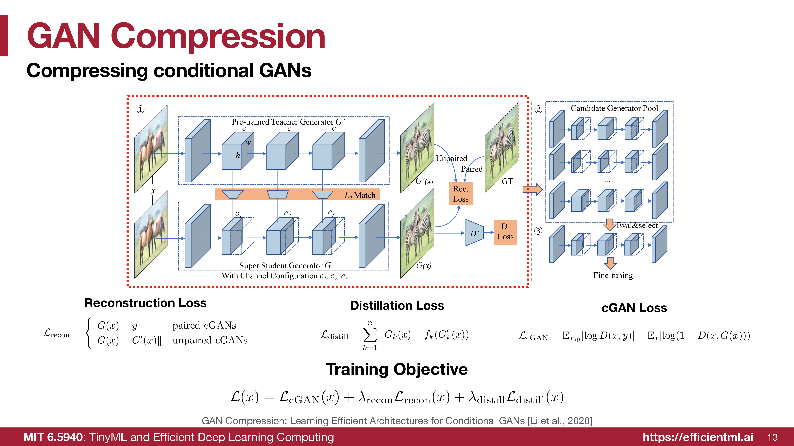
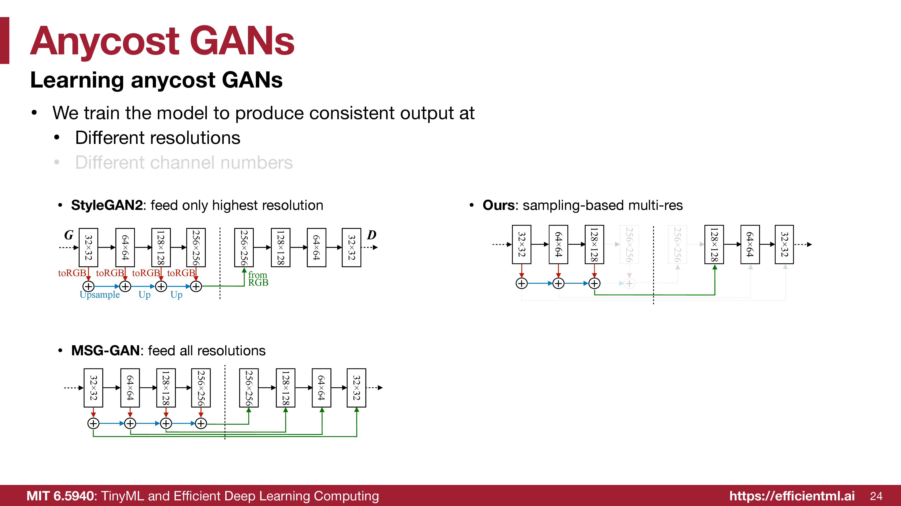
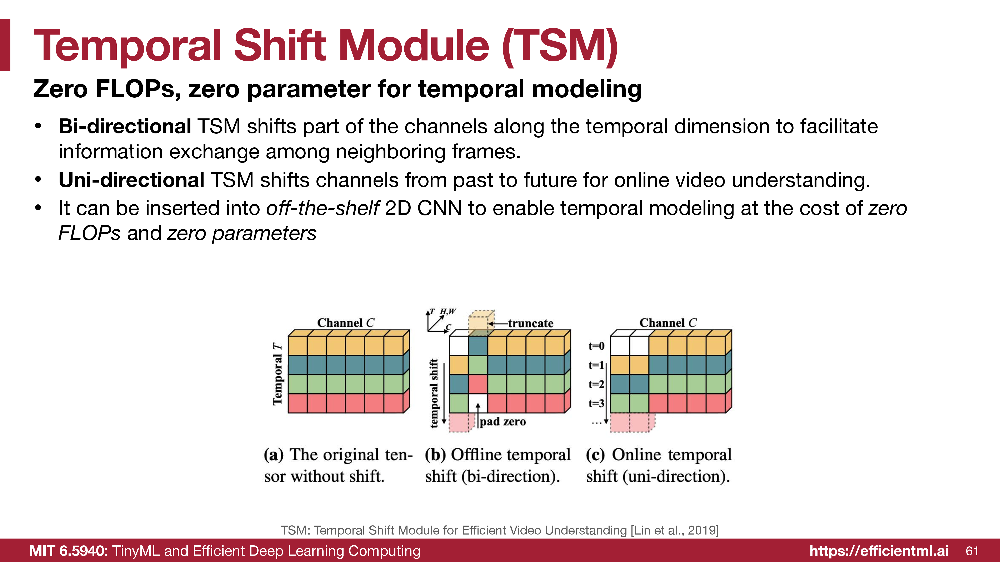
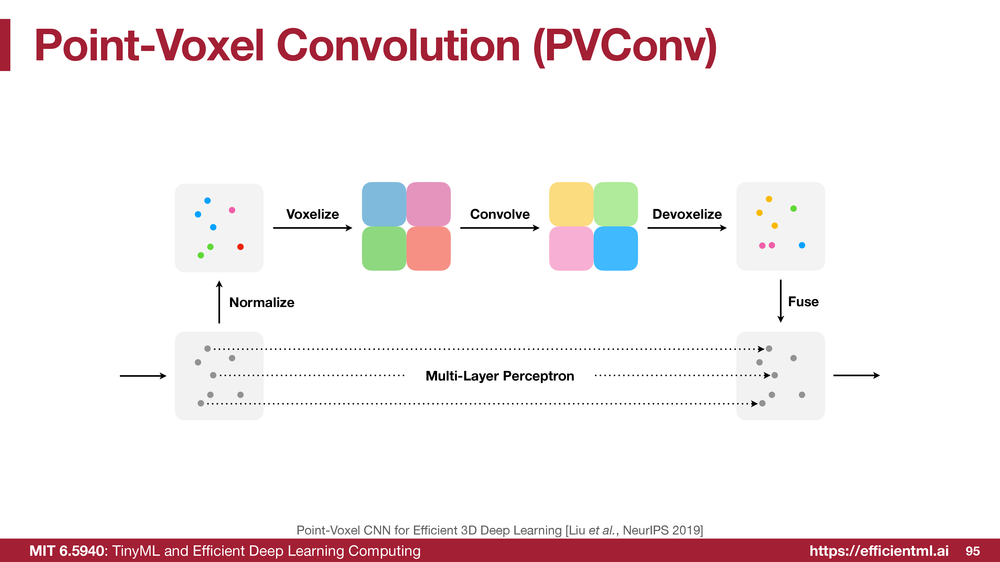
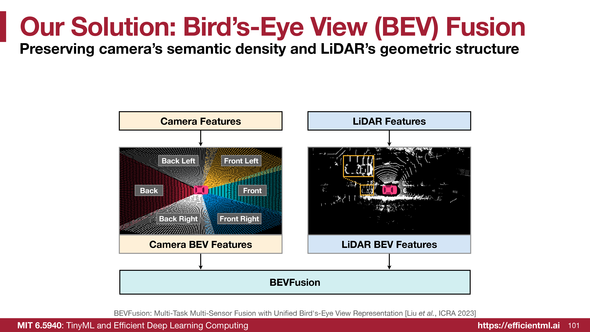

<iframe width="100%" height="500" src="https://www.youtube.com/embed/g24LzAIZbTA" title="Efficient AI Lecture 17: GAN, Video, Point Cloud" frameborder="0" allowfullscreen></iframe>

This lecture is about application-specific efficiency. The same generic idea appears in three different visual domains:

- **GANs:** images contain spatial redundancy, so generators can be compressed or run at adaptive cost.
- **Videos:** neighboring frames contain temporal redundancy, so temporal modeling should reuse 2D CNN efficiency when possible.
- **Point clouds:** 3D space is sparse and irregular, so the model must avoid both wasted dense voxel computation and expensive random point access.

The useful pattern is:

$$
\text{keep the task-critical representation, but avoid dense computation where the data is redundant or sparse.}
$$

## Efficient GANs

GAN inference only needs the generator, but high-quality generators can be very expensive. This is especially painful for interactive image synthesis and editing, where users need fast feedback while changing the latent code or editing controls.

### GAN Background

A standard GAN trains a generator $G$ and discriminator $D$ with an adversarial objective:

$$
\mathbb{E}_x[\log D(x)]
+
\mathbb{E}_z[\log(1-D(G(z)))].
$$

For deployment, the discriminator is only a training tool. The generator is the part that must run efficiently at inference time.

Conditional GANs add an input condition $x$, such as a segmentation map, sketch, label, or source image. The generator produces $G(x)$ and the discriminator judges whether the pair is realistic and condition-consistent.

## GAN Compression

GAN Compression compresses a conditional GAN generator by using a large pretrained teacher and a flexible student generator.

{fig-alt="GAN Compression pipeline with a pretrained teacher generator, a super student generator, a candidate generator pool, and reconstruction, distillation, and cGAN losses."}

The pipeline is:

1. Start with a large pretrained teacher generator $G'$.
2. Train a **super student generator** $G$ that supports multiple channel configurations.
3. Extract many smaller candidate generators from the super student.
4. Evaluate and select a candidate architecture.
5. Fine-tune the selected compact generator.

The key is that architecture search and distillation are coupled. Instead of training every candidate from scratch, the super student shares weights across many candidate subnetworks.

### Reconstruction Loss

For paired conditional GANs, the student can be matched against the ground-truth target:

$$
\mathcal{L}_{\text{recon}}
=
\|G(x)-y\|.
$$

For unpaired conditional GANs, ground-truth paired images are unavailable, so the student matches the teacher output:

$$
\mathcal{L}_{\text{recon}}
=
\|G(x)-G'(x)\|.
$$

Together:

$$
\mathcal{L}_{\text{recon}}
=
\begin{cases}
\|G(x)-y\|, & \text{paired cGANs} \\
\|G(x)-G'(x)\|, & \text{unpaired cGANs}
\end{cases}
$$

### Distillation Loss

The student should not only match final pixels. It should also inherit intermediate representations from the teacher:

$$
\mathcal{L}_{\text{distill}}
=
\sum_{k=1}^{n}
\|G_k(x)-f_k(G'_k(x))\|.
$$

Here $G_k(x)$ is a student feature map, $G'_k(x)$ is the teacher feature map, and $f_k$ maps the teacher feature channels into the student's channel shape.

### cGAN Loss

The adversarial term keeps images realistic:

$$
\mathcal{L}_{\text{cGAN}}
=
\mathbb{E}_{x,y}[\log D(x,y)]
+
\mathbb{E}_{x}[\log(1-D(x,G(x)))].
$$

The total generator objective is:

$$
\mathcal{L}_{\text{total}}
=
\mathcal{L}_{\text{cGAN}}
+
\lambda_{\text{recon}}\mathcal{L}_{\text{recon}}
+
\lambda_{\text{distill}}\mathcal{L}_{\text{distill}}.
$$

The result is a compact generator that keeps the teacher's visual behavior while reducing cost.

## AnyCost GAN

GAN Compression chooses a compact model. AnyCost GAN targets a different use case: one model that can run at many costs.

For interactive image editing, the user needs quick previews while dragging controls, then a high-quality result when there is more idle time. AnyCost GAN gives the generator a quality-speed knob.

{fig-alt="AnyCost GAN architecture showing sampling-based multi-resolution training, adaptive-channel training, and a generator-conditioned discriminator."}

The model is trained to produce consistent outputs under:

- different output resolutions,
- different channel widths,
- different computational budgets.

Two problems appear when subnetworks share one generator:

1. **Subnet inconsistency:** narrow or low-resolution subnetworks may produce different content than the full generator.
2. **Discriminator mismatch:** a single discriminator may not give equally useful feedback to every sub-generator.

AnyCost GAN handles this with:

- multi-resolution training,
- adaptive-channel sampling,
- consistency or distillation losses across costs,
- a generator-conditioned discriminator that knows which generator configuration produced the sample.

This makes one generator usable for both fast preview and high-quality final synthesis.

## Differentiable Augmentation

GANs degrade sharply when training data is limited. The discriminator can overfit to the small dataset, which gives poor gradients to the generator.

Traditional augmentation is not enough if it is applied naively.

**Augmenting real images only** can make the generator learn augmentation artifacts. **Augmenting real and fake images only for the discriminator** creates an optimization mismatch between the discriminator's view and the generator's gradient.

Differentiable Augmentation applies the same differentiable transformations to real and fake samples and keeps those transformations in the gradient path. Examples include color transforms, translation, and cutout.

The important point is not the augmentation list itself. The point is that GAN training is a two-player optimization problem, so augmentation must preserve balanced gradients between $G$ and $D$.

## Efficient Video Understanding

Video understanding needs temporal modeling. Processing frames independently misses motion cues; full 3D convolution captures space-time patterns but is expensive.

Common approaches:

- **2D CNN frame aggregation:** cheap, but weak temporal modeling.
- **Two-stream networks:** combine RGB and optical flow, but optical flow is slow.
- **2D CNN plus LSTM/post-fusion:** models high-level sequences, but misses low-level temporal relationships.
- **3D CNN:** models space and time jointly, but increases parameters and FLOPs because kernels extend into the temporal dimension.

The lecture's question is:

$$
\text{Can we get 3D-CNN temporal interaction at roughly 2D-CNN cost?}
$$

## Temporal Shift Module

Temporal Shift Module (TSM) shifts part of a feature tensor along the time dimension. The operation has no learned weights and no arithmetic FLOPs.

{fig-alt="Temporal Shift Module diagram showing unshifted channels, bidirectional offline temporal shift, and unidirectional online temporal shift."}

For a tensor shaped like `[N, T, C, H, W]`:

- one group of channels shifts backward in time,
- one group shifts forward in time,
- the remaining channels stay at the current frame.

This lets neighboring frames exchange information while still using ordinary 2D convolutions for spatial processing.

### Offline and Online TSM

**Offline TSM** can use future frames because the full clip is available. It uses bidirectional shifts and is useful for action recognition, video classification, and batch processing.

**Online TSM** only uses past information. It shifts channels from past to future and supports streaming tasks such as autonomous driving perception and live gesture recognition.

### Why TSM Is Efficient

TSM does not add convolution kernels, parameters, or multiply-adds. It changes where feature channels are read from across time. This makes it a strong fit for existing 2D CNN backbones:

- accuracy improves because temporal information is exchanged early,
- latency stays close to 2D CNN latency,
- model size stays close to the original image backbone,
- distributed training is easier than large 3D CNNs because communication cost is lower.

## Efficient Point Cloud Understanding

A point cloud is an unordered set of points:

$$
P = \{(p, f)\},
\qquad
p = [x,y,z],
\qquad
f \in \mathbb{R}^C.
$$

Point clouds are very different from images:

- Images are dense and regular grids.
- Point clouds are sparse and irregular.
- The occupied volume may be a tiny fraction of the 3D grid.
- Points are often stored in irregular memory layouts.

This creates a systems problem. Random memory access can dominate arithmetic, and dense voxels waste work on empty space.

## PVCNN and SPVCNN

Pure point methods preserve fine details but suffer from irregular memory access. Pure voxel methods use regular convolutions but lose information during voxelization.

Point-Voxel CNN combines both views:

{fig-alt="Point-Voxel Convolution diagram with a voxel-based feature aggregation branch and a point-based feature transformation branch fused together."}

- The **voxel branch** aggregates neighborhood information with regular convolution.
- The **point branch** keeps high-resolution point features.
- Features are fused after devoxelization.

This is the main tradeoff:

$$
\text{voxel branch for efficient aggregation}
\quad + \quad
\text{point branch for detail preservation}.
$$

Sparse Point-Voxel Convolution (SPVConv) improves the voxel branch by using sparse voxel computation. Instead of paying for empty 3D space, it focuses work on occupied regions.

## BEVFusion

Multi-sensor 3D perception has a view-discrepancy problem. Cameras produce dense semantic images in perspective view. LiDAR produces sparse geometric point clouds in 3D.

BEVFusion uses bird's-eye view as a shared representation.

{fig-alt="BEVFusion diagram showing camera features and LiDAR features projected into bird's-eye-view feature maps before fusion."}

The motivation is:

- Camera features are semantically dense.
- LiDAR features preserve geometric structure.
- Bird's-eye view gives both modalities a common coordinate system.

After converting both camera and LiDAR features into BEV, the model can fuse them and feed task-specific heads for 3D object detection, map segmentation, and other perception tasks.

## Takeaways

This lecture is a good reminder that efficient AI is not one generic trick. Each data type has a different structure to exploit.

- GANs need efficient generators because only the generator runs at inference time.
- GAN Compression uses teacher-student distillation plus architecture search for compact conditional GANs.
- AnyCost GAN trains one generator to support multiple inference budgets.
- Differentiable Augmentation improves low-data GAN training by preserving balanced gradients.
- TSM gives temporal modeling with zero added parameters and zero arithmetic FLOPs.
- PVCNN and SPVConv balance point-level detail with voxel-level regularity.
- BEVFusion resolves camera/LiDAR view discrepancy by fusing features in bird's-eye view.

## Source

These notes are based on MIT 6.5940 / EfficientML.ai [Lecture 17: Efficient GAN, Video, and Point Cloud](https://www.dropbox.com/scl/fi/6o45qs8xm20qhzkc192bv/Lec17-Efficient-GANs-Video-PointCloud.pdf?rlkey=71hrp50kjtl8zz8w7jntvbwn0&st=ywq378y5&dl=0).
