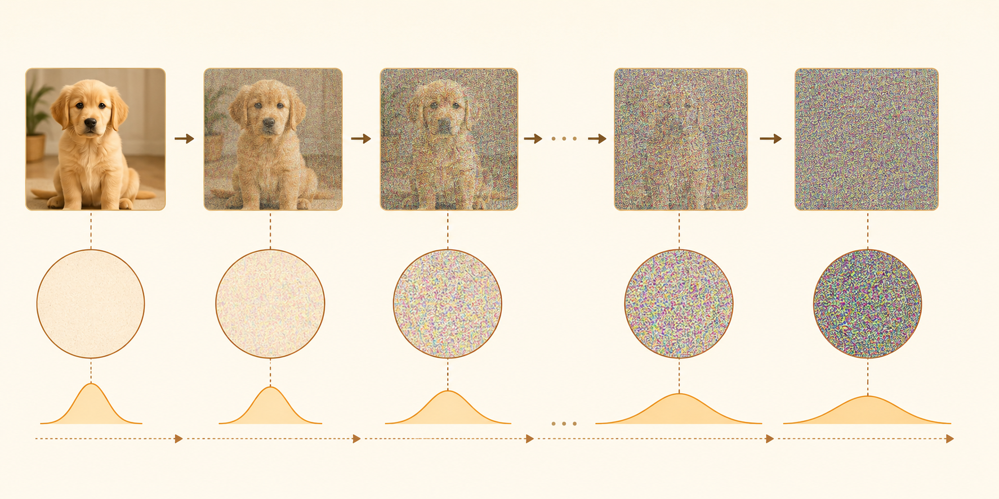
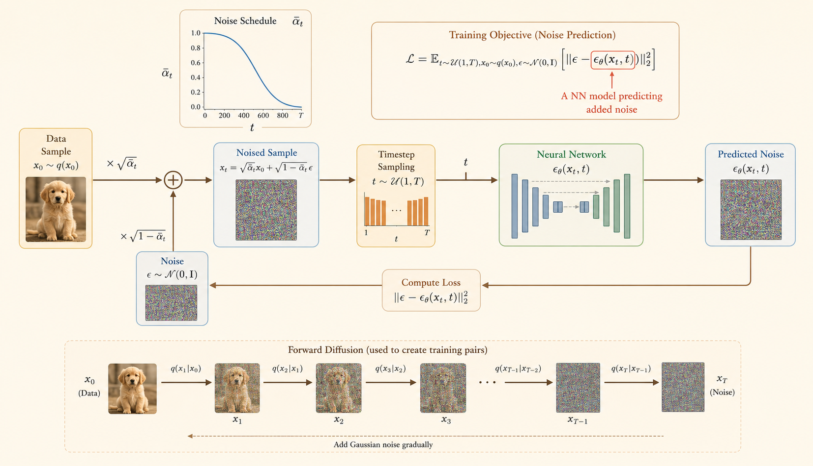

<iframe width="100%" height="500" src="https://www.youtube.com/embed/LK57PyOJWYk" title="Efficient AI Lecture 18: Diffusion Models" frameborder="0" allowfullscreen></iframe>

## Diffusion Models

### Basic Diffusion Model

### 1. Forward Process

The forward process is fixed. It gradually adds Gaussian noise to a clean data sample $x_0$ until the sample becomes nearly pure noise.

At one timestep:

$$
q(x_t \mid x_{t-1})
=
\mathcal{N}\left(
x_t;
\sqrt{1-\beta_t}\,x_{t-1},
\beta_t\mathbf{I}
\right)
$$

where:

- $\beta_t$ is the variance schedule, or diffusion speed.
- $\sqrt{1-\beta_t}\,x_{t-1}$ is the mean.
- $\beta_t\mathbf{I}$ is the covariance.

Define:

$$
\alpha_t = 1-\beta_t,
\qquad
\bar{\alpha}_t = \prod_{i=1}^{t}\alpha_i
$$

Then the one-step noising equation is:

$$
x_t
=
\sqrt{\alpha_t}\,x_{t-1}
+
\sqrt{1-\alpha_t}\,\epsilon_{t-1},
\qquad
\epsilon_{t-1}\sim\mathcal{N}(0,\mathbf{I})
$$

#### Closed-Form Forward Sampling

Instead of adding noise one step at a time, we can sample $x_t$ directly from $x_0$:

$$
q(x_t \mid x_0)
=
\mathcal{N}\left(
x_t;
\sqrt{\bar{\alpha}_t}\,x_0,
(1-\bar{\alpha}_t)\mathbf{I}
\right)
$$

Equivalently:

$$
x_t
=
\sqrt{\bar{\alpha}_t}\,x_0
+
\sqrt{1-\bar{\alpha}_t}\,\epsilon,
\qquad
\epsilon\sim\mathcal{N}(0,\mathbf{I})
$$

As $t$ increases, the schedule is chosen so that $\bar{\alpha}_t \rightarrow 0$. Therefore:

$$
q(x_t \mid x_0) \approx \mathcal{N}(0,\mathbf{I})
$$

#### Why the Closed Form Works

Repeated substitution gives:

$$
\begin{aligned}
x_t
&= \sqrt{\alpha_t}\,x_{t-1}
 + \sqrt{1-\alpha_t}\,\epsilon_{t-1} \\
&= \sqrt{\alpha_t\alpha_{t-1}}\,x_{t-2}
 + \sqrt{\alpha_t(1-\alpha_{t-1})}\,\epsilon_{t-2}
 + \sqrt{1-\alpha_t}\,\epsilon_{t-1} \\
&= \sqrt{\bar{\alpha}_t}\,x_0
 + \sqrt{1-\bar{\alpha}_t}\,\epsilon
\end{aligned}
$$

Independent Gaussian noise terms combine by adding variances:

$$
\mathcal{N}(0,\sigma_1^2\mathbf{I})
+
\mathcal{N}(0,\sigma_2^2\mathbf{I})
=
\mathcal{N}(0,(\sigma_1^2+\sigma_2^2)\mathbf{I})
$$

### 2. Training Algorithm

Training teaches a neural network to predict the noise that was added to a clean sample.

#### Objective

Sample $x_0$, $t$, and $\epsilon$. Construct $x_t$ using the closed-form forward process, then train $\epsilon_\theta(x_t,t)$ to predict the true noise.

$$
\mathcal{L}
=
\mathbb{E}_{t,x_0,\epsilon}
\left[
\left\|\epsilon - \epsilon_\theta(x_t,t)\right\|^2
\right]
$$

This is mean squared error between:

- the true noise $\epsilon$,
- the predicted noise $\epsilon_\theta(x_t,t)$.

#### Steps

1. Sample clean data:

$$
x_0 \sim q(x_0)
$$

2. Sample a timestep:

$$
t \sim \text{Uniform}\{1,\dots,T\}
$$

3. Sample Gaussian noise:

$$
\epsilon \sim \mathcal{N}(0,\mathbf{I})
$$

4. Create the noisy sample:

$$
x_t
=
\sqrt{\bar{\alpha}_t}\,x_0
+
\sqrt{1-\bar{\alpha}_t}\,\epsilon
$$

5. Predict the noise:

$$
\epsilon_\theta(x_t,t)
$$

6. Update model parameters by minimizing:

$$
\left\|\epsilon - \epsilon_\theta(x_t,t)\right\|^2
$$

Key idea: the model does not directly predict the clean image during training. It learns the noise component.

### 3. Inference Algorithm

Inference, or sampling, runs the learned reverse process. Start from pure Gaussian noise and repeatedly denoise until reaching a generated sample.

$$
x_T \sim \mathcal{N}(0,\mathbf{I})
$$

Then for $t=T,T-1,\dots,1$, sample:

$$
p_\theta(x_{t-1}\mid x_t)
=
\mathcal{N}\left(
x_{t-1};
\mu_\theta(x_t,t),
\Sigma_\theta(x_t,t)
\right)
$$

A common DDPM parameterization predicts noise and uses it to compute the reverse mean:

$$
\mu_\theta(x_t,t)
=
\frac{1}{\sqrt{\alpha_t}}
\left(
x_t
-
\frac{\beta_t}{\sqrt{1-\bar{\alpha}_t}}
\epsilon_\theta(x_t,t)
\right)
$$

#### Sampling Steps

1. Start from random Gaussian noise:

$$
x_T \sim \mathcal{N}(0,\mathbf{I})
$$

2. For each timestep $t=T,T-1,\dots,1$, predict the noise:

$$
\epsilon_\theta(x_t,t)
$$

3. Compute the reverse mean:

$$
\mu_\theta(x_t,t)
=
\frac{1}{\sqrt{\alpha_t}}
\left(
x_t
-
\frac{\beta_t}{\sqrt{1-\bar{\alpha}_t}}
\epsilon_\theta(x_t,t)
\right)
$$

4. Add stochasticity if $t>1$:

$$
x_{t-1}
=
\mu_\theta(x_t,t)
+
\sigma_t z,
\qquad
z\sim\mathcal{N}(0,\mathbf{I})
$$

5. At the final step, use the mean directly:

$$
x_0 = \mu_\theta(x_1,1)
$$

Overall chain:

$$
x_T \rightarrow x_{T-1} \rightarrow \cdots \rightarrow x_0
$$

Intuition: training learns how to estimate noise at any timestep. Inference repeatedly subtracts that predicted noise, turning random Gaussian noise into a structured sample.

### Conditional Diffusion Model

#### Unconditional vs. Conditional

**Unconditional models** generate images based solely on random noise:

$$
p_\theta(x_{t-1}\mid x_t)
=
\mathcal{N}\left(
x_t;
\mu_\theta(x_t),
\sigma_t^2\mathbf{I}
\right)
$$

**Conditional models** generate images guided by an additional condition $c$:

$$
p_\theta(x_{t-1}\mid x_t,c)
=
\mathcal{N}\left(
x_t;
\mu_\theta(x_t,c),
\sigma_t^2\mathbf{I}
\right)
$$

#### Condition Types

The lecture categorizes the types of information you can use to guide generation:

1. **Scalar condition:** Using a single value, such as a specific class ID.
2. **Text condition:** Using a sequence of text tokens, such as "photo of a moon gate".
3. **Pixel-wise condition:** Using a spatial map, such as a semantic map or a **Canny edge detector** map, to guide the structure of the output image.

#### Cross Attention

Cross-attention acts as a bridge between the image and the text. Instead of the image interacting only with itself, it looks at the text to understand how to guide the generation process.

The output of this cross-attention layer is calculated as:

$$
\mathrm{Output}
=
\mathrm{Softmax}\left(\frac{QK^T}{\sqrt{d}}\right)V
$$

where:

- **Q (Query):** derived from the image features.
- **K (Key):** derived from the text condition.
- **V (Value):** also derived from the text condition.
- **Softmax:** creates an attention map that determines how much focus the model places on each word.

#### How It Works in Practice

1. **Projecting Features:** The image features are projected into $Q$, while the text condition is projected into $K$ and $V$ using learned weight matrices $W_q$, $W_k$, and $W_v$.
2. **Calculating Similarity:** By multiplying $Q$ and $K^T$, the model computes a similarity score between every part of the image and every word in the text.
3. **Refinement:** The resulting attention scores are used to weight the values $V$.

#### Joint Attention

- **Bridge Between Modalities:** Joint attention fuses text-based constraints with visual information.
- **Unified Processing:** Joint attention creates a shared space $(Q,K,V)$ where the model can consider text meaning and image structure at the same time.
- **Modulation:** Modulation blocks adapt the input embeddings before they enter the joint attention layer.

#### Single Self Attention

- Text conditions are integrated into the model through an **Attention** mechanism.
- **Workflow:**
  - **Input:** Image features and text conditions are concatenated.
  - **Projection:** They pass through weight matrices $W_q$, $W_k$, and $W_v$ to generate **Query** $Q$, **Key** $K$, and **Value** $V$ vectors.
  - **Attention Layer:** These vectors are processed by the attention module and refined by a linear transformation $W_0$.

### Latent Diffusion

Standard diffusion models operate directly in **pixel space**, which is expensive because images are high-dimensional. **Latent Diffusion** solves this by performing the diffusion process in a compressed, low-dimensional latent space.

#### Key Components

- **Pre-trained VAE (Variational Auto-Encoder):**
  - **Encoder:** Compresses the original high-resolution image $x_0$ into a much smaller latent representation $z$. The note mentions a compression factor of $\frac{1}{8}$ or $\frac{1}{4}$ of the original resolution.
  - **Decoder:** Once the diffusion process is complete, this component takes the denoised latent $z$ and maps it back to the original image space, resulting in the reconstructed image $x'_0$.
- **Reconstruction Loss:** During training, the VAE ensures that the latent space maintains enough information to reconstruct the original image accurately.
- **Why it is efficient:** By working on the smaller latent $z$ rather than the massive pixel grid of $x_0$, the model requires significantly less memory and compute power while still producing high-resolution outputs.

#### Training Algorithm

1. **Preparation:** Start with a pre-trained encoder $E$ that compresses a clean image $x_0$ into a latent representation $z_0$.
2. **Sampling:**
  - Pick a random image $x_0$ from the data distribution.
  - Encode it: $z_0 \leftarrow E(x_0)$.
  - Select a random time step $t$ from the range $\{1,\dots,T\}$.
  - Sample Gaussian noise $\epsilon \sim \mathcal{N}(0,\mathbf{I})$.
3. **Noising:** Generate the noisy latent $z_t$ using the cumulative variance schedule $\bar{\alpha}_t$:

$$
z_t
\leftarrow
\sqrt{\bar{\alpha}_t}z_0
+
\sqrt{1-\bar{\alpha}_t}\epsilon
$$

4. **Optimization:** Train the neural network $\epsilon_\theta(z_t,t)$ to predict the added noise $\epsilon$ by taking a gradient descent step to minimize the MSE loss:

$$
\left\|\epsilon-\epsilon_\theta(z_t,t)\right\|^2
$$

#### Why This Is Effective

- **Efficiency:** By working on $z_0$ instead of $x_0$, the model handles significantly less data.
- **Separation of Concerns:** The pre-trained encoder focuses on compact visual features, while the diffusion model focuses on denoising that compact representation.

#### Inference Algorithm

The algorithm iterates from time step $T$ down to $1$. At each step, it refines the latent representation $z_t$ by removing the noise predicted by $\epsilon_\theta(z_t,t)$.

1. **Initialize:** Begin with pure noise $z_T \sim \mathcal{N}(0,\mathbf{I})$ in the compressed latent space.
2. **Estimate Noise:** The model $\epsilon_\theta(z_t,t)$ predicts the noise component present in the current latent $z_t$.
3. **Calculate Mean:** The algorithm computes the estimated mean of the latent at the previous step $t-1$:

$$
\mu
\leftarrow
\frac{1}{\sqrt{\alpha_t}}
\left(
z_t
-
\frac{1-\alpha_t}{\sqrt{1-\bar{\alpha}_t}}
\epsilon_\theta(z_t,t)
\right)
$$

4. **Update Latent:** Generate the next latent $z_{t-1}$ by adding controlled noise $\sigma_t\epsilon$ to the mean:

$$
z_{t-1}
\leftarrow
\mu+\sigma_t\epsilon
$$

5. **Reconstruct Image:** After completing the loop down to $t=1$, pass the final latent $z_0$ through the pre-trained decoder $D$:

$$
x_0 \leftarrow D(z_0)
$$

### Image Editing

#### SDEdit

- Start from an input image or user stroke, then perturb it with noise.
- Run the reverse diffusion process to synthesize an edited image that keeps the coarse structure but improves realism.
- Useful for stroke-based editing and image-to-image translation.

#### Key Idea

- More noise gives the model more freedom to change the image.
- Less noise preserves more of the original input.

### Model Personalization

#### DreamBooth

- **Input:** A few images of a specific subject and its class name.
- **Process:** Fine-tune a text-to-image model so it recognizes that subject through a unique identifier.
- **Output:** The model can generate the subject in new contexts while preserving its visual identity.
- **Limitation:** One fine-tuned model is usually specific to one subject.

## Fast Sampling Techniques

### DDIM

- DDPM sampling is Markovian and usually requires many sequential denoising steps.
- DDIM defines a non-Markovian process that keeps the same diffusion kernel and training loss.
- It estimates $x_0$ from the current noisy sample and predicted noise, then jumps to an earlier timestep.
- Sampling can use a subsequence $[\tau_0=0,\dots,\tau_S=T]$ instead of all $T$ steps.

### Fewer-Step Sampling

- Choose fewer timesteps, such as $\tau=[0,10,20,30,\dots,1000]$.
- This reduces the number of neural network evaluations while using the same trained model.
- Related advanced samplers include DPM-Solver and exponential-integrator samplers.

### Progressive Distillation

- Distill a deterministic DDIM sampler into the same model architecture.
- At each stage, train a student model to replace two adjacent teacher sampling steps with one step.
- The student then becomes the teacher for the next distillation stage.

## Acceleration Techniques

### Sparsity

- In image editing, only a small region may change, but vanilla diffusion recomputes the full image.
- Spatially Sparse Inference reuses cached activations in unchanged regions and updates only active blocks.
- SIGE uses gather, tiled convolution, scatter, and kernel fusion to reduce overhead.

### Quantization

- SVDQuant targets 4-bit diffusion models by handling activation and weight outliers.
- Low-rank components absorb difficult outlier structure so the remaining computation is easier to quantize.
- Fused kernels combine quantization and low-rank branches to reduce latency and memory.

### Parallelism

- Diffusion timesteps are sequential, so naive timestep parallelism is hard.
- DistriFusion uses patch parallelism and reuses activations across adjacent timesteps.
- Asynchronous communication can overlap with computation, improving high-resolution sampling speed.
