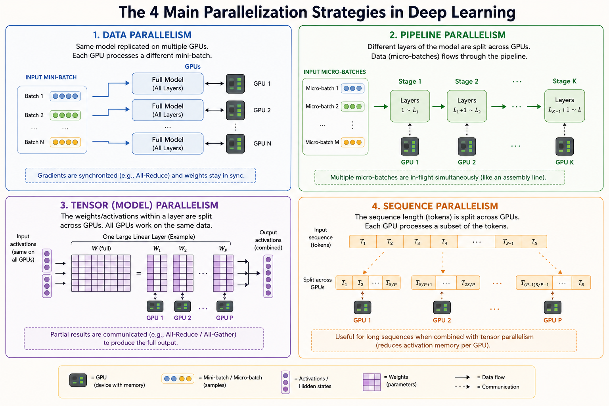
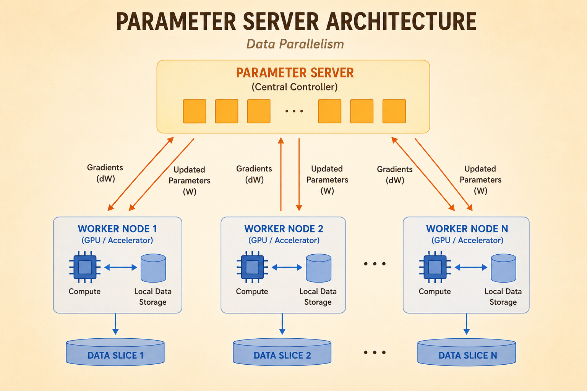
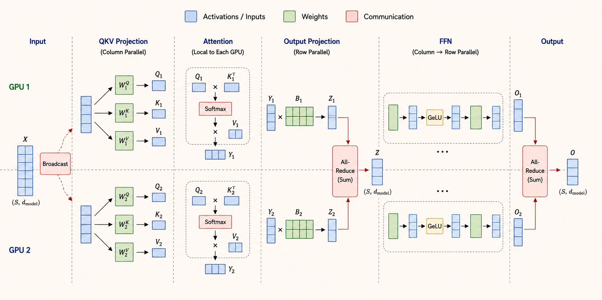

<iframe width="100%" height="500" src="https://www.youtube.com/embed/tiAZUme2ST0" title="Efficient AI Lecture 19: Distributed Training Part 1" frameborder="0" allowfullscreen></iframe>

Distributed training is about splitting model training across devices while controlling two bottlenecks:

- **Memory:** can the model, gradients, activations, and optimizer states fit?
- **Communication:** can devices exchange tensors fast enough to keep compute busy?

The main techniques split either the data, the model layers, the tensors inside layers, or the sequence dimension.

## Parallelization Methods



### Data Parallelization

Data parallelism gives every device a copy of the same model, but sends each device a different mini-batch.

Each iteration follows this pattern:

1. **Replicate:** every device starts with the same model weights.
2. **Forward:** each device computes loss on its local mini-batch.
3. **Backward:** each device computes local gradients.
4. **Synchronize:** devices average gradients, usually with `All-Reduce`.
5. **Update:** every device applies the same averaged gradient update.

The model stays replicated, while the data is partitioned.

### Pipeline Parallelization

Pipeline parallelism splits model layers into stages. For example, a 100-layer model might assign:

- layers 1-25 to GPU 1
- layers 26-50 to GPU 2
- layers 51-75 to GPU 3
- layers 76-100 to GPU 4

Data flows sequentially through the stages. To reduce idle time, the batch is split into micro-batches so different GPUs can work on different micro-batches at the same time.

### Tensor Parallelization

Tensor parallelism partitions the tensors inside a layer. Large matrix multiplications in linear layers and attention blocks are split across GPUs.

A device computes only its local slice of the matrix multiplication. The partial results are then combined with collectives such as `All-Reduce` or `All-Gather`.

### Sequence Parallelization

Sequence parallelism partitions the sequence dimension. Each device processes only a subset of tokens.

This helps long-context training because each device stores and computes over fewer tokens. The challenge is that attention, normalization, and softmax often need global sequence information, so devices must exchange partial results.

## Data Parallelization



### Parameter Server

A parameter-server setup separates the global model state from the worker computation.

- **Parameter server:** receives gradients, aggregates them, and sends updated model weights back.
- **Workers:** hold local data shards, compute local gradients, and communicate with the server.
- **Global state:** the parameter server keeps the model consistent across workers.

### Single Node vs. Distributed Training

Single-node training has a simple iteration:

$$
\text{sample}
\rightarrow
\text{compute gradients}
\rightarrow
\text{update weights}
$$

Distributed training adds communication:

$$
\text{pull weights}
\rightarrow
\text{sample}
\rightarrow
\text{compute gradients}
\rightarrow
\text{push gradients}
\rightarrow
\text{global update}
$$

The benefit is parallel compute. The cost is synchronization and communication overhead.

## Communication Primitives

Distributed training depends on communication collectives. The model-parallel strategy determines which collective appears on the critical path.

### One-to-One

Point-to-point communication sends data from one process to another specific process.

Example:

```text
node 0 -> node 3
```

### Scatter and Gather

**Scatter** is one-to-many. A source node splits a tensor into chunks and sends one chunk to each worker.

**Gather** is many-to-one. Workers send local results back to a source node, which reconstructs the full tensor.

### Reduce and Broadcast

**Reduce** aggregates values from many workers into one result. For example:

$$
[1] + [2] + [3] + [4] = [10]
$$

**Broadcast** sends one tensor from a source node to every other node.

### All-Reduce and All-Gather

**All-Reduce** combines reduce and broadcast. Every worker contributes data, and every worker receives the same aggregated result.

This is the core operation in synchronous data parallel training:

$$
g
=
\frac{1}{N}
\sum_{i=1}^{N}
g_i
$$

where $g_i$ is the gradient from worker $i$.

**All-Gather** gathers data from all workers and distributes the full concatenated result back to all workers.

| Method | Time Complexity | Peak Node Bandwidth | Total Bandwidth |
|---|---:|---:|---:|
| Parameter Server | $O(1)$ | $O(N)$ | $O(N)$ |
| All-Reduce: Sequential | $O(N)$ | $O(N)$ | $O(N)$ |
| All-Reduce: Ring | $O(N)$ | $O(1)$ | $O(N)$ |
| All-Reduce: Parallel | $O(1)$ | $O(N)$ | $O(N^2)$ |

### Recursive All-Reduce

Recursive all-reduce uses a doubling or halving communication pattern.

At each step, nodes exchange with partners at increasing offsets:

1. offset 1
2. offset 2
3. offset 4
4. continue until all nodes have contributed

This reaches global synchronization in:

$$
\log_2(N)
$$

communication steps.

## ZeRO and FSDP

### Memory Usage During Training

Using FP16 weights as a simple example:

- weights: 2 bytes per parameter
- gradients: 2 bytes per parameter
- Adam optimizer states: about 12 bytes per parameter

So the standard replicated memory cost is roughly:

$$
2 + 2 + 12 = 16
\text{ bytes per parameter}
$$

On an 80 GB GPU:

$$
\frac{80\text{ GB}}{16\text{ bytes}}
\approx
5.0
\text{ billion parameters}
$$

This is far below the scale of large language models, so simply replicating all training states on every GPU does not scale.

### ZeRO-1: Shard Optimizer States

ZeRO-1 partitions optimizer states across $N$ GPUs.

Weights and gradients are still replicated, but each GPU stores only:

$$
\frac{1}{N}
$$

of the optimizer states.

Approximate memory per parameter:

$$
2 + 2 + \frac{12}{N}
$$

For $N=64$:

$$
2 + 2 + \frac{12}{64}
\approx
4.2
\text{ bytes per parameter}
$$

This raises the model capacity to roughly 19 billion parameters on 80 GB GPUs.

### ZeRO-2: Shard Optimizer States and Gradients

ZeRO-2 additionally shards gradients.

Approximate memory per parameter:

$$
2
+
\frac{2}{N}
+
\frac{12}{N}
$$

For $N=64$:

$$
2 + \frac{2}{64} + \frac{12}{64}
\approx
2.2
\text{ bytes per parameter}
$$

This raises the capacity to roughly 36 billion parameters on 80 GB GPUs.

### ZeRO-3: Shard Parameters, Gradients, and Optimizer States

ZeRO-3 shards all three major training states:

- parameters
- gradients
- optimizer states

Approximate memory per parameter:

$$
\frac{2}{N}
+
\frac{2}{N}
+
\frac{12}{N}
=
\frac{16}{N}
$$

For $N=64$:

$$
\frac{16}{64}
=
0.25
\text{ bytes per parameter}
$$

With 80 GB GPUs, this makes hundreds-of-billions-parameter training feasible.

In PyTorch, ZeRO-3-style sharding is implemented through **Fully Sharded Data Parallel**, or **FSDP**.

## Pipeline Parallelism

### Naive Pipeline Parallelism

Naive pipeline parallelism splits model layers across GPUs, but each stage waits for the previous stage before it can run.

This creates the **pipeline bubble**:

- early GPUs become idle after sending activations forward
- later GPUs wait before they receive work
- the hardware is underutilized

### GPipe

GPipe reduces the bubble by splitting a large batch into micro-batches.

For example:

$$
[16, 10, 512]
\rightarrow
4 \times [4, 10, 512]
$$

Once GPU 0 finishes the first micro-batch, it sends it to GPU 1 and immediately starts the next micro-batch. Multiple stages can then work concurrently on different micro-batches.

The goal is to keep all pipeline stages busy for most of the iteration.

## Tensor Parallelism

Tensor parallelism slices large weight tensors so a single layer operation can be distributed across devices.



### FFN Layer

A Transformer feed-forward network often has the form:

$$
X
\rightarrow
A
\rightarrow
\operatorname{GeLU}
\rightarrow
B
\rightarrow
Z
$$

The common strategy is:

1. Split $A$ column-wise.
2. Apply GeLU independently on each local activation slice.
3. Split $B$ row-wise.
4. Use `All-Reduce` at the end to sum partial outputs.

This avoids communication between the two matrix multiplications and pays the communication cost only after the second projection.

### QKV Projection

For attention, the query, key, and value projections are often split column-wise.

Each GPU computes only a subset of attention heads:

$$
Q_i,\ K_i,\ V_i
$$

The input $X$ is broadcast to each device, and every device computes its local projection independently.

### Attention and Output Projection

After local attention heads are computed, the output projection is usually row-parallel.

Each device multiplies its local activation slice by its local row shard of the output matrix. The partial outputs are then summed with `All-Reduce`:

$$
Z
=
\sum_i Z_i
$$

## Sequence Parallelism

### Repartition Data in Attention Layers

Sequence parallelism splits tokens across GPUs. This increases the maximum sequence length that can be processed because each GPU owns only a partition of the full context.

The scaling rule is:

$$
\#\text{GPUs}
=
\#\text{sequence partitions}
=
\#\text{head partitions}
$$

Attention still needs global information, so sequence-parallel attention often requires `All-to-All` communication.

### Ring Attention

Ring attention distributes keys and values across GPUs.

Each GPU holds:

- local queries $Q$
- one shard of keys $K$
- one shard of values $V$

GPUs pass $K$ and $V$ blocks around a ring. While a GPU receives a new block, it computes attention scores for its local queries against that block.

The key idea is overlapping:

$$
\text{communication}
\quad \text{with} \quad
\text{attention computation}
$$

This makes long-context attention more scalable than gathering all keys and values onto every device.

---

*Source: Efficient AI, Lecture 19: Distributed Training Part 1.*
