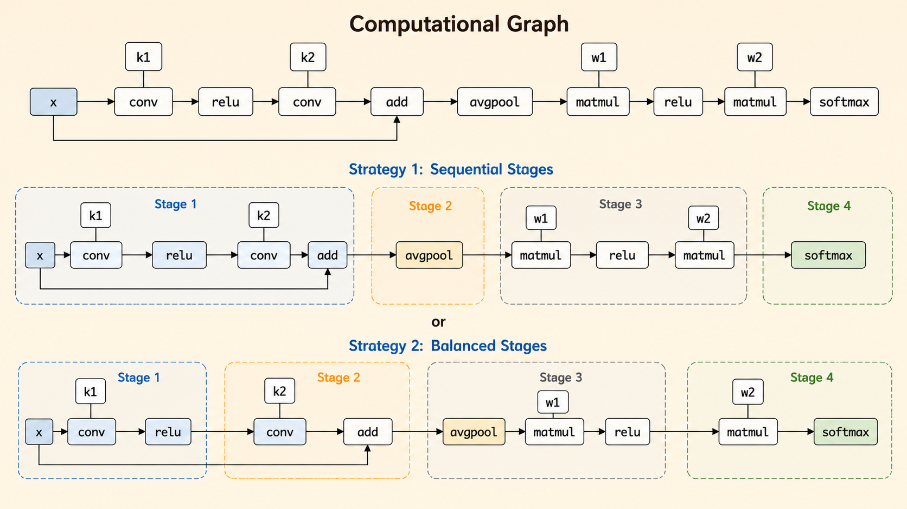
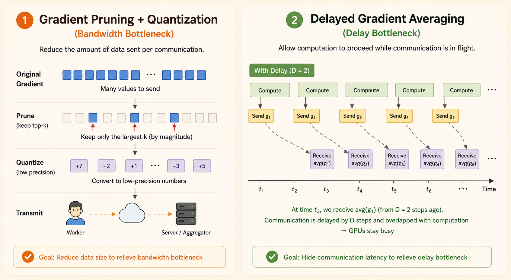

<iframe width="100%" height="500" src="https://www.youtube.com/embed/jb91nEH2g_0" title="Efficient AI Lecture 20: Distributed Training Part 2" frameborder="0" allowfullscreen></iframe>

This lecture continues distributed training from the systems side: how to search parallelization strategies, why communication becomes the bottleneck, and how gradient compression and delayed gradients reduce bandwidth and latency costs.

# Auto Parallelization

Auto-parallelization asks the compiler to choose how a model should be split across devices. Instead of manually deciding every stage and tensor partition, the system searches over possible inter-op and intra-op strategies and picks a plan that balances compute, memory, and communication cost.

## Search for Inter-Op Parallelism

Inter-operator parallelism partitions the model graph into sequential stages. Instead of running the whole model on every device, each device or device group executes one segment and passes intermediate activations to the next stage.

The compiler can choose different split points for the same graph. For example, a split can place `add` at the beginning of the next stage, or keep it with the previous convolution block. The split affects load balance, memory, and communication.

## Search for Intra-Op Parallelism

Intra-operator parallelism splits a single operator across devices. For a large `matmul`, devices may compute different slices of the output or compute partial results that later require an `all-reduce`.

The core tradeoff is compute parallelism versus communication overhead: splitting an operator can use more GPUs, but some partitioning choices introduce extra synchronization.

# Bottleneck of Distributed Training

## Communication

Distributed training requires frequent synchronization across workers. As models and clusters grow, communication becomes expensive in two ways:

- **Bandwidth pressure**: larger gradients or parameters increase transfer size.
- **Latency pressure**: more synchronization operations add waiting time, especially with `all-reduce`.
- **Scaling friction**: adding more workers can improve compute throughput but also increases coordination cost.

# Gradient Compression

Gradient compression reduces communication bandwidth by sending a smaller representation of the update.

## Reduce Transfer Size

Two broad strategies are:

- **Pruning**: set small gradient entries to zero and communicate only important values.
- **Quantization**: reduce numeric precision, such as sending 8-bit values instead of 32-bit floats.

Both reduce transfer size, but both must preserve enough update information for training to converge.

## Local Accumulation

Sparse communication sends only the top-k gradient entries by magnitude. The unsent entries are kept locally as a residual buffer and added back into later updates.

Why this helps:

- Bandwidth drops because only a small fraction of entries is transmitted.
- Accuracy can recover because dropped values are not discarded; they accumulate locally.

The limitation is that simple sparse communication works on small models but can degrade modern networks such as ResNets.

## Momentum Correction

Momentum makes local accumulation more subtle. Vanilla momentum SGD keeps a velocity state:

$$
\nu_t = m \nu_{t-1} + g_t
$$

$$
w_t = w_{t-1} - \eta \nu_t
$$

If sparse communication accumulates raw unsent gradients and later feeds them into momentum, the timing of the momentum update changes. The optimizer no longer follows the same trajectory as vanilla momentum SGD.

Deep Gradient Compression fixes this with **momentum correction**:

- Compute the current gradient.
- Update the momentum velocity.
- Sparsify the velocity or update direction.
- Communicate selected large entries.
- Keep unsent velocity components in the residual buffer.

Key idea: **accumulate the velocity, not the raw gradient.** This preserves the momentum effect before sparsification and better matches the vanilla momentum direction.

## Warm-Up Training

Early training is unstable because weights change quickly. Applying extreme sparsity immediately can make stale residuals and local accumulation harmful.

Warm-up stabilizes DGC:

- **Learning-rate warm-up** starts with a smaller step size.
- **Sparsity warm-up** gradually increases sparsity over the first epochs.
- **Optimizer adaptation** gives momentum and residual buffers time to adjust.

The goal is to avoid a sudden change in optimization dynamics.

## PowerSGD: Low-Rank Gradient Compression

Sparse pruning can create irregular sparse patterns across workers. During all-reduce, sparse tensors may become denser, reducing the communication benefit.

PowerSGD uses low-rank factorization instead of fine-grained sparsity:

- Approximate a large gradient matrix with low-rank factors.
- Keep communication shapes consistent across workers.
- Avoid sparse-pattern densification during aggregation.
- Trade exact gradients for a structured approximation that is easier to communicate.

In short: DGC compresses by dropping entries; PowerSGD compresses by approximating gradient matrices with low-rank structure.

## Quantization

Gradient quantization reduces bandwidth by sending lower-precision gradients instead of full 32-bit values.

Common methods:

- **1-bit SGD**: quantize gradients to signs, with scaling factors and quantization-error accumulation.
- **Threshold quantization**: use a chosen threshold as both decision boundary and reconstruction value.
- **TernGrad**: quantize gradients to -1, 0, or 1 with stochastic probabilities so the quantized gradient is unbiased in expectation.

The tradeoff is transfer size versus quantization error. Good methods reduce communication while keeping the update direction useful enough for convergence.

# Delayed Gradient

Gradient compression improves bandwidth, but latency is harder. In vanilla distributed synchronous SGD, workers finish local computation and then wait for gradient synchronization before starting the next step.

## Why We Need It

High latency creates a synchronization barrier. Even if bandwidth is improved by pruning, low-rank compression, or quantization, workers may still sit idle while messages travel through the network.

Delayed gradients target this latency bottleneck by allowing workers to keep computing while communication is still in flight.

## Why It Works

Delayed Gradient Averaging overlaps communication with computation:

- Send the current gradient asynchronously.
- Keep a local copy of that gradient.
- After a delay of $D$ steps, receive the averaged gradient from earlier workers.
- Apply a correction so stale gradients do not directly overwrite the current update direction.

A simplified corrected update is:

$$
w_{i,j}
=
w_{i,j}
-
\eta
\left(
\nabla w_{i,j}
-
\nabla w_{i-D,j}
+
\nabla w_{i-D}
\right)
$$

This can be read as:

$$
\text{current local gradient}
+
(\text{old global average} - \text{old local gradient})
$$

The current local gradient keeps the update fresh. The delayed averaged gradient injects distributed information. Subtracting the old local gradient avoids double-counting what this worker already contributed.

Key takeaway: pruning, low-rank compression, and quantization mainly target the **bandwidth bottleneck**; delayed gradient methods target the **latency bottleneck**.

*Source: MIT 6.5940 TinyML and Efficient Deep Learning Computing, Lecture 20: Distributed Training II.*
