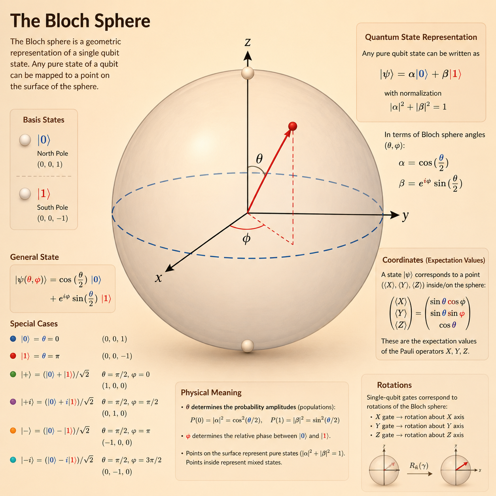
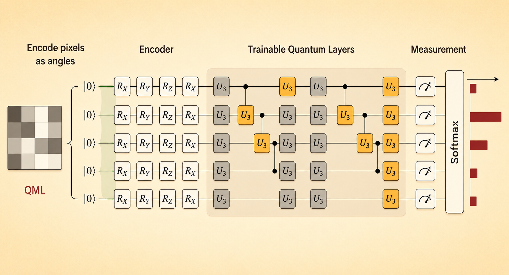

<iframe width="100%" height="500" src="https://www.youtube.com/embed/Ce0T48-c6XI" title="Efficient AI Lecture 22: Quantum Machine Learning I" frameborder="0" allowfullscreen></iframe>

This lecture introduces the quantum-computing foundations needed for quantum machine learning. The key shift is that information is no longer represented only by classical bits, but by complex-valued quantum states that can be transformed by reversible gates and read out by measurement.

# Quantum Computing Motivation

Classical bits are discrete: each bit is either 0 or 1. Qubits are described by vectors of complex amplitudes. With $n$ qubits, the state vector has $2^n$ amplitudes, so the representation size grows exponentially.

This exponential state space is the reason quantum computers are interesting, but it is also the reason they are hard to simulate on classical machines.

# Single Quantum Bit

The computational basis states are

$$
|0\rangle =
\begin{bmatrix}
1 \\
0
\end{bmatrix},
\qquad
|1\rangle =
\begin{bmatrix}
0 \\
1
\end{bmatrix}.
$$

A qubit can be a complex-valued linear combination of these basis states:

$$
|\psi\rangle = \alpha |0\rangle + \beta |1\rangle.
$$

The amplitudes must be normalized:

$$
|\alpha|^2 + |\beta|^2 = 1.
$$

## Superposition

For example,

$$
|q_0\rangle =
\begin{bmatrix}
\frac{1}{\sqrt{2}} \\
\frac{i}{\sqrt{2}}
\end{bmatrix}
=
\frac{1}{\sqrt{2}}|0\rangle
+ \frac{i}{\sqrt{2}}|1\rangle.
$$

This is a superposition: the state is represented as a linear combination of basis states before measurement.

## Measurement

Measurement converts a quantum state into a classical outcome. The probability of observing basis state $|x\rangle$ from state $|\psi\rangle$ is

$$
p(|x\rangle) = |\langle x|\psi\rangle|^2.
$$

Kets such as $|x\rangle$ are column vectors. Bras such as $\langle x|$ are row vectors, formed by the conjugate transpose of the corresponding ket.

For the example above:

$$
\langle 0|q_0\rangle
=
\frac{1}{\sqrt{2}}\langle 0|0\rangle
+ \frac{i}{\sqrt{2}}\langle 0|1\rangle
=
\frac{1}{\sqrt{2}},
$$

so

$$
|\langle 0|q_0\rangle|^2 = \frac{1}{2}.
$$

Once measured, the state collapses to one outcome. The original superposition information is no longer available.

# Bloch Sphere

The Bloch sphere visualizes every possible single-qubit state, ignoring global phase.

- The north pole represents $|0\rangle$.
- The south pole represents $|1\rangle$.
- $\theta$ controls the relative probability of $|0\rangle$ and $|1\rangle$.
- $\phi$ controls the relative phase.

A general one-qubit state can be written as

$$
|q\rangle
=
\cos\left(\frac{\theta}{2}\right)|0\rangle
+ e^{i\phi}\sin\left(\frac{\theta}{2}\right)|1\rangle.
$$

Quantum gates can be understood as rotations of the state vector on this sphere.

# Single-Qubit Gates

Quantum gates are reversible operations represented by unitary matrices.

The Pauli-X gate acts like a quantum NOT gate:

$$
X =
\begin{bmatrix}
0 & 1 \\
1 & 0
\end{bmatrix}.
$$

The Pauli gates are:

| Gate | Name | Matrix | Bloch sphere effect |
|---|---|---|---|
| $X$ | Bit-flip | $\begin{bmatrix}0 & 1 \\ 1 & 0\end{bmatrix}$ | $180^\circ$ rotation around x-axis |
| $Y$ | Phase and bit-flip | $\begin{bmatrix}0 & -i \\ i & 0\end{bmatrix}$ | $180^\circ$ rotation around y-axis |
| $Z$ | Phase-flip | $\begin{bmatrix}1 & 0 \\ 0 & -1\end{bmatrix}$ | $180^\circ$ rotation around z-axis |

The Z gate is

$$
Z =
\begin{bmatrix}
1 & 0 \\
0 & -1
\end{bmatrix}
=
|0\rangle\langle 0|
-
|1\rangle\langle 1|.
$$

It leaves $|0\rangle$ unchanged and maps $|1\rangle$ to $-|1\rangle$. The sign is physically indistinguishable in isolation, but the phase matters for quantum interference.

## Common Bases

The X-basis states are

$$
|+\rangle
=
\frac{1}{\sqrt{2}}(|0\rangle + |1\rangle)
=
\frac{1}{\sqrt{2}}
\begin{bmatrix}
1 \\
1
\end{bmatrix},
$$

$$
|-\rangle
=
\frac{1}{\sqrt{2}}(|0\rangle - |1\rangle)
=
\frac{1}{\sqrt{2}}
\begin{bmatrix}
1 \\
-1
\end{bmatrix}.
$$

The Y-basis states are

$$
|R\rangle = \frac{|0\rangle + i|1\rangle}{\sqrt{2}},
\qquad
|L\rangle = \frac{|0\rangle - i|1\rangle}{\sqrt{2}}.
$$

## Hadamard Gate

The Hadamard gate is

$$
H =
\frac{1}{\sqrt{2}}
\begin{bmatrix}
1 & 1 \\
1 & -1
\end{bmatrix}.
$$

It maps computational-basis states into the X-basis:

$$
H|0\rangle = |+\rangle,
\qquad
H|1\rangle = |-\rangle.
$$

## Phase and U Gates

The phase gate is

$$
P(\phi) =
\begin{bmatrix}
1 & 0 \\
0 & e^{i\phi}
\end{bmatrix}.
$$

The S gate is the special case $\phi = \pi/2$:

$$
S =
\begin{bmatrix}
1 & 0 \\
0 & i
\end{bmatrix}.
$$

The general single-qubit U gate can express any single-qubit transformation by adjusting three parameters:

$$
U(\theta, \phi, \lambda)
=
\begin{bmatrix}
\cos\left(\frac{\theta}{2}\right)
&
-e^{i\lambda}\sin\left(\frac{\theta}{2}\right)
\\
e^{i\phi}\sin\left(\frac{\theta}{2}\right)
&
e^{i(\phi+\lambda)}
\cos\left(\frac{\theta}{2}\right)
\end{bmatrix}.
$$

# Multiple Quantum Bits

For two qubits, the state has four amplitudes:

$$
|a\rangle
=
a_{00}|00\rangle
+ a_{01}|01\rangle
+ a_{10}|10\rangle
+ a_{11}|11\rangle
=
\begin{bmatrix}
a_{00} \\
a_{01} \\
a_{10} \\
a_{11}
\end{bmatrix}.
$$

More generally, $n$ qubits require $2^n$ amplitudes. This exponential scaling is what gives quantum computing its representational power and what makes classical simulation difficult.

## Collective State

The Kronecker product combines smaller state vectors into a larger joint state:

$$
|ba\rangle = |b\rangle \otimes |a\rangle.
$$

For $n$ qubits, this creates a $2^n$-dimensional state vector.

## Single-Qubit Gates in Multi-Qubit Systems

To apply a gate to one qubit inside a larger system, use the Kronecker product with identity gates. For example, applying $X$ to the first qubit and doing nothing to the second is represented as

$$
X \otimes I.
$$

# Multi-Qubit Gates and Entanglement

The CNOT gate uses a control qubit and a target qubit. If the control qubit is $|1\rangle$, the target flips.

For inputs:

- $00 \rightarrow 00$
- $01 \rightarrow 01$
- $10 \rightarrow 11$
- $11 \rightarrow 10$

Entanglement is a non-classical correlation between qubits. A common Bell-state circuit applies Hadamard to one qubit and then CNOT:

$$
\mathrm{CNOT}|0+\rangle
=
\frac{1}{\sqrt{2}}(|00\rangle + |11\rangle).
$$

After measurement, this state produces $00$ with probability $1/2$ and $11$ with probability $1/2$, but never $01$ or $10$.

Other useful multi-qubit gates include:

- **CZ**: conditional phase flip.
- **SWAP**: exchanges two qubit states.
- **CRX**: controlled rotation around the x-axis.

# Quantum Circuits

A quantum circuit combines:

- initialization and reset,
- quantum gates,
- measurement,
- classically controlled quantum gates.

Because measurement collapses the state, circuits usually delay measurement until the end unless feedback is explicitly needed.

## Quantum Adder

Quantum addition uses reversible gates. CNOT acts like XOR for the sum bit, while multi-qubit gates such as Toffoli can represent carry logic.

The important distinction from classical adders is that quantum circuits must preserve reversibility and can operate on superposed inputs.

# A Simple Quantum ML Circuit

Quantum machine learning circuits usually have three stages:

- **Data encoding**: map classical data, such as pixels, into quantum rotation angles.
- **Trainable quantum layers**: use parameterized gates such as $U_3$ gates.
- **Measurement and prediction**: measure the quantum state and map the result to a classical output such as a softmax classifier.

# NISQ Era and Qubit Mapping

NISQ means **Noisy Intermediate-Scale Quantum**. Current quantum devices have tens to hundreds of qubits, but they are noisy and not fully error corrected.

Two constraints matter:

- Gates introduce errors.
- Hardware connectivity is limited.

Qubit mapping solves the gap between the logical circuit and the physical chip. If two logical qubits need a gate but are not physically adjacent, the compiler inserts SWAP gates. Algorithms such as Sabre try to minimize extra SWAPs by looking ahead in the circuit dependency graph and updating the logical-to-physical mapping.

# Key Takeaway

Quantum machine learning starts with quantum information primitives: qubits, measurement, gates, entanglement, and circuits. The promise comes from the exponential state space, but the practical challenge is NISQ hardware: noisy gates, limited connectivity, and expensive routing.

*Source: MIT 6.5940 TinyML and Efficient Deep Learning Computing, Lecture 22: Quantum Machine Learning I.*
