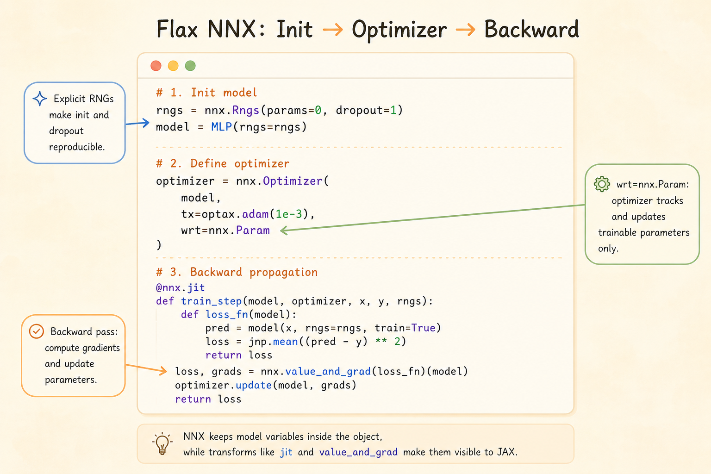

<iframe width="100%" height="420" src="https://www.youtube.com/embed/Autf6AUoQMY?list=PLOU2XLYxmsIJBcjiFi8LdyY5YGR8sz0ZZ&index=3" title="Introducing Flax NNX" frameborder="0" allowfullscreen></iframe>

<iframe width="100%" height="420" src="https://www.youtube.com/embed/QSyV5K5ovoA?list=PLOU2XLYxmsIJBcjiFi8LdyY5YGR8sz0ZZ&index=4" title="Flax NNX RNGs" frameborder="0" allowfullscreen></iframe>

<iframe width="100%" height="420" src="https://www.youtube.com/embed/XNMQAmkgCm4?list=PLOU2XLYxmsIJBcjiFi8LdyY5YGR8sz0ZZ&index=5" title="Flax NNX training" frameborder="0" allowfullscreen></iframe>



Flax NNX is the neural-network layer in the JAX stack. It keeps the JAX ideas of explicit state, explicit randomness, and composable transformations, but presents them through a more object-oriented model API.

The main mental model:

- `nnx.Module` owns variables such as parameters and batch statistics
- `nnx.Rngs` manages named random streams
- `nnx.jit` compiles JAX-compatible functions
- `nnx.value_and_grad` computes gradients through model objects
- `nnx.Optimizer` connects an Optax optimizer to NNX variables

## Why NNX Is Stateful

In raw JAX, parameters, optimizer state, batch statistics, RNG keys, and other mutable values are usually passed explicitly through functions and returned after every update. That style is powerful, but training code can become verbose.

NNX gives neural networks a stateful programming model. A layer owns its parameters, and a model can look like a normal Python object:

```python
from flax import nnx


class MLP(nnx.Module):
    def __init__(self, rngs: nnx.Rngs):
        self.linear = nnx.Linear(20, 10, rngs=rngs)

    def __call__(self, x):
        return self.linear(x)
```

The important point is that this is only stateful at the user-facing API. Under the hood, NNX still makes model variables visible to JAX transformations when a function is compiled, differentiated, or vectorized.

So NNX aims for a PyTorch-like authoring experience without giving up JAX's transformation model.

## `nnx.Rngs`

JAX randomness is explicit. NNX keeps that principle, but avoids forcing the user to split keys manually everywhere.

`nnx.Rngs` manages named random streams. Each stream has a seed key and an internal counter. Every time a new key is requested, NNX folds the counter into the seed to produce a fresh key.

The common streams are:

| Stream | Typical use |
|---|---|
| `params` | parameter initialization for layers such as `nnx.Linear`, `nnx.Conv`, and `nnx.Embed` |
| `dropout` | stochastic masks during the forward pass |

Keeping these streams separate matters because initialization randomness and training-time randomness are conceptually different.

```python
from flax import nnx
import jax.numpy as jnp


class Model(nnx.Module):
    def __init__(self, rngs: nnx.Rngs):
        self.linear = nnx.Linear(20, 10, rngs=rngs)
        self.dropout = nnx.Dropout(0.1)

    def __call__(self, x, rngs: nnx.Rngs):
        x = self.linear(x)
        x = self.dropout(x, rngs=rngs)
        return x


rngs = nnx.Rngs(params=0, dropout=1)

model = Model(rngs=rngs)  # uses rngs.params for initialization
x = jnp.ones((32, 20))
y = model(x, rngs=rngs)  # uses rngs.dropout for dropout masks
```

This makes experiments reproducible: the same streams, same seeds, and same call order produce the same random behavior.

## `nnx.jit`

`nnx.jit` is the NNX-aware version of JAX compilation. It lets a function accept NNX objects such as models, optimizers, and variables while still compiling the underlying numerical computation with JAX.

The usual JAX rule still applies: compile traceable numerical work, not arbitrary Python behavior.

Good candidates for `jit`:

- loss functions
- forward passes
- training steps
- repeated array-heavy computation

Be careful with Python control flow that depends on array values:

```python
# Not ideal for direct jit compilation:
def process_value(x, threshold):
    if x > threshold:
        return x * 2
    else:
        return x / 2
```

Inside a compiled JAX function, `x > threshold` may be a traced array value, not a Python boolean. Better options are:

- keep the routing logic outside the compiled function
- use `jax.lax.cond` or `jnp.where` for array-dependent branches
- split branch computations into smaller functions and compile the numerical parts

The practical habit is simple: let Python choose coarse program structure, and let JAX compile the dense numerical kernels.

## `nnx.Optimizer`

NNX uses Optax for optimization, but wraps it in an NNX optimizer object.

That gives three useful properties:

- **Optax algorithms:** use familiar transformations such as SGD, Adam, clipping, and schedules
- **NNX variable filtering:** `wrt=nnx.Param` says the optimizer tracks trainable parameters
- **In-place model update:** `optimizer.update(model, grads)` updates model variables through the NNX object API

```python
from flax import nnx
import jax.numpy as jnp
import optax


class Model(nnx.Module):
    def __init__(self, rngs: nnx.Rngs):
        self.linear = nnx.Linear(in_features=1, out_features=1, rngs=rngs)

    def __call__(self, x):
        return self.linear(x)


model = Model(rngs=nnx.Rngs(0))

optimizer = nnx.Optimizer(
    model,
    tx=optax.sgd(learning_rate=0.01),
    wrt=nnx.Param,
)

x = jnp.array([[1.0], [2.0], [3.0]])
y = jnp.array([[2.0], [4.0], [6.0]])


@nnx.jit
def train_step(model, optimizer, x, y):
    def loss_fn(model):
        pred = model(x)
        return jnp.mean((pred - y) ** 2)

    loss, grads = nnx.value_and_grad(loss_fn)(model)
    optimizer.update(model, grads)
    return loss


loss = train_step(model, optimizer, x, y)
print("Flax NNX loss:", loss)
```

The surface API is mutable, but the compiled execution remains compatible with JAX's functional transformation machinery.

## Common Layers

| Layer | Role |
|---|---|
| `nnx.Linear` | fully connected layer |
| `nnx.Conv` | convolutional layer |
| `nnx.BatchNorm` | batch normalization |
| `nnx.LayerNorm` | layer normalization |
| `nnx.GroupNorm` | group normalization |
| `nnx.MultiHeadAttention` | attention mechanism |
| `nnx.LSTMCell` | recurrent cell |
| `nnx.GRUCell` | recurrent cell |
| `nnx.Dropout` | stochastic regularization |

These layers feel familiar if you have used PyTorch modules, but randomness and transformation behavior remain explicit.

## NNX vs PyTorch Training

PyTorch usually exposes training through an imperative gradient tape:

```python
import torch
import torch.nn as nn
import torch.optim as optim


class TorchModel(nn.Module):
    def __init__(self):
        super().__init__()
        self.linear = nn.Linear(1, 1)

    def forward(self, x):
        return self.linear(x)


model = TorchModel()
optimizer = optim.SGD(model.parameters(), lr=0.01)
loss_fn = nn.MSELoss()

x = torch.tensor([[1.0], [2.0], [3.0]])
y = torch.tensor([[2.0], [4.0], [6.0]])

optimizer.zero_grad()
pred = model(x)
loss = loss_fn(pred, y)
loss.backward()
optimizer.step()
```

NNX makes the comparable steps explicit in JAX terms:

```python
loss, grads = nnx.value_and_grad(loss_fn)(model)
optimizer.update(model, grads)
```

The difference is not just syntax. PyTorch centers on an eager dynamic computation graph and implicit randomness. NNX centers on explicit RNG streams, explicit gradient calculation, and JAX-compatible transformations.

## Summary

- NNX makes JAX neural-network code feel object-oriented without hiding state from JAX
- `nnx.Rngs` keeps randomness explicit and reproducible
- `nnx.jit` compiles NNX-aware functions
- `nnx.value_and_grad` differentiates through model objects
- `nnx.Optimizer` applies Optax updates to selected NNX variables
- the result is a more ergonomic model-building interface on top of JAX's transformation-first design

## References

- [Flax NNX randomness guide](https://flax.readthedocs.io/en/stable/guides/randomness.html)
- [Flax NNX optimizer API](https://flax.readthedocs.io/en/latest/api_reference/flax.nnx/training/optimizer.html)
- [NNX 0.10 to 0.11 optimizer migration notes](https://flax.readthedocs.io/en/stable/migrating/nnx_010_to_nnx_011.html)
