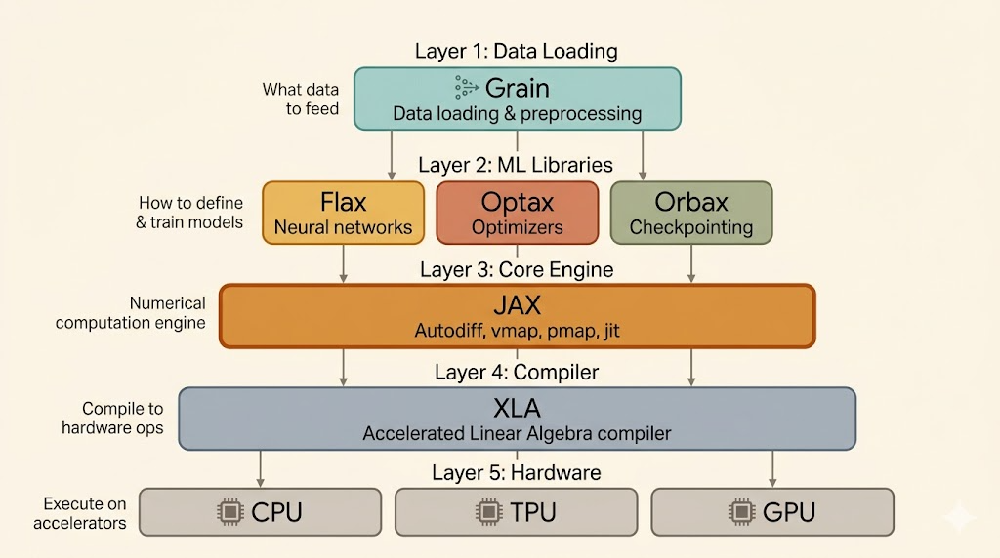

<iframe width="100%" height="500" src="https://www.youtube.com/embed/1X4GW2mtSXA?list=PLOU2XLYxmsIJBcjiFi8LdyY5YGR8sz0ZZ&index=2" title="JAX AI Stack" frameborder="0" allowfullscreen></iframe>



This note is about the ecosystem around JAX rather than JAX alone. The useful idea is that modern JAX training is not one library but a stack: JAX provides the functional core and transformations, while surrounding libraries handle models, optimization, checkpointing, and data pipelines.

## The Stack

The lecture presents the JAX AI stack roughly as:

- `Grain`: data loading
- `Flax NNX`: neural-network structure
- `Optax`: optimizers and gradient transformations
- `Orbax`: checkpointing
- `JAX`: function transformations and NumPy-like APIs
- `XLA`: compiler backend

The point is that each layer has a different responsibility. JAX itself is not trying to be a full PyTorch-style framework. It is a transformation system built on array programming, and the other libraries fill in the training workflow around it.

## JAX as the Engine

The core value of JAX is that it lets you write numerical code in a NumPy-like style and then transform that code systematically.

### `jax.jit`

`jax.jit()` uses XLA to compile a JAX-compatible function into optimized machine code for the target hardware:

- CPU
- GPU
- TPU

This is one of the main reasons JAX feels different from eager-first frameworks: compilation is part of the normal programming model.

### `jax.grad`

`jax.grad()` is a transformation that takes a scalar-valued numerical function, such as a loss, and returns a new function that computes its gradient.

So instead of treating autodiff as hidden framework magic, JAX exposes differentiation as an explicit function transformation.

### `jax.vmap`

`jax.vmap()` vectorizes a function across a batch dimension automatically. Instead of writing manual loops, you describe a single-example computation and let JAX lift it to batched execution.

Together, `jit`, `grad`, and `vmap` define much of the JAX mental model:

- write pure numerical functions
- transform them for differentiation, vectorization, and compilation

## XLA

XLA is the compiler layer underneath JAX. It takes the transformed computation graph and generates optimized kernels for the target accelerator.

In practice, this means the performance story of JAX is tightly coupled to compilation. JAX expresses the program; XLA makes it efficient.

## Flax NNX

Flax NNX provides structure for building neural networks on top of JAX’s functional core.

Why it matters:

- it gives a more Pythonic, module-like experience similar in spirit to `torch.nn.Module`
- it manages model state in a way that stays compatible with JAX transformations like `jit` and `grad`

So Flax NNX tries to make model authoring ergonomic without giving up the transformation-based design that makes JAX powerful.

## Optax

Optax is the optimization library in the stack, analogous to `torch.optim`, but more compositional.

Its main idea is that optimizers can be built from smaller gradient transformations, such as:

- momentum-style accumulation
- Adam-style adaptive scaling
- gradient clipping
- learning-rate scaling

This makes Optax feel more functional and modular than monolithic optimizer classes.

Another important point is that optimizer state is handled explicitly:

- `init()` creates optimizer state
- `update()` takes gradients and current state
- it returns parameter updates and the new optimizer state

So the optimizer is stateful, but the API remains functional.

## Example: Flax NNX + Optax

```python
import jax
import jax.numpy as jnp
from flax import nnx
import optax


class SimpleModelNNX(nnx.Module):
    def __init__(self, rngs: nnx.Rngs):
        self.linear = nnx.Linear(in_features=1, out_features=1, rngs=rngs)

    def __call__(self, x):
        return self.linear(x)


model = SimpleModelNNX(rngs=nnx.Rngs(0))

optimizer = nnx.Optimizer(
    model,
    tx=optax.sgd(learning_rate=0.01),
    wrt=nnx.Param,
)

x = jnp.array([[2.0]])
y = jnp.array([[4.0]])


@nnx.jit
def train_step(model, optimizer, x, y):
    def loss_fn(model):
        preds = model(x)
        return jnp.mean((preds - y) ** 2)

    loss, grads = nnx.value_and_grad(loss_fn)(model)
    optimizer.update(grads)
    return loss
```

What this example shows is the division of labor:

- Flax NNX defines the model
- JAX handles compilation and differentiation
- Optax provides the optimization algorithm

## Orbax

Orbax handles saving and loading training state:

- model parameters
- optimizer state
- other checkpointed metadata

It is designed for the JAX ecosystem specifically, with emphasis on:

- distributed-aware checkpointing
- fault tolerance
- asynchronous save and restore behavior

So Orbax is the “training-state persistence” layer of the stack.

## Grain

Grain is the data-loading library for efficient JAX training.

Its purpose is straightforward: keep accelerators fed with data instead of letting training stall on input bottlenecks.

Main ideas:

- efficient reading and preprocessing
- parallel data processing
- distributed sharding support

This is the data-pipeline counterpart to the compute stack above.

## Flexible Parallelism

The lecture also highlights a JAX-specific view of parallelism.

Instead of choosing from a few fixed parallel wrappers, you describe how data and parameters should be sharded, and JAX compiles a fresh parallel program based on those annotations.

That is a more flexible model than “single GPU vs data parallel vs model parallel” as a small menu of hard-coded modes. The compiler participates more directly in producing the parallel execution strategy.

## Two Useful Links

Official learning notebook:

[Learning JAX notebook](https://colab.research.google.com/github/rcrowe-google/Learning-JAX/blob/main/code-exercises/01%20-%20JAX%20AI%20Stack.ipynb)

Personal Colab:

[My Colab](https://colab.research.google.com/drive/1IFSnaBkz-yy51CEJDrh4S56zFtHcDqd7#scrollTo=c554c05f)

## Summary

- JAX is the functional and transformation-based core of the stack
- XLA is the compiler that turns transformed programs into efficient accelerator code
- Flax NNX provides model structure on top of JAX
- Optax provides composable optimizers and explicit optimizer state handling
- Orbax handles robust checkpointing
- Grain handles high-performance data loading
- the big picture is a modular training stack rather than one monolithic framework
