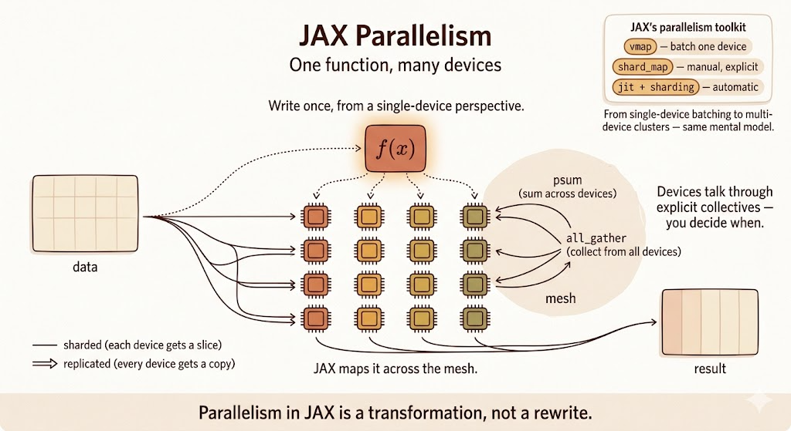

<iframe width="100%" height="500" src="https://www.youtube.com/embed/kue4fzBQkVI?list=PLOU2XLYxmsIJBcjiFi8LdyY5YGR8sz0ZZ&index=6" title="JAX NumPy" frameborder="0" allowfullscreen></iframe>

<iframe width="100%" height="500" src="https://www.youtube.com/embed/srxiQeuopVY?list=PLOU2XLYxmsIJBcjiFi8LdyY5YGR8sz0ZZ&index=7" title="JAX Parallelism" frameborder="0" allowfullscreen></iframe>



JAX NumPy looks like NumPy, but the programming model is different. The syntax is familiar, while the execution model is designed for transformation, compilation, automatic differentiation, vectorization, and accelerator parallelism.

The useful mental model:

- NumPy is an eager array library.
- JAX NumPy is a NumPy-like frontend for compiled, transformable numerical programs.

That difference explains most of the surprises.

## Eager vs Compiled

NumPy and PyTorch usually execute operations eagerly: each operation runs as Python reaches it.

JAX can also run eagerly, but its power comes from `jax.jit`, which traces a function and compiles it through XLA.

The JIT workflow is:

1. **Tracing:** JAX traces the function for a given input shape and dtype.
2. **Optimization:** XLA optimizes the traced computation.
3. **Execution:** later calls with compatible shapes and dtypes reuse the compiled program.

```python
import jax
import jax.numpy as jnp
import numpy as np


def np_function(x):
    return np.sin(np.cos(x)) * np.tanh(x)


def jnp_function(x):
    return jnp.sin(jnp.cos(x)) * jnp.tanh(x)


jit_function = jax.jit(jnp_function)

x_np = np.ones((1000, 1000))
x_jnp = jnp.ones((1000, 1000))

%timeit np_function(x_np)
%timeit jit_function(x_jnp).block_until_ready()
```

The first JIT call pays compilation cost. The later calls are where compiled execution can be much faster, especially on accelerators.

## Mutable vs Immutable Arrays

NumPy arrays are mutable:

```python
import numpy as np

x = np.array([1, 2, 3])
x[0] = 10
```

JAX arrays are immutable. You do not modify an array in place. Instead, you create a new array with the requested update:

```python
import jax.numpy as jnp

x = jnp.array([1, 2, 3])
y = x.at[0].set(10)
```

This is part of JAX's functional style. It makes transformations such as `jit`, `grad`, and `vmap` easier to reason about.

## Views, Copies, and Compiler Optimization

NumPy operations such as slicing, transposing, or reshaping often return views. A view can share memory with the original array, so changing one can affect the other.

JAX arrays behave more functionally. Operations conceptually produce new values rather than mutable views.

That does not necessarily mean JAX always performs wasteful copies. Under `jit`, XLA can optimize away intermediate arrays and fuse operations when it is safe to do so.

The important difference is semantic:

- NumPy exposes memory-sharing behavior to the user.
- JAX presents immutable values and lets the compiler optimize the implementation.

## Random Number Generation

NumPy uses implicit global random state:

```python
import numpy as np

np.random.seed(0)
print(np.random.normal())
print(np.random.normal())
```

Each call advances hidden global state.

JAX uses explicit random keys:

```python
from jax import random

key = random.PRNGKey(0)

print(random.normal(key))
print(random.normal(key))
```

Both calls return the same value because the same key is reused. To get new random values, split the key:

```python
key = random.PRNGKey(0)
key1, key2 = random.split(key)

print(random.normal(key1))
print(random.normal(key2))
```

Explicit randomness is more verbose, but it is reproducible and parallelism-friendly. There is no hidden global state that silently changes across devices or transformations.

## Automatic Vectorization with `vmap`

NumPy relies heavily on broadcasting and manual vectorization. JAX adds `jax.vmap`, which transforms a function written for one example into a batched function.

```python
import jax.numpy as jnp
from jax import vmap


def predict(W, b, x):
    return jnp.dot(W, x) + b


W = jnp.ones((3, 4))
b = jnp.ones(3)
batch_x = jnp.ones((10, 4))

batch_predict = vmap(
    predict,
    in_axes=(None, None, 0),
)

batch_result = batch_predict(W, b, batch_x)
```

Here:

- `W` is not mapped over
- `b` is not mapped over
- `x` is mapped over its first axis

The result has shape `(10, 3)`: one prediction for each input in the batch.

This is one of JAX's central ideas: write the single-example function first, then transform it.

## Pytrees

A pytree is a nested Python container whose leaves are values.

Common pytree containers include:

- dictionaries
- lists
- tuples
- dataclasses registered as pytrees

Pytrees are important because model parameters, optimizer state, gradients, and metrics are rarely single arrays. They are nested structures.

```python
import jax
import jax.numpy as jnp

params = {
    "layer1": {
        "w": jnp.array([1, 1]),
        "b": 2,
    },
    "layer2": {
        "w": 3,
        "b": 4,
    },
}

new_params = jax.tree.map(lambda x: x * 2, params)
```

This applies the function to every leaf while preserving the structure:

```python
{
    "layer1": {"w": jnp.array([2, 2]), "b": 4},
    "layer2": {"w": 6, "b": 8},
}
```

This is why JAX training code can update whole parameter trees with compact transformations.

## Explicit Parallelism with `shard_map`

`vmap` maps a function over a batch axis. `shard_map` maps a function over shards of data across a mesh of devices.

The key idea is that you write the computation from the perspective of one shard, while JAX runs it across devices according to the sharding specification.

`shard_map` is useful when you want explicit control:

- how inputs are partitioned
- how outputs are assembled
- where collective communication happens

For example, a matrix multiplication can be split across a 2D mesh:

```python
from functools import partial

import jax
import jax.numpy as jnp
from jax.sharding import PartitionSpec as P


mesh = jax.make_mesh((4, 2), ("x", "y"))

a = jnp.arange(8 * 16.0).reshape(8, 16)
b = jnp.arange(16 * 4.0).reshape(16, 4)


@partial(
    jax.shard_map,
    mesh=mesh,
    in_specs=(P("x", "y"), P("y", None)),
    out_specs=P("x", None),
)
def matmul_basic(a_block, b_block):
    c_partial = jnp.dot(a_block, b_block)
    c_block = jax.lax.psum(c_partial, "y")
    return c_block


c = matmul_basic(a, b)
```

Inside `matmul_basic`, the code describes local work on one block. The `psum` is the explicit collective that sums partial results across the `"y"` mesh axis.

This is different from automatic compiler partitioning. With `shard_map`, communication is part of the program you write.

## Comparison

| Feature | NumPy | JAX NumPy | Why it matters |
|---|---|---|---|
| Execution | eager | eager or JIT compiled | XLA can optimize whole functions |
| Mutability | mutable arrays | immutable arrays | functional transformations are easier |
| Updates | `x[i] = y` | `x.at[i].set(y)` | updates return new values |
| Views/copies | views are common | value semantics | compiler handles optimization |
| Randomness | global state | explicit keys | reproducibility and parallelism |
| Autodiff | external tools | `jax.grad` | built into the transformation system |
| Batching | manual vectorization | `jax.vmap` | lift single-example code to batches |
| Hardware | mostly CPU | CPU, GPU, TPU | accelerator-first array programming |
| Multi-device control | outside NumPy | `shard_map` and sharding APIs | explicit parallel programs |

## Colab

[Personal Colab](https://colab.research.google.com/drive/1b1ZVo7Dpie9Gss244szVdDfuCzk26cRd#scrollTo=68dd5d3f)

## Summary

- JAX NumPy mirrors much of the NumPy API, but the execution model is different.
- `jax.jit` traces and compiles numerical functions through XLA.
- JAX arrays are immutable; updates return new arrays.
- Randomness is explicit through PRNG keys.
- `vmap` turns single-example code into batched code.
- Pytrees let JAX transform nested parameter and state structures.
- `shard_map` gives explicit control over multi-device sharded computation.

## References

- [JAX NumPy API](https://docs.jax.dev/en/latest/jax.numpy.html)
- [JAX random numbers](https://docs.jax.dev/en/latest/random-numbers.html)
- [JAX pytrees](https://docs.jax.dev/en/latest/pytrees.html)
- [Manual parallelism with shard_map](https://docs.jax.dev/en/latest/notebooks/shard_map.html)
