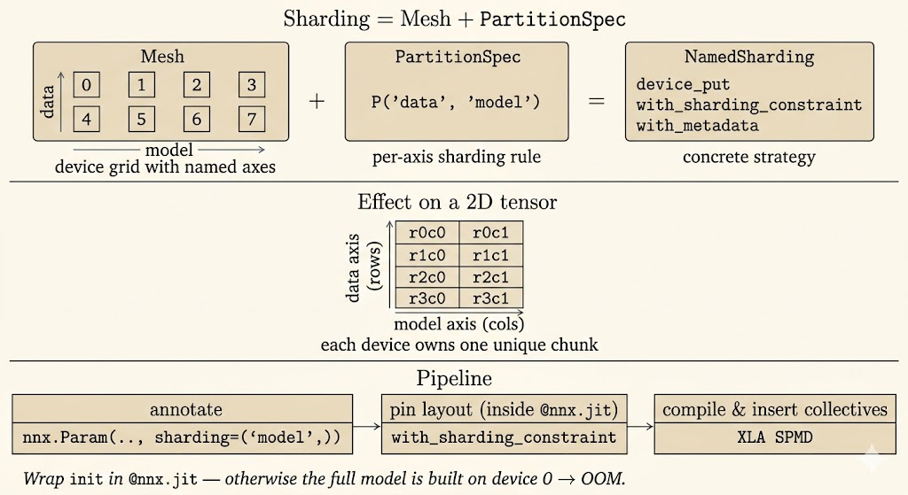

<iframe width="100%" height="420" src="https://www.youtube.com/embed/tBco9ScFG_k?list=PLOU2XLYxmsIJBcjiFi8LdyY5YGR8sz0ZZ&index=14" title="Scaling Up with JAX" frameborder="0" allowfullscreen></iframe>

<iframe width="100%" height="420" src="https://www.youtube.com/embed/msUpldpUn2k?list=PLOU2XLYxmsIJBcjiFi8LdyY5YGR8sz0ZZ&index=15" title="JAX Distributed Training" frameborder="0" allowfullscreen></iframe>

<iframe width="100%" height="420" src="https://www.youtube.com/embed/KM3HYK7cBtE?list=PLOU2XLYxmsIJBcjiFi8LdyY5YGR8sz0ZZ&index=16" title="JAX Sharding and Parallelism" frameborder="0" allowfullscreen></iframe>

Scaling up training is mostly about deciding what is replicated, what is sharded, and when devices must communicate. JAX makes that decision explicit through meshes, partition specs, and sharding annotations, while XLA turns those annotations into an SPMD program.

## Distributed Data Parallelism

Distributed data parallelism, or DDP, is the simplest scaling pattern:

- every device holds a full copy of the model
- each device receives a different shard of the batch
- gradients are computed locally
- gradients are synchronized so every replica applies the same update

```{mermaid}
graph TD
    subgraph Cluster ["Distributed Data Parallelism"]
        direction TB
        D0["Device 0<br/>Model replica"]
        D1["Device 1<br/>Model replica"]
        D2["Device 2<br/>Model replica"]
        D3["Device 3<br/>Model replica"]
        D0 ~~~ D1
        D1 ~~~ D2
        D2 ~~~ D3
    end

    style D0 fill:#d1e3fa,stroke:#333,stroke-width:1px
    style D1 fill:#d1e3fa,stroke:#333,stroke-width:1px
    style D2 fill:#d1e3fa,stroke:#333,stroke-width:1px
    style D3 fill:#d1e3fa,stroke:#333,stroke-width:1px
    style Cluster fill:#fff,stroke:#333,stroke-dasharray: 5 5
```

DDP increases throughput when the model fits on each device. Its limit is memory: parameters, gradients, and optimizer state are replicated everywhere.

## Fully Sharded Data Parallelism

Fully sharded data parallelism, or FSDP, shards model states instead of fully replicating them:

- parameters are sharded
- gradients are sharded
- optimizer state is sharded
- full tensors are gathered only when an operation needs them

```{mermaid}
graph TD
    subgraph FSDP_Box ["Fully Sharded Data Parallelism"]
        direction TB
        F0["Device 0<br/>Model shard 0<br/>Data shard 0"]
        F1["Device 1<br/>Model shard 1<br/>Data shard 1"]
        F2["Device 2<br/>Model shard 2<br/>Data shard 2"]
        F3["Device 3<br/>Model shard 3<br/>Data shard 3"]
        F0 ~~~ F1
        F1 ~~~ F2
        F2 ~~~ F3
    end

    style FSDP_Box fill:#f9f9f9,stroke:#333,stroke-dasharray: 5 5
    style F0 fill:#ffe5b4,stroke:#333
    style F1 fill:#ffe5b4,stroke:#333
    style F2 fill:#ffe5b4,stroke:#333
    style F3 fill:#ffe5b4,stroke:#333
```

The tradeoff is memory for communication. FSDP can train larger models because no single device stores all training state permanently, but the system must gather and scatter tensors at layer boundaries.

## Tensor Parallelism

Tensor parallelism splits the computation inside large layers:

- a matrix or activation tensor is partitioned across devices
- devices compute different pieces of the same layer
- communication combines partial results
- very large layers can run even when they do not fit on one device

```{mermaid}
graph TD
    subgraph TP_Box ["Tensor Parallelism"]
        direction TB
        T0["Device 0<br/>Layer shard 0"]
        T1["Device 1<br/>Layer shard 1"]
        T2["Device 2<br/>Layer shard 2"]
        T3["Device 3<br/>Layer shard 3"]
        T0 ~~~ T1
        T1 ~~~ T2
        T2 ~~~ T3
    end

    style TP_Box fill:#f9f9f9,stroke:#333,stroke-dasharray: 5 5
    style T0 fill:#c8e6c9,stroke:#333
    style T1 fill:#c8e6c9,stroke:#333
    style T2 fill:#c8e6c9,stroke:#333
    style T3 fill:#c8e6c9,stroke:#333
```

In practice, large training systems often combine data parallelism and tensor parallelism. Data parallelism scales across batches; tensor parallelism scales within the model.

## JAX Sharding Primitives

JAX describes distributed layouts through a small set of concepts.

### Mesh

`jax.sharding.Mesh` maps physical devices into a named logical grid. For example, eight devices can be arranged as four-way data parallelism and two-way model parallelism:

```python
import jax
from jax.experimental import mesh_utils
from jax.sharding import Mesh

devices = mesh_utils.create_device_mesh((4, 2))
mesh = Mesh(devices, axis_names=("data", "model"))
```

The axis names matter because later sharding annotations refer to names such as `"data"` and `"model"` rather than device IDs.

### PartitionSpec

`PartitionSpec`, often imported as `P`, describes how array dimensions map to mesh axes:

```python
from jax.sharding import PartitionSpec as P

# Shard dimension 0 over the data axis and dimension 1 over the model axis.
spec1 = P("data", "model")

# Shard the batch dimension over data parallel devices and replicate features.
spec2 = P("data", None)

# Replicate the first dimension and shard the second over the model axis.
spec3 = P(None, "model")
```

`None` means that dimension is replicated rather than split over a mesh axis. `P()` means the full value is replicated.

### NamedSharding and `device_put`

`NamedSharding` combines a mesh and a partition spec into a concrete placement strategy. `jax.device_put` moves data onto devices with that layout:

```python
import numpy as np
import jax
from jax.sharding import NamedSharding, PartitionSpec as P

data_sharding = NamedSharding(mesh, P("data", None))

numpy_batch = np.arange(32 * 128).reshape((32, 128))
sharded_batch = jax.device_put(numpy_batch, data_sharding)
```

This is the entry point for sharding input batches before they enter a compiled training step.

### `jit` and Sharding Constraints

When sharded arrays enter `jax.jit` or `nnx.jit`, JAX compiles an SPMD program. Operations are partitioned according to input sharding, and XLA inserts communication when an operation needs data from another device.

Inside a compiled function, `jax.lax.with_sharding_constraint` can assert or guide the desired layout of an intermediate value:

```python
import jax

@jax.jit
def step(x):
    x = jax.lax.with_sharding_constraint(x, P("data", None))
    return x * 2
```

This is useful when the compiler has multiple legal layouts and the model author wants to make the intended layout explicit.

## Annotating Sharding in Flax NNX

In Flax NNX, sharding metadata can be attached when parameters are initialized:

```python
from flax import nnx

init_fn = nnx.initializers.lecun_normal()

self.kernel = nnx.Param(
    nnx.with_metadata(init_fn, sharding=(None, "model"))(rng_key, shape)
)
```

The metadata says how the parameter should be partitioned once the model state is constrained inside a mesh context.

## Sharded Initialization

For very large models, initialization itself can cause an out-of-memory error if parameters are first materialized on a single device. The safer pattern is to initialize inside a compiled function and immediately constrain the state:

```python
from flax import nnx
import jax

@nnx.jit
def create_sharded_model(*model_args):
    model = MyNNXModule(*model_args)
    state = nnx.state(model)
    pspecs = nnx.spmd.get_partition_spec(state)
    sharded_state = jax.lax.with_sharding_constraint(state, pspecs)
    nnx.update(model, sharded_state)
    return model

with mesh:
    sharded_model = create_sharded_model(...)
```

The important sequence is:

- define sharding metadata on parameters
- extract the NNX state pytree
- derive a matching partition-spec pytree
- apply sharding constraints inside `nnx.jit`
- update the module with the sharded state

This keeps initialization compatible with distributed layouts from the beginning.

## Logical Axis Names

One useful refinement is to annotate the model with semantic names such as `"batch"`, `"embed"`, or `"hidden"` and map them later to physical mesh axes such as `"data"` or `"model"`.

```python
sharding_rules = (
    ("batch", "data"),
    ("hidden", "model"),
    ("embed", None),
)

class LogicalDotReluDot(nnx.Module):
    def __init__(self, depth: int, rngs: nnx.Rngs):
        init_fn = nnx.initializers.lecun_normal()
        self.dot1 = nnx.Linear(
            depth,
            depth,
            kernel_init=nnx.with_metadata(
                init_fn,
                sharding=("embed", "hidden"),
                sharding_rules=sharding_rules,
            ),
            use_bias=False,
            rngs=rngs,
        )
```

This decouples the model definition from a specific hardware layout. The same model code can be remapped to different meshes.

## Distributed Training Loop

A distributed training loop usually follows this shape:

1. create a mesh
2. initialize the model with sharding metadata
3. shard each input batch with `jax.device_put`
4. compile the training step with `nnx.jit`
5. let autodiff and the compiler handle sharded gradients and communication
6. update parameters and optimizer state in their distributed layout

```python
import jax
import jax.numpy as jnp
from flax import nnx
from jax.sharding import NamedSharding, PartitionSpec as P
import optax

input_sharding = NamedSharding(mesh, P("data", None))
label_sharding = NamedSharding(mesh, P("data"))

numpy_batch, numpy_labels = get_next_batch()
sharded_batch = jax.device_put(numpy_batch, input_sharding)
sharded_labels = jax.device_put(numpy_labels, label_sharding)

@nnx.jit
def train_step(model, optimizer, batch, labels):
    def loss_fn(model):
        logits = model(batch)
        return jnp.mean(
            optax.softmax_cross_entropy_with_integer_labels(logits, labels)
        )

    loss, grads = nnx.value_and_grad(loss_fn)(model)
    optimizer.update(grads)
    return loss

with mesh:
    loss = train_step(model, optimizer, sharded_batch, sharded_labels)
```

The practical point is that the training step still looks like ordinary JAX/NNX code. The distributed behavior comes from sharded values, mesh context, and partition metadata.

## Data Loading with Grain

Distributed training only helps if accelerators stay fed with data. Grain is the JAX ecosystem's data-loading library for high-throughput and deterministic input pipelines.

For multi-process training, Grain can shard a dataset by JAX process:

- `jax.process_index()` identifies the current host process
- `jax.process_count()` identifies the total number of processes
- `grain.sharding.ShardByJaxProcess` assigns each host its own data slice

This keeps host-level input pipelines aligned with JAX's distributed execution model.

## Choosing an Eight-Core Mesh

The same eight devices can be arranged in different ways:

```python
from jax.experimental import mesh_utils
from jax.sharding import Mesh

# More batch parallelism, less model parallelism.
mesh = Mesh(mesh_utils.create_device_mesh((4, 2)), ("batch", "model"))

# More model parallelism for larger layers.
mesh = Mesh(mesh_utils.create_device_mesh((2, 4)), ("batch", "model"))

# Pure model parallelism.
mesh = Mesh(mesh_utils.create_device_mesh((1, 8)), ("batch", "model"))

# Pure data parallelism.
mesh = Mesh(mesh_utils.create_device_mesh((8, 1)), ("batch", "model"))
```



There is no universally best mesh. Large batches favor the batch axis; large layers favor the model axis. The right split depends on model size, activation memory, batch size, and communication cost.

## Best Practices

- initialize large models inside `nnx.jit` with sharding constraints
- annotate every relevant parameter with sharding metadata
- prefer logical axis names when the model should be portable across hardware layouts
- use `jax.debug.visualize_array_sharding` to inspect the actual layout
- profile communication rather than assuming more devices always improve throughput
- keep optimizer state sharded consistently with model parameters

## Summary

Scaling is a layout problem. DDP replicates the model and shards data. FSDP shards training state to reduce memory. Tensor parallelism shards large layer computations. JAX exposes these choices through meshes, partition specs, sharding objects, and constraints, then relies on XLA to compile the distributed program.
