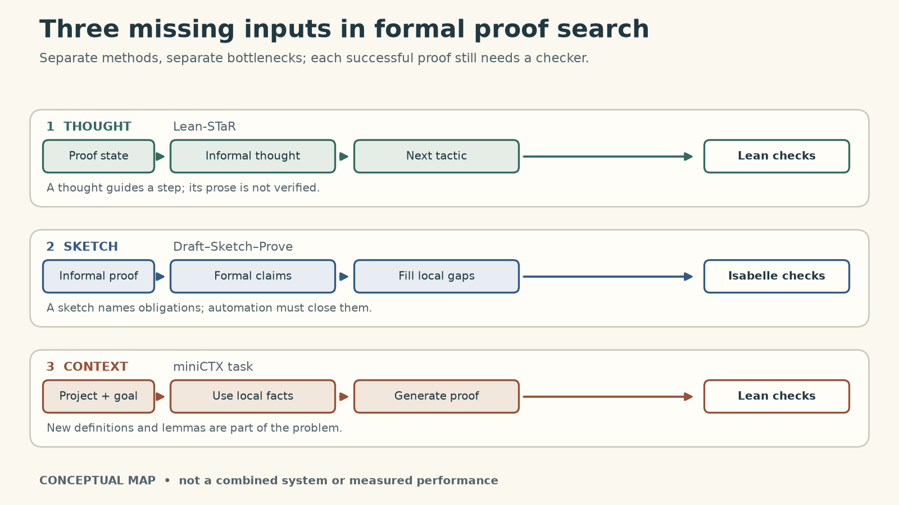
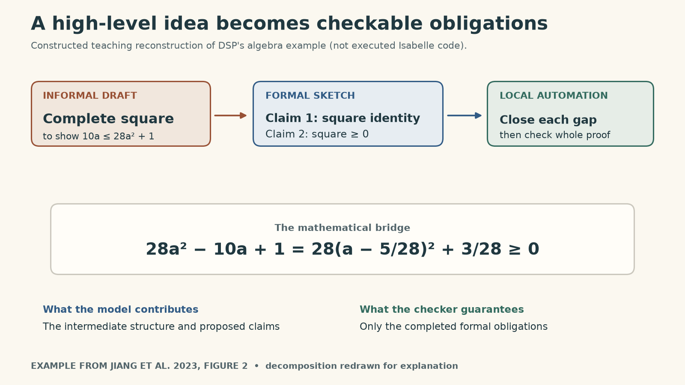
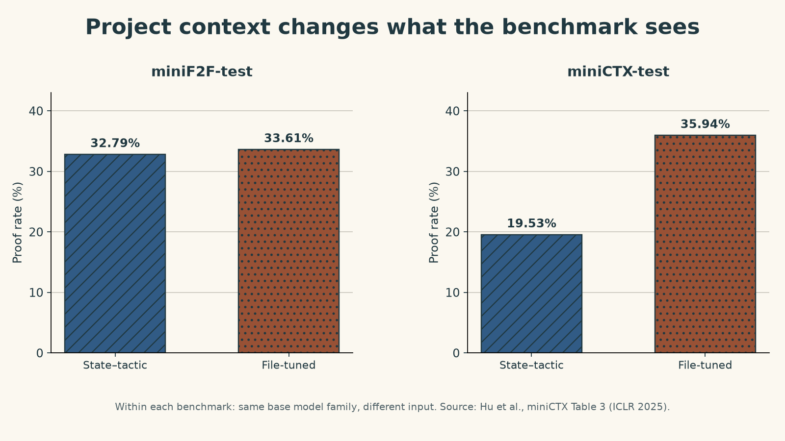

In [Lecture 9](https://ickma2311.github.io/ML/LLM-Agents/language-models-autoformalization-theorem-proving.html), the first reliability question was whether a formal statement actually matched the human problem. Sean Welleck's next lecture assumes we have a formal goal and asks a different question: **what does a prover need, besides a checker, to find a proof in a real mathematical project?**

A checker can reject an invalid proof. It does not supply the high-level idea, choose a useful intermediate claim, or tell a model about a definition introduced yesterday in another file. The lecture connects three ways of supplying that missing information: thoughts before individual tactics, sketches that divide a proof into obligations, and context from the surrounding Lean project. These are complementary interventions, not one combined system.

{fig-alt="Three parallel routes into formal proof search. Lean-STaR supplies informal thoughts before tactics, Draft–Sketch–Prove supplies intermediate formal claims, and miniCTX tests use of project definitions and lemmas. All successful formal proofs are checked." #fig-three-inputs}

*Figure 1. A conceptual map of the lecture, not an architecture that merges the three papers. A natural-language thought can guide search without itself being a checked proof.*

## A thought can guide a tactic without being verified

A conventional neural prover learns from pairs of a formal proof state $s_i$ and the next tactic $a_i$. Lean runs the tactic, producing the next state or an error. [Lean-STaR](https://arxiv.org/abs/2407.10040) inserts an informal thought $t_i$ before the tactic, modeling a step as

$$
p_\theta(t_i,a_i\mid s_i)
=p_\theta(t_i\mid s_i)\,p_\theta(a_i\mid s_i,t_i).
$$

The extra text is meant to help the model plan and vary its next step. Training data do not already contain human thoughts for every tactic. The authors therefore show a stronger model both the proof state *and a known successful next tactic*, then ask it to write a retrospective rationale. They fine-tune a thought-plus-tactic model on those triples. During further expert iteration, the model samples complete proof trajectories; only trajectories that Lean accepts are retained for more training. At inference time, the model must generate the thought before seeing the tactic it will choose. [Slides 16–34; Lean-STaR §§3.2–3.3.](https://rdi.berkeley.edu/adv-llm-agents/slides/welleck2025_berkeley_bridging.pdf)

The distinction between *useful* and *true* thoughts matters. Lean verifies the formal proof, not the English rationale. The [paper's Figure 2](https://arxiv.org/pdf/2407.10040) even points out a calculation error in a generated thought while a Lean tactic performs the calculation correctly. A checked final proof is strong evidence about the formal theorem; it is not a certificate that every preceding sentence faithfully describes the reasoning.

## A sketch moves the hard choice to the right level

[Draft, Sketch, and Prove (DSP)](https://arxiv.org/abs/2210.12283) tackles a different bottleneck. The method begins with an informal theorem and a corresponding **already supplied formal statement**. A human or model drafts an informal proof; a model maps its main steps into a formal proof sketch; an automated prover fills the open low-level obligations. The published experiments use **Isabelle and Sledgehammer**, not Lean. [Slides 36–47; DSP §§3–4.](https://rdi.berkeley.edu/adv-llm-agents/slides/welleck2025_berkeley_bridging.pdf)

The paper's algebra example makes the division of labor concrete. To show $10a\leq 28a^2+1$ for every real $a$, the useful high-level move is completing the square:

$$
28a^2-10a+1
=28\left(a-\frac{5}{28}\right)^2+\frac{3}{28}\geq 0.
$$

My compact derivation above follows the [paper's Figure 2](https://arxiv.org/pdf/2210.12283); it is not a verbatim Isabelle proof. A sketch can name intermediate claims such as the square expansion and non-negativity. The local prover then checks or fills each open step. If it cannot close an obligation within its budget, the attempted proof has failed; the original theorem has not been disproved.

{fig-alt="Constructed DSP-style example. The target inequality is reduced by completing the square; a formal sketch records an equality and non-negativity as intermediate claims; local automation must close both gaps before the theorem is checked." #fig-sketch}

*Figure 2. Teaching reconstruction of DSP's division of labor, using the inequality from its paper. It is not an executed Isabelle trace.*

On miniF2F-test under the paper's Isabelle setup, Sledgehammer plus simple heuristics solved 20.9% of problems; DSP reached 39.3% with human informal proofs and 38.9% with one of its language-model proof sources. Those are results for the paper's problem set, search budget, and prover—not a general theorem that sketches nearly double success. [DSP Table 1.](https://arxiv.org/pdf/2210.12283)

## Local automation needs the right premises

Sketches help only if the prover can discharge their gaps. Isabelle has Sledgehammer; Welleck's lecture then asks what a comparable experience would require in Lean. A *hammer* must narrow a large library to relevant premises, translate the goal for an external automated prover, and reconstruct the result as something Lean can check. Otherwise the external system's answer would not be the same as a Lean-accepted proof.

The lecture presents [LeanHammer](https://cmu-l3.github.io/lean-hammer/) as that workflow: a neural premise selector supplies candidate lemmas, Aesop searches over tactics and subgoals, Lean-auto translates eligible goals for the external prover Zipperposition, and Duper attempts proof reconstruction. Premise selection is not cosmetic: withholding a needed lemma can make a small obligation unreachable within budget. The slides describe this work as under review in April 2025; a [subsequent paper version](https://arxiv.org/abs/2506.07477) was published at ICLR 2026. I use the later paper only to clarify the implemented pipeline, not to attribute its later results to the 2025 lecture. [Slides 48–58.](https://rdi.berkeley.edu/adv-llm-agents/slides/welleck2025_berkeley_bridging.pdf)

## The project's code is part of the problem

A competition theorem is often presented as a self-contained statement. Research formalization is not. A proof may depend on newly defined objects, local lemmas, imports, notation, comments, and earlier proofs. The current goal text alone can omit information a human collaborator would see by opening the file. This is the motivation for [miniCTX](https://arxiv.org/abs/2408.03350): evaluate a prover on a theorem $x$ *together with* project context $c$, then check whether its proposed proof is valid in that environment. [Slides 60–74; miniCTX §§2–4.](https://rdi.berkeley.edu/adv-llm-agents/slides/welleck2025_berkeley_bridging.pdf)

In the paper's baseline, **state-tactic tuning** trains a model on $(\text{proof state},\text{next tactic})$ pairs. **File tuning** uses the same base model family and adds preceding file contents to the input. On miniCTX-test, their reported average proof rates are 19.53% and 35.94%, respectively. On the separate miniF2F-test competition set, they are much closer: 32.79% and 33.61%. These are within-benchmark comparisons; the bar heights across the two datasets are not a universal measure of which mathematics is harder. The experiment supports the narrower point that standard competition performance can hide an inability to use fresh project context. [miniCTX Table 3.](https://arxiv.org/pdf/2408.03350)

{fig-alt="Two-panel bar chart of miniCTX paper Table 3. On miniF2F-test, state-tactic and file-tuned proof rates are 32.79% and 33.61%; on miniCTX-test, they are 19.53% and 35.94%. Values are paper-reported, not newly measured." #fig-context}

*Figure 3. Source data: Hu, Zhu, and Welleck, [miniCTX Table 3](https://arxiv.org/pdf/2408.03350). Each panel compares two input designs within one benchmark. No uncertainty interval is reported in that table.*

The benchmark also distinguishes preceding **in-file** context from relevant premises in **other files**. Adding retrieved cross-file premises is not uniformly beneficial in the reported results; the paper notes gains in some high-dependency splits and mixed outcomes elsewhere. “More context” is therefore not a recipe by itself. A useful system must supply the *right* available context in a form the prover can use.

## What I would check in a theorem-proving claim

These methods address different failure points. A thought may improve tactic generation, a sketch may turn a large proof into manageable obligations, and premise selection or file context may reveal the facts needed to close them. None removes the need for a checker; none solves Lecture 9's separate question of whether the formal statement captured the human problem.

For a claimed success, I would record four things: the exact formal theorem; the source and version of its project context; the search budget and tools used; and the checker-accepted proof artifact. I would evaluate thoughts and sketches as *search aids*, not as independently verified mathematics. That distinction is the useful bridge from a benchmark proof to a collaborator's evolving research repository.

## Lecture and sources

Sean Welleck's [Berkeley Lecture 10 recording](https://www.youtube.com/watch?v=Gy5Nm17l9oo) and [official slides](https://rdi.berkeley.edu/adv-llm-agents/slides/welleck2025_berkeley_bridging.pdf) are available alongside the original papers below.

- Lin, Sun, Welleck, and Yang, [Lean-STaR: Learning to Interleave Thinking and Proving](https://arxiv.org/abs/2407.10040), ICLR 2025.
- Jiang et al., [Draft, Sketch, and Prove](https://arxiv.org/abs/2210.12283), ICLR 2023.
- Hu, Zhu, and Welleck, [miniCTX: Neural Theorem Proving with (Long-)Contexts](https://arxiv.org/abs/2408.03350), ICLR 2025.
- Zhu et al., [Premise Selection for a Lean Hammer](https://arxiv.org/abs/2506.07477), ICLR 2026; this is a later version of work described as under review in the lecture.

<iframe src="https://www.youtube-nocookie.com/embed/Gy5Nm17l9oo" title="Berkeley Advanced Large Language Model Agents Lecture 10, Sean Welleck" allow="accelerometer; autoplay; clipboard-write; encrypted-media; gyroscope; picture-in-picture; web-share" referrerpolicy="strict-origin-when-cross-origin" allowfullscreen loading="lazy"></iframe>

