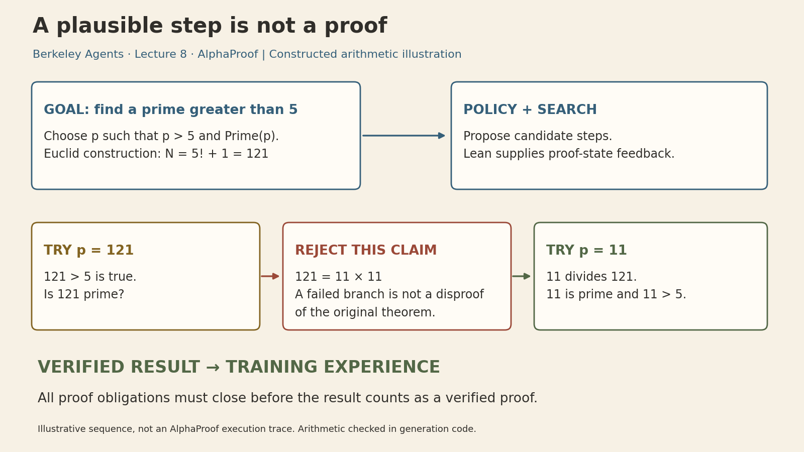
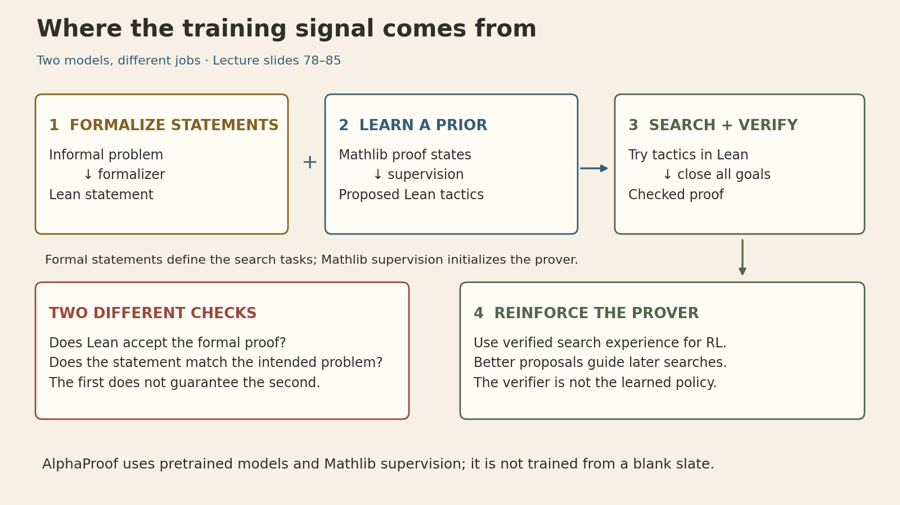
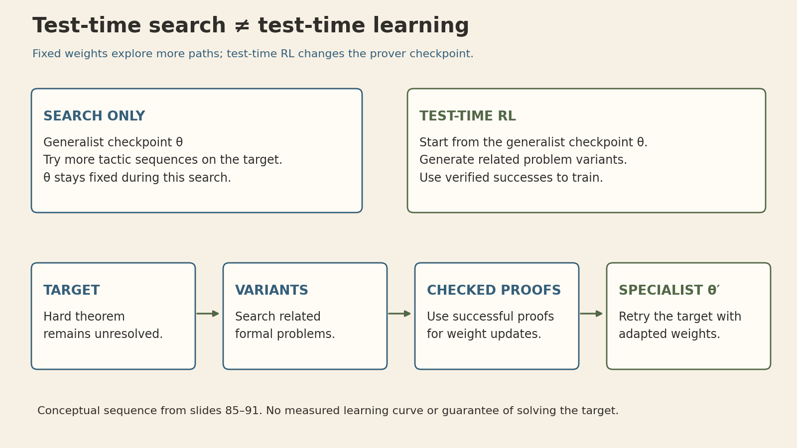

A model can propose a convincing mathematical argument and still be wrong. What changes when every proposed proof must pass a formal checker?

**The checker turns success into reliable feedback, but it does not supply the successful argument.** AlphaProof combines a language model that proposes proof steps, search that explores those steps, and Lean that checks the resulting proof. Verified successes then become training experience. Thomas Hubert's eighth lecture in **Berkeley's Advanced Large Language Model Agents** explains how these pieces fit together.

The connection to [Lecture 7](multimodal-agents-perception-to-action.qmd) is useful: a GUI agent needs evidence that an action achieved its goal. A formal mathematics agent works in an environment where the rules and the acceptance condition can be specified much more precisely. That makes trial and error unusually valuable.

## Lecture and sources



[Recording, 1:14:07](https://www.youtube.com/watch?v=3gaEMscOMAU) · [Official slides](https://rdi.berkeley.edu/adv-llm-agents/slides/alphaproof.pdf) · [Course schedule](https://rdi.berkeley.edu/adv-llm-agents/sp25)

This article follows the **March 31, 2025 lecture** and its slide deck. The 2024 DeepMind report supplies the historical IMO result; constructed examples and explanatory diagrams are labeled below. Details of live demonstrations not shown in the published slides are not reconstructed here.

## 1. Formalization changes the feedback available to an agent

The lecture begins with the evolution from prose arguments to symbolic mathematics and then computer-checked proofs. Lean is both a programming language and a proof assistant; Mathlib supplies a shared library of definitions, results, and proofs. A prover can build on this library instead of reconstructing every mathematical fact.

There are two separate objects to get right:

- **The statement:** the formal expression of the intended mathematical question, including its assumptions and domains.
- **The proof:** an object that establishes that statement under the formal system's rules.

A checked proof is stronger evidence than a model saying its answer looks correct. But the guarantee is scoped: it establishes the **formal statement**, relative to its assumptions and trusted foundations. It does not by itself show that a natural-language problem was translated faithfully. An omitted hypothesis, changed quantifier, or unintended domain can produce a formally correct answer to the wrong question.

This distinction also keeps the lecture's phrase “perfect verification” in context. It describes the opportunity provided by formal mathematics, not a claim that the entire data, translation, software, and deployment pipeline is infallible.

*Sources: slides 5–22 and 36–42; the statement-versus-intent distinction is a clarification of the verification boundary.*

## 2. A checked environment still needs search

The prover's input is a **Lean proof state**: the current goals together with available hypotheses. Its proposed actions are tactics. Applying a tactic can fail, solve a goal, or create new subgoals. A successful intermediate step is not yet a complete proof; all obligations must eventually be discharged.

The lecture's search procedure uses the model to propose tactics, evaluates the resulting Lean states, and balances promising paths against less-explored ones. The model's prior and value estimates guide where to spend compute. Lean provides the formal transition/checking machinery; it does not decide which promising idea the model should try first.

A search timeout is also not a proof of falsehood. To disprove a statement, the system needs a valid argument for its negation or a suitable certified counterexample. “No proof found within the budget” remains a different outcome.

### Worked illustration: why the prime factor matters

The lecture demonstrates the infinitude of primes. A useful general statement is that, for every natural number $n$, there is a prime $p>n$.

Let $N=n!+1$. Since $N>1$, it has a prime divisor $p$. Suppose $p\le n$. Then $p\mid n!$, while $p\mid(n!+1)$, so $p\mid1$, a contradiction. Therefore $p>n$.

The subtle point is that **$n!+1$ need not itself be prime**. At $n=5$,

$$
5!+1=121=11^2.
$$

Choosing $p=121$ fails the primality obligation. Choosing the prime factor $p=11$ works: $11\mid121$, $11$ is prime, and $11>5$. This finite calculation illustrates the construction; it is not a replacement for the quantified proof above.

```{=html}
<div class="lecture-animation">

<button type="button" aria-pressed="false">Play animation</button>
</div>
```

This animation is a **constructed teaching sequence**, not a recorded AlphaProof search or a Lean execution trace. Its arithmetic is checked in the figure-generation code. The lesson is the separation of responsibilities: proposal supplies a candidate, checking exposes an unmet obligation, and search changes course.

*Sources: slides 14–21 for the prime proof; slides 79–80 for tactic proposals and search. The numerical example is added.*

## 3. The training recipe bridges scarce proofs and abundant problems

Natural-language mathematics provides many problems, while formal data supplies machine-checkable statements and proofs. AlphaProof uses these sources in different roles.

**First, train a formalizer.** It translates informal problem statements into Lean statements, expanding the pool of formal problems. This is statement generation, not the automatic production of valid proofs. Translation quality and problem usefulness remain important.

**Second, initialize the prover from Mathlib.** Supervised learning on human proof states and tactics gives the model a useful starting prior. Although the lecture motivates the method through AlphaZero, AlphaProof does not start from a completely blank slate: pretrained language models and human formal mathematics are part of the recipe.

**Third, search and learn.** On formal problems, the prover searches over Lean steps. Checked proofs and disproofs provide grounded success signals. Reinforcement learning updates the prover using successful search experience, which can improve later proposals and search decisions.

{fig-alt="Three upper panels show formalizing statements, learning tactic priors from Mathlib, and searching with Lean. The lower panels distinguish proof validity from translation fidelity and show verified experience feeding prover training."}

The deck sketches roughly one million informal problems and a much larger pool of formal statements. These are order-of-magnitude descriptions in the lecture, not an accuracy claim for the formalizer or proof that every generated problem is useful.

The four ingredients emphasized earlier in the lecture are **scaled trial and error, grounded feedback, search, and curriculum**. A verifier supplies only one part of that combination. If the generated problems are all trivial, impossible, incorrectly translated, or beyond the agent's current capabilities, a reliable acceptance signal alone does not make training effective.

*Sources: slides 23–42 and 78–84. The deck does not specify a complete implementation or enough training hyperparameters to reproduce AlphaProof; this note does not invent them.*

## 4. Test-time RL changes the solver, not just the search budget

There are two different ways to spend more computation on a hard problem.

With **test-time search**, a fixed prover explores more candidate proof paths. Its parameters stay fixed while the search state develops.

With **test-time reinforcement learning**, the system creates related problem variants, searches for checked solutions to them, and trains the prover on that experience. The resulting specialist checkpoint is then used on the difficult target. The lecture illustrates this as a solver's region of competence extending toward the target through related problems.

```{=html}
<div class="lecture-animation">

<button type="button" aria-pressed="false">Play animation</button>
</div>
```

In schematic notation, search uses a policy $\pi_\theta$ to explore, while test-time learning produces an adapted policy $\pi_{\theta'}$. This notation expresses the distinction, not a claim about the precise AlphaProof loss or optimizer.

Related problems are useful only if their verified solutions teach something that transfers to the target. There is no guarantee that adaptation will solve it. The cost also includes generating variants, conducting many proof searches, and updating the model—not just one longer answer.

*Sources: slides 85–91. Animation is a conceptual sequence, not a measured learning curve or spatial map of mathematical ability.*

## 5. What the IMO result demonstrated—and under which conditions

The lecture's case study is the **2024** International Mathematical Olympiad. It is a historical result, not a statement about current model rankings.

| Problem | Topic | System that solved it |
|---|---|---|
| P1 | Algebra | AlphaProof |
| P2 | Number theory | AlphaProof |
| P3 | Combinatorics | Unsolved |
| P4 | Geometry | AlphaGeometry 2 |
| P5 | Combinatorics | Unsolved |
| P6 | Algebra | AlphaProof |

Each solved problem earned seven points, for a combined **28/42**, within that year's silver-medal range. AlphaProof solved three problems; the fourth came from the separate AlphaGeometry system. Calling this “AlphaProof solved four IMO problems” would conflate the two.

The evaluation conditions matter:

- Experts manually formalized the competition problems. This was not an end-to-end demonstration of automatic natural-language translation at contest time.
- Some questions required finding an answer as well as proving it. Gemini generated candidate answers; AlphaProof attempted to prove or disprove them, rather than receiving an oracle's correct answer.
- The system used substantially more compute and time than contestants. DeepMind reports up to three days for the longer solutions, compared with contestants' two 4.5-hour sessions.
- The lecture identifies gaps in Mathlib and difficulties with combinatorics, including formalization of P5. Not every failure can be attributed solely to the proof-search policy.

The result supports the usefulness of search and learning with formal feedback on very hard problems. It does not show that all of mathematics is formalized, that the system operates within human contest constraints, or that a checker removes the need for problem formulation.

*Sources: slides 43–76; [DeepMind's July 2024 report](https://deepmind.google/blog/ai-solves-imo-problems-at-silver-medal-level/). Later research is not folded into this March 2025 lecture retrospectively.*

## 6. The demonstrations connect proof search to mathematical structure

Beyond the prime theorem, the deck includes an AIME problem and a demonstration connecting primes to the zeta function. The common thread is the ability to express mathematical structure precisely enough to manipulate and check it.

For a finite set of primes $S$ and real $s>1$, expand each geometric series:

$$
\prod_{p\in S}\frac{1}{1-p^{-s}}
=\prod_{p\in S}\left(1+p^{-s}+p^{-2s}+\cdots\right)
=\sum_{\substack{n\ge1\\\text{all prime factors of }n\text{ lie in }S}}n^{-s}.
$$

Unique prime factorization explains why each eligible integer appears once. Extending over all primes, with the required convergence justification, gives Euler's product

$$
\zeta(s)=\sum_{n=1}^{\infty}n^{-s}
=\prod_{p\ \mathrm{prime}}(1-p^{-s})^{-1},\qquad s>1.
$$

The slides first motivate the pattern using the harmonic series at $s=1$, which diverges. That illustration should not be copied as an equality of finite-valued convergent expressions. The restriction above makes the elementary real-variable statement precise. The final slides gesture toward zeta zeros and the distribution of primes; they do **not** establish that AlphaProof proved the Riemann hypothesis.

*Sources: screenshot-based slides 93–107. The convergence qualification and finite-prime-set explanation are mathematical clarifications. The published slides do not show every intermediate step of the live proof sequence.*

## The broader agent lesson

AlphaProof separates **generating an idea, checking it, searching alternatives, and learning from success**. That separation makes it possible to use unreliable proposals inside a system that requires reliable final evidence.

Formal mathematics is especially favorable because the target and rules can be made explicit. Transferring the recipe to software, scientific discovery, or GUI agents requires asking which part of the goal is actually checked, whether the checker covers the intended task, and whether the training problems produce transferable experience. A trustworthy verifier is powerful; defining the right problem and finding a proof remain substantial work.

## Sources and figure provenance

- Thomas Hubert, *AlphaProof: When RL Meets Formal Maths*, [112-page lecture deck](https://rdi.berkeley.edu/adv-llm-agents/slides/alphaproof.pdf), March 2025; [Berkeley lecture recording](https://www.youtube.com/watch?v=3gaEMscOMAU).
- AlphaProof and AlphaGeometry teams, [AI achieves silver-medal standard solving International Mathematical Olympiad problems](https://deepmind.google/blog/ai-solves-imo-problems-at-silver-medal-level/), July 25, 2024.
- Original explanatory figures: [generation code](berkeley-8-assets/create_figures.py), [manifest and arithmetic checks](berkeley-8-assets/manifest.json). Two GIFs have static PNG and editable SVG companions. No measured model trajectories, fabricated learning curves, or AI-generated raster artwork are used.
- Figure workflow: Kassis, T., Agarwal, V., He, Y., Patel, D., and Brueckner, A. M. (2026), [Scientific Agent Skills: A Library of Procedural Knowledge for Research Agents](https://doi.org/10.48550/arXiv.2609.00065).

```{=html}
<style>
.lecture-animation { margin:1.6rem 0; }
.lecture-animation img { width:100%; height:auto; display:block; }
.lecture-animation button { margin-top:.5rem; padding:.5rem .9rem; border:1px solid #526746; border-radius:4px; background:#F7F1E5; color:#302E2A; }
</style>
<script>
document.querySelectorAll('.lecture-animation').forEach(box => {
 const img=box.querySelector('img'), btn=box.querySelector('button');
 const stop=()=>{img.src=img.dataset.poster;btn.setAttribute('aria-pressed','false');btn.textContent='Play animation';};
 btn.addEventListener('click',()=>{if(btn.getAttribute('aria-pressed')==='true'){stop();}else{img.src=img.dataset.gif;btn.setAttribute('aria-pressed','true');btn.textContent='Stop animation';}});
 window.matchMedia('(prefers-reduced-motion: reduce)').addEventListener('change',e=>{if(e.matches)stop();});
});
</script>
```
