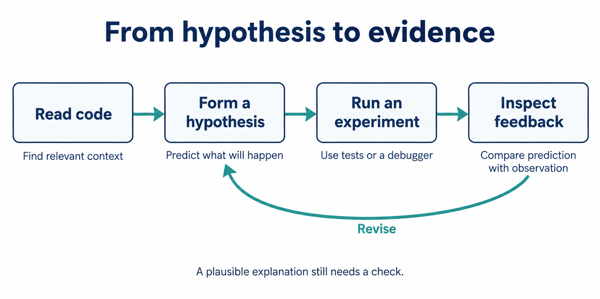



A coding agent becomes useful when it can check what it thinks. It reads a repository, proposes a change, runs a tool, and uses the result to decide what to do next.

Charles Sutton's lecture connects this feedback loop to two questions: how we evaluate agents, and how much control we put in the surrounding code.

**Source:** [Berkeley lecture recording](https://www.youtube.com/watch?v=JCk6qJtaCSU), March 3, 2025. These notes describe the systems as discussed in that lecture; benchmark rankings and model limitations are historical.

# Start with the Evaluation

HumanEval and MBPP ask for small programs from short descriptions. SWE-bench moves to repository-level repair: given an issue and an earlier version of a project, produce a patch.

That changes what the model needs to do. It must find relevant code, understand the surrounding behavior, edit it, and check the result.

But a passing test suite is an incomplete specification. A patch can satisfy the available tests while breaking an untested case. Issue descriptions also differ from everyday requests in an IDE: some contain diagnosis or hints that a user would not provide.

**The evaluation shapes the system.** If we choose tools and prompts by their benchmark scores, the benchmark's blind spots become blind spots in our design.

## What Does pass@k Measure?

For one problem, pass@k asks whether at least one of k generated candidates passes the checks.

Given n sampled candidates, c of which pass, the standard estimator is:

$$
\widehat{\mathrm{pass@}k}
=1-\frac{\binom{n-c}{k}}{\binom{n}{k}},
\qquad 1\leq k\leq n.
$$

The fraction is the probability that a uniformly chosen subset of k candidates contains only failures. When fewer than k failures exist, that fraction is zero.

**Example:** With 10 candidates and 2 passing solutions, pass@1 is 0.2. For k = 3:

$$
1-\frac{\binom{8}{3}}{\binom{10}{3}}
=1-\frac{56}{120}
\approx 0.533.
$$

This measures the availability of a passing candidate. It does not tell us whether a deployed system can select that candidate without access to the evaluation's hidden checks.

# The Agent Loop

The basic loop is short:

1. Give the model the task and the trajectory so far.
2. Let it select a tool.
3. Execute the tool and append its output.
4. Continue until success, failure, or the budget limit.

Tools contribute information the model did not already have. A failed test or an unexpected debugger value can overturn the current explanation.

For example, suppose a model thinks an empty input causes an error. Running that input may show that the function succeeds. The next step should follow this observation: inspect another path or revise the hypothesis.

# Where Should Control Flow Live?

The lecture compares systems along a continuum.

| Design | Where the workflow lives | Main trade-off |
| --- | --- | --- |
| SWE-agent | The model chooses successive actions | Flexible recovery, but early mistakes can derail a trajectory |
| Agentless | Code organizes localization, repair, and validation | Predictable steps, with less freedom to change strategy |
| AutoCodeRover | Separate retrieval and patch-generation stages contain agent loops | Structure between stages and flexibility within them |
| RepairAgent | A state machine constrains the available actions | Explicit phases guide exploration |
| Passerine | A dynamic loop uses Google's development tools | The tools and evaluation reflect the target environment |

A fixed workflow makes sense when the steps are already clear. A dynamic loop helps when new evidence changes which step is useful.

The choice also determines how we spend inference-time compute. After a failed patch, should we extend the same trajectory or generate a fresh candidate? Neither strategy wins by definition. Compare them on the target tasks with a comparable budget.

# Tools Are Part of the Method

An agent-computer interface makes useful actions easy to express and their results easy to interpret.

Three details matter:

- **Compact actions:** searching a repository should not require opening every file individually.
- **Useful feedback:** return locations, relevant context, and errors that support the next decision.
- **Recoverable edits:** detect malformed changes early so later actions do not build on a broken state.

Tool names and output formats should use concepts the model already understands. AutoCodeRover's class and method search illustrates this: the interface follows the structure of code, instead of exposing only raw text matching.

Longer output is not automatically better. It may bury the useful evidence or consume more of the budget. Sutton also stresses inspecting failed trajectories; recurring mistakes tell us which part of the interface needs work.

# From Code Repair to Security

Security tasks use a similar loop, but the objective changes. A repair agent produces a patch. A vulnerability-finding agent tries to demonstrate a security-relevant failure.

Capture-the-flag tasks offer clear success checks and controlled environments. EnIGMA adds tools suited to these tasks, including stateful debugging and server interaction. These benchmarks are useful stepping stones, but they cover only part of real security work.

## Why a Function Alone May Be Insufficient

Consider a function that copies data using a size supplied by its caller. The function might be safe because the caller validated the size. The same function could be unsafe along another reachable path.

To judge it, we need the data flow and the assumptions across that path.

This makes datasets built from vulnerability patches difficult to interpret:

- The patched function may be far from the operation that fails.
- A commit may contain unrelated changes.
- Missing vulnerability reports do not establish that code is safe.
- Several different patches may correctly address the same problem.

# Big Sleep: Test the Hypothesis

In the lecture's Big Sleep system, the agent uses code navigation, a Python input generator, and a debugger to investigate memory-safety bugs.

The loop is concrete: inspect code, predict a failure, construct an input, run the program, and inspect the result. If execution stops before the suspected path, the agent gets evidence that its input or explanation needs revision.

A sanitizer supplies a check for particular classes of invalid memory behavior. A reproducible sanitizer finding is stronger evidence than a plausible written report. It still does not establish every aspect of exploitability, and a clean run does not prove the program is free of vulnerabilities.

Sutton describes a SQLite case in which an earlier fixed bug supplied context for finding a related issue. This is variant analysis: use a known failure pattern to guide the search. The example shows a useful collaboration between reasoning and execution; it does not establish that agents generally outperform fuzzers.

# What I Take Away

The connection to earlier lectures is direct. Inference-time computation becomes more useful when some of it buys new evidence. The system can then revise a hypothesis rather than elaborate on it.

For an agent project, I would start with a small evaluation that reflects the actual task, implement a simple workflow, and inspect where it fails. Add flexibility where the failures require it, then compare the improvement against its cost.

Three questions to keep beside the design:

1. What observation could show that the current explanation is wrong?
2. Does the success check measure the outcome we care about?
3. Would a simpler workflow achieve the same result with the same budget?

# Sources

- [Charles Sutton's lecture and recording](https://www.youtube.com/watch?v=JCk6qJtaCSU) — primary source; evaluation at 7:33, agent design at 22:22, security at 55:00, and Big Sleep at 1:14:16.
- [Lecture slides](https://rdi.berkeley.edu/adv-llm-agents/slides/Code%20Agents%20and%20AI%20for%20Vulnerability%20Detection.pdf).
- [Berkeley Spring 2025 course syllabus](https://rdi.berkeley.edu/adv-llm-agents/sp25).
