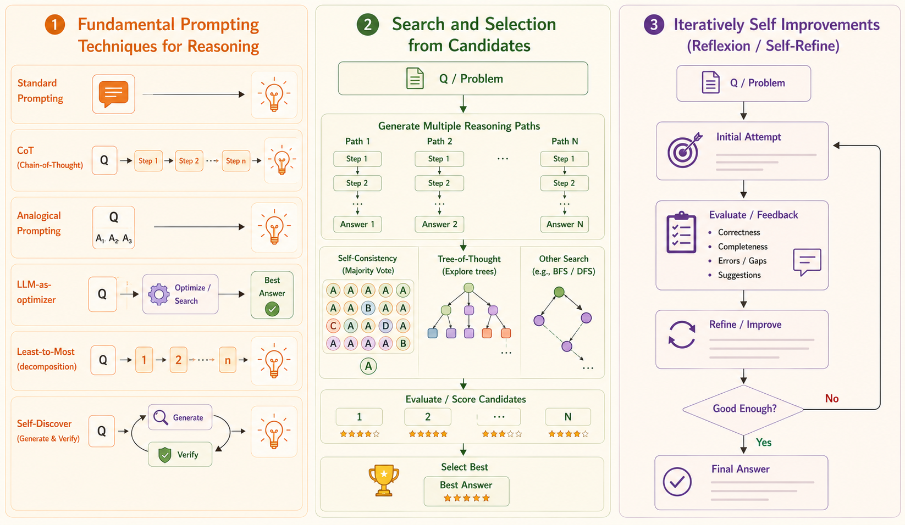

<iframe width="100%" height="500" src="https://www.youtube.com/embed/g0Dwtf3BH-0" title="Inference-Time Techniques for LLM Reasoning" frameborder="0" allowfullscreen></iframe>

Inference-time reasoning improves model performance by spending additional computation **after training**. Instead of relying on one greedy answer, the system can decompose the task, sample multiple solutions, evaluate intermediate states, search promising branches, and revise outputs using feedback.



# Technique Map

| Family | Techniques | Main purpose |
|---|---|---|
| Reasoning elicitation | Chain-of-thought, analogical prompting, least-to-most, Self-Discover | Structure the reasoning process |
| Candidate selection | Self-consistency, universal self-consistency, voting | Choose a stronger answer from diverse candidates |
| Search | Tree of Thoughts | Explore and prune intermediate reasoning states |
| Iterative improvement | Reflexion, Self-Refine, self-debugging | Revise outputs using internal or external feedback |

# Fundamental Prompting Techniques

## Standard Prompting

Standard prompting maps a question directly to an answer without requesting an explicit intermediate process.

> **Question:** Roger has 5 tennis balls. He buys 2 cans with 3 balls in each. How many does he have now?
>
> **Answer:** 11.

This can work for simple tasks, but it is fragile when the answer depends on several intermediate steps.

## Chain-of-Thought Prompting

Chain-of-thought (CoT) prompting asks the model to derive the answer step by step:

> Roger starts with 5 balls. Two cans contain $2\times3=6$ balls. Therefore, he has $5+6=11$ balls.

CoT gives the model a variable inference budget: harder questions can naturally use more reasoning steps. It also provides a foundation for decomposition, planning, sampling, and evaluation methods.

## Analogical Prompting

Analogical prompting asks the model to generate relevant examples or knowledge before solving the original problem.

For a geometry problem, the model might first recall that a square's area is the square of its side length. It can then calculate the side length from the coordinates:

$$
s
=
\sqrt{(2-(-2))^2+(-2-2)^2}
=
\sqrt{32},
$$

so

$$
A=s^2=32.
$$

Benefits:

- Exemplars are generated automatically rather than written manually.
- The examples can be tailored to the current problem.
- The same idea can retrieve high-level concepts, algorithms, or related tasks.

The method depends on model capability: weak models may generate irrelevant or incorrect analogies, while stronger models can benefit substantially.

## LLM as a Prompt Optimizer

An LLM can optimize prompts by examining a trajectory of previous candidates and their scores. Each iteration receives:

- the task description,
- earlier solution-score pairs,
- and the objective or evaluator feedback.

It then proposes a new candidate intended to improve the score.

```{mermaid}
flowchart LR
    LLM["LLM optimizer"] --> C["Generate candidate prompts"]
    C --> E["Evaluate candidates"]
    E --> H["Update solution-score history"]
    H --> LLM
    C --> B["Return best prompt"]
```

The LLM is not changing its weights. It is searching the prompt space at inference time.

## Least-to-Most Prompting

Least-to-most prompting targets easy-to-hard generalization by solving a complex problem through ordered subproblems.

### Stage 1: Decompose

Identify the prerequisite question.

> Amy needs 4 minutes to climb a slide and 1 minute to slide down. The slide closes in 15 minutes. How many trips can she complete?

The prerequisite is: **How long does each trip take?**

### Stage 2: Solve Sequentially

First compute

$$
4+1=5\text{ minutes per trip}.
$$

Append that result to the context and solve the original question:

$$
15\div5=3\text{ trips}.
$$

Each solved subproblem becomes context for the next step.

## Self-Discover

Self-Discover separates reasoning into two levels:

1. **Task level:** Select and compose useful atomic reasoning modules into a structured plan.
2. **Instance level:** Apply that discovered structure to a specific problem and fill in its intermediate values.

The model first determines *how this class of problems should be solved*, then uses that reusable structure to solve each instance.

# Search and Selection from Candidates

A single generation can commit early to a bad reasoning path. Inference-time search instead creates alternatives:

- sample several complete solutions, or
- branch over multiple possible next steps during reasoning.

The additional paths only help if the system can evaluate and select among them effectively.

## Self-Consistency

Self-consistency samples several diverse reasoning paths and selects the final answer that appears most consistently.

Suppose 16 eggs are produced each day, 3 are eaten, 4 are used for muffins, and the remaining eggs sell for two dollars each. A correct path computes

$$
16-3-4=9,
$$

then

$$
9\times2=18.
$$

If multiple independent paths reach 18 dollars while an occasional path reaches an incorrect result, majority aggregation can recover the correct answer.

Important observations:

- Accuracy can improve as more paths are sampled.
- Diversity matters; temperature or nucleus sampling can produce varied paths.
- Beam search may reduce useful diversity by retaining only high-probability paths.

## Universal Self-Consistency

Standard self-consistency assumes answers can be extracted and counted. Universal self-consistency asks the model to compare complete candidate outputs and select the most consistent response.

This extends candidate selection to open-ended tasks such as summarization and question answering. Its main limitation is the context required to hold and compare many candidates.

## Tree of Thoughts

Tree of Thoughts treats reasoning as a search problem over intermediate states.

At each state, the system alternates between two operations:

1. **Propose:** generate several possible next thoughts or actions.
2. **Evaluate:** score each resulting state as promising, uncertain, or impossible.

For the Game of 24, a state contains the remaining numbers. A proposed operation creates a child state; the evaluator checks whether that state can plausibly reach 24. Dead ends are pruned early, and computation is concentrated on promising branches.

Tree of Thoughts adds planning and backtracking that a single left-to-right generation does not provide.

## Voting-Based Evaluation

An LLM can also evaluate candidate plans directly:

1. Generate multiple plans or intermediate states.
2. Analyze how well each candidate satisfies the requirements.
3. Vote several times.
4. Continue from the candidate receiving the most votes.

Repeated voting reduces dependence on one potentially noisy evaluation.

# Iterative Self-Improvement

## Reflexion and Self-Refine

Reflexion and Self-Refine use an iterative loop:

```{mermaid}
flowchart TD
    Q["Problem"] --> A["Initial attempt"]
    A --> E["Evaluate and generate feedback"]
    E --> R["Reflect and revise"]
    R --> G{"Good enough?"}
    G -- "No" --> E
    G -- "Yes" --> F["Final answer"]
```

Feedback may be generated by the model, but external evidence is usually stronger:

- **Decision making:** environment observations reveal that an attempted action did not occur.
- **Programming:** unit tests expose a specific failure in the implementation.
- **Reasoning:** an external reward signals that the answer is incorrect.

The model converts the feedback into a reflection, then uses that reflection to produce a revised trajectory.

## Self-Debugging

Self-debugging applies the same loop specifically to code. Useful feedback formats include:

- **Simple feedback:** state that the output is incorrect and request a correction.
- **Unit-test feedback:** provide the failing input, expected result, and actual result.
- **Explanation and tracing:** ask the model to explain the code or trace variable values line by line.

Execution feedback grounds the revision in observable behavior. Explanations and traces help localize the error before the model rewrites the code.

# Key Takeaways

- Inference-time compute can improve reasoning without updating model weights.
- Structured prompting helps elicit decomposition and reusable reasoning plans.
- Sampling creates alternative reasoning paths; selection determines whether those paths are useful.
- Tree search explores and prunes intermediate states instead of committing to one trajectory.
- Iterative methods use evaluation and feedback to revise an initial answer.
- Strong external signals, such as unit tests or environment observations, make self-improvement more reliable.
