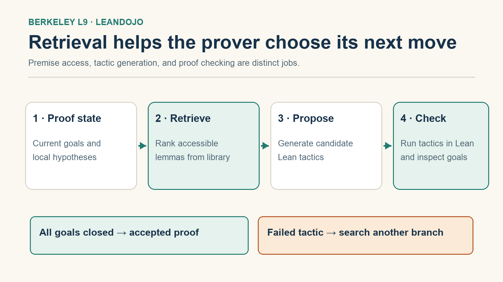
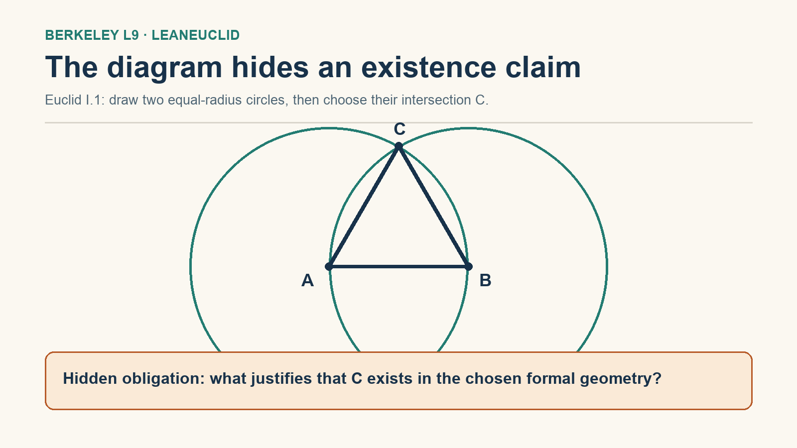

A proof assistant can certify every step of a proof. That sounds like the end of the reliability problem—until the model proves a different statement from the one a human meant.

**This lecture separates two gates:** *Did we formalize the right theorem?* and *Did we prove that theorem?* The second has a strong checker in Lean. The first is a semantic translation problem, and it is often the harder one to evaluate. Kaiyu Yang's ninth lecture in Berkeley's **Advanced Large Language Model Agents** connects this gap to theorem-proving systems such as LeanDojo and to the domain-specific LeanEuclid benchmark.

{fig-alt="Two horizontal gates: translation fidelity from informal question to formal theorem, and proof validity from proposed proof to Lean acceptance. An orange warning says that passing gate two does not imply passing gate one."}

## Source and scope



[Lecture recording (52:06)](https://www.youtube.com/watch?v=cLhWEyMQ4mQ) · [Official 114-page slides](https://rdi.berkeley.edu/adv-llm-agents/slides/mathverification.pdf) · [Course schedule](https://rdi.berkeley.edu/adv-llm-agents/sp25)

The recording is from April 7, 2025. Timestamps below refer to its English transcript. The explanatory figures are conceptual diagrams, not screenshots of a model run or a Lean execution.

## 1. A proof checker is a local guarantee, not an intent checker

The lecture defines two related tasks [18:28–19:13]:

1. **Formal theorem proving:** start with a statement already expressed in Lean, then produce a proof Lean accepts.
2. **Autoformalization:** translate informal mathematics into a formal statement, or translate an informal proof into a formal proof.

If Lean accepts a proof, we have strong evidence that the formal statement follows within the formal system and its assumptions. That does not establish that the statement is the one the textbook, problem setter, or user intended. The distinction matters because a changed quantifier, a missing non-degeneracy condition, or a wrong domain can make the proof both valid and irrelevant.

Consider the sentence “there are infinitely many primes.” It can be expressed as “for every natural number $n$, some prime $p$ is at least $n$.” Replacing $p\ge n$ by $p>n$ still expresses infinitude. A literal text match between generated Lean and a reference formalization would count one of these as wrong despite their equivalent mathematical meaning. But allowing arbitrary changes without semantic checking could accept an easier, non-equivalent statement. Yang uses this example at [34:17–35:58] to explain why **compilation is not the same as semantic fidelity**, and why generic equivalence checking is not a cheap universal solution.

::: {.callout-note}
## The diagnostic question

Before celebrating a checked proof, ask: *Which exact theorem did the checker prove, with which assumptions?* Then separately ask how that theorem was shown to match the original problem.
:::

## 2. Where retrieval enters a proof search

Once the target statement is fixed, the prover still needs to find a path through proof states. Each Lean tactic can fail, close a goal, or produce new subgoals. A search procedure explores possible next tactics until all goals close or its budget runs out. Failure to find a proof within a budget is not a disproof.

The [LeanDojo paper](https://arxiv.org/abs/2306.15626) and lecture [20:46–24:17] make an important move: **retrieve accessible premises before generating the next tactic**. A library is too large to put wholesale into every prompt. ReProver embeds the current proof state and candidate premises, retrieves useful ones, and conditions tactic generation on the state plus those premises. Search then tests proposals in Lean. This is not simply “RAG for answers”: the retrieved item must be usable in the current formal context, and the suggested tactic still has to survive the checker.

{fig-alt="Four-step proof-search pipeline with accessible premise retrieval, tactic proposal, Lean checking, and branching search. Invalid tactics return to search; a state with no remaining goals is accepted."}

In the paper, LeanDojo also contributes tools to extract fine-grained proof data and interact with Lean. Its benchmark is designed to test generalization to theorems that need premises not used during training—not merely memorization of familiar proof steps. The precise benchmark count differs between the lecture slides and the later arXiv abstract, so I do not treat a single count as the conceptual result. The important design point is the **premise-availability constraint**: retrieving an impressive but inaccessible lemma does not advance the proof.

### A second way to tame search: structure the action space

The lecture also presents **LIPS**, an inequality prover, at [27:19–33:07]. Unlike LeanDojo's general premise-retrieval story, this is a domain-specific decomposition of possible moves. For competition inequalities, the speaker separates *scaling*—applying a known inequality such as AM–GM or Cauchy–Schwarz to a selected expression—from *rewriting* an expression into a useful equivalent form. Within the chosen finite lemma set and matching patterns, symbolic tools can enumerate and prune scaling moves; the language model proposes rewrites in the much larger space of possible transformations. Search combines and filters these proposals.

The slides report 16 of 20 selected Olympiad-level inequalities solved by LIPS, versus 4 of 20 for DeepSeek-R1 and 15 of 20 for human gold medalists on that selection. This is a **lecture-reported, small, selected comparison**, not a general claim that LIPS exceeds human mathematical ability. The transferable idea is more modest: when a domain exposes a tractable class of symbolic moves, reserve the model's generative flexibility for what cannot be enumerated. The speaker explicitly leaves cross-domain generalization open.

## 3. Autoformalization has two different failure modes

Yang distinguishes the statement and proof sides at [33:27–36:52].

**Statement translation is hard to evaluate.** There may be many valid formal equivalents of one informal claim. Syntactic similarity is too strict; a model can also emit a well-typed but subtly weaker theorem. General semantic equivalence is computationally difficult.

**Proof translation must fill gaps.** A human proof may say “obvious from the diagram,” or leave a case to the reader. A proof assistant has no privileged access to that omitted reasoning. The model or a domain-specific reasoning tool must supply it.

These are not the same problem. A perfect Lean proof checker resolves neither the intended meaning of a translated statement nor a missing human step on its own.

### Worked example: Euclid's first construction

Euclid's *Elements*, Book I, Proposition 1 constructs an equilateral triangle on a segment $AB$. Draw a circle centered at $A$ through $B$, draw another centered at $B$ through $A$, choose an intersection $C$, and connect $AC$ and $BC$. The equal radii then give $AB=AC=BC$.

But “choose an intersection” silently assumes **the two circles actually meet**. The diagram makes that visually immediate; a formal proof needs an existence justification in its chosen geometry system. Yang uses this at [46:21–49:01] to show a *diagrammatic reasoning gap*. In LeanEuclid, domain-specific geometric rules and SMT-based automation help discharge such gaps. This is not a general theorem saying any natural-language proof can be filled in automatically.

{fig-alt="Constructed geometry diagram with points A and B at the circle centers, upper intersection C, an equilateral triangle, and an orange callout highlighting the hidden circle-intersection existence step."}

There is a second lesson in Euclid's Proposition 24. Yang shows a familiar-looking argument that works for one configuration but omits another arrangement of the points [40:23–44:42]. The theorem can still be repaired; the flaw is an **unhandled case in the proof**, not a claim that the theorem is false. Formalization made that omission visible.

## 4. What LeanEuclid makes measurable—and what it does not

The [LeanEuclid paper](https://arxiv.org/abs/2405.17216) builds a controlled geometry benchmark with human formalizations of problems from Euclid and UniGeo. In this restricted domain, the authors test a generated statement against a reference by checking both directions of implication with symbolic tools [45:04–45:58]. They also use domain rules to fill or test certain diagrammatic proof gaps [49:04–50:07]. The lecture's slides list 48 Euclid Book I problems and 125 UniGeo problems; that is a benchmark description, not a success rate.

The generalization boundary is the result worth remembering. A domain with explicit axioms and tractable reasoning procedures makes some semantic checks possible that are infeasible in unrestricted mathematics. The lecture's closing question [51:20–51:48] is how far that strategy can travel beyond geometry—not a claim that the translation problem is solved.

## How I would use this distinction

For an AI mathematics workflow, I would record two artifacts for each solved problem: **the exact formal statement plus a justification for its fidelity**, and **the checker-accepted proof with its environment/version**. I would track translation errors separately from proof-search failures. Otherwise a high “proof success” number can hide a system that proves the wrong things reliably.

This is the bridge from [Lecture 8's AlphaProof note](https://ickma2311.github.io/ML/LLM-Agents/alphaproof-reinforcement-learning-formal-mathematics.html): verified feedback can improve search, but its usefulness depends on the question submitted to the checker. In this lecture, retrieval improves the *proof search* gate; domain-specific semantic evaluation addresses part of the *translation* gate. Neither substitutes for the other.

## References

- Kaiyu Yang, [Berkeley lecture recording](https://www.youtube.com/watch?v=cLhWEyMQ4mQ) and [official slides](https://rdi.berkeley.edu/adv-llm-agents/slides/mathverification.pdf), April 7, 2025.
- Kaiyu Yang et al., [LeanDojo: Theorem Proving with Retrieval-Augmented Language Models](https://arxiv.org/abs/2306.15626), NeurIPS 2023.
- Yuhuai Wu et al., [Autoformalization with Large Language Models](https://arxiv.org/abs/2205.12615), 2022.
- Logan Murphy, Kaiyu Yang et al., [Autoformalizing Euclidean Geometry](https://arxiv.org/abs/2405.17216), ICML 2024.
- Timothy Kassis et al., [Scientific Agent Skills: A Library of Procedural Knowledge for Research Agents](https://arxiv.org/abs/2609.00065), arXiv v2, 2026. Its figure-design procedure was used for these original explanatory diagrams; it is not a source for the mathematical claims.
