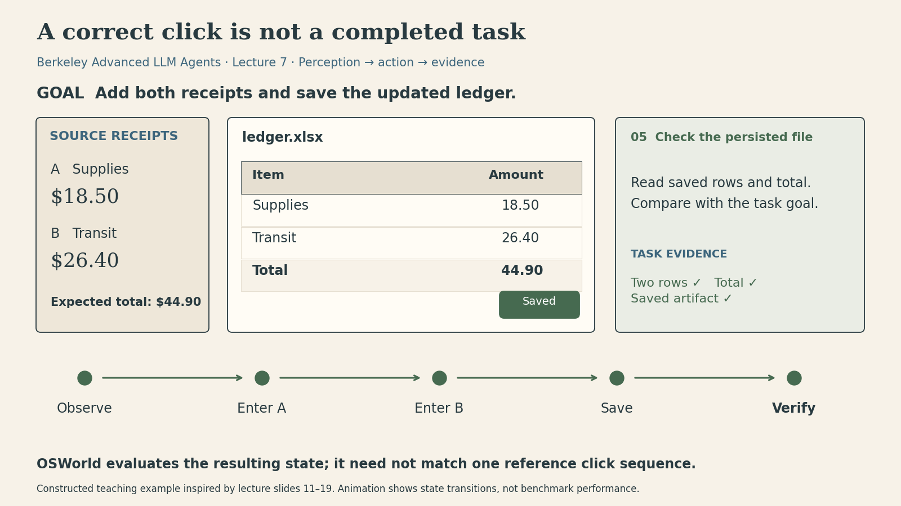
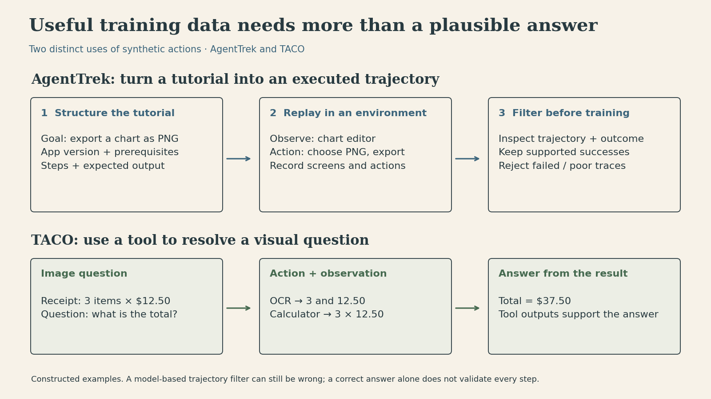

An agent can read a receipt, enter the right number, and still fail to update a spreadsheet. It might miss a second receipt, edit the wrong cell, or close the window before saving. The difficult part is connecting perception to a sequence of actions whose **result can be checked**.

Caiming Xiong's seventh lecture in **Berkeley's Advanced Large Language Model Agents** connects three parts of that problem: an executable environment, useful training trajectories, and a model that can both choose an action and locate its target. OSWorld, AgentTrek, TACO, and Aguvis address different parts of this chain.

<button type="button">Play animation</button>

*An original teaching example, not an OSWorld benchmark run. The animation separates an action, the next observation, and evidence in the saved artifact.*

## Why a screenshot is only part of the task

In a static question, an image is an input and an answer is an output. In computer use, the output changes the environment. Clicking a menu creates a new screen; saving a file changes persistent state; a failed dialog can make the next planned action inappropriate.

Let $g$ be the goal, $s_t$ the underlying computer state, $o_t$ the available observation, and $h_t=(o_0,a_0,\ldots,o_t)$ the interaction history. A simple description is

$$
a_t\sim\pi_\theta(\cdot\mid g,h_t),\qquad
s_{t+1}\sim P(\cdot\mid s_t,a_t),\qquad
o_{t+1}=O(s_{t+1}).
$$

This is notation for the interaction loop, not a claim that a particular model explicitly represents $s_t$ or $P$. The screenshot is only an observation of state: it may not reveal whether the file on disk contains the latest changes.

In our ledger example, the expected total is $18.50+26.40=44.90$. Seeing `44.90` on screen is useful feedback. Checking that the saved file contains both rows and that total is stronger evidence for the stated task. A checker that tests only the sum would still miss wrong labels or compensating errors in individual amounts.

*Source: recording 5:19–21:35; slides 9–18. Equations and numerical example are added explanations.*

## OSWorld: evaluate the outcome, allow different routes

OSWorld separates the environment from the benchmark tasks built on it. A task supplies a natural-language instruction, an initial-state configuration, and a task-specific evaluator. The environment initializes a virtual machine with the required applications and files, exposes observations, and executes actions.

Depending on the experimental setup, observations may include screenshots, an accessibility tree, or Set-of-Marks annotations. These are different interfaces to the environment, not interchangeable information. The agent generates actions such as mouse clicks or keyboard input, receives another observation, and continues until termination or its action budget is exhausted.

The important distinction is **execution-based evaluation**. Two agents might update the same spreadsheet through different valid routes: one uses keyboard shortcuts; another uses menus. Comparing both trajectories to a single demonstration can penalize the second valid route. An evaluator instead checks whether the resulting artifact or environment satisfies the task's conditions.

The original benchmark discussed in the lecture contains 369 tasks. That is a historical description of the lecture's benchmark, not a statement about today's leaderboard. A benchmark result also depends on the observation interface, model, action budget, and evaluator. The lecture's comparisons with 15, 50, or more permitted steps should not be collapsed into one undifferentiated success rate.

This setup makes experiments more repeatable, but passing a finite benchmark does not establish general reliability. A task evaluator can omit a requirement; a virtual machine can reproduce only part of a real workflow. The useful design lesson is to define completion precisely enough that a plausible-looking screen cannot substitute for the required result.

*Source: recording 10:01–39:54; slides 11–31; [OSWorld paper](https://arxiv.org/abs/2404.07972).*

## AgentTrek: a tutorial becomes data when it is executed

The web contains many instructions for using software, but those instructions are not already agent trajectories. “Export the chart” does not contain the exact screen, the relevant control's location, the intermediate action, or the response from the application.

AgentTrek uses tutorials as guidance for collecting this missing interaction data. Its pipeline filters tutorial-like material, structures the task, and replays the instructions with a vision-language agent in an actual digital environment. The structured description includes the platform, goal, prerequisites, steps, and expected outcome.

During replay, the system records observations and actions, along with intermediate guidance. A separate model-based evaluator filters the resulting trajectories. This is more informative than simply asking a model to write a convincing sequence of steps: the trace is tied to what the environment actually displayed during execution.

For example, a tutorial might say “export a PNG.” An executed trace adds the export dialog, the selected format, the click, and the resulting screen. Those details make it possible to train the connection between an instruction and a situated action.

{fig-alt="Two worked examples distinguish environment trajectory synthesis in AgentTrek from tool-assisted visual question answering in TACO."}

The filter is still a model, so its verdict is not a guarantee. Another limitation is imitation coverage: one successful trajectory demonstrates one route, not every possible recovery. Xiong suggests combining supervised learning from such data with further learning in an executable environment. That is a direction discussed in the lecture, not evidence that AgentTrek alone already implements and validates the whole supervised-to-reinforcement-learning pipeline.

*Source: recording 39:57–58:21; slides 33–45; [AgentTrek paper](https://arxiv.org/abs/2412.09605).*

## TACO: an action can improve understanding itself

Actions need not be clicks that change a desktop. A model answering a difficult visual question can use OCR, crop an image, query external information, or call a calculator. These operations change the evidence available for the answer.

TACO trains multimodal models on synthetic chains of thought and action. An intermediate tool call produces an observation that can support the next step. In our constructed receipt example, OCR yields the quantity `3` and unit price `12.50`; a calculation produces `37.50`. The tool call has a clear purpose and a checkable output.

The lecture describes both model-based synthesis from image question-answer examples and programmatic synthesis using annotations and templates. The training recipe matters: adding more mixed data was not automatically better, and the slide deck explicitly notes that programmatic data helped some benchmarks without improving the average. These are findings from the reported experiments, not a universal law that synthetic data, more reasoning text, or tool use always helps.

This also separates two notions of verification. A correct final answer can help filter a training example, but it does not prove that every intermediate explanation is faithful. Tool outputs need their own interpretation: OCR can misread a digit, and a calculator can correctly evaluate an expression built from the wrong values.

*Source: recording 58:21–1:10:10; slides 46–61; [TACO paper](https://arxiv.org/abs/2412.05479).*

## Aguvis: “what next?” and “where exactly?” are different skills

A plan can be sensible while its click is misplaced. A click can hit its target while being the wrong next action. Aguvis addresses both problems through a common visual interface and two stages of training.

**Grounding** maps an instruction to a location in the current screenshot. **Planning and reasoning** choose the next instruction in the context of the goal and prior actions. Aguvis uses screenshots as its visual observations and a standardized action representation, reducing dependence on different platform-specific textual GUI formats. “Pure vision” here concerns the interface observation; the agent still receives language instructions and produces language and actions.

The first training stage develops grounding. A packing strategy groups multiple grounding examples for the same screenshot, reusing the visual context. The second stage trains on multi-step trajectories with an explicit intermediate monologue, including thoughts and low-level instructions before action generation. This generated training text is a model output, not privileged evidence about an internal reasoning process.

{fig-alt="A worked GUI coordinate example separates visual grounding from multi-step planning and subsequent result verification."}

For the illustrated $W=1000$, $H=600$ screen, the target center $(x,y)=(800,450)$ corresponds to

$$
(u,v)=\left(\frac{x}{W},\frac{y}{H}\right)=(0.8,0.75).
$$

Under a proportional resize to $1500\times900$, the same relative point becomes $(1200,675)$. This calculation assumes the layout scales proportionally. If a responsive layout moves the button, the agent must ground it again. Normalizing coordinates standardizes representation; it does not make the interface invariant to layout changes.

The lecture reports that both training stages matter and that stronger grounding can improve a system paired with a separate planner. That distinction is valuable when diagnosing a failed task: asking for a longer explanation will not necessarily fix a missed target, and better target localization will not necessarily fix an incorrect plan.

*Source: recording 1:10:17–1:28:21; slides 63–83; [Aguvis paper](https://arxiv.org/abs/2412.04454). The coordinate calculation is an original teaching example.*

## A practical way to diagnose an agent failure

Rather than judging only the final message, inspect the first point where the execution diverged from the goal:

| Layer | Concrete question | Evidence to inspect |
|---|---|---|
| Observation | Was the amount or control visible and legible? | Screenshot, accessibility information, tool output |
| Decision | Was this the right next operation? | Goal, prior actions, intermediate instruction |
| Grounding | Did the action refer to the intended target? | Current screenshot and executed coordinates |
| State change | Did the application accept the operation? | New observation, dialog state, error message |
| Completion | Was the required artifact actually produced? | Saved file and task-specific checks |

This table is a synthesis of the lecture, not an OSWorld scoring specification. Its purpose is to keep distinct failures distinct. In the ledger example, reading both numbers correctly, summing them correctly, and saving them correctly are separate conditions.

## Supplement from the slides: remembering long visual histories

The supplied recording ends after Aguvis. Slides 84–106 additionally discuss long-video memory; this section is based on those slides rather than spoken material in the recording.

Concatenating a representation for every frame can produce too many visual tokens. If $F$ frames each contribute $K$ tokens, the straightforward sequence contains $FK$ visual tokens. **BLIP-3-Video** instead uses a temporal encoder to compress information into a much smaller representation. The slides discuss sequential memory and a compact video representation; compression necessarily makes preserving task-relevant details a design concern.

**GenS** addresses a different question: which spans of a long video are relevant to a user's instruction? It predicts relevant frame spans and associated scores. This differs from independently ranking frames by image-text similarity because the question can depend on temporal relationships across frames.

The connection to agents is useful but should remain qualified. Compression asks what information to retain; retrieval asks what information to select for the current question. A video-understanding result does not by itself prove that the same method improves a computer-use agent.

## Continue from concepts to current systems

The previous lecture covered [search and feedback for multimodal web agents](multimodal-autonomous-ai-agents.qmd). This lecture adds a complementary question: what environment, data, and grounding model make those actions learnable and evaluable?

For a shorter look at current AI and technology developments between these course notes, I also maintain [DailyChat](https://dailychat.net/). The lectures provide the foundations; the brief is a separate way to follow what is changing.

## Sources and reproducible figures

- [Berkeley course schedule](https://rdi.berkeley.edu/adv-llm-agents/sp25), lecture dated March 17, 2025, Caiming Xiong, Salesforce AI Research.
- [Official slides, 106 pages](https://rdi.berkeley.edu/adv-llm-agents/slides/Multimodal_Agent_caiming.pdf). All slide text was reviewed, with visual checks of the main workflow diagrams. Results are presented as historical lecture findings.
- The full **1:28:21 transcript** was read. This is transcript-and-slide coverage, not a claim to have watched the entire video.
- [Figure source code](berkeley-7-create-figures.py), [export manifest](berkeley-7-figure-manifest.json), and [MP4 version of the animation](berkeley-7-action-evidence.mp4). All three figures were generated programmatically and use constructed examples.
- Figure workflow: Kassis, T., Agarwal, V., He, Y., Patel, D., & Brueckner, A. M. (2026). [Scientific Agent Skills: A Library of Procedural Knowledge for Research Agents](https://doi.org/10.48550/arXiv.2609.00065).

### Lecture recording



[Open the recording on YouTube](https://www.youtube.com/watch?v=n__Tim8K2IY)

