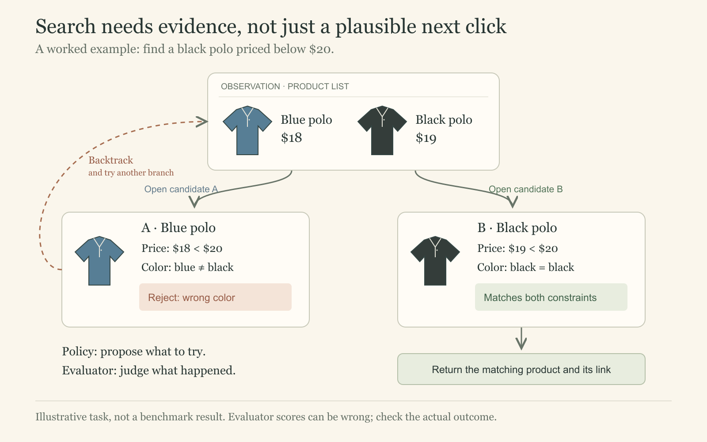

Notes on Ruslan Salakhutdinov's **Multimodal Autonomous AI Agents**, Berkeley Advanced Large Language Model Agents (CS294/194-280), March 10, 2025.

A web agent can click the right button and still fail the task. The harder question is whether each action moves it toward the user's goal—and whether it can recognize when the goal has actually been reached.

This lecture connects three uses of feedback: choosing a promising search branch, selecting trajectories for training, and measuring task success. They share a need for reliable evidence, but they are different evaluation problems.

This note follows the March 2025 lecture rather than later model releases. Its search and InSTA results should be read as historical lecture findings.



## From understanding a page to completing a task

A web agent has to connect perception, decisions, and execution. Finding a bike that matches a reference image and stays within a budget requires more than recognizing the bike: the agent must navigate, compare candidates, retain constraints, and check the final result.

VisualWebArena makes this concrete with reproducible shopping, forum, and classifieds environments. Some tasks require information available only in images. A text description can help, but it may omit the exact detail the task depends on.

The lecture's impressive demonstrations are selected examples. They show possible behavior, not the probability that an arbitrary task will succeed.

## Observations are not the full state

A browser agent sees a screenshot, HTML, or an accessibility tree. The underlying environment contains more than any one observation reveals: off-screen content, earlier choices, and application state.

This is naturally a partially observable decision problem. The policy chooses an action from the task and observation-action history; the environment returns a new observation. In the benchmark, transitions can be deterministic while the agent still has incomplete information.

Different representations expose different useful structure:

- **HTML:** detailed, but long and cluttered; visual relationships are indirect.
- **Accessibility tree:** cleaner semantic structure, but incomplete visual information.
- **Screenshot with Set-of-Marks:** numbered boxes connect visible elements to executable action IDs; crowded pages can still be ambiguous.
- **Direct coordinates:** flexible, but require precise visual grounding.

The representation determines which mistakes are easy to make. A good plan can still fail when “click the matching item” targets the wrong element.

## Why long tasks need recovery

Small action errors become large task failures. If every one of 30 necessary actions has conditional success probability 0.9, with no recovery, then

$$
P(\text{complete task}) = 0.9^{30} \approx 0.042.
$$

Here, 0.9 is the chance that each necessary action succeeds given that all earlier actions succeeded; the product follows from the chain rule, without requiring independent errors. This illustrative calculation assumes every action must succeed and no recovery is possible. Real tasks allow retries and alternative paths, which is precisely why recovery matters.

The lecture shows several distinct failures: poor visual grounding, repeated navigation loops, undoing progress, and stopping too early. Memory helps retain what was tried; a plan helps organize what remains. Neither substitutes for checking whether the task actually succeeded.

For a “find the cheapest matching product” task, viewing two plausible products is evidence of progress. It is not evidence that the cheapest one has been found.

## Tree search turns feedback into a better next action

A simple baseline is repeated sampling: run a trajectory until it stops, evaluate the result, and try again if it fails. This can find a successful path, but repeatedly completing bad paths wastes work. The lecture instead evaluates intermediate states, using best-first search to keep promising alternatives available:

1. The policy proposes candidate actions from the current history.
2. Executing a candidate reveals an actual successor observation.
3. A value evaluator scores the resulting partial trajectory against the task.
4. Best-first search retains alternatives and expands promising branches within its depth and exploration budget.

These are branches in the environment, not just alternative plans written in text. When the search reaches its stopping threshold or exhausts its budget, it returns to the best state found. That state can still fall short of task completion.

The evaluator can use an LLM, including multiple judgments. Its score guides a search decision; it is not automatically a calibrated probability or a verified outcome.

Search quality depends on both components. A strong evaluator cannot select an action that the policy never proposes. A strong policy can still be misdirected by a poor evaluator. More branch expansions also require more model calls and environment interaction, so breadth and depth compete for a budget.

Consider the illustrative task in the figure: find a black polo under $20. A blue polo priced at $18 meets only the price constraint. If the agent mistakes this branch for the whole catalog, it may conclude the task is impossible. A useful evaluator identifies the color mismatch early and sends the search back to another candidate.

The policy and evaluator answer different questions. Writing the task as $g$ and the observation-action history as $h_t$, a policy produces $\pi(a\mid h_t,g)$, while an evaluator supplies a score $v(h_t,g)$. A likely next action need not lead to a useful state. This notation is an explanatory abstraction of the lecture's system, not an additional training objective.

The lecture's results show improvement from search for both WebArena and VisualWebArena, alongside increased cost. They support the narrower claim that testing alternatives helps in these environments; they do not establish reliable performance across the live web.

There is a further systems constraint: **backtracking requires a recoverable environment.** In a self-hosted benchmark, resetting and replaying actions can reconstruct a branch, although this is costly. Browser Back does not undo a purchase, message, or other consequential change on a live site. The same search algorithm therefore needs different execution rules outside a resettable benchmark.

## InSTA uses completed trajectories as supervision

InSTA extends the data problem beyond a small set of familiar websites. Its basic loop is to propose tasks, collect agent trajectories, evaluate the outcomes, and train on filtered examples.

The supplied slides describe filtering an initial million ranked domains to roughly 150,000 live sites. Of 150,000 attempted tasks, 14.6% received the verifier's maximum confidence, yielding about 22,000 candidate trajectories. Those are **model-accepted examples**, not 22,000 independently proven successes (slides 91 and 103).

Website diversity matters because success on a few benchmark interfaces can depend on familiar layouts and action patterns. The lecture reports benefits from combining synthetic and human data, but step-level improvements should not be read as guaranteed end-to-end reliability.

During search, a mistaken score can waste exploration or favor the wrong branch. During data collection, a mistaken acceptance can become a training example. The latter error persists beyond the current task: the next policy may learn to imitate a trajectory that only appeared successful.

A useful distinction is selection quality versus selection volume. Raising a confidence threshold may reduce the number of accepted trajectories without repairing a systematic error. The slide deck reports 82% accuracy for judging task completion in its evaluation; that metric should not be substituted for the precision of the maximum-confidence subset.

Filtering is therefore a source of supervision, with noise. Agreement among model judgments does not establish correctness when the judgments share the same blind spot. Independent checks and human audits remain useful for measuring what the filter accepts.

The live-web collection discussed in the lecture focuses on navigation and information-seeking tasks, avoiding consequential external actions. Its offline training loop should also be distinguished from the online reinforcement-learning direction discussed as future work.

## Check the outcome, not the agent's claim

VisualWebArena uses task-specific execution evaluation, such as checking final application state or required answer constraints. An agent choosing “stop” is not itself proof of completion.

This separates three questions:

- Did the action execute?
- Does the resulting state satisfy the task?
- Did the model correctly judge that result?

Keeping these questions separate helps diagnose whether to improve tools, the policy, or the evaluator.

The lecture also shows how visual content can introduce adversarial instructions. A screenshot or generated caption is evidence about the environment; it should not acquire authority to redefine the user's task. This is especially relevant when the same observation feeds action selection and evaluation.

## The connection to robotics

The final robotics discussion follows a related hierarchy: **Plan, Sequence, Learn** separates language planning, geometric grounding, and learned interaction. For “put the silver nut on the silver peg,” the planner produces stages such as grasping the nut and placing it on the peg. Segmentation and depth help locate the objects; projection, inverse kinematics, and motion planning approach them; a learned local policy handles the interaction. The low-level policy is shared across stages rather than independently trained for every step.

The useful connection is decomposition. High-level choices and low-level execution require different representations and feedback. The analogy has limits: physical dynamics and contact make recovery unlike resetting a web benchmark.

The connection I take from the lecture is that feedback serves two timescales: search uses it to improve the current trajectory, while training uses it to change future behavior. A useful system needs both ways to recover from mistakes and ways to check its evaluator. More exploration or more accepted data helps only to the extent that the feedback identifies real progress.

## Sources

- [Lecture recording — Ruslan Salakhutdinov](https://www.youtube.com/watch?v=RPINOYM12RU).
- [Berkeley course syllabus](https://rdi.berkeley.edu/adv-llm-agents/sp25) and [lecture slides](https://rdi.berkeley.edu/adv-llm-agents/slides/ruslan-multimodal.pdf), especially slides 20, 42, 50–76, 80–106, and 107–121.
- The storefront example and discussion of shared evaluator blind spots are explanatory synthesis; they are not new experimental results.
- [VisualWebArena](https://jykoh.com/vwa).
- [Tree Search for Language Model Agents](https://jykoh.com/search-agents).
- [Towards Internet-Scale Training for Agents (InSTA), February 2025 version](https://arxiv.org/abs/2502.06776v1). The lecture's counts and rounded verifier accuracy are taken from its slides; later paper revisions report different experiments.
