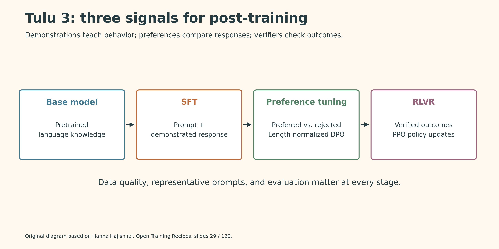
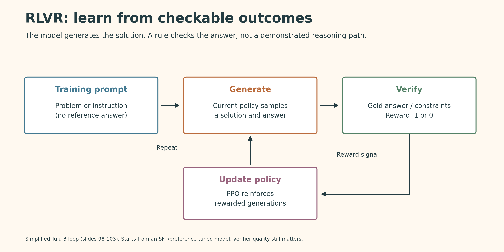
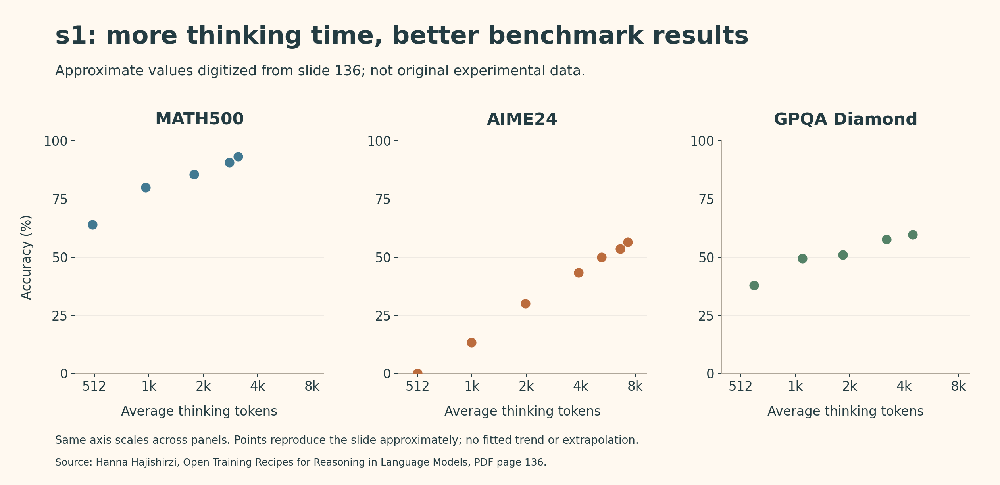



This lecture connects data curation, supervised fine-tuning, preference learning, verifiable rewards, and test-time computation into reproducible recipes for reasoning models.

# Post-Training

- Follow instructions
- Use tools
- Chat
- Avoid harm
- Serve apps
- Reason

## Why Open Training Recipes?

**Open weights are not the same as a fully open model.** Reproducing and studying a model also requires its data, training code, infrastructure, and evaluation recipe.

- **OLMo:** a fully open language-model effort, including pretraining.
- **Tülu:** an open post-training recipe that can be applied to different base models.
- **s1:** a minimal recipe for reasoning and test-time scaling.

**Speaker:** Hanna Hajishirzi  

**Slides:** [Open Training Recipes for Reasoning in Language Models](https://rdi.berkeley.edu/adv-llm-agents/slides/OLMo-Tulu-Reasoning-Hanna.pdf)

## Tülu 3 Training Recipe

**Base model → Supervised fine-tuning → Preference tuning → RL with verifiable rewards**

Each stage provides a different learning signal:

| Stage | Training signal | Purpose |
| --- | --- | --- |
| SFT | Prompt and demonstrated response | Learn instruction following and targeted skills |
| Preference tuning | Preferred versus rejected responses | Improve response quality and alignment |
| RLVR | Checkable final answers or constraints | Reinforce successful generated solutions |

Before training:

- Define meaningful evaluations for the skills you want.
- Collect representative prompts.
- Check data licenses.
- Remove benchmark contamination.

# Supervised Fine-Tuning

## What Does SFT Learn?

Train the pretrained model on **prompt-response pairs**.

For reasoning tasks, demonstrations include intermediate solution steps, not just final answers.

**Example:** Under a buy-two-get-one-free offer, seven shirts at \$25 each cost \$125: two groups of three cost \$100, and one additional shirt costs \$25.

The demonstration teaches how to break the problem into steps. A readable explanation, however, is not itself proof that the reasoning is correct.

## Data Curation and Mixing

Two related tasks:

- **Curation:** collect and filter examples for a particular capability.
- **Mixing:** balance examples across chat, knowledge, reasoning, coding, multilinguality, safety, and precise instruction following.

A dataset that improves one skill may not improve every skill. Evaluate the mixture, not just each source in isolation.

## Persona-Driven Data Generation

Human-written reasoning data is costly and difficult to scale. The lecture combines existing datasets with synthetic data:

1. Start from a diverse collection of personas.
2. Generate problems targeting skills such as math, coding, or instruction following.
3. Use strong models to generate worked solutions.
4. Filter the resulting examples and mix them with existing data.

**Why personas?** They provide varied contexts and perspectives instead of repeatedly generating similar problems.

## Experiment: Quality Versus Quantity

**Setup:** Add persona-generated math problems to a public-data mixture, then filter generated solutions using voting / self-consistency.

**Results:**

- Increasing persona-generated math data improves MATH performance in the reported experiments.
- Grade-school math data helps GSM8K.
- After filtering, about **60% of the data** retains similar MATH performance and improves GSM8K.

**Takeaway:** More data is not automatically better. Targeted diversity and filtering can be more useful than raw volume. Agreement between generated answers is a quality filter, not a correctness guarantee.

# Preference Tuning

## Learning from Comparisons

For the same prompt, compare two responses and identify which is better.

- **Human feedback:** people label the preference.
- **AI feedback:** a model judges the responses.

Preference tuning strongly affects style and chat quality, while also building on capabilities learned during SFT.

## PPO and DPO

| Method | How it works | Trade-off |
| --- | --- | --- |
| PPO-based RLHF | Train a reward model from preferences; generate responses and optimize the policy against that reward | More complex, with higher memory and compute costs |
| DPO | Directly optimize preferred versus rejected responses, relative to a reference policy | No separately trained reward model; simpler development |

A standard KL-regularized reward objective is:

$$
\max_{\theta}\;
\mathbb{E}_{x\sim D}\left[
\mathbb{E}_{y\sim\pi_{\theta}(\cdot\mid x)}[r(x,y)]
-\beta D_{\mathrm{KL}}\!\left(
\pi_{\theta}(\cdot\mid x)\,\Vert\,\pi_{\mathrm{ref}}(\cdot\mid x)
\right)
\right]
$$

- **Reward:** encourage better responses.
- **KL penalty:** discourage excessive departure from the reference model.

## What Matters Most?

In the lecture's comparisons:

- High-quality preference data is the most important factor.
- PPO performs better than DPO, but DPO is cheaper and easier to iterate on.
- A larger reward model does not always produce a better final policy.
- Relevant, in-domain prompts can improve results.

**Tülu 3 uses length-normalized DPO**, which normalizes response log-likelihoods by response length. The recipe also refines preference-data generation rather than relying only on an algorithm change.

# Reinforcement Learning with Verifiable Rewards

## Why Replace the Reward Model?

A learned reward model is an imperfect proxy. Optimizing its score too aggressively can exploit its mistakes instead of improving real quality.

For tasks with checkable answers, use a **verification function**:

$$
r(x,y)=
\begin{cases}
1, & \text{if the answer or required constraints pass verification},\\
0, & \text{otherwise}.
\end{cases}
$$

Examples include mathematical final answers and precise instruction-following constraints.

## Training Loop

1. Start from an SFT or preference-tuned model.
2. Sample a response to a training prompt.
3. Verify the final answer or constraints.
4. Update the policy with PPO.
5. Repeat with newly generated responses.

**Important distinction:** this RL stage needs a correct final answer or verifier, but not a demonstrated intermediate reasoning trajectory. It is not supervision-free: the verifier supplies the learning signal.

## Experiment

**Setup:** Pair targeted training prompts with verifiers; evaluate on GSM8K, MATH, IFEval, and BBH. Compare SFT and DPO starting points.

**Results:**

- The plotted GSM8K and MATH runs improve during RL training.
- Those runs do not show the over-optimization pattern highlighted for learned rewards.
- The lecture reports stronger RLVR performance at larger scale and shows chaining multiple RLVR stages for OLMo 2.

**Why can sparse rewards work?** The starting model already has useful knowledge and some ability to generate solution steps. RL can reinforce successful responses rather than discovering language and reasoning from scratch.

**Limitation:** a verifier only checks what it encodes. Passing a final-answer check does not guarantee every intermediate step is valid.

# s1: Reasoning and Test-Time Scaling

## A Small, Carefully Selected Dataset

The recipe combines **s1K data + budget forcing**.

1. Collect about 59,000 candidate questions.
2. Filter for quality, difficulty, and diversity.
3. Select **1,000 examples**.
4. Distill worked solutions and answers from a strong reasoning model.
5. Supervised-fine-tune the student model.

The slides distinguish Gemini-generated traces for **s1** and DeepSeek-R1 traces for **s1.1**.

**Takeaway:** the result depends on a strong starting model and carefully selected demonstrations; it is not training reasoning from scratch with only 1,000 examples.

## Budget Forcing

When the model tries to finish its reasoning, append **“Wait”** to encourage continued reasoning before the final answer.

- This gives the model additional opportunities to reconsider or check its approach.
- It changes inference-time computation, not model weights.
- **Sequential scaling:** extend one reasoning trajectory.
- **Parallel scaling:** generate several trajectories and aggregate or select answers.

## Results and Ablations

*Original Python redraw of slide 136. Values are approximate digitizations, not raw experimental data.*

- The reported MATH500, AIME24, and GPQA Diamond curves improve as the thinking-token budget increases over the tested range.
- Carefully selected s1K examples outperform random or diversity-only 1K selections on the displayed benchmarks.
- Using all 59K examples does not consistently beat the selected 1K set.

**Takeaway:** training-data selection and how extra inference compute is used both matter. Longer output alone is not a guarantee of better reasoning.

# OLMo: Pretraining and Mid-Training

## Two-Stage Base-Model Training

| Stage | Data | Role |
| --- | --- | --- |
| Pretraining | Large amounts of diverse, mostly unstructured text | Build broad capabilities; about 99% of the illustrated training budget |
| Mid-training | Higher-quality, domain-focused, synthetic, and instruction data | Concentrate useful data near the end; about 1% of the illustrated budget |

During the final stage, the learning rate decays to zero.

**Why mid-training?** Some valuable datasets are too small for the main pretraining mixture. Upsampling them late makes better use of this scarce data.

## Reported Results

The displayed average benchmark score increases:

- **OLMo 2 7B:** 50.6 → 61.2.
- **OLMo 2 13B:** 56.5 → 66.8.

These are averages over the slide's benchmark set, not universal model-quality scores.

Mid-training strengthens the base model; it is distinct from the later SFT → preference tuning → RLVR pipeline.

# Key Takeaways

- **Open recipes enable reproducible research:** weights alone are not enough.
- **Data quality and mixing are central:** curate for specific capabilities and evaluate the combined recipe.
- **Different stages teach different things:** demonstrations, preferences, and verifiable outcomes provide complementary signals.
- **RLVR relies on capable starting models and reliable checks.**
- **Test-time compute is another lever:** a trained reasoning model can benefit from controlled additional reasoning.
- **Small, high-quality datasets can have large effects**, especially when used at the right training stage.
