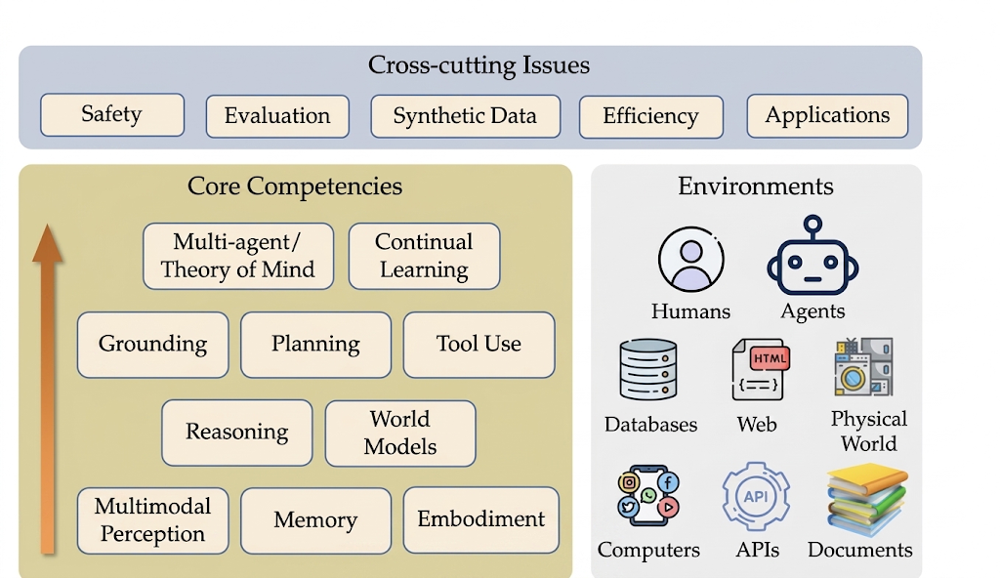
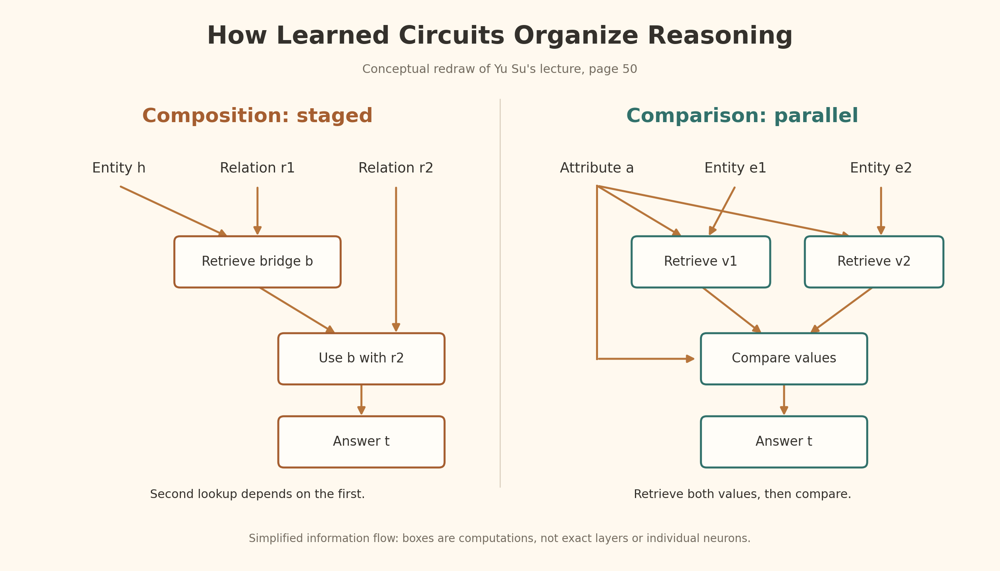

<iframe width="100%" height="500" src="https://www.youtube.com/embed/zvI4UN2_i-w" title="On Memory, Reasoning, and Planning of Language Agents" frameborder="0" allowfullscreen></iframe>

Language agents combine language models with an external environment. This lecture examines how memory, implicit reasoning, and planning contribute to their ability to act.

# Two Competing Views

- LLM-first
    - Build scaffolding on top of LLMs, focusing on prompting and engineering.
- Agent-first
    - Integrate LLMs into agents, revisiting memory, reasoning, and planning as core capabilities.

# Agent-first View

**Fundamentally New Capabilities of AI Agents**

- **Language as a Vehicle:** Modern AI agents integrated with LLMs uniquely use natural language to both reason and communicate, distinguishing them from previous AI systems.
- **Advanced Reasoning & Reflection:** Language enables these agents to infer states, self-reflect, and replan to improve their actions. The slide illustrates this with a GPT-4 screenshot where the model dynamically catches and corrects its own mathematical error in real-time.
- **In-Context Learning:** They can follow instructions and customize outputs on the fly without requiring structural retraining or fine-tuning.
- **Unprecedented Impact:** The lecture's "Road To 100 Million Users" chart emphasizes how rapidly this new language-based paradigm (led by ChatGPT) has been adopted compared to traditional software platforms, underlining the sheer scale of this shift.

## Evolution of AI Agents
|  | **Logical Agent** | **Neural Agent** | **Language Agent** |
| --- | --- | --- | --- |
| **Expressiveness** | Low bounded by the logical language | Medium anything a (small-ish) NN can encode | High almost anything, esp. verbalizable parts of the world |
| **Reasoning** | Logical inferences sound, explicit, rigid | Parametric inferences stochastic, implicit, rigid | Language-based inferences fuzzy, semi-explicit, flexible |
| **Adaptivity** | Low bounded by knowledge curation | Medium data-driven but sample inefficient | High strong prior from LLMs + language use |

## A Conceptual Framework for Language Agents

# Memory

- Humans are 24/7 learners. Even when we are sleeping, we are replaying what happened in the day.
    - Memory is everything, without it we are nothing!

We want to build the same capability in machines.
To illustrate this, we can use LLM context.

## Non-parametric Memory for LLMs

**Core Finding:** Large Language Models (LLMs) are highly receptive to external evidence (non-parametric memory) if it is coherent and convincing, even when it directly conflicts with their internal, pre-trained knowledge (parametric memory).

**Wrong Memory Correction:** Conversely, an LLM's incorrect internal knowledge can be fixed when provided with accurate external evidence.

## Why Standard RAG Can Fail

**The Multi-Hop Reasoning Failure (Example):**

- **The Query:** "Which Stanford professor works on the neuroscience of Alzheimer's?"
- **How RAG Fails:** To answer this, a system must connect two separate facts: Fact A (Person X is at Stanford) and Fact B (Person X studies Alzheimer's). Standard RAG retrieves individual chunks containing the keywords "Stanford" or "Alzheimer's," but it may fail to bridge the gap between those separate chunks to identify the shared entity (the professor).
- **How Associative Memory Succeeds:** The lecture's associative-memory illustration shows how an interconnected system successfully cross-references the neural pathway for "Stanford" with the pathway for "Alzheimer's" to triangulate and identify the correct professor.

**The Human Memory Contrast:** Unlike RAG, human memory functions as an interconnected network or knowledge graph. Humans naturally build associative links between distinct concepts, allowing for complex reasoning across different pieces of information.

## Long-term Memory in the Human Brain

- **Core Concept:** A well-established model of human long-term memory where the brain separates the indexing of memories from their actual storage.
- **The Hippocampus (The Index):** This region acts like a biological directory. It stores "indices" (pointers) and the associative links between them, rather than the raw data of the memories themselves.
- **The Neocortex (The Storage):** The actual substantive memories—such as specific people, events, and places—are stored in the neocortex.
- **The Mechanism:** The hippocampus connects distinct pieces of information by pointing to where those individual memories reside in the neocortex, linking them together into cohesive thoughts or recollections.

**Long-term memory in humans** relies on an indexing procedure that enables two fundamental faculties:

- **Pattern separation:** The process responsible for differentiating memories, which involves the neocortex and the parahippocampus.
- **Pattern completion:** The process used to recover complete memories from relevant associations, occurring mostly in the hippocampus, specifically the CA3 region.

## HippoRAG

**HippoRAG** is a neurobiologically-inspired long-term memory framework designed for Large Language Models (LLMs) to overcome the limitations of standard Retrieval-Augmented Generation (RAG).

- **Biological Inspiration:** It mimics human associative memory (specifically how the brain indexes and connects memories) rather than treating information as isolated, disconnected chunks of text.
- **Knowledge Integration:** It utilizes knowledge graphs to build an interconnected network of concepts, linking related entities and facts across different documents (often utilizing techniques like Personalized PageRank).
- **Multi-Hop Reasoning:** This interconnected structure enables HippoRAG to successfully answer complex queries that require synthesizing information from multiple sources—such as deducing which Stanford professor studies Alzheimer's by connecting one document about their university affiliation with another document about their research focus.

## Key Takeaways

- **Human Memory Mechanisms:** Memory is fundamental to human learning. It enables complex pattern recognition, the creation of rich associations, and the dynamic, context-aware recall of information that goes far beyond superficial similarities.
- **LLM Memory Challenges:** Embedding long-term memory directly into an LLM's internal weights (parametric continual learning) is highly difficult. Instead, utilizing external, non-parametric memory solutions like Retrieval-Augmented Generation (RAG) presents a much more promising path forward.
- **Structural Trends in RAG:** A major recent trend for improving RAG systems is adding more structural organization to embeddings. Frameworks like HippoRAG and GraphRAG are being used to enhance these capabilities and better mimic associative memory.

# Reasoning
Can Transformers learn to reason implicitly, predicting answers without a verbalized chain of thought?

## Experiment: Implicit Reasoning and Grokking

### Setup

- **Model:** GPT-2-style decoder-only Transformer: 8 layers, hidden size 768, 12 attention heads.
- **Training:** AdamW; learning rate 0.0001, batch size 512, weight decay 0.1, 2,000 warm-up steps.
- **Data:** Synthetic knowledge graph with 200 relations; learn latent rules from atomic facts and inferred two-hop facts, predicting answers directly.
- **Evaluation:** ID tests use unseen deductions from the same atomic-fact set underlying training deductions. OOD tests use deductions from a different atomic-fact set.

### Results

- **Grokking:** Training accuracy saturates before test accuracy improves; generalization emerges with extended training.
- **Composition:** ID accuracy approaches 100%, while OOD accuracy stays near zero.
- **Comparison:** Both ID and OOD accuracy eventually approach 100%.
- **Data distribution:** Increasing the inferred-to-atomic fact ratio accelerates ID generalization. Increasing entity count at a fixed ratio gives similar learning curves across epochs and does not resolve composition's OOD failure.

### Takeaways

- Transformers can acquire implicit reasoning in this controlled setting; early training performance can hide later generalization.
- Generalization depends on the reasoning task: ID success does not establish systematic OOD reasoning.
- The mix of training facts matters more than simply adding data in these experiments.

## Grokking

### What Changes Inside the Model? (pp. 49–52)

**Grokking** is delayed generalization after the model has already fit the training data. The lecture explains it as a generalizing circuit forming and eventually outperforming a memorizing circuit.

- **Logit lens:** Decode intermediate hidden states to inspect which entities or relations they represent.
- **Causal tracing:** Replace an internal activation with one from a perturbed run and measure the output change, testing which states actually influence the answer.

### Circuit Structure and Generalization

- **Composition uses a staged circuit:** Retrieve an intermediate entity from the first relation, then use it with the second relation to obtain the answer.
- **Comparison uses a parallel circuit:** Retrieve both entities' attribute values, then compare them.
- These different organizations help explain why comparison generalizes systematically while composition struggles on OOD facts in the earlier experiment.

### Improving Generalization

**Cross-layer parameter sharing** improves composition's OOD accuracy to roughly 70% in the plotted run, while ID accuracy reaches nearly 100%.
The proposed explanation involves **circuit efficiency and regularization**: reusing facts and rules can require less storage than memorizing separate answers. The weight-decay comparison supports regularization's role in the timing of grokking.

### Transition to Planning
These pages begin a new topic: choosing an action sequence that reaches a goal.

- **Formal planning:** LLM+P translates a problem into PDDL for an external planner.
- **Applications:** Web navigation and travel planning involve broad action spaces, constraints, and difficult goal checks.
- **Reactive agents:** Fast, but short-sighted.
- **Search through real interactions:** Explores alternatives, but can be costly or unsafe because actions may be irreversible.
- **Model-based planning:** Simulates alternatives before acting; obtaining a reliable world model is the key challenge.

# World Models and Planning

## Planning
Given a goal $G$, planning chooses an action sequence $(a_0,a_1,\ldots,a_n)$ that reaches a state satisfying the goal test $g(\cdot)$.

- **General Trends in Planning Settings for Language Agents:**
    - **Natural Language Goals:** Moving toward more expressive goal specifications using natural language rather than rigid, formal programming languages.
    - **Expanded Action Spaces:** Working with substantially larger or completely open-ended sets of actions.
    - **Automated Goal Tests:** Facing increased difficulty in automatically verifying whether a goal has been successfully achieved.

### **Example Overview: Finding Auto Repair Reviews**

- **Task Description:**
    > *“Show me the reviews for the auto repair business closest to 10002.”*
- **The Challenge:** Unlike simpler benchmarks that just look for a final answer, a web agent has to execute a multi-step sequence of UI interactions (clicking elements, typing zip codes, sorting results) across a real web interface.

| **Step** | **Target Element** | **Operation** | **Description** |
| --- | --- | --- | --- |
| **1.** | `[searchbox]` | `TYPE: auto repair` | Enters the search category into the main search box. |
| **2.** | `[button]` | `CLICK` | Clicks the auto repair category suggestion. |
| **3.** | `[textbox]` | `TYPE: 10002` | Enters the location zip code into the proximity filter. |
| **4.** | `[button]` | `CLICK` | Selects the 10002 location filter. |
| **5.** | `[button]` | `CLICK` | Submits the search. |
| **6.** | `[switch]` | `CLICK` | Toggles "Show BBB Accredited only" to filter results. |
| **7.** | `[svg]` | `CLICK` | Clicks an SVG element; the slide does not specify its function. |
| **8.** | `[button]` | `CLICK` | Opens the "Sort By" menu. |
| **9.** | `[link]` | `CLICK` | Selects the specific business (*Fast Lane 24 Hour Auto Repair*). |
| **10.** | `[link]` | `CLICK` | Clicks to read the full reviews page. |

## Planning Paradigms for Language Agents

### 1. Reactive Planning

- **How it works:** The agent takes a direct, single-path approach, deciding on the next immediate action one step at a time without looking ahead.
- **Pros:** Fast and easy to implement.
- **Cons:** Greedy and short-sighted. Because it doesn't plan ahead, it can easily get stuck in a dead end or fail without sufficient feedback or replanning.

### 2. Tree Search with Real Interactions

- **How it works:** The agent explores multiple possible paths or branches. If it realizes a chosen path is wrong or hits a dead end, it can backtrack and try an alternative route until it successfully reaches the goal.
- **Pros:** Allows for systematic exploration, allowing alternatives to be evaluated.
- **Cons:** It is slow. It struggles with **irreversible actions**. In real-world web environments, you cannot always "backtrack" safely (e.g., you can't un-send an email or un-purchase an item), making this approach potentially unsafe.

### 3. Model-Based Planning

- **How it works:** Instead of interacting with the real environment during the exploration phase, the agent uses an internal "world model" to simulate potential actions and predict their outcomes. The agent "imagines" the tree search. It evaluates the simulated paths and executes the selected next action in the real environment.
- **The Advantage:** It reduces the need to explore through real interactions. Because the exploration happens safely within a simulation, the agent can compare alternatives before committing potentially irreversible actions.
- **The Challenge:** It requires the agent to have a highly accurate internal world model to simulate the environment correctly, which is incredibly difficult to build for complex, open-ended systems like the live internet.

### World Model

**Definition:** A world model predicts how the environment changes after an action:
$$
\hat{T}:\mathcal{S}\times\mathcal{A}\rightarrow\mathcal{S},
\qquad \hat{s}_{t+1}=\hat{T}(s_t,a_t)
$$
Here, the model takes the current state and a candidate action and predicts the next state: **What would happen if I did this now?**

**Why it is difficult:** The web contains billions of diverse, changing interfaces. Building a simulator for every website is impractical. The slides propose using an LLM's knowledge to predict likely transitions in natural language, such as a product click opening a detail page with specifications, reviews, and purchase options.

**WebDreamer: simulate, evaluate, then act**

1. **Propose actions** from the current webpage and task.
2. **Simulate:** Use the LLM to describe the likely next state and possible follow-up actions, exploring short candidate trajectories without interacting with the real website.
3. **Evaluate:** Score the simulated trajectories by their expected usefulness for reaching the goal.
4. **Execute:** Take the first action of the highest-scoring trajectory in the real environment.

**Example: buying the cheapest 512 GB disk in “Data Storage”**

- **Office Products → Office Electronics:** Predicted to lead toward printers and related accessories; illustrative score **0.4**.
- **Electronics → Computers & Accessories:** Predicted to expose “Data Storage”; illustrative score **0.8**.
- **Search “Disk” → Electronics:** The illustrated trajectory receives **0.1**.

The agent selects **Click Electronics** and executes that action on the actual webpage. These scores illustrate action selection; they are not benchmark success rates.

**Takeaway:** Language-based simulation allows lookahead before committing real actions, reducing the need for costly or irreversible exploration. Its usefulness depends on the accuracy of the predicted states and their evaluation.

## Planning Takeaways

- **New settings bring new challenges:** Natural-language goals can be ambiguous, action spaces are open-ended, and success may be difficult to verify or only partially achieved.
- **Language enables richer planning:** Generalist world models support simulated lookahead; hierarchical planning breaks goals into subgoals, while dynamic replanning adapts to new observations.
- **Match the strategy to the model:** Stronger LLMs may need less external planning machinery and can sometimes work more reactively. No single strategy is best for every model.
- **An open research question:** The lecture asks whether the training recipe behind o1/R1-style reasoning can also improve planning.

## Sources

- [Yu Su: On Memory, Reasoning, and Planning of Language Agents](https://rdi.berkeley.edu/adv-llm-agents/slides/language_agents_YuSu_Berkeley.pdf)
- [Lecture video, Berkeley RDI Advanced Large Language Model Agents](https://www.youtube.com/watch?v=zvI4UN2_i-w)
