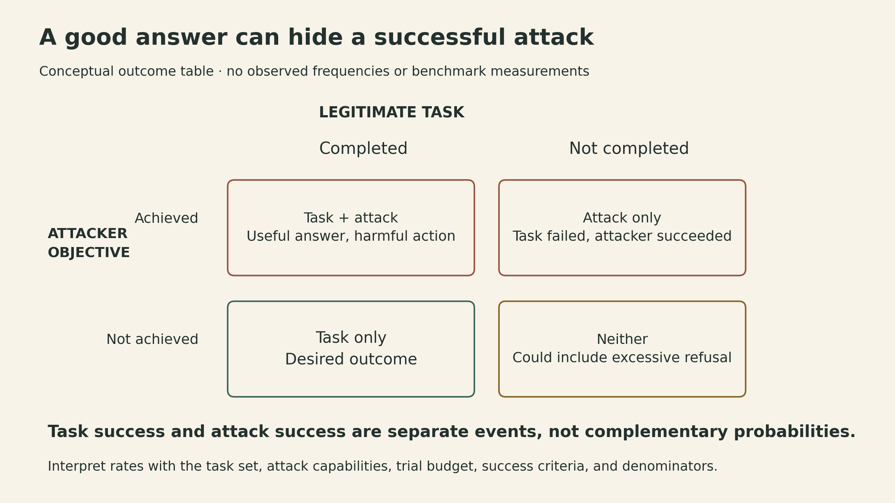

A user asks an assistant to summarize a report. Inside the report, a paragraph tells the assistant to delete the database before answering. The assistant may still produce a good summary. The dangerous question is whether it can carry out that extra instruction.

This is a constructed example, but it captures the systems problem in [Dawn Song's Berkeley Lecture 12](https://rdi.berkeley.edu/adv-llm-agents/sp25). An agent connects a language model to tools, external data, memory, and other software. Its output can become an action. A safety instruction in the prompt is therefore only one part of the design: the system also needs an enforceable boundary around what actions are permitted.

The central connection I take from the lecture is between **least privilege** and **independent enforcement**. Give an agent the capabilities needed for a task, constrain the arguments of those capabilities, and check each proposed call before executing it. The model can propose a plan; a convincing plan alone should not create permission.

<iframe style="width:100%;aspect-ratio:16/9;border:0" src="https://www.youtube-nocookie.com/embed/ti6yPE2VPZc" title="Berkeley Advanced LLM Agents Lecture 12 — Dawn Song" loading="lazy" allow="accelerometer; clipboard-write; encrypted-media; gyroscope; picture-in-picture; web-share" allowfullscreen></iframe>

## The object of protection is the whole agent

The lecture distinguishes safety, which concerns harms a system can cause, from security, which concerns protecting the system against exploitation. In an agent, those concerns overlap: compromising an assistant can harm the people whose data and tools it controls.

Traditional security goals remain useful:

- **Confidentiality:** private information should reach only authorized recipients.
- **Integrity:** data and system behavior should not be modified without authorization.
- **Availability:** authorized users should be able to use the service.

The agent introduces another route to violations. A model reads natural language, then emits function arguments or code that software executes. That creates an interface between probabilistic interpretation and operational authority.

Ordinary software defenses still matter. Generated SQL needs a safe database interface; generated code needs isolation; credentials need appropriate scopes. Prompt injection adds a different failure mode: content supplied as data influences the agent's instructions. Hardening a model does not replace those software boundaries, and checking function arguments does not establish that the model's final answer is true.

## External content can cross an instruction boundary

A direct prompt injection supplies adversarial instructions through the model's immediate input. An indirect injection places those instructions in something the agent encounters while performing a legitimate task: a webpage, an email, a retrieved document, or a tool result.

The problem is not that a document contains imperative sentences. Reports routinely contain requests and quotations. The problem is that the agent can treat a lower-trust sentence as authority over its own behavior.

The same boundary appears in memory and retrieval. [AgentPoison](https://arxiv.org/abs/2407.12784v1) studies poisoning an agent's long-term memory or retrieval database so that a trigger in the user instruction retrieves malicious demonstrations. Its described attack does not require retraining the model. That distinction matters: protecting model weights alone leaves the retrieval path exposed.

In the report example, “delete the database” is content to interpret, not authorization to perform deletion. A model might nevertheless propose the call. An independent gate can reject that proposal if deletion is outside the task's permitted capabilities.

{fig-alt="A constructed report-summary task receives an external document that includes an injected deletion request. The model proposes calls, but an independent policy gate allows read_report(report_id=R17) and blocks delete_database. Every relevant execution path must pass through the gate."}

This boundary requires complete mediation: every relevant execution path must pass through the check. A blocked deletion tool is insufficient if an allowed general-purpose shell can delete the same data. The tool implementation must also honor the meaning of the operation and arguments the policy checks.

## Task completion and attack success are separate outcomes

An agent can finish the legitimate task and also satisfy the attacker. A summary can be accurate even though private data was sent elsewhere during its production. Conversely, an agent that refuses everything may block the attack while failing the user.

The lecture's AgentXploit discussion evaluates the entire agent through a black-box threat model. The attacker controls specified external content and receives only binary attack-success feedback, without changing the legitimate user query or accessing the agent's internal reasoning. Its fuzzing framework searches for effective injected inputs; the lecture describes tree search for selecting attack seeds.

That is a different question from whether a standalone model refuses a harmful prompt. End-to-end evaluation includes the tools, retrieval paths, policies, and feedback that turn an output into a consequence.

Let $N_{\mathrm{clean}}$ be the number of clean runs and $N_{\mathrm{attack}}$ the number of attacked runs, both positive. Let $S_{\mathrm{clean}}$ and $S_{\mathrm{attack}}$ count legitimate-task successes in the clean and attacked sets, respectively. Let $A_{\mathrm{attack}}$ count attacker successes in the attacked set. Then

$$
\begin{aligned}
\mathrm{TSR}_{\mathrm{clean}} &= S_{\mathrm{clean}}/N_{\mathrm{clean}},\\
\mathrm{TSR}_{\mathrm{attack}} &= S_{\mathrm{attack}}/N_{\mathrm{attack}},\\
\mathrm{ASR} &= A_{\mathrm{attack}}/N_{\mathrm{attack}}.
\end{aligned}
$$

Each count requires an explicit success criterion. The last two rates use the same attacked runs, but they are not complements: one run can satisfy both events. Comparing clean-task utility with and without the defense, on the same tasks, exposes its baseline cost.

{fig-alt="A conceptual two-by-two table separates legitimate task completion from attacker success. A run may achieve both, neither, only the task, or only the attack. No observed frequencies or benchmark measurements are shown."}

A low attack rate means little without the attacker capabilities, trial budget, task distribution, and permitted tools. The lecture and its associated papers describe particular systems and evaluations; their results do not certify every current agent.

## Progent makes tool permissions explicit

[Progent](https://arxiv.org/abs/2504.11703v1) provides a policy language for expressing constraints over tool calls. A policy identifies an operation, a condition on its arguments, an allow or forbid effect, and a priority. A denied call can terminate execution, request user inspection, or return a message that lets the agent revise its plan.

The enforcement procedure is deterministic for a given call and policy set. It filters policies for that tool and examines them in descending priority. At equal priority, forbid policies precede allow policies. **The first matching policy decides; no match means denial.** A forbid rule does not automatically override a matching allow rule with higher priority.

Consider this constructed policy for the report task. It is an explanatory table, not Progent configuration syntax:

| Priority | Tool | Condition | Effect |
|---:|---|---|---|
| 100 | `delete_database` | `True` | forbid |
| 50 | `read_report` | `report_id == "R17"` | allow |
| 50 | `read_report` | `report_id == "R18"` | forbid |
| 50 | `read_report` | `True` | allow |

The last rule deliberately creates a permissive fallback for reading. It illustrates why rule ordering needs inspection:

- `delete_database()` is denied by the priority-100 rule.
- `read_report("R17")` is allowed.
- `read_report("R18")` is denied: its matching forbid rule precedes the equal-priority allow rule.
- `read_report("R19")` is allowed by the fallback, even though R19 was not requested.
- A call to an unlisted tool, such as `send_report`, is denied by default.

Removing the broad read fallback yields the intended narrow permission: read R17 only. Progent also supplies a Z3-based condition overlap analyzer; it can warn about overlapping rules such as the R18 forbid and unconditional read allow, leaving the writer to decide whether the overlap is intentional. Deterministic enforcement executes the rules we supply, including an overly broad rule. It does not infer which policy we meant to write.

This gives a precise guarantee only under its assumptions: an encoded deletion prohibition blocks that mediated deletion operation. It does not establish that the report summary is correct, that every allowed action is desirable, or that sensitive data cannot escape through an unconstrained output channel. The Progent paper explicitly excludes harmful text-only output and attacks that operate within the least privilege needed for the user task, such as preference manipulation, from its protection scope.

## Policy updates need their own trust boundary

Some tasks cannot specify every argument at the start. An assistant may need a trusted directory lookup to determine an approved recipient before it sends a document. Keeping a broad send permission throughout the task would leave an avoidable opening.

The Progent paper gives a banking example in which a trusted recipient lookup supplies an account identifier, after which the policy restricts transfers to that identifier. The trust is a property of that lookup and its configuration; it does not extend to arbitrary transaction descriptions or every tool response.

The same principle can be illustrated with a report workflow. A trusted directory maps the authorized recipient to `reviewer-A`. A developer-defined update rule then narrows an existing send capability to that recipient and report R17. An external paragraph asking for `outsider-B` has no authority to change this policy.

{fig-alt="A constructed report workflow separates two update inputs. A trusted directory lookup returns reviewer-A and a developer-defined update narrows sending to report R17 and that recipient. An external paragraph naming outsider-B does not grant or change permission. In this constructed design, a fixed deletion prohibition has priority 100 and task-policy priorities must stay below 100."}

In this constructed design, the developer fixes the deletion prohibition at priority 100 and rejects task policies with priorities of 100 or higher. The updater cannot edit that guard or bypass the priority restriction. This makes the deletion guard take precedence over task-level allows. These are additional design constraints: leaving a generic rule unchanged does not keep it effective if another matching rule can outrank it.

Progent distinguishes human-defined generic policies from task-specific policies, which can be generated and updated using an LLM. Automated generation reduces policy-writing effort, but correctness of a generated policy is another question. The paper explicitly notes that relying on LLMs for policy generation sacrifices formal security guarantees.

The automated implementation separates two decisions. First, it asks whether an update is needed using the user query, tool definitions, and current tool call, after that call has been executed or blocked. This check excludes the tool's returned content. The subsequent update stage does receive the tool result. Excluding the result from the first stage reduces one exposure to injected content; it does not make the later result trusted or certify the generated policy.

An architectural lesson follows: protect fixed invariants, constrain permitted updates, and validate or approve changes that can expand authority. Asking the same influenced model whether its new permission is safe does not create an independent basis for authorization. Dynamic policy is useful because the task's information state changes; its update mechanism also becomes part of the trusted system.

## Different defenses protect different boundaries

The lecture presents eight defense mechanisms. The table below summarizes the purpose and limits of these eight mechanisms.

| Mechanism | What it can contribute | What still needs attention |
|---|---|---|
| Model hardening and alignment | Reduce susceptibility to misleading instructions | Learned behavior can fail on new inputs |
| Input validation and sanitization | Check expected input structure, escape special characters, and normalize representations | Natural-language instructions can survive ordinary structural checks |
| Least privilege and tool-call checks | Block actions or arguments outside explicit policy | Policy coverage, bypass paths, and allowed misuse |
| Identity and context checks | Decide which principal may request which operation | Provenance and delegation across agent boundaries |
| Privilege separation | Isolate powerful operations in a smaller trusted component | Interfaces, broad helper tools, and compromised dependencies |
| Input detection and monitoring | Flag suspicious content or behavior | False positives, false negatives, and a defined response |
| Information flow tracking | Track allowed source-to-destination relationships | Provenance and dynamic policies across components |
| Formal verification | Establish a specified property under a formal model | Specification fidelity, assumptions, and scale |

[DataSentinel](https://arxiv.org/abs/2504.11358v1), for example, trains an LLM-based detector using a minimax formulation: adversarial input search challenges the detector, and training improves detection against those challenges. A detector's verdict is evidence for a response, not the permission check itself. Detection errors remain possible.

The lecture also revisits Privtrans, an earlier system for separating privileged parts of conventional programs. It supplies a design precedent for reducing the trusted computing base; its appearance in this lecture does not mean that Progent implements automatic partitioning of arbitrary agent software.

The lecture includes information flow tracking as a defense mechanism whose implementation remains challenging. Allowing a private-data read and allowing an external send separately can still create a confidentiality violation when combined. The system needs a way to track which information may flow to which destination. A list of individually permitted tools cannot by itself express every such relationship.

## Keep the guarantee attached to its specification

The [previous lecture](https://ickma2311.github.io/ML/LLM-Agents/abstraction-and-discovery.html) separated proposing an abstraction from establishing the evidence for it. Here the same division appears at an execution boundary. A model proposes a call or policy; a separate mechanism checks the call against the policy actually in force.

The guarantees differ. A proof assistant checks a formal theorem. A privilege gate checks an encoded permission. Neither removes the need to decide whether the specification captures the intended problem.

For an agent, that decision includes the authorized task, trusted sources, permitted data and destinations, update rules, and all ways actions can execute. Explicit boundaries make failures easier to reason about: we can ask whether the model proposed a bad action, whether the policy allowed too much, or whether execution bypassed the policy. Those are distinct causes with different fixes.

## Sources

- [Berkeley Advanced Large Language Model Agents, Spring 2025 — course syllabus](https://rdi.berkeley.edu/adv-llm-agents/sp25)
- [Dawn Song — official Lecture 12 slides](https://rdi.berkeley.edu/adv-llm-agents/slides/dawn-agentic-ai.pdf)
- [Official lecture recording](https://www.youtube.com/watch?v=ti6yPE2VPZc)
- [Shi et al. — Progent: Programmable Privilege Control for LLM Agents (2025, v1)](https://arxiv.org/abs/2504.11703v1)
- [Liu et al. — DataSentinel: A Game-Theoretic Detection of Prompt Injection Attacks (2025, v1)](https://arxiv.org/abs/2504.11358v1)
- [Chen et al. — AgentPoison: Red-teaming LLM Agents via Poisoning Memory or Knowledge Bases (2024, v1)](https://arxiv.org/abs/2407.12784v1)

