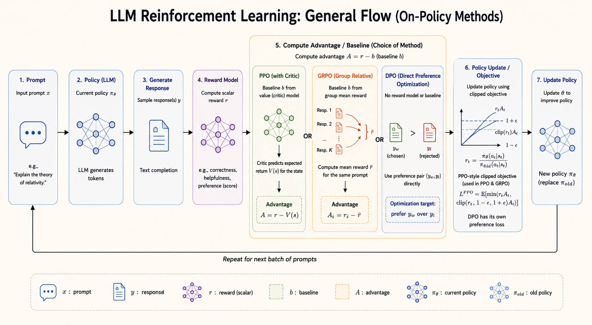

<iframe width="100%" height="500" src="https://www.youtube.com/embed/eEssbb3E98s" title="CMU Advanced NLP Lecture 16: Reinforcement Learning for LLMs" frameborder="0" allowfullscreen></iframe>

This lecture explains how reinforcement learning is used to improve language models after pretraining or supervised fine-tuning. The key idea is simple: let the model generate outputs, evaluate those outputs with a reward signal, and update the model so high-reward outputs become more likely.

# RL Framework for LLMs

## Three Basic Ingredients

RL for LLMs usually has three moving parts:

- **Generate output:** the model samples one or more responses from its current policy.
- **Evaluate reward:** a rule, verifier, reward model, or human-preference model scores each response.
- **Update parameters:** the model is trained to increase the probability of better responses while keeping updates stable.

The main modeling choice is how to view text generation as a reinforcement-learning problem.

## One-Step MDP

In a one-step MDP, the model generates the whole response as one action.

- **State:** the prompt, or prompt plus context.
- **Action:** a complete response.
- **Policy:** the LLM distribution $p_\theta(y \mid x)$.
- **Reward:** a scalar score on the full generated sequence.

Example:

```text
Prompt: What is 2 + 3?
Response: Let's think step by step. 2 + 3 = 5.
Reward: 1 if the final answer is correct, otherwise 0.
```

This view is clean and often useful when the reward is only available after the full answer is generated.

## Token-Level MDP

In a token-level MDP, generation is treated as a sequence of actions.

- **State:** the prompt plus tokens generated so far.
- **Action:** the next token.
- **Policy:** $p_\theta(y_t \mid y_{<t}, x)$.
- **Reward:** usually zero at intermediate steps and nonzero at the end.

One common sparse-reward setup is:

$$
r_t = 0 \quad \text{for } t < T
$$

$$
r_T = r(x, y)
$$

This matches autoregressive generation more directly, but credit assignment becomes harder: the final reward must be assigned back to earlier token choices.

## Policy Gradient

Let the language model be the policy:

$$
p_\theta(y \mid x)
$$

For a generated output $y = (y_1, \dots, y_T)$, the log-probability factorizes as:

$$
\log p_\theta(y \mid x)
=
\sum_{t=1}^{T}
\log p_\theta(y_t \mid y_{<t}, x)
$$

Policy gradient increases the probability of actions that lead to high reward. A common training loss is:

$$
L_{\text{PG}}
=
-
\sum_{t=1}^{T}
A_t
\log p_\theta(y_t \mid y_{<t}, x)
$$

where $A_t$ is an advantage estimate. Intuitively:

- If $A_t > 0$, increase the probability of that token.
- If $A_t < 0$, decrease the probability of that token.
- If $A_t$ is close to 0, the update should be small.

## Group-Based Advantage

A practical way to estimate advantage for LLMs is to sample multiple outputs for the same prompt.

For each input $x_i$:

1. Generate $K$ outputs.
2. Compute a reward for each output.
3. Compare each reward against the group's average reward.

One normalized form is:

$$
A^{i,k}
=
\frac{
r^{i,k}
-
\operatorname{mean}(r^{i,1}, \dots, r^{i,K})
}{
Z
}
$$

where $Z$ is often the group standard deviation, sometimes with a small constant for numerical stability.

This avoids training a separate value function, but it does not fully solve token-level credit assignment. The reward still belongs to the whole response, not to a specific intermediate token.

## PPO

PPO, or Proximal Policy Optimization, controls how far the new policy can move from the old policy in one update.

For each generated token, define the probability ratio:

$$
\rho_t(\theta)
=
\frac{
p_\theta(y_t \mid y_{<t}, x)
}{
p_{\theta_{\text{old}}}(y_t \mid y_{<t}, x)
}
$$

The clipped PPO objective is:

$$
L_{\text{PPO}}
=
\min
\left(
\rho_t(\theta) A_t,
\operatorname{clip}
(\rho_t(\theta), 1 - \epsilon, 1 + \epsilon) A_t
\right)
$$

The ratio tells us how much the new model changed the probability of the sampled action:

- $\rho_t = 1$: no change from the old policy.
- $\rho_t > 1$: the new policy gives the action higher probability.
- $\rho_t < 1$: the new policy gives the action lower probability.

The clipping term prevents overly large policy updates. This matters for LLMs because a model can become unstable if RL pushes it too far from its pretrained or supervised behavior.

In code, the core operation looks like:

```python
ratio = torch.exp(selected_log_probs - old_selected_log_probs)
clipped_ratio = torch.clamp(ratio, 1 - eps, 1 + eps)
objective = torch.min(ratio * advantages, clipped_ratio * advantages)
loss = -objective.mean()
```

## Key Decisions

When applying RL to LLMs, the important choices are:

- Whether to start RL directly from a pretrained model or from a supervised fine-tuned model.
- Which prompts or datasets to train on.
- What reward function to use.
- How to estimate advantages.
- Which policy-gradient objective and hyperparameters to use.
- How strongly to constrain the model from drifting.

It is often beneficial to fine-tune before RL:

- It teaches the model the task format.
- It uses supervision from available data.
- It makes high-reward examples easier to discover during RL.

The tradeoff is that supervised fine-tuning can narrow the model's output distribution.



# Examples

## Reversing a String

For a simple verifiable task, the reward can be rule based.

```text
Task: Reverse a string.
Input: hello
Correct output: olleh
```

A reward function can be:

$$
r(x, y)
=
\begin{cases}
1 & \text{if the answer is correct} \\
0 & \text{otherwise}
\end{cases}
$$

A reasonable training recipe is:

1. Start with supervised fine-tuning so the model learns the input-output format.
2. Generate multiple candidate answers for each input.
3. Score answers with the rule-based verifier.
4. Use group-based advantages and PPO to improve the policy.

This is a clean RL setting because the reward is cheap, deterministic, and verifiable.

## Solving Math Problems

Math reasoning has a similar structure, but the output is more complex.

- **Input:** a problem statement.
- **Output:** reasoning steps plus a final answer.
- **Reward:** answer correctness, format correctness, or both.

The MDP is often treated as one-step at the sequence level: the model generates a complete solution and receives reward after the final answer is checked.

Useful rewards include:

- **0/1 answer reward:** whether the final answer is correct.
- **Format reward:** whether the output follows the required structure, such as including a final answer field.

PPO with group-based advantages can compare several sampled solutions for the same problem. A KL penalty is often added so the policy does not drift too far from the original model.

## Aligning with Human Preference

For open-ended chat, there is usually no single correct answer. The key challenge is reward design.

Instead of a rule-based verifier, RLHF uses human preference data:

1. **Supervised fine-tuning:** train an instruction-following model on high-quality prompt-response examples.
2. **Reward modeling:** train a reward model to predict which response humans prefer.
3. **RL optimization:** optimize the language model to maximize the reward model's score, usually with PPO or a related policy-optimization method.

## Reward Modeling

A reward model assigns a scalar score:

$$
r_\phi(x, y)
$$

It is commonly trained from preference pairs:

- $y_+$: the response preferred by a human.
- $y_-$: the less preferred response.

The pairwise preference loss is:

$$
\mathcal{L}_{\text{RM}}
=
-
\sum_{(x, y_+, y_-) \in D}
\log
\sigma
\left(
r_\phi(x, y_+)
-
r_\phi(x, y_-)
\right)
$$

The model learns to give higher scores to preferred responses than to rejected responses.

## Reward Hacking

Reward hacking happens when the model finds a way to maximize the reward without actually solving the intended task.

Examples:

- A model exploits a formatting rule without producing a useful answer.
- A model repeats phrases that the reward model tends to like.
- A model becomes overly cautious or refusal-prone because that pattern scores well.

This is why the reward function and the stability constraints matter.

## KL Divergence Constraint

RLHF usually includes a penalty that keeps the new policy close to a reference policy $p_0$:

$$
\underset{\theta}{\arg\max}\;
\mathbb{E}_{x,\,y \sim p_\theta}
\left[
r(x, y)
\right]
-
\beta
D_{\mathrm{KL}}
\left(
p_\theta(\cdot \mid x)
\;\Vert\;
p_0(\cdot \mid x)
\right)
$$

The KL term acts as a constraint:

- Higher $\beta$ keeps the model closer to the reference policy and improves stability.
- Lower $\beta$ gives the model more freedom to optimize reward, but increases the risk of reward hacking or degraded language quality.

The practical goal is balance: improve the model with reward feedback without losing the useful behavior learned during pretraining and supervised fine-tuning.

# Key Takeaway

RL for LLMs is less about discovering a long-horizon strategy in a physical environment and more about improving generation with feedback. The model samples text, receives a reward on the output, and updates its token probabilities through policy optimization. The hard parts are reward design, credit assignment, and keeping the model stable while it improves.

*Source: CMU Advanced NLP Fall 2025, Lecture 16: Reinforcement Learning for LLMs.*
