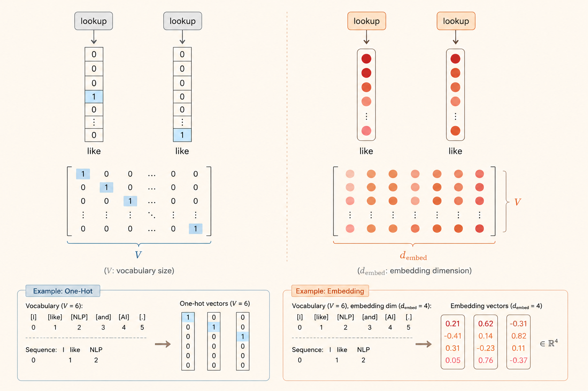
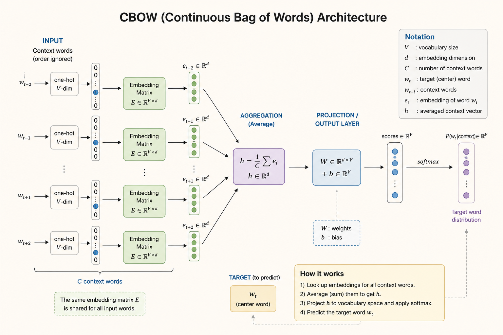
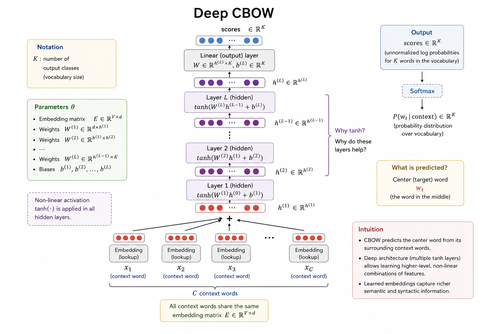

<iframe width="100%" height="500" src="https://www.youtube.com/embed/Q-xjR1qspD4" title="CMU Advanced NLP Lecture 2: Learned Representation" frameborder="0" allowfullscreen></iframe>

This lecture moves from discrete text to learned vector representations. The main pipeline is:

$$
\text{text}
\rightarrow
\text{tokens}
\rightarrow
\text{embeddings}
\rightarrow
\text{pooled representation}
\rightarrow
\text{classifier}
$$

## Tokenization

Tokenization maps raw text into a sequence of discrete tokens from a vocabulary.

For a sentence such as "the companies are expanding," there are several possible tokenizations:

- **Whole words:** "the", "companies", "are", "expanding"
- **Subwords:** "the", "compan", "_ies", "are", "expand", "_ing"
- **Characters:** "t", "h", "e", "c", "o", "m", "p", "a", "n", ...

We can write the token sequence as:

$$
x_1, x_2, \dots, x_T
$$

The vocabulary has two goals:

- **Expressive:** it should represent many kinds of text, including different languages and code.
- **Efficient:** it should balance vocabulary size against sequence length.

### Practical Tool: TikToken

TikToken loads existing OpenAI tokenization vocabularies.

```python
import tiktoken

enc_gpt2 = tiktoken.get_encoding("gpt2")
print(enc_gpt2.encode("Hello, こんにちは"))
# [15496, 11, 23294, 241, 22174, 28618, 2515, 94, 31676]

enc_cl100k = tiktoken.get_encoding("cl100k_base")
print(enc_cl100k.encode("Hello, こんにちは"))
# [9906, 11, 220, 90115]
```

## Token Embeddings

A token embedding is a dense vector in:

$$
\mathbb{R}^{d_{\text{dim}}}
$$



### Embedding Layer

An embedding layer acts like a lookup table. Each token ID indexes a vector in a learned matrix.

Think of the embedding matrix as:

$$
E \in \mathbb{R}^{V \times d_{\text{emb}}}
$$

where:

- $V$ is the vocabulary size.
- $d_{\text{emb}}$ is the embedding dimension.
- Each row stores the vector for one token.

When the model receives a token, it does not compute the vector from scratch. It looks up the corresponding row in $E$.

## CBOW

CBOW, or Continuous Bag of Words, builds a sentence representation by aggregating word embeddings.



### How It Works

Given a token sequence:

$$
x_1, x_2, \dots, x_T
$$

CBOW does three things:

1. Map each token to a dense vector.
2. Sum or average those embeddings into one vector.
3. Feed the pooled vector into a linear classifier.

In notation:

$$
h
=
\frac{1}{T}
\sum_{t=1}^{T}
\operatorname{Embed}(x_t)
$$

Then the classifier computes scores for $K$ classes:

$$
s = Wh + b
$$

The "bag of words" part means word order is ignored. The model sees the sentence as a collection of word features.

### Simple Embedding Layer

```python
import torch
import torch.nn as nn

class Embedding(nn.Module):
    def __init__(self, vocab_size, emb_size):
        super().__init__()
        self.weight = nn.Parameter(torch.randn(vocab_size, emb_size))
        self.vocab_size = vocab_size

    def forward(self, x):
        xs = torch.nn.functional.one_hot(
            x,
            num_classes=self.vocab_size,
        ).float()
        return torch.matmul(xs, self.weight)
```

### Simple CBOW

```python
class CBoW(nn.Module):
    def __init__(self, vocab_size, num_labels, emb_size):
        super().__init__()
        self.embedding = nn.Embedding(vocab_size, emb_size)
        self.output_layer = nn.Linear(emb_size, num_labels)

    def forward(self, tokens):
        emb = self.embedding(tokens)       # [len(tokens), emb_size]
        emb_sum = torch.sum(emb, dim=0)    # [emb_size]
        h = emb_sum.view(1, -1)            # [1, emb_size]
        out = self.output_layer(h)         # [1, num_labels]
        return out
```

### Limitation

CBOW cannot distinguish sentences that contain the same words in different orders.

For example:

```text
I hate this movie
movie this hate I
```

Both contain the same words, so a pure bag-of-words representation loses the structural difference.

## Vector Representation

The goal of learned vectors is to make useful linguistic properties available to the model.

- **Semantic similarity:** words with related meanings should have nearby vectors.
- **Feature representation:** each dimension can encode a learned feature.
- **Continuous representation:** dense vectors are more compact than sparse one-hot vectors and can capture graded similarity.

## Neural Network

### Deep CBOW

Deep CBOW keeps the same pooled CBOW representation, then feeds it through one or more nonlinear layers.



The basic structure is:

$$
\text{tokens}
\rightarrow
\text{embeddings}
\rightarrow
\text{sum/mean pooling}
\rightarrow
\text{nonlinear layers}
\rightarrow
\text{class scores}
$$

### Linear Collapse

Stacking linear layers without nonlinear activation does not really make the model deeper. For example:

$$
W_2(W_1x) = (W_2W_1)x
$$

The two layers collapse into one linear transformation. A nonlinear activation such as `tanh` or `ReLU` breaks this collapse and lets the network model more complex feature interactions.

```python
class DeepCBoW(nn.Module):
    def __init__(self, vocab_size, num_labels, emb_size, hid_size):
        super().__init__()
        self.embedding = nn.Embedding(vocab_size, emb_size)
        self.linear1 = nn.Linear(emb_size, hid_size)
        self.output_layer = nn.Linear(hid_size, num_labels)

    def forward(self, tokens):
        emb = self.embedding(tokens)
        emb_sum = torch.sum(emb, dim=0)
        h = emb_sum.view(1, -1)
        h = torch.tanh(self.linear1(h))
        out = self.output_layer(h)
        return out
```

### What Do The Vectors Represent?

With nonlinear layers, a model can learn feature combinations rather than only adding features independently.

For example, a hidden unit can learn a pattern like:

```text
feature 1 AND feature 5 are both active
```

This helps model some linguistic interactions, such as negation. However, if the input has already been mean-pooled, the model still cannot recover the original word order.

## Training

Training has three recurring steps:

1. **Define the loss:** choose a function that measures prediction error.
2. **Calculate gradients:** compute how each parameter affects the loss.
3. **Update parameters:** move parameters in a direction that reduces the loss.

## Loss

### Binary Cross-Entropy

Binary cross-entropy is used for two-class classification, such as positive vs. negative sentiment.

If the model outputs probability $p$ for the positive class and the label is $y \in \{0, 1\}$:

$$
L_{\text{BCE}}
=
-y \log(p)
-
(1-y)\log(1-p)
$$

When $y=1$, minimizing the loss pushes $p$ toward $1$. When $y=0$, minimizing the loss pushes $p$ toward $0$.

### Multi-Class Cross-Entropy

For multiple classes, the model first converts scores into probabilities with softmax:

$$
p_i
=
\operatorname{softmax}(z_i)
=
\frac{e^{z_i}}{\sum_j e^{z_j}}
$$

With a one-hot label vector $y$, cross-entropy is:

$$
L_{\text{CE}}
=
\sum_i -y_i \log(p_i)
$$

Only the correct class contributes to the loss when $y$ is one-hot.

## Small Experiment: CBOW vs. Deep CBOW

I ran a small sentiment-classification experiment on Hugging Face `rotten_tomatoes`.

Dataset:

- Train: 8,530 examples
- Validation: 1,066 examples
- Test: 1,066 examples
- Classes: 2
- Vocabulary size: 8,845 with `min_freq = 2`
- Token limit: 80 tokens

Models:

- **CBOW:** `Embedding(128)` -> mean pooling -> linear projection.
- **Deep CBOW:** `Embedding(128)` -> mean pooling -> 3 hidden layers (`128` units, ReLU, dropout `0.2`) -> linear projection.

Both models were trained for 20 epochs with AdamW using `lr = 2e-3`. The reported result is from the checkpoint with the best validation accuracy.

| Seed | CBOW Val | CBOW Test | Deep CBOW Val | Deep CBOW Test |
|---:|---:|---:|---:|---:|
| 7 | 75.89% | 77.67% | 75.33% | 75.98% |
| 13 | 76.92% | 76.92% | 75.14% | 75.89% |
| 21 | 76.45% | 78.14% | 75.42% | 74.86% |
| **Average** | **76.42%** | **77.58%** | **75.30%** | **75.58%** |

The deeper ReLU model improves slightly over a shallower Deep CBOW variant, but it still underperforms the simple CBOW baseline on average test accuracy.

The likely reason is that depth is added after mean pooling. By then, word order has already been removed:

$$
\text{word sequence}
\rightarrow
\text{unordered pooled vector}
\rightarrow
\text{deep classifier}
$$

So the classifier has more capacity, but it does not receive the missing sequence structure.

---

*Source: CMU Advanced NLP Fall 2025, Lecture 2: Learned Representation.*
