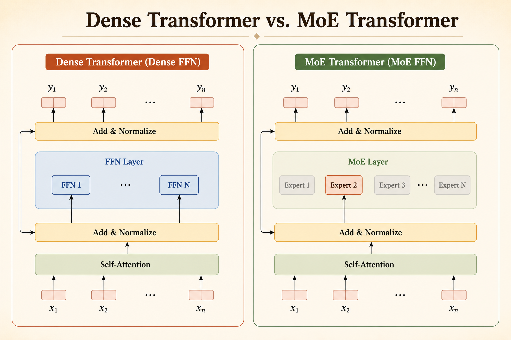
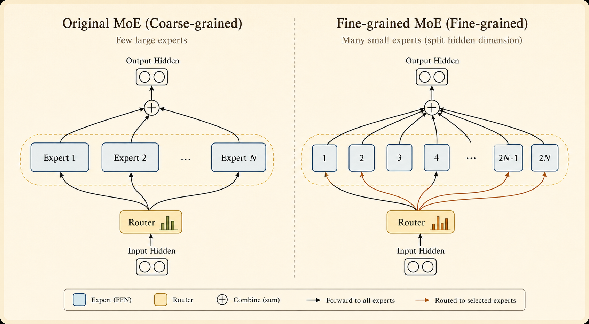

Mixture of Experts (MoE) replaces dense Transformer feed-forward layers with sparse expert layers. The model can have many parameters, but only a small subset is active for each token during training and inference.

The core trade-off is:

- **Scale parameter count** while keeping active FLOPs roughly fixed.
- **Reduce training compute** compared with using an equally large dense FFN.
- **Pay extra system complexity** for routing, balancing, and communication.

# Key Idea

An MoE layer is a neural network layer that activates only some of its parameters for each token. In modern LLMs, MoE is usually applied to the feed-forward layers inside Transformer blocks.

For a standard Transformer layer:

$$
\begin{aligned}
\tilde{h}_{1:T} &= \operatorname{Attn}(h_{1:T}) + h_{1:T} \\
h'_{1:T} &= \operatorname{FFN}(\tilde{h}_{1:T}) + \tilde{h}_{1:T}
\end{aligned}
$$

For an MoE Transformer layer:

$$
\begin{aligned}
\tilde{h}_{1:T} &= \operatorname{Attn}(h_{1:T}) + h_{1:T} \\
h'_{1:T} &= \operatorname{MoE}(\tilde{h}_{1:T}) + \tilde{h}_{1:T}
\end{aligned}
$$

The MoE module has two main pieces:

- **Experts:** $N$ feed-forward networks, $\operatorname{FFN}_1, \dots, \operatorname{FFN}_N$, each with its own parameters.
- **Router:** a learned function that selects one or more experts for each input token.

# Expert Design

## Where Experts Go

Most MoE language models place experts in the feed-forward layers.

- **Typical:** replace FFN layers with MoE layers.
- **Less common:** put experts in attention layers.
- **Practical trend:** use MoE in many or all FFN layers.

Attention experts can be unstable, while FFN experts are simpler and map naturally onto sparse computation.

## Expert Count

Increasing the number of experts increases total parameters.

- More experts usually improve quality because the model has more specialized capacity.
- Gains eventually show diminishing returns.
- Active FLOPs can stay fixed, but total memory and parameter-management cost increase.

## Fine-Grained Experts

Instead of using a few large experts, we can split the hidden dimension into smaller expert chunks.

- If each expert is smaller, the model can have more expert choices at similar total parameter count.
- More fine-grained experts give the router more possible expert combinations per token.

## Shared Experts

Some MoE designs include shared experts that are always active, plus routed experts chosen dynamically.

- **Shared experts** learn common information needed by most tokens.
- **Routed experts** specialize on more token-specific patterns.
- This reduces redundant learning across routed experts.

# Routing Functions

## Basic Idea

Routing computes a score for each token-expert pair.

- **Token choice:** each token selects its top-$k$ experts. This is common in LLMs.
- **Expert choice:** each expert selects its top-$k$ tokens. This guarantees more balanced expert load.
- **Global choice:** assignments are chosen by a batch-level optimization.

## Computing Scores

Each expert has a learned weight vector $e_i$. For token hidden state $\tilde{h}_t$, the router computes:

$$
s_{t,i}
=
\operatorname{softmax}_i(\tilde{h}_t^T e_i)
$$

Then the top-$K$ experts are selected:

$$
g_{i,t}
=
\begin{cases}
s_{t,i}, & i \in \operatorname{TopK}(\{s_{t,j} \mid 1 \le j \le N\}, K) \\
0, & \text{otherwise}
\end{cases}
$$

The final output combines the selected experts with the residual connection:

$$
h'_t
=
\sum_{i=1}^{N}
g_{i,t}\operatorname{FFN}_i(\tilde{h}_t)
+
\tilde{h}_t
$$

# Top-k Token Choice Routing

Top-k token choice is simple: each token chooses the experts with the highest routing scores.

## Pros

- Every input token is assigned to at least one expert.
- The routing rule is simple to compute.
- It works well enough to be widely used.

## Potential Issues

- **Load imbalance:** many tokens may choose the same expert.
- **Token dropping:** an overloaded expert may exceed capacity, forcing some tokens to skip that MoE layer.
- **Non-differentiability:** the top-k selection itself is discrete, which complicates training.

# Alternative Routing Strategies

## Expert Choice

Expert choice reverses the decision: each expert chooses a fixed number of tokens to process.

Benefits:

- It guarantees load balancing during training.
- It can allocate more computation to important or difficult tokens.

Costs:

- It does not naturally match autoregressive inference, where tokens arrive one at a time.
- A token may be ignored if no expert selects it.

## Hash Routing

Hash routing removes the learned router. A deterministic hash function maps each token to an expert.

- **Pros:** no learned routing parameters and a surprisingly strong baseline.
- **Cons:** the router cannot adapt to data, so it is ultimately less flexible.

## Reinforcement Learning Routing

Routing can also be framed as a decision problem: the router acts as a policy, expert selection is the action, and language-modeling quality provides the reward.

This is principled, but usually expensive and unstable:

- RL has high-variance gradients.
- It adds training overhead.
- At large scale, simpler top-k methods are often competitive enough to justify their use.

# Auxiliary Losses

## Balance Loss

Routers can collapse by sending too many tokens to the same expert. A balance loss penalizes this behavior:

$$
L
=
\alpha
\sum_{i=1}^{N}
f_i P_i
$$

where:

- $f_i$ is the fraction of tokens actually routed to expert $i$.
- $P_i$ is the average router probability assigned to expert $i$.
- $\alpha$ controls the strength of the balancing penalty.

The goal is to keep experts used more uniformly, which improves both model utilization and hardware utilization.

## Z-Loss for Router Stability

Router logits can become numerically large, especially during large-scale training with lower precision formats such as BF16. The Z-loss penalizes large log-sum-exp values:

$$
L_Z(x)
=
\frac{1}{B}
\sum_{i=1}^{B}
\left(
\log
\sum_{j=1}^{N}
e^{x_{i,j}}
\right)^2
$$

Here $x_{i,j}$ is the router logit for token $i$ and expert $j$. Penalizing the log partition term keeps router logits bounded and reduces numerical instability.

# Expert Parallelism

Dense models usually use data parallelism or model parallelism. MoE adds another dimension: **expert parallelism**.

- Experts are placed on different devices.
- Tokens are dispatched to the devices that host their selected experts.
- Expert outputs are sent back and combined.

The benefit is memory scale: the model can contain many more parameters than a dense model with the same active FLOPs.

The cost is communication. Routing tokens to experts creates all-to-all traffic, so network bandwidth can become the bottleneck.

# Takeaway

MoE is a way to scale model capacity without scaling active computation linearly. The hard part is not the basic idea; it is making sparse routing trainable, balanced, numerically stable, and efficient across devices.

*Source: CMU Advanced NLP Fall 2025, Lecture 21: Mixture of Experts.*
