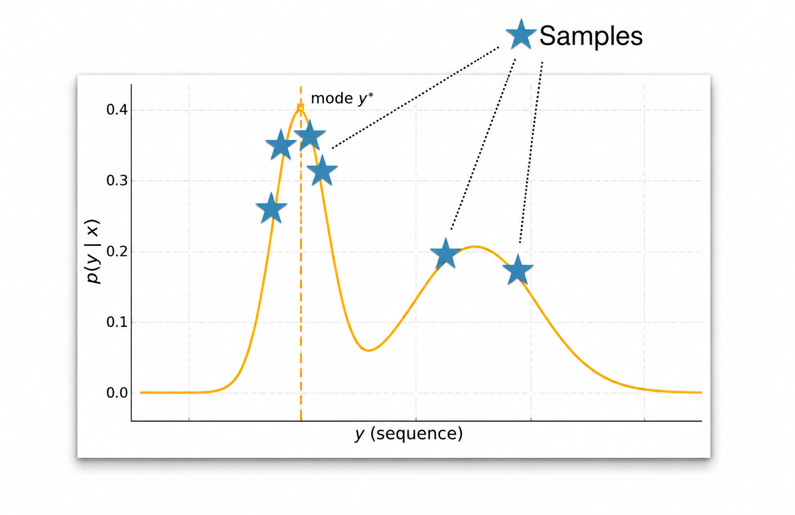
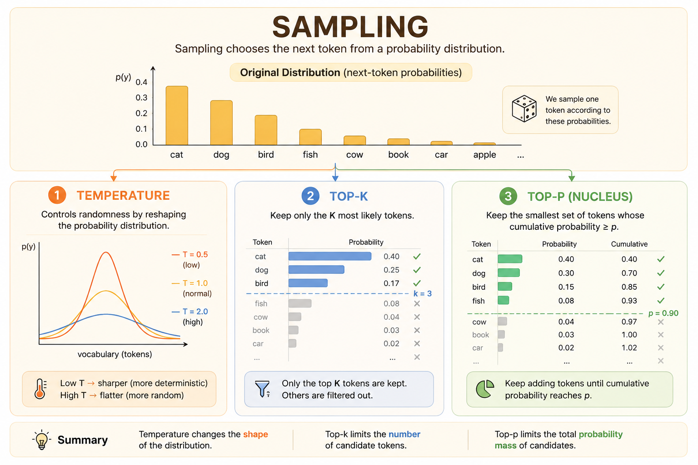

<iframe width="100%" height="500" src="https://www.youtube.com/embed/0NxTw_G1jYs" title="CMU Advanced NLP Lecture 9: Decoding Algorithms" frameborder="0" allowfullscreen></iframe>

Decoding is the process of generating a sequence one token at a time. At each step, the model gives a probability distribution over the next token, and the decoding algorithm decides how to choose from that distribution.

# Decoding as Optimization

The optimization view asks for the most likely output sequence:

$$
\hat{y}
=
\argmax_{y \in \mathbb{Y}}
p_\theta(y \mid x)
$$

The goal is simple: find the single most likely output. The challenge is that the output space $\mathbb{Y}$ is enormous.

## Greedy Decoding

Greedy decoding chooses the most likely token at each step:

$$
\hat{y}_t
=
\argmax_{y_t \in \mathcal{V}}
P_\theta(y_t \mid \hat{y}_{<t}, x)
$$

where:

- $\hat{y}_t$ is the predicted token at time step $t$.
- $\mathcal{V}$ is the vocabulary.
- $P_\theta$ is the model distribution.
- $\hat{y}_{<t}$ is the sequence of previously generated tokens.

Greedy decoding is fast and simple, but it does not guarantee the most likely full sequence. A locally best token can lead to a worse sequence later.

## Beam Search

Beam search is a width-limited breadth-first search over possible outputs.

The key idea is to maintain several possible paths instead of only one:

- $B = 1$: equivalent to greedy decoding.
- $B = |\mathcal{V}|^{T_{\max}}$: exhaustive MAP search.
- In practice, $B$ is small, often around 4 to 16.

```{mermaid}
graph TD
    Root["Taylor Swift is"] --> A["a"]
    Root --> AN["an"]
    Root --> THE["the"]

    A --> FORMER["former (0.003)"]
    A --> WRITER["writer (0.003)"]
    A --> LATEST["latest (0.004)"]

    AN --> LATEST_AN["latest (0.06)"]

    THE --> ONLY["only (0.003)"]
    THE --> PERSON["person (0.0004)"]

    LATEST --> TO["to (0.0004)"]
    LATEST --> IN["in (0.0003)"]

    PERSON --> WHO["who (0.00008)"]
    PERSON --> TO_PERSON["to (0.00008)"]

    TO --> BE["be (0.00002)"]
    TO --> JOIN["join (0.00002)"]
```

In Hugging Face:

```python
# Greedy decoding
model.generate(do_sample=False, num_beams=1)

# Beam search
model.generate(do_sample=False, num_beams=b)
```

## Pitfalls of MAP Decoding

MAP decoding searches for the highest-probability sequence, but highest probability does not always mean best output.

### Degeneracy

Models can assign high probability to repeated content, which creates repetitive loops.

Common mitigations:

- Repetition penalties.
- Modified decoding scores.
- Loss modifications during training.

### Short Outputs

Short sequences can receive high probability because every extra token multiplies another probability term. In extreme cases, the empty sequence can look attractive.

A common remedy is length normalization.

### Atypicality

Human language is diverse. A model that always selects the highest-probability continuation can sound generic, robotic, or less natural than a slightly lower-probability alternative.

| Probability | Output | Assessment |
|---:|---|---|
| 0.30 | "The cat sat down." | High probability and natural. |
| 0.25 | "The cat ran away." | Slightly lower probability, but still high quality. |
| 0.20 | "The cat sprinted off." | Lower probability, but still a valid expression. |
| 0.149 | "The cat got out of there." | Less likely, but still natural in context. |

The probability mass for good language is often spread across many valid outputs, not concentrated on one single sentence.

# Sampling

Modern LLM APIs expose decoding controls that turn the next-token distribution into generated text.



## Basic Sampling

Basic sampling, also called ancestral sampling, samples directly from the model distribution at each step:

$$
\hat{y}_t
\sim
p_\theta(y_t \mid y_{<t}, x)
$$

This is equivalent to sampling a full sequence from the autoregressive factorization:

$$
\hat{y}_{1:T}
\sim
p_\theta(y_{1:T} \mid x)
$$

### Categorical Sampling

Each next-token distribution is a categorical distribution over the vocabulary.

```python
import torch

vocab = ["a", "b", "c", "d", "e"]
probs = torch.tensor([0.1, 0.2, 0.1, 0.4, 0.2])

categorical = torch.distributions.Categorical(probs=probs)
samples = categorical.sample((100,))
```

Basic sampling adds diversity, but it can also create incoherence because low-probability tokens still have some chance of being selected.

Two common problems:

- **Heavy tail:** a large vocabulary contains many low-probability, low-quality tokens.
- **Compounding errors:** one bad token can push later predictions into worse contexts.

## Top-k Sampling

Top-k sampling keeps only the $k$ most likely next tokens, sets all other probabilities to zero, then renormalizes:

$$
\hat{y}_t \sim
\begin{cases}
P_\theta(y_t \mid y_{<t}, x) / Z_t
& \text{if } y_t \in \operatorname{TopK} \\
0
& \text{otherwise}
\end{cases}
$$

This removes the long tail while still allowing diversity among the strongest candidates.

## Top-p Sampling

Top-p sampling, or nucleus sampling, keeps the smallest set of tokens whose cumulative probability reaches a threshold $p$.

This makes the candidate pool dynamic:

- If the model is confident, only a few tokens may be needed.
- If the model is uncertain, many tokens may be included.

Top-p sampling is more context-aware than a fixed top-k cutoff because it adapts to the shape of the distribution.

In Hugging Face:

```python
# Ancestral sampling
model.generate(do_sample=True)

# Top-k sampling
model.generate(do_sample=True, top_k=k)

# Top-p sampling
model.generate(do_sample=True, top_p=p)
```

## Temperature Sampling

Temperature modifies logits before the softmax:

$$
P_i
=
\frac{\exp(z_i / T)}
{\sum_j \exp(z_j / T)}
$$



Temperature acts like a diversity dial:

- **Low temperature, $T < 1$:** sharpens the distribution and makes generation more conservative.
- **High temperature, $T > 1$:** flattens the distribution and makes generation more diverse.
- As $T \to 0$, temperature sampling approaches greedy decoding.

Too much temperature can make the model incoherent because unlikely tokens receive too much probability mass.

# Speeding Up Decoding

Autoregressive decoding generates one token at a time. To generate each new token, the transformer attends to all previous tokens.

Without caching, the model recomputes keys and values for previous tokens at every step, creating unnecessary $O(T^2)$ work across a length-$T$ generation.

## KV Cache

The KV cache stores the keys and values for previously generated tokens.

At the next decoding step:

1. Compute the key and value for the new token.
2. Append them to the existing cache.
3. Reuse all previous keys and values instead of recomputing them.

The result is faster inference because decoding reuses past computation and shifts repeated work into cached matrix-vector attention over the growing context.
