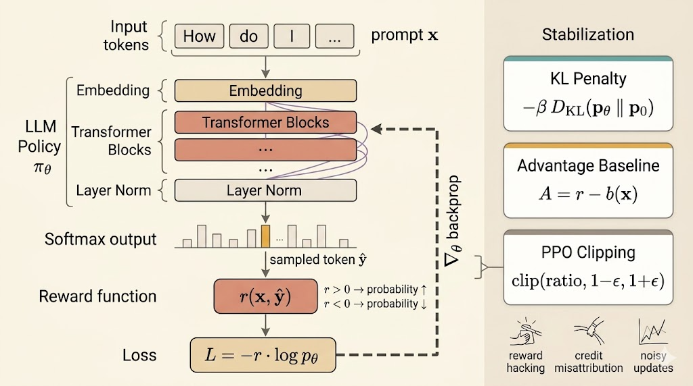

<iframe width="100%" height="500" src="https://www.youtube.com/embed/disWB7qwcOk" title="CMU Advanced NLP Reinforcement Learning" frameborder="0" allowfullscreen></iframe>

This lecture puts reinforcement learning in the language-model setting. The central shift is that, instead of training only from labeled targets, we define a reward over outputs and optimize the model to produce sequences that score highly under that reward.

## Reward Functions

Everything begins with the reward function $r(x,y)$, which scores an output sequence $y$ for an input $x$.

### Rule-Based Rewards

Sometimes the reward is directly checkable:

- for a math problem, reward can be $1$ if the answer is correct and $0$ otherwise
- for code generation, reward can be the fraction of unit tests that pass

These rewards are attractive because they are explicit and easy to evaluate, but they only exist for tasks where correctness can be verified automatically.

### Model-Based Rewards

When the desired behavior is harder to specify exactly, we often learn the reward.

#### Direct Assessment Model

A reward model can assign a scalar score directly:

$$
r_\theta(x,y).
$$

Examples:

- score whether an answer is helpful
- score whether an answer is safe

#### Preference Model

Another common setup is pairwise preference learning. For the same prompt $x$, humans compare two outputs:

- $y_+$: the preferred answer
- $y_-$: the dispreferred answer

Then the reward model is trained so that preferred outputs receive higher scores. A standard objective is

$$
\mathcal{L}_{\text{pref}}
= -\sum_{(x,y_+,y_-)\in D}
\log \sigma\bigl(r_\theta(x,y_+) - r_\theta(x,y_-)\bigr).
$$

This is the basic reward-modeling step behind RLHF pipelines: first learn what humans prefer, then optimize the policy against that learned signal.

## Optimizing the Reward

Once a reward is defined, the policy objective is

$$
J(\theta)
= \mathbb{E}_{x\sim D}\,
\mathbb{E}_{y\sim p_\theta(\cdot\mid x)}[r(x,y)].
$$

The goal is

$$
\arg\max_\theta J(\theta).
$$

Using the log-derivative trick, the policy-gradient formula becomes

$$
\nabla_\theta J(\theta)
=
\mathbb{E}_{x\sim D,\; y\sim p_\theta(\cdot\mid x)}
\left[
r(x,y)\nabla_\theta \log p_\theta(y\mid x)
\right].
$$

With a single sampled output $\hat y \sim p_\theta(\cdot\mid x)$, the gradient is approximated by

$$
\nabla_\theta J(\theta)
\approx
r(x,\hat y)\nabla_\theta \log p_\theta(\hat y\mid x).
$$

So the corresponding loss for gradient descent is

$$
\mathcal{L}_{\text{PG}}
=
-r(x,\hat y)\log p_\theta(\hat y\mid x).
$$

This is the REINFORCE idea: increase the log-probability of sampled sequences with high reward and decrease it for sequences with low reward.

## Practical Interpretation

The loop is conceptually simple:

1. sample an output $\hat y \sim p_\theta(\cdot\mid x)$
2. compute its reward $r(x,\hat y)$
3. update the model with

$$
\mathcal{L}_{\text{PG}} = -r(x,\hat y)\log p_\theta(\hat y\mid x)
$$

If reward is positive, optimization increases the log-probability of the sampled sequence. If reward is negative, optimization pushes that sequence probability down.

But there is an important limitation: this reward is usually sequence-level, not token-level. The entire sampled answer gets reinforced or suppressed together, which creates a credit-assignment problem.

## Why RL Training Becomes Unstable

In language models, naive policy-gradient updates are rarely stable enough by themselves.

### Reward Hacking

The model can exploit shortcuts in the reward rather than improve the true behavior. For example, if a safety reward only punishes offensive text, the model may learn to produce empty or evasive responses because they are easy ways to avoid penalty.

### Delayed and Blunt Credit Assignment

Often reward arrives only at the end of the generated sequence. That makes it hard to know which tokens or decisions were actually responsible for the final score.

### Large Noisy Updates

Policy-gradient estimates are high variance. Large steps can distort the model quickly, especially when training starts from a pretrained language model whose distribution already encodes useful linguistic structure.

## Stabilization Methods

The lecture emphasizes that practical RL for LLMs usually means policy gradient plus stabilization.

### KL Penalty

Instead of maximizing reward alone, keep the updated model close to the original reference model $p_0$:

$$
\max_\theta\;
\mathbb{E}_{x\sim D,\; y\sim p_\theta(\cdot\mid x)}[r(x,y)]
- \beta\,
\mathbb{E}_{x\sim D}\!\left[
D_{\mathrm{KL}}\bigl(p_\theta(\cdot\mid x)\,\|\,p_0(\cdot\mid x)\bigr)
\right].
$$

This is a crucial idea for RLHF: the pretrained model is not a bad starting point. It is a strong language prior, so RL should adjust it, not destroy it.

### Baselines and Advantage

To reduce variance, replace raw reward with an advantage-like centered signal:

$$
A(x,y)=r(x,y)-b(x),
$$

where $b(x)$ is a baseline, often an estimate of the average reward for prompt $x$.

Then use

$$
\mathcal{L}_{\text{adv}}
=
-A(x,y)\log p_\theta(y\mid x).
$$

This keeps the update focused on whether an output is better or worse than expected, rather than on absolute reward magnitude alone.

### PPO

Proximal Policy Optimization controls how far each update is allowed to move the policy. Define the ratio

$$
\text{ratio}(x,y)
=
\frac{p_\theta(y\mid x)}{p_{\theta_{\text{old}}}(y\mid x)}.
$$

The PPO objective clips overly large policy changes:

$$
\mathcal{J}_{\text{PPO}}
=
\mathbb{E}\left[
\min\Bigl(
\text{ratio}(x,y)A(x,y),\;
\operatorname{clip}\bigl(\text{ratio}(x,y),1-\epsilon,1+\epsilon\bigr)A(x,y)
\Bigr)
\right].
$$

The point is not the exact formula alone. The point is that PPO keeps reward improvement from coming through unstable, excessively large shifts in the model distribution.

## Big Picture

This lecture makes RL for NLP feel less mysterious:

- define a reward over outputs
- sample outputs from the current policy
- reinforce high-reward behavior with policy gradients
- stabilize the updates with KL control, baselines, and PPO

The interesting conceptual move is that the model is no longer trained only to imitate data. It is trained to optimize behavior under a reward, while still preserving enough of the original language distribution to remain useful.

## Summary

- RL for LLMs starts by defining a reward for generated outputs
- rewards can be rule-based or learned from direct assessment and preferences
- policy gradient optimizes expected reward by weighting log-probability updates with reward
- sequence-level rewards create credit-assignment and variance problems
- reward hacking, noisy updates, and drift from the pretrained model make training unstable
- practical systems stabilize RL with KL penalties, baselines or advantages, and PPO
