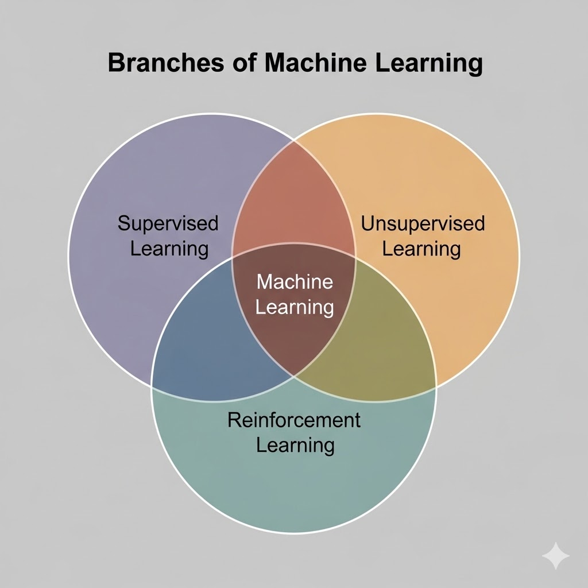
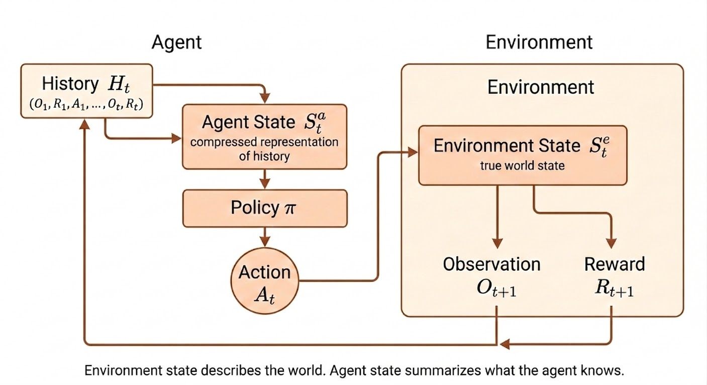
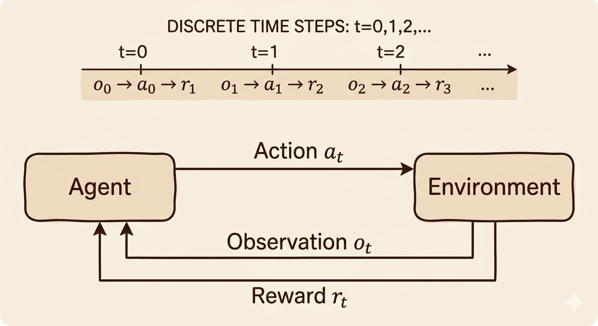
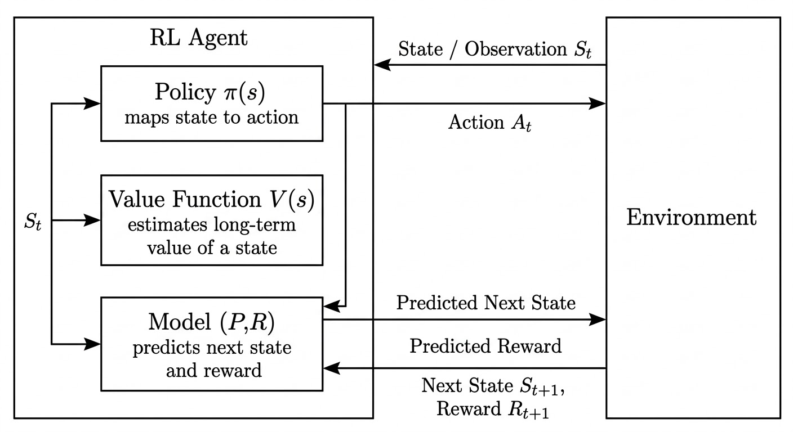
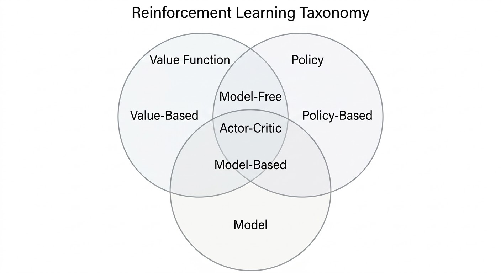



Reinforcement learning studies how an agent should act through interaction with an environment in order to maximize cumulative reward. Unlike supervised learning, there is no teacher providing the correct action at each step. The signal is sparse, delayed, and entangled with long-term consequences.

## What Makes RL Different?

Three properties make RL fundamentally different from standard supervised learning:

- There is no supervisor, only a reward signal.
- Feedback is delayed rather than instantaneous.
- Time matters because current actions change future states and future rewards.

That last point is the key structural difference: RL is a sequential decision-making problem, not a collection of independent predictions.

## Examples

Representative RL applications from the lecture:

- Helicopter stunt maneuvers learned by trial and error.
- Backgammon systems that improve through self-play.
- Investment portfolio management with long-horizon return objectives.
- Power station control under efficiency and safety constraints.
- Humanoid robot walking with reward for stable forward motion.
- Atari gameplay learned directly from reward and visual input.

## The Reinforcement Learning Problem

At time step $t$, an **agent** interacts with an **environment**:

1. The agent observes the current state $S_t$.
2. The agent chooses an action $A_t$.
3. The environment emits reward $R_{t+1}$.
4. The environment transitions to the next state $S_{t+1}$.

This gives the standard RL interaction pattern:

$$
S_t \rightarrow A_t \rightarrow (R_{t+1}, S_{t+1})
$$

### Reward

A reward is a scalar feedback signal indicating how desirable the immediate outcome is.

### Sequential Decision Making

Actions are coupled across time. A decision is good not only because of its immediate reward, but because of how it changes the future trajectory.

Examples:

- A financial investment may take months to mature.
- Refueling a helicopter now may prevent a crash hours later.
- Blocking an opponent move may matter many turns later.

## Environment, Agent, Observation, Action

- **Environment**: the external system that responds to actions and produces new states and rewards.
- **Agent**: the learner or decision-maker trying to maximize cumulative reward.
- **Observation**: the information the agent receives at a given time step.
- **Action**: the decision that influences the next state of the environment.

## State

### History And State

The full interaction history up to time $t$ can be written as

$$
H_t = (O_1, A_1, R_1, O_2, A_2, R_2, \dots, O_t)
$$

Using the full history directly is usually impractical because it grows with time. Instead, we define a state as a compact summary:

$$
S_t = f(H_t)
$$

The state is useful only if it preserves the information needed for future prediction and decision making.

### Environment State vs Agent State

The **environment state** $S_t^e$ is the true internal state of the world. The **agent state** $S_t^a$ is the internal representation the agent uses to choose actions.

| Aspect | Environment State | Agent State |
| --- | --- | --- |
| Location | Inside the environment | Inside the agent |
| Purpose | Generates next observation and reward | Chooses actions |
| Visibility | Usually hidden | Fully known to the agent |
| Symbol | $S_t^e$ | $S_t^a$ |

Examples of environment state:

| Problem | Environment State |
| --- | --- |
| Chess | Full board configuration |
| Atari | Full game memory |
| Robotics | Full physical world state |

The agent state is typically built from history:

$$
S_t^a = f(H_t)
$$

## Markov State

A state is **Markov** if the present contains all information needed to predict the future:

$$
P(S_{t+1} \mid S_t) = P(S_{t+1} \mid S_1, S_2, \dots, S_t)
$$

Equivalent intuition: once the current state is known, earlier states add no extra predictive power for the future.

Important examples:

- The environment state is Markov.
- The full history is also Markov.
- If a compressed state is Markov, the rest of the history can be discarded.

## Fully Observable vs Partially Observable

If the environment is fully observable, then

$$
O_t = S_t^e
$$

and therefore the agent can use

$$
S_t^a = S_t^e
$$

This is the standard **Markov Decision Process (MDP)** setting.

In many real problems the agent only sees partial information:

| Problem | Observation |
| --- | --- |
| Poker | Public cards only |
| Trading | Current prices |
| Robotics | Camera images |

In that case,

$$
S_t^a \neq S_t^e
$$

and the agent must construct its own internal state, for example:

- the full history $S_t^a = H_t$
- a belief state over hidden environment states
- a recurrent representation $S_t^a = f(S_{t-1}^a, O_t)$

## Inside An RL Agent

An RL agent may contain three major components:

- **Policy**: what action should I take?
- **Value function**: how good is this state or action?
- **Model**: what will happen next?

### Policy

A policy maps states to actions.

- Deterministic policy: $a = \pi(s)$
- Stochastic policy: $\pi(a \mid s) = \mathbb{P}(A_t = a \mid S_t = s)$

### Value Function

The value function is the expected discounted future reward:

$$
v_\pi(s) = \mathbb{E}\left[R_{t+1} + \gamma R_{t+2} + \gamma^2 R_{t+3} + \cdots \mid S_t = s\right]
$$

where $0 \leq \gamma < 1$ is the discount factor.

The value function is the agent's estimate of long-term potential, not just immediate payoff.

### Model

A model predicts environment dynamics and reward.

Transition model:

$$
\mathcal{P}_{ss'}^a = \mathbb{P}(S_{t+1} = s' \mid S_t = s, A_t = a)
$$

Reward model:

$$
\mathcal{R}_s^a = \mathbb{E}[R_{t+1} \mid S_t = s, A_t = a]
$$

A model acts like an internal simulator: it predicts the next state and immediate reward, while the value function estimates long-term return.

## RL Agent Categories

RL methods can be classified along two orthogonal dimensions:

1. Agent architecture: policy-based, value-based, or actor-critic.
2. Environment knowledge: model-free or model-based.

### Agent Architecture

| Agent Type | Policy | Value Function | Core Idea | Typical Algorithms |
| --- | --- | --- | --- | --- |
| Value-Based | Implicit | Yes | Learn value, derive behavior from it | Q-Learning, DQN |
| Policy-Based | Yes | No | Optimize the policy directly | REINFORCE, Policy Gradient |
| Actor-Critic | Yes | Yes | Policy acts, value evaluates | A2C, A3C, PPO |

### Environment Knowledge

| Agent Type | Model | Policy / Value | Core Idea | Typical Algorithms |
| --- | --- | --- | --- | --- |
| Model-Free | No | Policy and/or value | Learn directly from interaction | DQN, PPO, SAC |
| Model-Based | Yes | Policy and/or value | Use or learn dynamics for planning | AlphaZero, MuZero |

The model-based / model-free distinction is about whether the agent has access to a predictive model of transitions and rewards, not about whether it uses a policy or value function.

### Combined View

| Category | Policy | Value | Model |
| --- | --- | --- | --- |
| Value-Based | No | Yes | Optional |
| Policy-Based | Yes | No | Optional |
| Actor-Critic | Yes | Yes | Optional |
| Model-Free | Optional | Optional | No |
| Model-Based | Optional | Optional | Yes |

## Core RL Problems

### Learning vs Planning

- **Learning** assumes the environment is initially unknown and must be understood through interaction.
- **Planning** assumes a model is known and can be used to simulate future outcomes before acting.

### Exploration vs Exploitation

- **Exploration** tries uncertain actions to gather information.
- **Exploitation** uses the best action known so far to collect reward.

A strong RL agent needs both.

### Prediction vs Control

- **Prediction** evaluates a fixed policy.
- **Control** searches for a better or optimal policy.

Prediction asks, "How good is this policy?" Control asks, "What policy should I use?"

| Problem | Core Question | Key Idea | Example |
| --- | --- | --- | --- |
| Learning vs Planning | Do we know the environment model? | Learn by interaction vs reason with a known model | Atari agent vs chess search engine |
| Exploration vs Exploitation | Try new actions or use known good ones? | Information gathering vs reward maximization | New restaurant vs favorite restaurant |
| Prediction vs Control | Evaluate or optimize a policy? | Estimate value vs improve policy | Policy evaluation vs finding the optimal policy |

## Takeaways

- RL differs from supervised learning because supervision is replaced with delayed reward.
- The state is a compressed summary of past interaction.
- Markov state is the mathematical notion of "enough information for the future."
- Policy, value function, and model are the core conceptual building blocks.
- Many RL algorithms are best understood by asking which of these components they learn.

*Source: David Silver, Reinforcement Learning Course, Lecture 1.*
