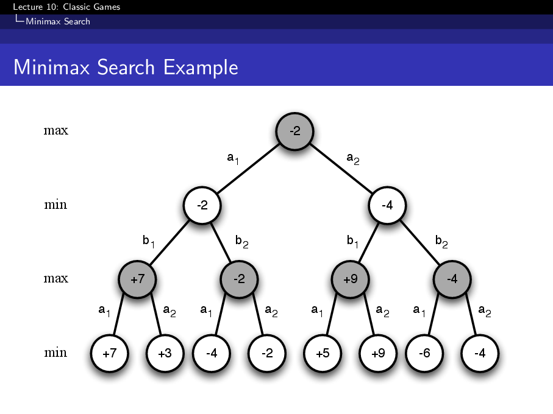
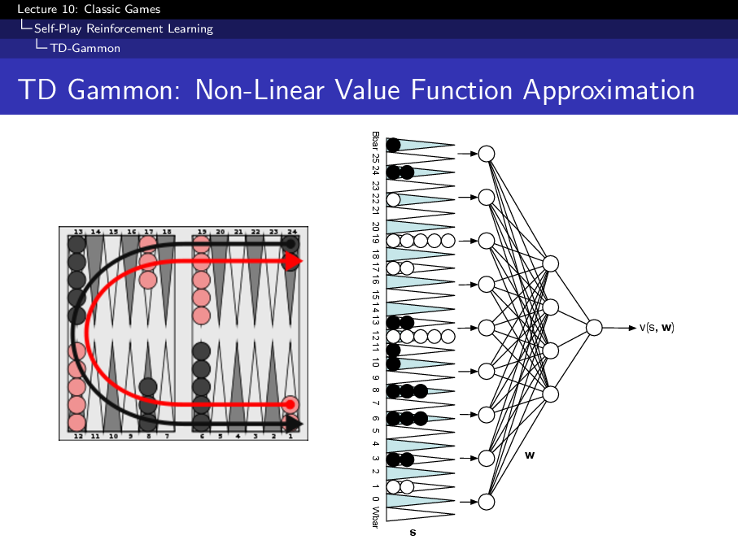
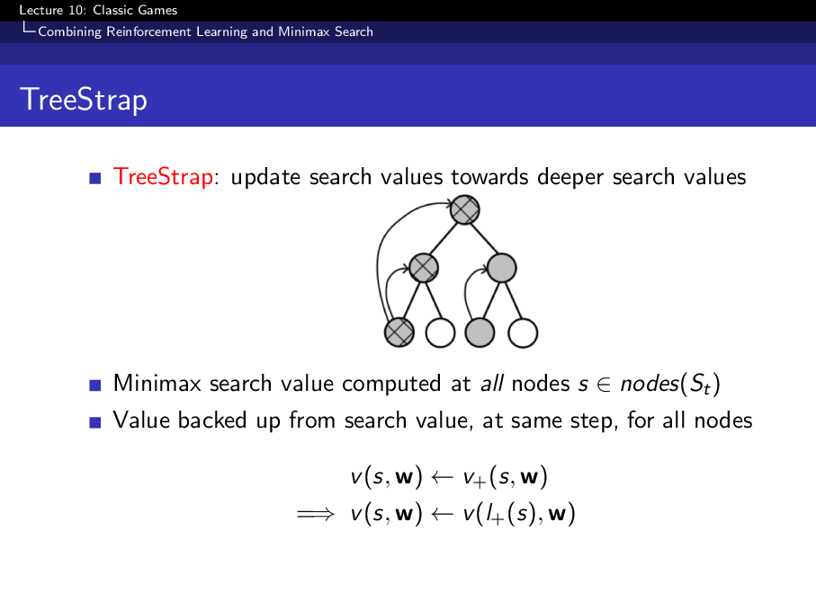
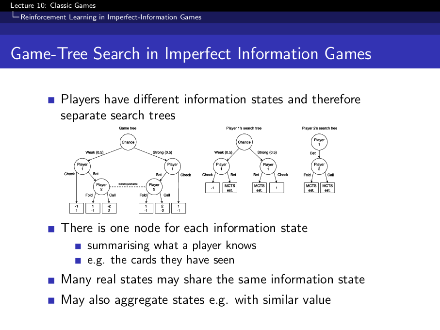

<iframe width="100%" height="500" src="https://www.youtube.com/embed/kZ_AUmFcZtk?list=PLqYmG7hTraZDM-OYHWgPebj2MfCFzFObQ&amp;index=10" title="David Silver Reinforcement Learning Lecture 10" frameborder="0" allow="accelerometer; autoplay; clipboard-write; encrypted-media; gyroscope; picture-in-picture; web-share" allowfullscreen></iframe>

Classic games are useful reinforcement learning laboratories. The rules are clear, the objective is unambiguous, and strong play requires planning against an opponent rather than optimizing a one-step reward.

This lecture connects three ideas:

1. **Game theory:** define what optimal play means in competitive settings.
2. **Self-play reinforcement learning:** learn from games against yourself.
3. **Search plus learning:** use lookahead to improve decisions, and use learned value functions to make lookahead practical.

## Why Classic Games?

Games stress different parts of reinforcement learning.

**Perfect-information games** such as chess, checkers, Othello, and Go expose the full state to both players. In these settings, the central problem is often search: how far can the agent look ahead, and how accurately can it evaluate the leaves?

**Imperfect-information games** such as poker and Scotland Yard hide part of the true state. Here, an agent must reason over information states, opponent beliefs, and mixed strategies.

**Stochastic games** such as backgammon add randomness to the transition dynamics. This can make value learning especially useful because the agent must estimate long-run expected outcomes rather than memorize fixed tactical lines.

The lecture uses classic systems as examples: Deep Blue for chess, Chinook for checkers, TD-Gammon for backgammon, Maven for Scrabble, and Smooth UCT for Scotland Yard.

## Game Theory Setup

For a two-player zero-sum game, one player's gain is the other player's loss. A value function can be written as the expected return from state $s$ when the current player uses policy $\pi$ and the opponent uses policy $\pi'$:

$$
v(s, \pi, \pi') =
\mathbb{E}[G_t \mid S_t = s].
$$

The minimax value assumes both players act optimally:

$$
v_*(s)
=
\max_\pi \min_{\pi'} v(s, \pi, \pi').
$$

This is the key conceptual shift. In a competitive game, a good policy is not merely good against the current opponent. It should remain good against the best response the opponent could choose.

## Minimax Search

Minimax turns a game into a search tree.

At **max nodes**, the current player chooses the successor with the highest value. At **min nodes**, the opponent chooses the successor with the lowest value for the current player. Leaf nodes are either terminal rewards or estimated values from an evaluation function.

{fig-alt="Minimax search tree with max and min layers backing up values from leaf nodes."}

Full minimax search is usually impossible in large games. Practical agents therefore combine several approximations:

- depth-limited search,
- heuristic evaluation functions,
- alpha-beta pruning,
- learned value functions.

The search procedure supplies tactical precision. The value function supplies generalization when the tree cannot be expanded all the way to terminal states.

## Self-Play Reinforcement Learning

Self-play removes the need for a fixed external opponent. The agent repeatedly plays games against itself, improves from the generated experience, and then faces a stronger version of its own policy.

A simple temporal-difference value update has the form

$$
\delta_t =
v(S_{t+1}, w) - v(S_t, w),
$$

$$
\Delta w =
\alpha \delta_t \nabla_w v(S_t, w).
$$

The appeal is that self-play generates its own curriculum. Weak agents produce simple positions; stronger agents produce harder positions. The risk is that learning may overfit to the current opponent distribution, cycle, or become unstable in games where small tactical mistakes are heavily punished.

## TD-Gammon

TD-Gammon is the lecture's central example of successful self-play. It used a nonlinear value function trained from games of self-play in backgammon.

{fig-alt="TD-Gammon value function approximation diagram with a backgammon board representation feeding a neural network."}

Why this worked well:

- Backgammon is stochastic, so the agent must learn expected value rather than fixed deterministic lines.
- Self-play produces many realistic board positions without expert labels.
- The learned value function made greedy policy improvement effective in practice.

The lecture also emphasizes a limitation: TD-Gammon's recipe does not automatically solve every game. Games with deeper tactical traps may require explicit search, and imperfect-information games may require more careful equilibrium reasoning.

## From Self-Play to Search

Search and reinforcement learning solve complementary problems.

**Search** improves the decision at the current state by looking ahead. **Learning** stores patterns discovered by search or experience in a reusable value function or policy.

This creates a useful loop:

1. Use search to make a stronger local decision.
2. Train a value function from the search result.
3. Use the improved value function to make future search cheaper and deeper.

This is one reason game-playing systems often combine a hand-designed or learned evaluator with tree search.

## TreeStrap

TreeStrap is an example of learning directly from search values. Instead of training only from final game outcomes, the value function is trained toward values backed up from a deeper search tree.

{fig-alt="TreeStrap diagram showing search values backed up through a tree and used as value-function targets."}

The idea is:

$$
v(S_t, w)
\leftarrow
\text{value backed up from search}.
$$

The learner imitates a stronger procedure than itself. Once the value function improves, it can guide future search more effectively.

## Monte Carlo Tree Search

Monte Carlo Tree Search estimates action values by sampling trajectories from the current state. It is useful when exact minimax search is too expensive or when heuristic evaluation is weak.

The general loop is:

1. Select a path through the current tree.
2. Expand a new node.
3. Simulate or evaluate from that node.
4. Back up the result through the path.

UCT adds a bandit-style exploration term to tree search:

$$
a_t =
\operatorname*{argmax}_a
\left[
Q(s,a)
+
c \sqrt{\frac{\log N(s)}{N(s,a)}}
\right].
$$

The first term exploits actions that currently look good. The second term explores actions that have not been visited enough.

## Imperfect-Information Games

In imperfect-information games, the visible history does not determine the full state. The same observations may correspond to many hidden worlds.

{fig-alt="Imperfect-information game-tree diagram where players share information sets rather than observing the full game state."}

This changes the problem:

- The agent may need to search over an information state, not a single concrete board state.
- Greedy deterministic play can become exploitable.
- Self-play can cycle if each player keeps overfitting to the other's current strategy.

A Nash equilibrium is a pair of policies where neither player can improve by changing strategy alone. In imperfect-information games, equilibrium thinking matters because robust mixed strategies can be more important than finding one sharp best line.

## Smooth UCT and Fictitious Play

Smooth UCT adapts tree search for imperfect-information games by smoothing action selection rather than always committing to a hard maximum. This connects to fictitious play, where each player responds to an average of the opponent's historical behavior.

The intuition is simple: in hidden-information games, being predictable is dangerous. Averaging and smoothing make the strategy less brittle and less exploitable.

## Takeaways

Classic games show how RL changes when another intelligent decision maker is inside the environment.

- Minimax defines optimal play for perfect-information zero-sum games.
- Self-play can generate a training curriculum without expert demonstrations.
- TD-Gammon shows that self-play TD learning can be extremely powerful in stochastic games.
- Search and learning are strongest together: search improves targets, and learning amortizes search.
- Imperfect-information games require information-state and equilibrium reasoning, not only visible-state value maximization.

## Source

These notes are based on David Silver's [Lecture 10: Case Study: RL in Classic Games](https://davidstarsilver.wordpress.com/wp-content/uploads/2025/04/lecture-10-case-study-rl-in-classic-games.pdf).
